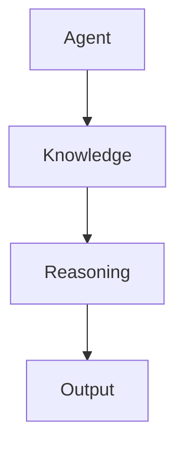
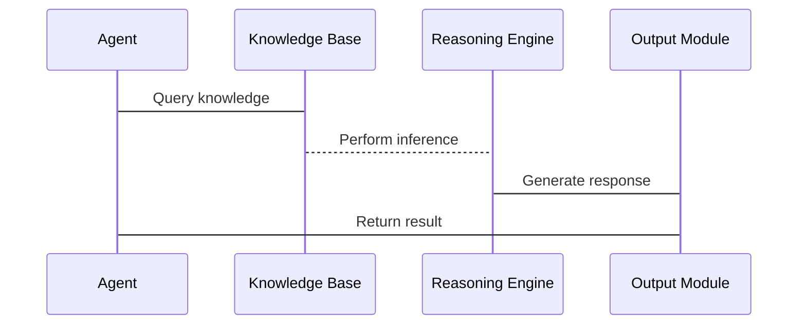

                 


# 开发具有跨领域推理能力的AI Agent

> **关键词**: AI Agent, 跨领域推理, 多模态数据融合, 知识迁移, 图神经网络, Transformer, 对比学习

> **摘要**: 跨领域推理是AI Agent实现复杂任务的核心能力，本文从理论基础到算法实现，系统阐述了如何构建具备跨领域推理能力的AI Agent。通过分析跨领域推理的关键技术，包括知识表示、逻辑推理、多模态数据融合与知识迁移，结合图神经网络、Transformer和对比学习等前沿算法，详细讲解了AI Agent的设计与实现。最后，通过实战案例，展示了如何将理论应用于实际项目，帮助读者掌握跨领域推理AI Agent的开发技能。

---

## 第1章: AI Agent的核心概念与背景

### 1.1 AI Agent的基本定义

AI Agent（人工智能代理）是指能够感知环境、自主决策并采取行动以实现特定目标的智能实体。Agent可以是软件程序、机器人或其他智能系统，其核心能力包括感知、推理、规划和行动。

**AI Agent的分类**：
1. **简单反射型Agent**：基于当前感知做出反应，不涉及复杂推理。
2. **基于模型的反射型Agent**：维护环境模型，根据模型进行推理和决策。
3. **目标驱动型Agent**：基于目标驱动的行为选择。
4. **效用驱动型Agent**：通过最大化效用函数来优化决策。

**跨领域推理的定义与特点**：
跨领域推理是指AI Agent能够结合多个领域的知识，理解并解决跨领域能力的问题。其特点包括：
- **知识多样性**：整合不同领域的知识。
- **推理复杂性**：需要处理多种知识模式和逻辑关系。
- **适应性**：能够在不同领域间灵活切换。

---

### 1.2 跨领域推理的重要性

**背景与需求**：
随着AI技术的发展，单一领域的问题解决已无法满足复杂场景的需求。跨领域推理能够帮助AI Agent在多个领域间切换，解决复杂问题。

**应用场景**：
1. **智能助手**：跨领域推理可以帮助智能助手理解用户需求并提供跨领域能力的服务。
2. **医疗AI**：结合医学知识和患者数据，提供个性化的诊断建议。
3. **金融分析**：整合市场数据和公司财报，提供跨领域的投资建议。

**核心挑战**：
1. **知识表示**：如何有效表示和整合不同领域的知识。
2. **推理能力**：如何实现跨领域的逻辑推理。
3. **数据融合**：如何处理多模态数据并提取有用信息。

---

## 第2章: 跨领域推理的理论基础

### 2.1 知识表示与推理

**知识图谱的构建与表示**：
知识图谱是一种结构化的知识表示形式，通过实体和关系构建网络。常用的构建方法包括基于规则的抽取和深度学习模型（如BERT）。

**逻辑推理的基本原理**：
逻辑推理是基于知识图谱进行推导的过程。常见的推理方法包括：
1. **单点推理**：基于单个三元组进行推理。
2. **路径推理**：通过多步推理发现隐含关系。

**跨领域知识融合的方法**：
1. **对齐技术**：通过实体对齐技术将不同领域的知识图谱合并。
2. **联合学习**：在同一模型中学习多个领域的知识。

---

### 2.2 跨领域推理的数学模型

**基于图论的知识推理模型**：
图神经网络（GNN）是一种常用的图数据处理模型。通过节点表示和边权重，GNN可以进行复杂的关系推理。

**基于概率论的推理方法**：
概率图模型（如贝叶斯网络）通过概率分布描述知识间的不确定性，适用于处理模糊推理问题。

**基于深度学习的推理模型**：
Transformer模型通过自注意力机制，能够处理长距离依赖关系，在跨领域推理中表现出色。

---

## 第3章: 跨领域推理的关键技术

### 3.1 多模态数据融合

**多模态数据的定义与特点**：
多模态数据包括文本、图像、语音等多种数据形式。其特点是信息丰富且互补性强。

**多模态数据融合的技术挑战**：
1. **异构性**：不同模态的数据格式和语义差异大。
2. **计算复杂度**：多模态数据的处理需要大量计算资源。

**基于深度学习的多模态融合方法**：
使用多任务学习框架，将不同模态的数据作为输入，共同优化模型参数。

---

### 3.2 跨领域知识迁移

**知识迁移的基本原理**：
知识迁移是将一个领域的知识应用到另一个领域。常用方法包括领域适应和迁移学习。

**基于对比学习的知识迁移**：
对比学习通过最大化目标域和源域之间的相似性，实现知识的有效迁移。

---

### 3.3 跨领域推理的评估与优化

**评估指标**：
1. **准确率**：推理结果与真实结果的匹配程度。
2. **F1分数**：综合考虑精确率和召回率的指标。
3. **AUC曲线**：评估模型的分类能力。

**优化策略**：
1. **数据增强**：通过生成更多样化的训练数据，提高模型的泛化能力。
2. **模型调优**：通过超参数调整和架构优化，提升推理性能。

---

## 第4章: 跨领域推理的算法与实现

### 4.1 基于图神经网络的推理算法

**图神经网络的基本原理**：
图神经网络通过聚合邻居节点的信息，逐步传播特征，最终得到节点的表示向量。

**在跨领域推理中的应用**：
将不同领域的知识图谱建模为图结构，利用GNN进行跨领域推理。

---

### 4.2 基于Transformer的推理算法

**Transformer的基本结构**：
由编码器和解码器组成，编码器负责将输入数据编码为向量，解码器负责生成输出序列。

**在跨领域推理中的应用**：
通过多模态输入，利用Transformer的自注意力机制，实现跨领域的信息融合。

---

### 4.3 基于对比学习的推理算法

**对比学习的基本原理**：
通过最大化正样本对的相似性和最小化负样本对的相似性，学习数据的表征。

**在跨领域推理中的应用**：
用于领域适应，通过对比学习优化跨领域的知识迁移。

---

## 第5章: 跨领域推理的数学模型与公式

### 5.1 基于图论的推理模型

**图的表示与遍历算法**：
图可以表示为节点和边的集合，遍历算法如深度优先搜索（DFS）和广度优先搜索（BFS）用于探索图结构。

**推理公式推导**：
假设图中的节点表示为$u_i$，边权重为$w_{i,j}$，则节点的表示向量可通过聚合邻居信息更新：
$$ u_i' = \sigma(\sum_{j \in N(i)} w_{i,j} u_j) $$
其中$\sigma$为激活函数。

---

### 5.2 基于概率论的推理模型

**概率分布的基本概念**：
概率分布描述了随机变量取各个值的概率，常用的分布包括高斯分布和贝叶斯分布。

**推理公式推导**：
假设事件$A$和$B$，根据贝叶斯定理：
$$ P(A|B) = \frac{P(B|A)P(A)}{P(B)} $$

---

### 5.3 基于深度学习的推理模型

**深度学习的基本原理**：
通过多层神经网络，自动提取数据的特征，适用于复杂的非线性关系。

**推理公式推导**：
使用多层感知机（MLP）进行分类，输出概率为：
$$ y = \sigma(Wx + b) $$
其中$W$为权重矩阵，$x$为输入向量，$b$为偏置，$\sigma$为激活函数。

---

## 第6章: 跨领域推理的系统架构设计

### 6.1 项目介绍

**项目目标**：
开发一个具备跨领域推理能力的AI Agent，能够处理多模态数据并提供跨领域能力的服务。

---

### 6.2 系统功能设计

**功能模块**：
1. **数据输入模块**：接收多模态数据输入。
2. **知识表示模块**：构建领域知识图谱。
3. **推理模块**：基于知识图谱进行跨领域推理。
4. **输出模块**：生成推理结果并返回。

**ER实体关系图**：


---

### 6.3 系统架构设计

**系统架构图**：


---

### 6.4 系统交互设计

**交互流程图**：


---

## 第7章: 项目实战

### 7.1 环境安装

**安装依赖**：
使用Python 3.8及以上版本，安装库如TensorFlow、PyTorch和NetworkX。

---

### 7.2 核心实现源代码

**代码示例**：
```python
import tensorflow as tf
from tensorflow.keras import layers

class CrossDomainAgent:
    def __init__(self):
        self.model = self.build_model()

    def build_model(self):
        inputs = layers.Input(shape=(None, 100))
        x = layers.Bidirectional(layers.LSTM(64))(inputs)
        x = layers.Dense(64, activation='relu')(x)
        outputs = layers.Dense(1, activation='sigmoid')(x)
        model = tf.keras.Model(inputs=inputs, outputs=outputs)
        return model

    def train(self, x_train, y_train):
        self.model.compile(optimizer='adam', loss='binary_crossentropy')
        self.model.fit(x_train, y_train, epochs=10, batch_size=32)
```

---

### 7.3 实际案例分析

**案例分析**：
假设一个跨领域推理任务，输入为文本和图像数据，模型通过多模态融合进行推理，输出结果。

---

## 第8章: 最佳实践与总结

### 8.1 最佳实践 tips

**开发建议**：
1. **数据质量**：确保输入数据的多样性和准确性。
2. **模型调优**：通过实验选择最优的模型架构和超参数。
3. **持续学习**：定期更新模型以适应新领域的知识。

---

### 8.2 小结

本文系统介绍了AI Agent的跨领域推理能力，从理论基础到算法实现，结合实战案例，详细讲解了如何开发具备跨领域推理能力的AI Agent。通过本文的学习，读者能够掌握跨领域推理的核心技术，并将其应用于实际项目中。

---

## 第9章: 拓展阅读与未来展望

### 9.1 拓展阅读

推荐阅读以下文献：
1. "Graph Neural Networks: A Review of Methods, Applications, and Open Challenges"。
2. "Attention Is All You Need"。

---

### 9.2 未来展望

跨领域推理技术仍有许多挑战和机遇，未来的研究方向包括：
1. **更高效的推理算法**：提高推理速度和准确率。
2. **多模态数据的实时处理**：实现低延迟的实时推理。
3. **领域知识的自适应学习**：模型能够自动适应新领域。

---

## 作者

**作者**：AI天才研究院（AI Genius Institute） & 禅与计算机程序设计艺术（Zen And The Art of Computer Programming）

---

通过以上详细的内容，您可以系统地学习和理解如何开发具有跨领域推理能力的AI Agent。从理论到实践，逐步深入，帮助您掌握这一领域的核心技术与应用。

