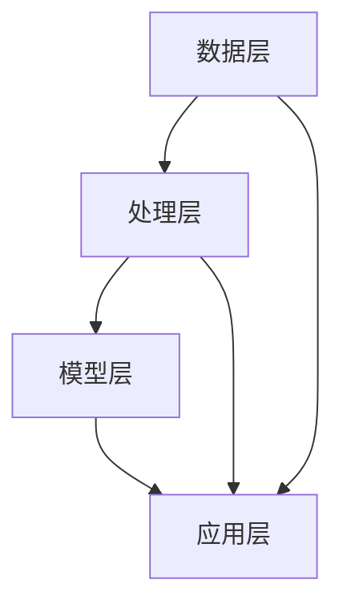
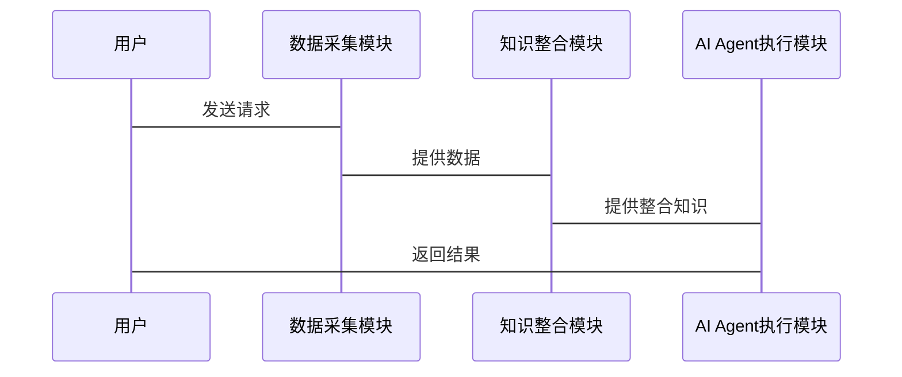

                 


# 开发具有跨领域知识整合能力的AI Agent

> **关键词**：AI Agent，跨领域知识整合，知识图谱，深度学习，系统架构，项目实战  
> **摘要**：本文详细探讨了开发具有跨领域知识整合能力的AI Agent的各个方面，包括其背景、核心概念、算法原理、系统架构设计、项目实战以及最佳实践。文章通过理论与实践相结合的方式，帮助读者理解如何构建能够有效整合多个领域知识的AI Agent。

---

## 第1章: AI Agent的基本概念与背景

### 1.1 AI Agent的定义与特点

#### 1.1.1 AI Agent的定义
AI Agent（人工智能代理）是指能够感知环境、自主决策并执行任务的智能实体。它通过与环境交互，利用传感器获取信息，并通过执行器采取行动，以实现特定目标。

#### 1.1.2 AI Agent的核心特点
- **自主性**：AI Agent能够在没有外部干预的情况下独立运行。
- **反应性**：能够实时感知环境变化并做出相应反应。
- **目标导向性**：所有行动均以实现特定目标为导向。
- **学习能力**：能够通过经验改进性能。

#### 1.1.3 跨领域知识整合能力的必要性
随着AI技术的快速发展，AI Agent需要处理的数据来源越来越多样化，跨领域知识整合能力成为其核心竞争力。

### 1.2 跨领域知识整合的背景与挑战

#### 1.2.1 当前AI技术的发展现状
当前AI技术在单一领域（如自然语言处理、计算机视觉）已经取得了显著进展，但在跨领域知识整合方面仍面临诸多挑战。

#### 1.2.2 跨领域知识整合的必要性
跨领域知识整合能够提升AI Agent的通用性和适应性，使其能够在复杂多变的环境中有效运作。

#### 1.2.3 跨领域整合的主要挑战
- **数据异构性**：不同领域数据格式和语义差异较大。
- **知识表示难度**：如何有效表示跨领域知识是技术难点。
- **计算资源需求**：跨领域整合通常需要大量计算资源。

### 1.3 本书的目标与结构

#### 1.3.1 本书的目标
通过理论与实践相结合的方式，系统性地介绍开发具有跨领域知识整合能力的AI Agent的方法。

#### 1.3.2 本书的结构安排
- 第1章：介绍AI Agent的基本概念与背景。
- 第2章：讲解跨领域知识整合的核心概念。
- 第3章：探讨跨领域知识整合的算法原理。
- 第4章：分析系统架构与设计。
- 第5章：通过项目实战展示开发过程。
- 第6章：总结与展望。

#### 1.3.3 本书的读者群体
- AI领域研究人员
- 从事AI Agent开发的工程师
- 对跨领域知识整合感兴趣的读者

---

## 第2章: 跨领域知识整合的核心概念

### 2.1 跨领域知识整合的定义

#### 2.1.1 跨领域知识整合的定义
跨领域知识整合是指将来自不同领域的知识（如文本、图像、语音等）进行融合，以提升AI Agent的综合能力。

#### 2.1.2 跨领域知识整合的关键要素
- **知识表示**：将知识以某种形式表示出来。
- **知识融合**：将不同来源的知识进行整合。
- **知识推理**：基于整合的知识进行推理。

### 2.2 跨领域知识整合的关键技术

#### 2.2.1 知识图谱
知识图谱是一种以图结构形式表示知识的工具，能够有效地整合跨领域知识。

#### 2.2.2 语义理解
通过自然语言处理技术，理解文本的深层含义，从而实现跨领域的语义整合。

#### 2.2.3 多模态数据处理
处理多种数据类型（如文本、图像、语音）的能力，是跨领域知识整合的重要组成部分。

### 2.3 跨领域知识整合的数学模型

#### 2.3.1 知识图谱构建的数学模型
知识图谱的构建通常基于图论，节点表示实体，边表示实体之间的关系。

#### 2.3.2 语义理解的数学模型
基于深度学习的语义理解模型（如BERT）通过神经网络进行语义表示。

#### 2.3.3 多模态数据融合的数学模型
多模态数据融合通常采用注意力机制或加性模型，将不同模态的信息进行融合。

---

## 第3章: 跨领域知识整合的算法原理

### 3.1 跨领域知识整合算法概述

#### 3.1.1 跨领域知识整合算法的分类
- **基于知识图谱的算法**：如知识融合算法。
- **基于深度学习的算法**：如多任务学习、对抗训练。

#### 3.1.2 各种算法的优缺点
- **知识图谱算法**：能够处理结构化知识，但灵活性较低。
- **深度学习算法**：灵活性高，但需要大量数据支持。

### 3.2 基于知识图谱的跨领域整合算法

#### 3.2.1 知识图谱构建算法
- **RDF（Resource Description Framework）**：用于表示资源及其关系。
- **知识抽取**：通过信息抽取技术从文本中提取实体和关系。

#### 3.2.2 知识图谱融合算法
- **基于规则的融合**：通过预定义规则进行数据合并。
- **基于学习的融合**：使用机器学习模型自动学习融合规则。

#### 3.2.3 知识图谱推理算法
- **基于规则的推理**：如基于逻辑推理进行知识推断。
- **基于学习的推理**：如使用神经网络进行推理。

### 3.3 基于深度学习的跨领域整合算法

#### 3.3.1 多任务学习
- **多任务学习**：同时学习多个任务，共享底层特征。
- **优势**：能够利用跨任务的特征共享，提升模型性能。

#### 3.3.2 对抗训练
- **对抗训练**：通过生成器和判别器的对抗，学习跨领域的特征表示。
- **优势**：能够有效处理数据分布偏移问题。

#### 3.3.3 跨领域迁移学习
- **迁移学习**：将一个领域的知识迁移到另一个领域。
- **优势**：适用于数据量较少的领域。

---

## 第4章: 系统架构与设计

### 4.1 系统架构概述

#### 4.1.1 系统架构的分层设计
- **数据层**：存储原始数据。
- **处理层**：对数据进行预处理和特征提取。
- **模型层**：构建跨领域知识整合的模型。
- **应用层**：提供API接口，供上层应用调用。

#### 4.1.2 系统架构的模块划分
- **数据采集模块**：负责数据的采集和预处理。
- **知识整合模块**：负责跨领域知识的整合与推理。
- **AI Agent执行模块**：负责根据整合的知识进行决策和行动。

### 4.2 系统功能设计

#### 4.2.1 数据采集模块
- **功能**：从不同数据源采集数据。
- **实现**：使用数据抽取工具（如BeautifulSoup、API）进行数据采集。

#### 4.2.2 知识整合模块
- **功能**：对采集到的数据进行知识整合。
- **实现**：使用知识图谱构建工具（如Neo4j）和深度学习模型（如BERT）进行知识整合。

#### 4.2.3 AI Agent执行模块
- **功能**：根据整合的知识进行决策和行动。
- **实现**：基于强化学习（如Q-learning）进行决策。

### 4.3 系统架构图


### 4.4 系统接口设计

#### 4.4.1 数据接口
- **输入接口**：接收来自不同数据源的数据。
- **输出接口**：输出处理后的数据。

#### 4.4.2 模型接口
- **输入接口**：接收预处理后的数据。
- **输出接口**：输出整合后的知识表示。

### 4.5 系统交互设计

#### 4.5.1 交互流程
- **用户请求**：用户向AI Agent发送请求。
- **数据采集**：AI Agent采集相关数据。
- **知识整合**：对数据进行整合与推理。
- **决策执行**：根据整合的知识进行决策并执行。

#### 4.5.2 交互序列图


---

## 第5章: 项目实战

### 5.1 环境安装

#### 5.1.1 安装Python
```bash
python --version
pip install --upgrade pip
```

#### 5.1.2 安装依赖库
```bash
pip install numpy pandas scikit-learn tensorflow neo4j
```

### 5.2 核心代码实现

#### 5.2.1 知识图谱构建代码
```python
from neo4j import GraphDatabase
from neo4j.exceptions import ServiceUnavailable

class KnowledgeGraph:
    def __init__(self, uri, user, password):
        self.driver = GraphDatabase.driver(uri, auth=(user, password))
    
    def close(self):
        self.driver.close()
    
    def create_node(self, label, properties):
        with self.driver.session() as session:
            session.write_transaction(self._create_node, label, properties)
    
    def _create_node(self, tx, label, properties):
        node = tx.create_node(label, properties)
        return node
```

#### 5.2.2 跨领域整合代码
```python
import tensorflow as tf
from tensorflow.keras import layers

class CrossDomainIntegrationModel:
    def __init__(self):
        self.model = self._build_model()
    
    def _build_model(self):
        inputs = layers.Input(shape=(None, 128))
        x = layers.Bidirectional(layers.LSTM(64, return_sequences=True))(inputs)
        x = layers.Attention(64)(x)
        x = layers.Dense(32, activation='relu')(x)
        outputs = layers.Dense(1, activation='sigmoid')(x)
        model = tf.keras.Model(inputs=inputs, outputs=outputs)
        model.compile(loss='binary_crossentropy', optimizer='adam', metrics=['accuracy'])
        return model
```

### 5.3 案例分析

#### 5.3.1 医疗领域应用
- **场景**：辅助医生进行疾病诊断。
- **实现**：整合医疗数据、文献数据，构建医疗知识图谱，辅助诊断。

#### 5.3.2 金融领域应用
- **场景**：风险评估与投资建议。
- **实现**：整合金融数据、经济指标，构建金融知识图谱，提供投资建议。

---

## 第6章: 总结与展望

### 6.1 本书总结
本书系统性地介绍了开发具有跨领域知识整合能力的AI Agent的方法，涵盖了从理论到实践的各个方面。

### 6.2 最佳实践 tips
- **数据预处理**：确保数据质量，减少噪声。
- **模型选择**：根据具体场景选择合适的模型。
- **系统优化**：通过并行计算优化系统性能。

### 6.3 注意事项
- **数据隐私**：注意数据隐私和安全问题。
- **模型可解释性**：确保模型的可解释性，便于调试和优化。

### 6.4 拓展阅读
- 推荐阅读《Deep Learning》（Ian Goodfellow等著）。
- 关注最新的AI Agent相关研究论文。

---

**作者**：AI天才研究院（AI Genius Institute） & 禅与计算机程序设计艺术（Zen And The Art of Computer Programming）

---

**注**：以上内容仅为示例，实际文章内容将更加详细和具体，涵盖更多技术细节和实际案例。

