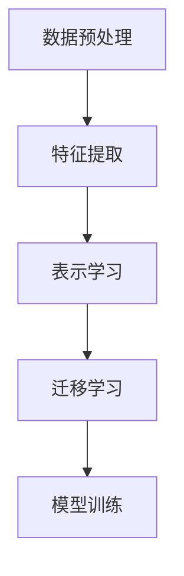
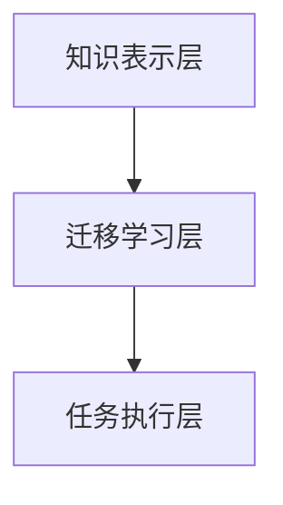
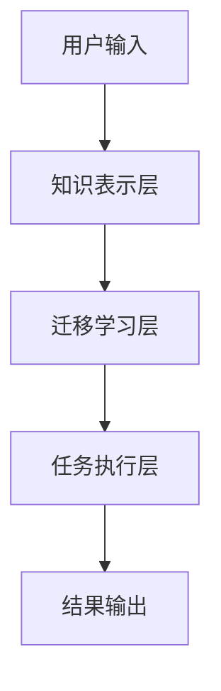

                 

# 开发具有跨领域知识迁移能力的AI Agent

## 关键词：AI Agent，跨领域知识迁移，知识表示，迁移学习，人工智能

## 摘要：  
本文旨在探讨如何开发具有跨领域知识迁移能力的AI Agent。通过分析AI Agent的核心概念、知识表示方法、迁移学习算法、系统架构设计以及实际应用场景，本文为读者提供了从理论到实践的全面指导。通过详细的算法原理、系统设计和项目实战，本文帮助读者理解如何实现跨领域知识迁移，并在实际项目中应用这些技术。

---

# 第1章: AI Agent与跨领域知识迁移概述

## 1.1 AI Agent的基本概念  
AI Agent（人工智能代理）是指能够感知环境、自主决策并执行任务的智能实体。它具备以下核心特征：  
1. **自主性**：能够在无外部干预的情况下独立运行。  
2. **反应性**：能够实时感知环境并做出响应。  
3. **目标导向**：通过设定目标来驱动行为。  

跨领域知识迁移是指AI Agent能够将在一个领域学到的知识和经验，迁移到另一个完全不同的领域中，并在新领域中有效应用这些知识。这种能力使得AI Agent能够更灵活地应对多样化的任务和环境。  

---

## 1.2 跨领域知识迁移的背景与挑战  

### 1.2.1 知识迁移的背景  
随着AI技术的快速发展，AI Agent的应用场景日益广泛。然而，AI Agent在单一领域的表现往往难以满足实际需求，尤其是在需要处理多领域任务的复杂场景中。跨领域知识迁移技术能够帮助AI Agent快速适应新领域，减少数据依赖性，降低开发成本。  

### 1.2.2 跨领域知识迁移的挑战  
1. **领域差异性**：不同领域之间的数据、特征和任务差异较大，直接迁移可能效果不佳。  
2. **数据稀疏性**：在新领域中，可用数据往往有限，导致迁移效果受限。  
3. **知识表示的通用性**：如何设计通用的知识表示方法，使其适用于不同领域，是关键挑战之一。  

### 1.2.3 跨领域知识迁移的实际应用场景  
跨领域知识迁移技术在以下场景中具有重要应用：  
- **医疗与教育**：将医疗领域的知识迁移到教育领域，辅助个性化教学。  
- **自然语言处理**：将某一语言的自然语言处理模型迁移到其他语言。  
- **机器人控制**：将某种环境下的机器人控制经验迁移到新的环境。  

---

## 1.3 本书的核心目标与结构  

### 1.3.1 本书的核心目标  
本文旨在系统地介绍AI Agent的跨领域知识迁移技术，涵盖从理论到实践的完整流程。通过深入分析知识表示、迁移学习算法和系统架构设计，本文为读者提供实现跨领域知识迁移的实用方法。  

### 1.3.2 本书的结构安排  
本书分为九章，内容安排如下：  
1. **概述**：介绍AI Agent和跨领域知识迁移的基本概念。  
2. **核心概念与知识表示**：探讨AI Agent的知识表示方法及其跨领域迁移的关键要素。  
3. **算法原理**：详细讲解知识表示学习、迁移学习和对比学习的算法及其数学模型。  
4. **系统架构设计**：分析AI Agent的系统功能、架构和交互流程。  
5. **项目实战**：从环境搭建到算法实现，再到案例分析，提供完整的实战指导。  
6. **未来趋势与挑战**：探讨跨领域知识迁移的前沿技术及应用潜力。  
7. **总结与展望**：总结全书内容，并展望未来发展方向。  

### 1.3.3 学习本书的建议  
建议读者在阅读本书时，结合实际项目进行实践，尤其是在掌握理论知识后，尝试在具体领域中应用跨领域知识迁移技术。此外，熟悉机器学习和深度学习的基础知识将有助于更好地理解本书内容。  

---

# 第2章: AI Agent的核心概念与知识表示  

## 2.1 AI Agent的知识表示方法  

### 2.1.1 符号表示法  
符号表示法通过符号和规则来表示知识，例如逻辑表达式、语法规则等。这种方法在知识推理和逻辑推理方面具有优势，但难以处理复杂和模糊的知识。  

### 2.1.2 语义网络表示法  
语义网络通过节点和边来表示概念及其关系，例如“狗是动物”可以用节点“狗”和“动物”之间的边“is-a”表示。这种方法能够有效表示层次化的知识结构。  

### 2.1.3 知识图谱表示法  
知识图谱是一种大规模的知识表示方法，通过结构化的数据描述实体及其关系。例如，知识图谱可以表示“人-出生地-城市”的关系。知识图谱广泛应用于搜索引擎、推荐系统等领域。  

---

## 2.2 跨领域知识迁移的关键概念  

### 2.2.1 知识表示的领域独立性  
领域独立性是指知识表示方法能够跨越不同领域，适用于多种场景。例如，使用Word2Vec表示的词向量在不同语言和领域中具有较好的迁移性。  

### 2.2.2 跨领域特征提取  
特征提取是将数据转换为能够反映其本质特征的表示。跨领域特征提取的目标是找到在不同领域中具有相似或相关性的特征。例如，在图像识别中，颜色和形状是跨领域通用的特征。  

### 2.2.3 跨领域知识的融合与推理  
跨领域知识的融合与推理是指将不同领域的知识进行整合，并通过推理得出新的结论。例如，在医疗和法律领域，可以将医疗知识与法律规则相结合，进行合规性推理。  

---

## 2.3 跨领域知识迁移的核心要素  

### 2.3.1 领域边界与特征提取  
领域边界是指不同领域之间的分界线。跨领域知识迁移需要识别和处理这些边界，提取能够跨越领域边界的特征。  

### 2.3.2 知识表示的可迁移性  
知识表示的可迁移性是指表示方法在不同领域中具有相似的语义表示能力。例如，使用统一的知识图谱表示不同领域的实体和关系。  

### 2.3.3 跨领域推理与应用  
跨领域推理是指在不同领域之间进行逻辑推理，从而解决复杂问题。例如，在电子商务和金融领域，可以利用跨领域推理技术进行风险评估。  

---

# 第3章: 跨领域知识迁移的算法原理  

## 3.1 知识表示学习  

### 3.1.1 表示学习的基本原理  
表示学习的目标是将数据转换为低维向量表示，例如Word2Vec将词转换为向量。  

### 3.1.2 Word2Vec与句向量表示  
Word2Vec通过上下文预测词或通过词预测上下文来学习词向量。句向量表示则是将句子转换为向量，例如使用BERT模型。  

### 3.1.3 知识图谱嵌入  
知识图谱嵌入是将知识图谱中的实体和关系表示为向量。例如，使用TransE将关系表示为边向量。  

---

## 3.2 跨领域迁移学习算法  

### 3.2.1 基于特征的迁移学习  
基于特征的迁移学习通过提取共同特征进行迁移，例如使用线性回归模型在源领域和目标领域之间迁移。  

### 3.2.2 基于模型的迁移学习  
基于模型的迁移学习通过共享模型参数进行迁移，例如使用卷积神经网络在图像分类任务中迁移。  

### 3.2.3 对比学习与自监督学习  
对比学习通过对比正样本和负样本进行学习，例如使用SimCLR框架。自监督学习通过预测数据本身来学习表示，例如使用MaskedLM模型。  

---

## 3.3 跨领域知识迁移的数学模型  

### 3.3.1 表示学习的数学公式  
例如，Word2Vec的损失函数：  
$$ L = -\sum_{i=1}^{n} \log p(word_i) $$  

### 3.3.2 迁移学习的数学模型  
例如，迁移学习的领域适应目标：  
$$ \min_{f} \mathbb{E}_{x,y} [L(f(x), y)] + \lambda \mathbb{E}_{x'} [L(f(x'), y')] $$  

### 3.3.3 对比学习的数学框架  
例如，对比学习的目标函数：  
$$ L = \frac{1}{|B|} \sum_{i=1}^{|B|} \sum_{j=1}^{|B|} \text{Contrast}(x_i, x_j) $$  

---

## 3.4 算法流程图  

---

# 第4章: 跨领域知识迁移的系统架构设计  

## 4.1 系统功能设计  
AI Agent的系统功能包括知识表示、知识存储、迁移学习和任务执行。  

### 4.1.1 领域模型设计  
领域模型通过类图表示不同领域的实体和关系。  

### 4.1.2 系统架构图  

---

## 4.2 系统架构设计  

### 4.2.1 系统功能设计  
系统功能包括数据输入、知识表示、迁移学习和结果输出。  

### 4.2.2 系统架构设计  
系统架构包括数据层、表示层、学习层和应用层。  

---

## 4.3 系统接口设计  
系统接口包括数据接口、模型接口和任务接口。  

---

## 4.4 系统交互流程图  

---

# 第5章: 跨领域知识迁移的项目实战  

## 5.1 环境搭建  

### 5.1.1 安装依赖  
安装必要的库，例如TensorFlow、Keras、PyTorch等。  

### 5.1.2 数据准备  
准备跨领域的数据集，例如多语言文本数据。  

---

## 5.2 核心算法实现  

### 5.2.1 知识表示实现  
实现Word2Vec或BERT模型，将文本表示为向量。  

### 5.2.2 迁移学习实现  
实现迁移学习算法，例如使用预训练模型在目标领域进行微调。  

---

## 5.3 实际案例分析  

### 5.3.1 案例背景  
例如，在自然语言处理任务中，将中文模型迁移到英文任务。  

### 5.3.2 案例实现  
详细解释实现步骤，包括数据预处理、模型训练和结果分析。  

---

## 5.4 项目小结  
总结项目实现的关键点和经验教训，强调跨领域知识迁移技术的应用价值。  

---

# 第6章: 跨领域知识迁移的最佳实践  

## 6.1 问题场景分析  
分析跨领域知识迁移的常见问题和解决方案。  

### 6.1.1 数据不足的解决方案  
使用数据增强、迁移学习等方法应对数据不足问题。  

---

## 6.2 系统设计建议  
建议在系统设计中采用模块化、可扩展的设计方式。  

---

## 6.3 开发注意事项  
注意领域适应性、模型泛化能力和计算资源的分配。  

---

## 6.4 拓展阅读  
推荐阅读相关领域的书籍和论文，例如《迁移学习》、《知识图谱》等。  

---

# 第7章: 跨领域知识迁移的未来趋势与挑战  

## 7.1 未来趋势  
跨领域知识迁移技术将朝着多模态学习、自适应学习和实时迁移的方向发展。  

---

## 7.2 挑战与解决方案  
挑战包括领域差异性、数据稀疏性和计算效率问题。解决方案包括多模态学习、元学习和分布式计算。  

---

## 7.3 应用潜力  
跨领域知识迁移技术将在医疗、教育、金融等领域发挥重要作用。  

---

# 第8章: 总结与展望  

## 8.1 全书总结  
总结本书的核心内容，强调跨领域知识迁移技术的重要性。  

---

## 8.2 学习与实践建议  
鼓励读者结合实际项目进行深入学习和实践，关注前沿技术的发展。  

---

# 作者：AI天才研究院/AI Genius Institute & 禅与计算机程序设计艺术 /Zen And The Art of Computer Programming

