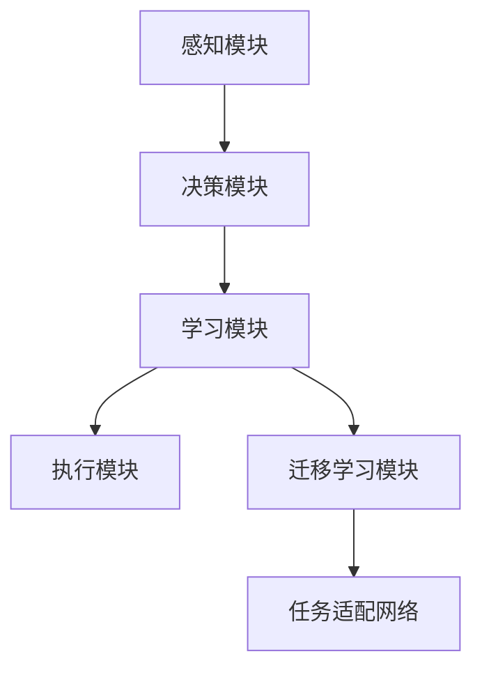

                 


# 开发具有迁移学习能力的AI Agent

> **关键词**：AI Agent，迁移学习，机器学习，深度学习，领域适应，任务适配

> **摘要**：本文详细探讨了开发具有迁移学习能力的AI Agent的核心概念、算法原理、系统架构以及实际应用。通过分析迁移学习在AI Agent中的重要性，结合具体案例，展示了如何通过迁移学习提升AI Agent的泛化能力和适应性。文章还深入讲解了迁移学习的数学模型、主流算法及其在系统设计中的应用，为读者提供了从理论到实践的全面指导。

---

## 第1章: 迁移学习与AI Agent概述

### 1.1 迁移学习的核心概念

#### 1.1.1 迁移学习的定义与背景
迁移学习是一种机器学习技术，旨在通过将从一个任务或领域中学到的知识迁移到另一个任务或领域中，从而减少对新任务的训练数据依赖。其核心思想是利用已有知识来提高新任务的学习效率和性能。

#### 1.1.2 迁移学习的核心原理
迁移学习的核心在于特征表示和任务适配。通过提取通用的特征或调整模型参数，使得模型能够适应新的任务或领域。

#### 1.1.3 迁移学习与传统机器学习的对比
| 对比维度         | 迁移学习                          | 传统机器学习                      |
|------------------|----------------------------------|-----------------------------------|
| 数据依赖         | 依赖少量新任务数据               | 依赖大量新任务数据               |
| 任务多样性       | 支持多任务学习                   | 专注于单一任务                   |
| 模型适应性       | 高                                | 中                                |

### 1.2 AI Agent的基本概念

#### 1.2.1 AI Agent的定义与特点
AI Agent是一种智能体，能够感知环境、自主决策并执行任务。其特点包括自主性、反应性、目标导向和社会能力。

#### 1.2.2 AI Agent的分类与应用场景
AI Agent可以分为简单反射型、基于模型的反射型、目标驱动型和实用驱动型。应用场景包括自动驾驶、智能助手、机器人控制等。

#### 1.2.3 迁移学习在AI Agent中的重要性
迁移学习可以提高AI Agent的泛化能力和适应性，减少对新任务的训练数据依赖，从而提升其在复杂环境中的性能。

### 1.3 迁移学习在AI Agent中的应用价值

#### 1.3.1 提高AI Agent的泛化能力
通过迁移学习，AI Agent可以在不同任务和领域之间共享知识，提高其在新环境中的表现。

#### 1.3.2 降低AI Agent的训练成本
迁移学习可以减少对新任务大量标注数据的需求，从而降低训练成本。

#### 1.3.3 提升AI Agent的实时适应能力
迁移学习使得AI Agent能够快速适应新任务，满足实时应用的需求。

### 1.4 本章小结
本章介绍了迁移学习的核心概念和AI Agent的基本特点，重点阐述了迁移学习在AI Agent中的重要性及其应用价值。

---

## 第2章: 迁移学习的核心原理

### 2.1 迁移学习的理论基础

#### 2.1.1 表征学习与特征提取
表征学习通过提取高维数据的低维特征，使得模型能够更好地捕捉数据的本质特征。

#### 2.1.2 域适应与任务适配
域适应通过调整模型参数或特征，使得模型在源域和目标域之间表现一致。任务适配则通过共享任务间的相关信息，提高模型的泛化能力。

#### 2.1.3 知识蒸馏与模型压缩
知识蒸馏通过将大模型的知识迁移到小模型中，实现模型压缩和轻量化。

### 2.2 迁移学习的关键技术

#### 2.2.1 参数迁移与非参数迁移
参数迁移通过调整模型参数实现，而非参数迁移则通过学习共享特征或概率分布。

#### 2.2.2 基于距离的迁移学习
基于距离的迁移学习通过最小化源域和目标域之间的距离，提高模型的泛化能力。

#### 2.2.3 基于概率分布的迁移学习
基于概率分布的迁移学习通过调整数据分布，使得源域和目标域的数据分布一致。

### 2.3 迁移学习的数学模型

#### 2.3.1 域适应模型（Domain Adaptation）
$$P(y|x) = \argmax_{y} \sum_{x} P(x|y)P(y)$$

#### 2.3.2 任务适配模型（Task Adaptation）
$$f_{target}(x) = \argmax_{f} \sum_{x} L(f(x), y_{target}(x))$$

### 2.4 本章小结
本章详细介绍了迁移学习的核心原理，包括表征学习、域适应和任务适配等关键技术，并通过数学模型展示了其理论基础。

---

## 第3章: 迁移学习算法与实现

### 3.1 基于特征的迁移学习算法

#### 3.1.1 统一特征空间方法
通过将源域和目标域的数据映射到统一的特征空间，实现特征对齐。

#### 3.1.2 基于核方法的迁移学习
利用核方法构建非线性特征空间，提高模型的表达能力。

#### 3.1.3 基于深度学习的特征对齐
通过深度神经网络提取高维特征，并通过对抗训练实现特征对齐。

### 3.2 基于参数的迁移学习算法

#### 3.2.1 参数迁移学习框架
通过共享模型参数或调整模型权重，实现知识迁移。

#### 3.2.2 基于权重共享的迁移学习
通过共享源任务和目标任务的权重，减少参数空间的差异。

#### 3.2.3 基于自适应层的迁移学习
在模型中添加自适应层，用于调整源任务和目标任务之间的差异。

### 3.3 基于任务的迁移学习算法

#### 3.3.1 多任务学习
通过同时学习多个任务，共享任务间的特征和参数，提高模型的泛化能力。

#### 3.3.2 任务适配网络
通过构建任务适配网络，将源任务的知识迁移到目标任务。

#### 3.3.3 基于对抗训练的迁移学习
通过对抗训练，使得模型在源任务和目标任务之间保持一致的特征分布。

### 3.4 算法对比与选择策略

#### 3.4.1 不同迁移学习算法的优缺点对比
| 算法类型         | 优点                           | 缺点                           |
|------------------|--------------------------------|--------------------------------|
| 基于特征的迁移   | 特征对齐能力强                 | 需要设计复杂的特征提取方法     |
| 基于参数的迁移   | 参数调整灵活                   | 参数空间差异可能较大           |
| 基于任务的迁移   | 多任务学习能力强               | 计算复杂度高                   |

#### 3.4.2 根据场景选择合适的迁移学习算法
选择迁移学习算法时，需考虑任务类型、数据分布差异以及计算资源等因素。

### 3.5 本章小结
本章详细介绍了主流的迁移学习算法，包括基于特征、参数和任务的迁移学习方法，并通过对比分析帮助读者选择合适的算法。

---

## 第4章: AI Agent的系统架构与设计

### 4.1 AI Agent的功能模块划分

#### 4.1.1 感知模块
负责感知环境信息，如视觉、听觉和触觉输入。

#### 4.1.2 决策模块
根据感知信息和任务目标，制定决策策略。

#### 4.1.3 学习模块
通过迁移学习算法，实现知识的迁移和模型的优化。

#### 4.1.4 执行模块
根据决策结果执行具体动作，与环境进行交互。

### 4.2 迁移学习在系统架构中的位置

#### 4.2.1 迁移学习模块的设计
通过设计专门的迁移学习模块，实现源任务和目标任务之间的知识迁移。

#### 4.2.2 系统架构图


#### 4.2.3 系统接口设计
系统接口包括感知接口、决策接口、学习接口和执行接口，通过标准化接口实现模块之间的通信。

### 4.3 本章小结
本章详细介绍了AI Agent的系统架构设计，重点阐述了迁移学习模块的设计与实现。

---

## 第5章: 项目实战与案例分析

### 5.1 项目实战

#### 5.1.1 环境安装
安装必要的依赖库，如TensorFlow、Keras和Scikit-learn。

#### 5.1.2 核心代码实现
```python
import tensorflow as tf
from tensorflow import keras

# 定义迁移学习模型
def transfer_learning_model():
    base_model = keras.applications.VGG16(weights='imagenet', include_top=False, input_shape=(224, 224, 3))
    x = base_model.output
    x = keras.layers.GlobalAveragePooling2D()(x)
    x = keras.layers.Dense(1024, activation='relu')(x)
    predictions = keras.layers.Dense(num_classes, activation='softmax')(x)
    model = keras.Model(inputs=base_model.input, outputs=predictions)
    return model

# 编译模型
model = transfer_learning_model()
model.compile(optimizer='adam', loss='categorical_crossentropy', metrics=['accuracy'])
```

#### 5.1.3 案例分析
通过具体案例分析，展示迁移学习在AI Agent中的实际应用效果。

### 5.2 本章小结
本章通过实际项目案例，展示了迁移学习在AI Agent中的具体实现和应用效果。

---

## 第6章: 高级内容与未来趋势

### 6.1 高级内容

#### 6.1.1 迁移学习的前沿研究
介绍迁移学习领域的最新研究成果，如元学习和自适应迁移学习。

#### 6.1.2 跨领域迁移学习
探讨在多个领域之间迁移学习的技术挑战和解决方案。

### 6.2 未来趋势

#### 6.2.1 迁移学习的自动化
通过自动化技术减少人工干预，实现自适应迁移学习。

#### 6.2.2 迁移学习的可解释性
提高迁移学习的可解释性，增强用户对模型的信任。

#### 6.2.3 迁移学习的多模态应用
探索多模态数据的迁移学习，如图像、文本和语音的联合迁移。

### 6.3 本章小结
本章展望了迁移学习的未来发展方向，为读者提供了进一步研究的方向。

---

## 作者

**作者：AI天才研究院/AI Genius Institute & 禅与计算机程序设计艺术 /Zen And The Art of Computer Programming**

---

通过以上结构和内容，我希望能够为读者提供一篇全面且深入的技术博客文章，帮助他们理解迁移学习在AI Agent中的重要性及其具体实现方法。

