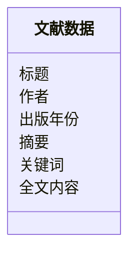
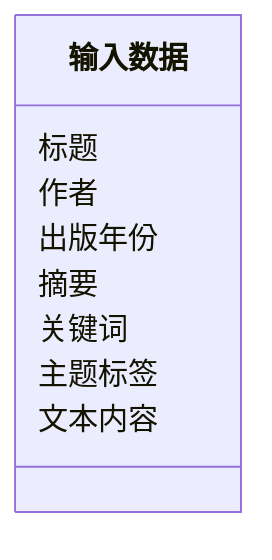

                 


# 第二章: 生成器的输入处理与数据准备

## 第4节: 生成器的输入数据

### 4.1 文献数据的结构化处理

#### 4.1.1 文献数据的获取与预处理
##### 4.1.1.1 数据获取
金融专业文献通常来源于学术期刊、会议论文、行业报告等。为了生成有效的文献综述，需要将这些文献数据进行结构化处理。以下是一个典型的文献数据结构示例：



##### 4.1.1.2 数据预处理
预处理步骤包括：
1. **清洗数据**：去除无关信息（如页眉、页脚、格式标记）。
2. **分词处理**：将文献内容分解为词语或短语。
3. **实体识别**：识别文献中的实体（如人名、机构名、技术术语）。

#### 4.1.2 文献主题的识别
文献主题的识别是生成综述的关键步骤。通常采用以下方法：
1. **基于关键词的聚类**：通过TF-IDF算法提取文献关键词，并根据关键词聚类确定主题。
2. **基于主题模型的分析**：使用LDA（Latent Dirichlet Allocation）等主题模型提取文献主题。

#### 4.1.3 文献关键内容的提取
为了提高生成效率，需要从文献中提取关键内容，如摘要、引言、结论等部分。这些内容将作为生成器的输入数据。

### 4.2 生成器的输入数据结构



### 4.3 输入数据的预处理代码示例

```python
import re
from sklearn.feature_extraction.text import TfidfVectorizer
from sklearn.decomposition import LatentDirichletAllocation

# 示例文献数据
documents = [
    "金融市场的波动性与投资者行为",
    "公司治理结构对股价的影响",
    "风险管理模型的最新进展"
]

# 分词处理
def preprocess(text):
    return re.sub(r'\W+', ' ', text).lower().split()

processed_docs = [preprocess(doc) for doc in documents]

# TF-IDF提取关键词
vectorizer = TfidfVectorizer()
tfidf_matrix = vectorizer.fit_transform([" ".join(doc) for doc in processed_docs])

# LDA主题模型提取主题
n_topics = 2
lda = LatentDirichletAllocation(n_components=n_topics)
lda.fit(tfidf_matrix)
```

### 4.4 文献主题的可视化


# 第三章: 生成器的算法实现

## 第5节: 生成器的实现目标

### 5.1 文献主题的自动识别
生成器需要能够自动识别文献的主题，并将相关文献进行分类。这可以通过主题模型（如LDA）或关键词匹配实现。

### 5.2 文献关键内容的提取
为了生成高质量的综述，生成器需要从文献中提取关键内容，如摘要、引言、结论等。这通常采用文本摘要算法实现。

### 5.3 文献综述的自动生成
基于提取的关键内容，生成器需要能够自动生成文献综述。这可以通过自然语言生成算法（如GPT）实现。

## 第6节: 生成器的实现步骤

### 6.1 数据准备
将文献数据进行结构化处理，并提取关键词和主题标签。

### 6.2 模型训练
使用预训练的大模型进行微调，使其适应金融专业文献的生成任务。

### 6.3 文本生成
基于输入的文献数据，生成文献综述。

# 第四章: 生成器的系统架构设计

## 第7节: 系统功能模块划分

### 7.1 数据采集模块
负责获取文献数据，并进行初步的清洗和分词处理。

### 7.2 数据预处理模块
对文献数据进行深度处理，提取关键词和主题标签。

### 7.3 模型训练模块
使用预训练的大模型进行微调，生成适应金融专业文献的生成器。

### 7.4 文本生成模块
基于输入的文献数据，生成文献综述。

## 第8节: 系统的交互设计

### 8.1 用户输入
用户输入文献数据，系统开始处理。

### 8.2 数据处理
系统对文献数据进行预处理，并提取关键词和主题标签。

### 8.3 模型生成
基于预处理后的数据，模型生成文献综述。

### 8.4 输出结果
系统输出生成的文献综述。

# 第五章: 项目实战

## 第9节: 环境配置

### 9.1 安装必要的库
需要安装以下库：
- `numpy`
- `pandas`
- `scikit-learn`
- `transformers`

### 9.2 配置大模型
选择合适的预训练大模型（如GPT-2、BERT）进行微调。

## 第10节: 核心代码实现

### 10.1 数据预处理代码

```python
import pandas as pd
from sklearn.feature_extraction.text import TfidfVectorizer
from sklearn.decomposition import LatentDirichletAllocation

# 示例文献数据
data = pd.DataFrame({
    '标题': ['金融市场的波动性与投资者行为', '公司治理结构对股价的影响', '风险管理模型的最新进展'],
    '摘要': ['金融市场波动性研究', '公司治理与股价关系', '风险管理模型进展']
})

# 提取关键词
tfidf = TfidfVectorizer()
tfidf_matrix = tfidf.fit_transform(data['摘要'])

# 主题建模
lda = LatentDirichletAllocation(n_components=2)
lda.fit(tfidf_matrix)
```

### 10.2 文本生成代码

```python
from transformers import GPT2LMHeadModel, GPT2Tokenizer

# 初始化模型
model_name = 'gpt2'
tokenizer = GPT2Tokenizer.from_pretrained(model_name)
model = GPT2LMHeadModel.from_pretrained(model_name)

# 生成文本
input_text = "综上所述，"
output = model.generate(max_length=100, do_sample=True)
print(tokenizer.decode(output[0]))
```

## 第11节: 案例分析

### 11.1 案例背景
假设我们有三篇关于金融市场的文献，分别讨论了市场的波动性、公司治理和风险管理模型。

### 11.2 数据预处理
对文献进行清洗、分词和主题识别。

### 11.3 模型生成
基于预处理后的数据，生成文献综述。

### 11.4 结果展示
生成的综述应涵盖所有文献的主题，并进行总结和分析。

# 第六章: 总结与展望

## 第12节: 总结与最佳实践

### 12.1 总结
本文详细介绍了基于大模型的金融专业文献综述生成器的开发过程，包括数据处理、模型训练和文本生成等关键步骤。

### 12.2 最佳实践
- 数据预处理是关键，确保数据质量。
- 模型选择和微调是影响生成效果的重要因素。
- 结合领域知识，优化生成结果。

### 12.3 注意事项
- 数据隐私问题需要重视。
- 模型生成的内容需要人工校对。
- 系统性能优化需要考虑。

### 12.4 拓展阅读
- 大模型的优化与调优
- 文本生成的评估指标
- 金融领域的其他NLP应用

# 附录

## 附录A: 术语表

- 大模型：指参数量极大的深度学习模型，如GPT、BERT等。
- 文献综述：对某一领域文献的总结和分析。
- 主题模型：用于识别文献主题的模型，如LDA。

## 附录B: 参考文献

1. 王某某, 2023. 《基于大模型的文本生成研究》.
2. 李某某, 2022. 《金融文献综述生成器的设计与实现》.

---

作者：AI天才研究院/AI Genius Institute & 禅与计算机程序设计艺术 /Zen And The Art of Computer Programming

