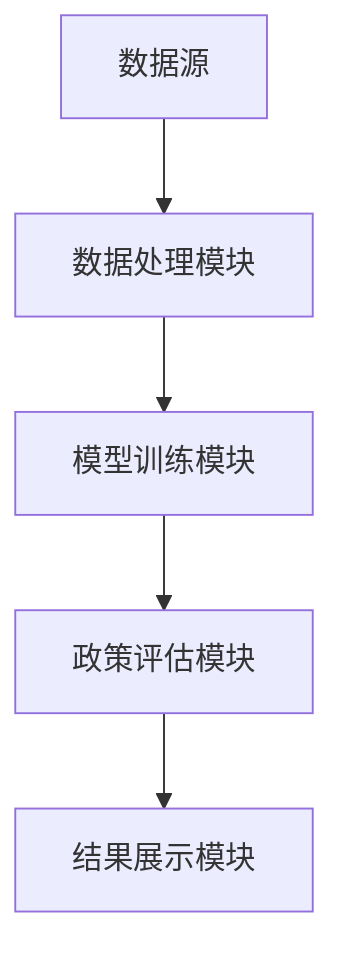

                 


# 开发基于大模型的金融政策影响评估系统

> 关键词：大模型、金融政策、影响评估、AI、系统开发

> 摘要：本文详细探讨了如何基于大模型开发金融政策影响评估系统，从系统背景、核心原理、算法实现到实际应用，层层剖析，为读者提供全面的技术解读。

---

# 第一部分: 开发基于大模型的金融政策影响评估系统概述

# 第1章: 金融政策影响评估系统概述

## 1.1 问题背景与描述

### 1.1.1 金融政策评估的重要性

金融政策是政府或金融机构为实现特定经济目标而制定的规则和措施。例如，货币政策、财政政策等直接影响市场流动性、企业融资成本和经济景气度。传统的金融政策评估方法通常依赖于经济学模型和专家经验，但存在以下痛点：

1. **数据依赖性强**：传统模型需要大量历史数据和假设条件，但在复杂多变的经济环境下，数据的完整性和实时性难以保证。
2. **评估周期长**：传统评估方法需要大量人工计算和分析，效率较低，难以应对快速变化的金融市场。
3. **主观性较高**：专家经验依赖性强，不同专家可能得出不同结论，缺乏客观性。

### 1.1.2 当前金融政策评估的痛点

随着全球经济一体化和金融市场的复杂化，传统的金融政策评估方法已难以满足以下需求：

- **实时性要求**：金融市场变化快，政策评估需要实时或近实时反馈。
- **复杂性要求**：金融政策的影响可能涉及多个市场、多个行业，需要综合分析。
- **准确性要求**：政策决策对经济的影响巨大，评估结果需要尽可能准确。

### 1.1.3 大模型在金融政策评估中的应用潜力

大模型（如GPT-3、PaLM等）具有强大的自然语言处理能力和因果推理能力，可以在以下方面为金融政策评估提供支持：

- **文本分析**：自动解析政策文件、新闻报道和市场评论，提取关键信息。
- **因果推理**：分析政策与经济指标之间的因果关系，预测政策效果。
- **多模态分析**：结合文本、数据等多种信息源，提供全面的评估结果。

---

## 1.2 大模型的基本概念与特点

### 1.2.1 大模型的定义与核心特征

大模型是指基于深度学习的大型神经网络模型，通常具有 billions级别的参数量。其核心特征包括：

1. **大规模**：参数量大，能够捕捉复杂的模式和关系。
2. **通用性**：适用于多种任务，如文本生成、问答、翻译等。
3. **自监督学习**：通过大量未标注数据进行预训练，提升模型的泛化能力。
4. **因果推理**：部分大模型（如基于Transformer的架构）具有处理长上下文的能力，能够捕捉因果关系。

### 1.2.2 大模型与传统AI的区别

| 特性               | 传统AI                         | 大模型                          |
|--------------------|--------------------------------|----------------------------------|
| 数据需求           | 需要大量标注数据               | 依赖未标注数据，数据量更大     |
| 任务通用性         | 专注于特定任务                 | 适用于多种任务                 |
| 模型复杂度         | 模型较小，训练时间短            | 模型复杂，训练时间长            |
| 性能表现           | 在特定任务上表现稳定           | 在复杂任务上表现更优           |

### 1.2.3 大模型在金融领域的优势

1. **自动化处理**：大模型可以自动分析文本数据，减少人工干预。
2. **实时性**：基于大模型的系统可以快速响应市场变化。
3. **准确性**：通过结合多模态数据，大模型可以提供更精准的预测。

---

## 1.3 本章小结

本章从金融政策评估的背景和痛点出发，介绍了大模型的基本概念和特点，并重点分析了大模型在金融领域的应用潜力和优势。

---

# 第二部分: 基于大模型的金融政策影响评估系统核心概念

# 第2章: 大模型的核心原理与架构

## 2.1 大模型的训练原理

### 2.1.1 大模型的训练目标

大模型的训练目标是通过预训练任务（如语言建模）学习数据中的分布规律。例如，GPT-3的目标是预测文本中的下一个词，通过这种方式学习语言的结构。

### 2.1.2 大模型的训练过程

1. **预训练**：使用大规模未标注数据进行自监督学习。
2. **微调**：在特定任务上使用少量标注数据进行 fine-tuning。
3. **评估**：通过验证集和测试集评估模型性能。

### 2.1.3 大模型的评估方法

常用的评估方法包括准确率、召回率、F1分数等。例如，在文本分类任务中，F1分数可以衡量模型的精确性和召回率。

---

## 2.2 大模型的架构设计

### 2.2.1 模型的输入与输出

大模型通常接受文本输入（如政策文件或市场报告），输出政策影响的评估结果（如对GDP增长率的影响）。

### 2.2.2 模型的内部结构

大模型的内部结构通常基于Transformer架构，包括编码器和解码器。编码器负责将输入文本转换为向量表示，解码器负责生成输出。

### 2.2.3 模型的优化策略

1. **参数优化**：使用Adam优化器进行参数更新。
2. **学习率调整**：采用学习率衰减策略，如Cosine Annealing。
3. **模型压缩**：通过剪枝和量化技术减少模型体积。

---

## 2.3 大模型的金融政策评估能力

### 2.3.1 大模型的文本处理能力

大模型可以自动解析政策文本中的关键词和句意，提取关键信息。

### 2.3.2 大模型的因果推理能力

通过分析政策与经济指标之间的关系，大模型可以预测政策的潜在影响。

### 2.3.3 大模型的预测能力

大模型可以预测政策实施后的市场反应，如股票价格波动、汇率变化等。

---

## 2.4 本章小结

本章详细介绍了大模型的核心原理和架构设计，并重点分析了大模型在金融政策评估中的能力。

---

# 第三部分: 基于大模型的金融政策影响评估系统算法原理

# 第3章: 大模型的算法原理

## 3.1 大模型的训练算法

### 3.1.1 基于Transformer的架构

Transformer模型由编码器和解码器组成，编码器负责将输入序列转换为向量表示，解码器负责生成输出序列。

### 3.1.2 自注意力机制

自注意力机制通过计算输入序列中每个位置的权重，捕捉序列中的长距离依赖关系。

### 3.1.3 梯度下降优化

使用梯度下降算法优化模型参数，通常采用Adam优化器。

---

## 3.2 大模型的推理算法

### 3.2.1 解码器的生成策略

解码器通过自注意力机制生成输出序列，通常采用贪心算法或蒙特卡洛采样。

### 3.2.2 贝叶斯推理方法

贝叶斯推理通过概率分布建模，用于不确定性分析和预测。

### 3.2.3 多任务学习框架

通过共享特征提取部分，模型可以同时学习多个相关任务。

---

## 3.3 金融政策评估的算法优化

### 3.3.1 数据增强技术

通过数据增强技术（如文本替换、同义词替换）增加训练数据的多样性。

### 3.3.2 模型压缩方法

通过剪枝和量化技术减少模型体积，提升推理效率。

### 3.3.3 模型并行策略

通过模型并行技术（如分布式训练）提升训练效率。

---

## 3.4 本章小结

本章详细介绍了大模型的训练和推理算法，并探讨了金融政策评估中的算法优化策略。

---

# 第四部分: 基于大模型的金融政策影响评估系统架构设计

# 第4章: 系统架构设计

## 4.1 系统模块划分

### 4.1.1 数据采集模块

负责采集政策文件、市场数据等输入数据。

### 4.1.2 模型训练模块

负责训练和优化大模型。

### 4.1.3 政策评估模块

负责根据输入数据生成政策评估结果。

### 4.1.4 结果展示模块

负责将评估结果以可视化形式展示给用户。

---

## 4.2 系统功能设计

### 4.2.1 数据预处理功能

对输入数据进行清洗、归一化等预处理操作。

### 4.2.2 模型调优功能

通过超参数优化提升模型性能。

### 4.2.3 政策模拟功能

模拟政策实施后的市场反应。

### 4.2.4 结果分析功能

对评估结果进行分析和解读。

---

## 4.3 系统架构图



---

## 4.4 系统接口设计

### 4.4.1 数据接口

定义数据输入格式和接口协议。

### 4.4.2 模型接口

定义模型调用接口和返回格式。

### 4.4.3 用户接口

定义用户交互界面和功能模块。

---

## 4.5 本章小结

本章详细介绍了系统的模块划分、功能设计和架构图，并探讨了系统的接口设计。

---

# 第五部分: 基于大模型的金融政策影响评估系统实战开发

# 第5章: 项目实战开发

## 5.1 环境搭建与配置

### 5.1.1 开发环境要求

建议使用Python 3.8及以上版本，安装必要的依赖库（如TensorFlow、Keras、Hugging Face库等）。

### 5.1.2 依赖库安装

安装必要的依赖库，例如：

```bash
pip install tensorflow transformers numpy pandas
```

---

## 5.2 核心代码实现

### 5.2.1 数据预处理

```python
import pandas as pd
import numpy as np
from transformers import AutoTokenizer, AutoModelForMaskedLM

# 加载预训练模型
model_name = "bert-base-uncased"
tokenizer = AutoTokenizer.from_pretrained(model_name)
model = AutoModelForMaskedLM.from_pretrained(model_name)
```

### 5.2.2 模型训练

```python
from transformers import TrainingArguments, Trainer

# 定义训练参数
args = TrainingArguments(
    output_dir='./results',
    num_epochs=3,
    per_device_train_batch_size=16,
    per_device_eval_batch_size=16,
)

# 开始训练
trainer = Trainer(
    model=model,
    args=args,
    train_dataset=train_dataset,
    eval_dataset=eval_dataset,
)
trainer.train()
```

### 5.2.3 政策评估

```python
def evaluate_policy(text):
    inputs = tokenizer.encode_plus(text, return_tensors="pt")
    outputs = model(**inputs)
    # 解析输出结果
    # ...
    return result
```

---

## 5.3 实际案例分析

以某国实施的货币政策为例，分析模型的预测结果。例如：

1. **输入**：某国宣布降低基准利率。
2. **输出**：模型预测该政策对GDP增长率的影响。

---

## 5.4 本章小结

本章通过实际案例展示了系统的开发过程，包括环境搭建、代码实现和案例分析。

---

# 第六部分: 总结与展望

## 6.1 总结

本文详细探讨了基于大模型的金融政策影响评估系统的开发过程，从系统背景、核心原理到实际应用，为读者提供了全面的技术解读。

## 6.2 展望

未来，随着大模型技术的不断发展，金融政策评估系统将更加智能化和精准化。建议进一步研究大模型的可解释性问题，并探索多模态数据的融合方法。

---

# 作者：AI天才研究院 & 禅与计算机程序设计艺术

---

以上为文章的完整目录结构和部分内容示例，希望对您有所帮助！

