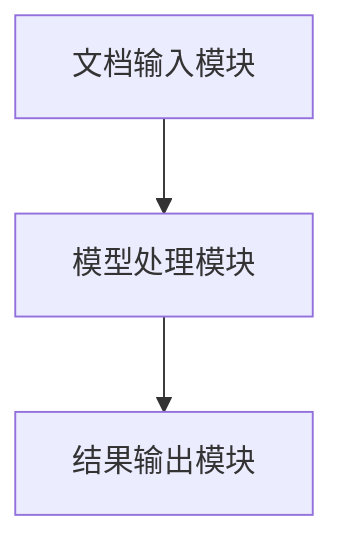

                 


# 开发基于大模型的金融法规遵从性检查系统

> 关键词：金融法规检查，大模型，自然语言处理，系统架构，合规性检查

> 摘要：本文详细探讨了基于大模型的金融法规遵从性检查系统的开发过程，从问题背景、核心概念、算法原理到系统架构设计和项目实战，全面解析了该系统的实现细节。通过本文，读者可以深入了解大模型在金融领域的应用，掌握系统设计与优化的关键点，为实际项目提供参考。

---

## 第1章：问题背景与需求分析

### 1.1 问题背景介绍

#### 1.1.1 金融法规遵从性检查的必要性
金融法规的遵从性是金融机构合规运营的核心要求。随着金融市场的复杂化和监管力度的加强，传统的手动检查方式效率低下，且容易出错。金融机构需要一种高效、准确的自动化检查手段。

#### 1.1.2 问题描述与解决方法
金融法规检查的核心问题是如何快速、准确地识别文本中的违规内容。传统方法依赖人工审核，存在效率低、成本高的问题。引入大模型技术可以实现自动化处理，提升检查效率和准确性。

#### 1.1.3 大模型技术的引入动机
大模型（如GPT）具有强大的自然语言处理能力，能够理解复杂的金融文本，并快速生成合规性判断。通过结合大模型，可以显著提升金融法规检查的效率和准确性。

### 1.2 系统目标与边界

#### 1.2.1 系统目标
- 实现金融文本的自动化合规性检查。
- 提供高准确率的违规内容识别功能。
- 支持多种金融文档格式的输入。

#### 1.2.2 边界与外延
- 本系统仅处理文本内容，不涉及图片、视频等其他形式的数据。
- 系统不对金融市场的实时数据进行处理，仅进行文本分析。

---

## 第2章：核心概念与系统架构

### 2.1 核心概念

#### 2.1.1 大模型的基本原理
大模型通过深度学习训练，能够理解上下文关系，并生成与输入内容相关的输出。其核心在于模型的参数优化和上下文捕捉能力。

#### 2.1.2 金融法规检查系统的组成
- **输入模块**：接收金融文档的输入。
- **处理模块**：利用大模型对文本进行分析。
- **输出模块**：生成合规性检查结果。

#### 2.1.3 实体关系分析
通过ER图分析，系统涉及的主要实体包括：用户、文档、检查结果、模型参数等。各实体之间的关系清晰，便于系统设计。

### 2.2 系统架构设计

#### 2.2.1 系统组成模块
- **文档输入模块**：接收金融文档并进行预处理。
- **模型处理模块**：利用大模型对文档进行分析。
- **结果输出模块**：生成检查结果并反馈给用户。

#### 2.2.2 模块之间的交互关系
- 文档输入模块将预处理后的文档传递给模型处理模块。
- 模型处理模块生成检查结果并返回给结果输出模块。
- 结果输出模块将结果反馈给用户。

---

## 第3章：算法原理与数学模型

### 3.1 算法原理

#### 3.1.1 大模型的训练过程
- **预训练**：使用大规模金融文本数据进行初始化训练。
- **微调**：针对金融法规检查任务进行优化训练。

#### 3.1.2 检查流程
1. 文档输入模块接收金融文档。
2. 模型处理模块对文档进行分析，生成合规性判断。
3. 结果输出模块将结果反馈给用户。

### 3.2 数学模型

#### 3.2.1 模型训练的数学公式
$$\text{损失函数} = \text{交叉熵损失} + \text{正则化项}$$

#### 3.2.2 模型推理的数学公式
$$\text{预测概率} = \text{模型输出}$$

---

## 第4章：系统分析与设计

### 4.1 系统功能设计

#### 4.1.1 功能模块划分
- **文档输入**：接收用户上传的金融文档。
- **模型处理**：对文档进行合规性检查。
- **结果输出**：显示检查结果。

#### 4.1.2 功能流程
1. 用户上传金融文档。
2. 系统对文档进行预处理。
3. 模型处理模块生成检查结果。
4. 结果输出模块展示结果。

### 4.2 系统架构设计

#### 4.2.1 系统架构图


---

## 第5章：项目实战与代码实现

### 5.1 环境安装与配置

#### 5.1.1 开发环境
- **Python 3.8+**
- **TensorFlow或PyTorch**

#### 5.1.2 依赖安装
```bash
pip install tensorflow transformers
```

### 5.2 系统核心实现

#### 5.2.1 代码实现
```python
import tensorflow as tf
from transformers import GPT2Tokenizer, GPT2Model

def load_model():
    model = GPT2Model.from_pretrained('gpt2-large')
    tokenizer = GPT2Tokenizer.from_pretrained('gpt2-large')
    return model, tokenizer

def preprocess_document(document):
    inputs = tokenizer(document, return_tensors='np')
    return inputs

def model_inference(model, inputs):
    outputs = model.generate(inputs['input_ids'], max_length=500)
    return outputs

def check_compliance(outputs):
    # 实现合规性判断逻辑
    pass

def main():
    model, tokenizer = load_model()
    document = "金融法规相关内容..."
    inputs = preprocess_document(document)
    outputs = model_inference(model, inputs)
    result = check_compliance(outputs)
    print(result)

if __name__ == "__main__":
    main()
```

#### 5.2.2 代码解读
- **load_model**：加载预训练的大模型。
- **preprocess_document**：对输入文档进行预处理。
- **model_inference**：利用模型进行推理。
- **check_compliance**：判断结果是否合规。

---

## 第6章：总结与展望

### 6.1 总结
本文详细介绍了基于大模型的金融法规遵从性检查系统的开发过程，从问题背景到系统设计，再到项目实战，全面解析了系统的实现细节。通过大模型的强大能力，显著提升了金融合规性检查的效率和准确性。

### 6.2 展望
未来，随着大模型技术的不断发展，金融法规检查系统将更加智能化和高效化。同时，结合其他AI技术，如图像识别和语音识别，将进一步拓展系统的应用场景。

---

## 作者：AI天才研究院 & 禅与计算机程序设计艺术

---

通过本文的详细讲解，读者可以深入了解基于大模型的金融法规检查系统的开发过程，并为实际项目提供有价值的参考。

