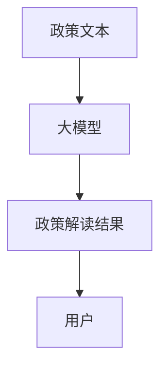
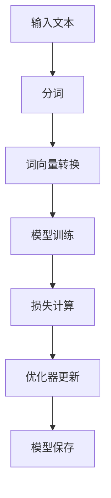
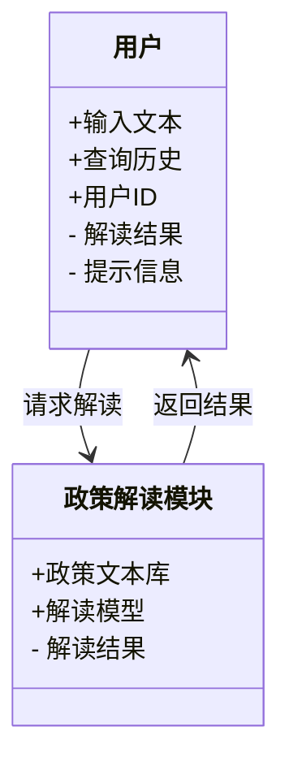
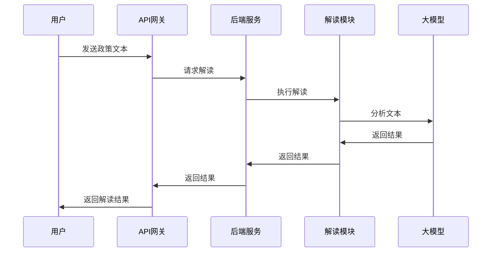

                 


# 开发基于大模型的金融监管政策解读系统

## 关键词：大模型，金融监管，政策解读，自然语言处理，系统架构

## 摘要：本文详细探讨了开发基于大模型的金融监管政策解读系统的背景、核心概念、算法原理、系统架构及项目实战。通过分析政策解读的挑战，结合大模型的优势，提出了系统的整体架构，并通过实际案例展示了系统的开发与应用。

---

# 第一部分: 背景与概述

## 第1章: 金融监管政策解读系统的背景与问题

### 1.1 问题背景

#### 1.1.1 金融监管的重要性与挑战
金融监管是维护金融市场稳定和保护投资者利益的关键。然而，随着金融市场的复杂化，政策解读的难度也在增加。政策文本通常复杂且模糊，需要专业人员进行深度分析。

#### 1.1.2 传统政策解读的局限性
传统政策解读依赖人工分析，效率低且容易出错。面对大量政策文本，这种方法难以快速准确地提取关键信息。

#### 1.1.3 大模型在金融监管中的潜力
大模型具备强大的自然语言处理能力，能够快速分析大量文本，提取关键信息，为政策解读提供高效解决方案。

### 1.2 问题描述

#### 1.2.1 政策解读的复杂性
政策文本涉及多个方面，解读时需要考虑上下文和隐含含义，容易出现歧义。

#### 1.2.2 数据处理的难度
金融政策涉及大量结构化和非结构化数据，如何有效处理这些数据是一个挑战。

#### 1.2.3 解读结果的准确性要求
金融监管需要高精度的解读结果，任何错误都可能带来重大风险。

### 1.3 问题解决思路

#### 1.3.1 引入大模型的必要性
大模型能够处理大量文本数据，提取关键信息，提高解读效率和准确性。

#### 1.3.2 大模型在政策解读中的优势
大模型可以自动分析政策文本，识别潜在风险，辅助监管机构做出决策。

#### 1.3.3 系统的整体架构设想
构建一个基于大模型的系统，整合文本处理、分析和反馈模块，实现自动化政策解读。

### 1.4 系统的边界与外延

#### 1.4.1 系统的功能边界
系统专注于政策文本的解读，不涉及其他监管任务。

#### 1.4.2 系统的适用范围
适用于银行、证券、保险等金融领域的政策解读。

#### 1.4.3 系统与其他系统的接口关系
系统可与风险评估系统、合规检查系统等其他监管系统集成。

### 1.5 概念结构与核心要素

#### 1.5.1 核心概念的层次结构
政策文本 → 大模型 → 政策解读结果

#### 1.5.2 核心要素的定义与关系
- 政策文本：输入数据
- 大模型：处理引擎
- 解读结果：输出数据

#### 1.5.3 概念结构图（Mermaid）


### 1.6 本章小结
本章介绍了金融监管政策解读的背景和挑战，探讨了大模型在其中的作用，并提出了系统的整体架构。

---

# 第二部分: 核心概念与联系

## 第2章: 大模型与金融监管政策解读的核心概念

### 2.1 大模型的基本原理

#### 2.1.1 大模型的定义与特点
大模型是一种深度学习模型，具有强大的文本处理能力，能够理解上下文和隐含含义。

#### 2.1.2 大模型的训练机制
通过大量数据训练，模型学习语言的规律和结构，具备生成和理解文本的能力。

#### 2.1.3 大模型的应用场景
广泛应用于文本生成、机器翻译、问答系统等领域。

### 2.2 金融监管政策解读的关键要素

#### 2.2.1 政策文本的特征
- 结构化：如法规条文
- 非结构化：如政策解读报告

#### 2.2.2 政策意图的识别
识别政策背后的意图，如监管力度、政策导向。

#### 2.2.3 解读结果的验证
通过交叉验证和专家审核确保解读的准确性。

### 2.3 大模型与金融监管的结合

#### 2.3.1 大模型在政策理解中的作用
帮助理解复杂政策文本，提取关键信息。

#### 2.3.2 大模型在风险评估中的应用
识别潜在风险点，辅助监管决策。

#### 2.3.3 大模型在合规性检查中的优势
快速检查企业行为是否符合政策要求。

### 2.4 核心概念的对比分析

#### 2.4.1 不同大模型的对比
- 参数量：参数越多，能力越强
- 训练数据：数据质量影响模型性能
- 计算资源：训练需要大量算力

#### 2.4.2 政策解读的对比
- 传统方法 vs. 大模型：效率和准确性对比

#### 2.4.3 解读结果的对比
- 精确率：大模型优于传统方法
- 召回率：大模型表现更好

### 2.5 本章小结
本章详细介绍了大模型的基本原理及其在金融监管中的应用，对比分析了不同方法的优劣。

---

# 第三部分: 算法原理

## 第3章: 基于大模型的金融监管政策解读算法原理

### 3.1 算法概述

#### 3.1.1 大模型的训练目标
最大化似然概率，最小化损失函数。

#### 3.1.2 模型结构
包括编码层、解码层，采用自注意力机制。

#### 3.1.3 损失函数
交叉熵损失函数：$$L = -\sum_{i=1}^{n} y_i \log p(y_i)$$

### 3.2 算法步骤

#### 3.2.1 数据预处理
- 分词：将文本分割成词语
- 词向量转换：使用词嵌入表示

#### 3.2.2 模型训练
- 输入政策文本
- 输出解读结果

#### 3.2.3 解码过程
- 生成解读结果
- 输出最终结果

### 3.3 算法实现

#### 3.3.1 Python代码实现
```python
def preprocess(text):
    tokens = tokenizer.encode(text)
    return tokens

def train_model():
    model = build_model()
    optimizer = Adam(...)
    loss_fn = nn.CrossEntropyLoss()
    for epoch in epochs:
        for batch in data_loader:
            inputs, labels = batch
            outputs = model(inputs)
            loss = loss_fn(outputs, labels)
            optimizer.zero_grad()
            loss.backward()
            optimizer.step()
```

#### 3.3.2 算法流程图（Mermaid）


### 3.4 数学模型

#### 3.4.1 注意力机制
$$ \text{Attention}(Q, K, V) = \text{softmax}\left(\frac{QK^T}{\sqrt{d_k}}\right)V $$

#### 3.4.2 解码层
$$ \text{Decoding}(x) = \text{SelfAttention}(x) + \text{FFN}(x) $$

### 3.5 举例说明

#### 3.5.1 训练示例
输入：金融监管政策文本
输出：解读结果，如“该政策要求银行增加资本充足率。”

#### 3.5.2 解码示例
输入：政策条文
输出：生成解读文本

### 3.6 本章小结
本章详细讲解了基于大模型的算法原理，包括数据预处理、模型训练和解码过程，并通过代码和图示进行了说明。

---

# 第四部分: 系统分析与架构设计

## 第4章: 基于大模型的金融监管政策解读系统架构

### 4.1 问题场景介绍

#### 4.1.1 系统目标
实现金融监管政策的自动化解读，辅助监管机构做出决策。

#### 4.1.2 系统需求
- 高效处理大量政策文本
- 准确解读政策意图
- 提供可视化结果

### 4.2 系统功能设计

#### 4.2.1 领域模型（Mermaid类图）


#### 4.2.2 系统架构（Mermaid架构图）


### 4.3 系统接口设计

#### 4.3.1 API接口
- 输入接口：接收政策文本
- 输出接口：返回解读结果

#### 4.3.2 数据接口
- 数据存储：存储政策文本和解读结果
- 数据检索：根据条件查询解读结果

### 4.4 系统交互（Mermaid序列图）



### 4.5 本章小结
本章设计了系统的整体架构，包括功能模块、接口设计和交互流程，并通过图示进行了详细展示。

---

# 第五部分: 项目实战

## 第5章: 金融监管政策解读系统的开发与实现

### 5.1 环境安装

#### 5.1.1 安装Python
```bash
python --version
```

#### 5.1.2 安装依赖
```bash
pip install torch transformers
```

### 5.2 系统核心实现

#### 5.2.1 政策文本预处理
```python
def preprocess_policy(text):
    return tokenizer.encode(text, add_special_tokens=True)
```

#### 5.2.2 模型加载与推理
```python
model = AutoModelForMaskedLM.from_pretrained('bert-base-uncased')
tokenizer = AutoTokenizer.from_pretrained('bert-base-uncased')
```

### 5.3 代码应用解读与分析

#### 5.3.1 核心代码
```python
def policy_interpreter(policy_text):
    inputs = tokenizer(policy_text, return_tensors='pt', padding=True, truncation=True)
    outputs = model(**inputs)
    predicted_ids = outputs logits.argmax(dim=-1)
    decoded = tokenizer.decode(predicted_ids[0])
    return decoded
```

#### 5.3.2 代码分析
- 使用预训练模型进行文本处理
- 解码输出结果

### 5.4 实际案例分析

#### 5.4.1 案例背景
监管机构需要解读最新的银行资本充足率政策。

#### 5.4.2 案例分析
输入政策文本，系统输出解读结果，识别关键条款和潜在风险。

### 5.5 本章小结
本章通过实际案例展示了系统的开发与实现，详细讲解了核心代码和应用过程。

---

# 第六部分: 小结与展望

## 第6章: 总结与未来展望

### 6.1 小结

#### 6.1.1 系统优势
- 高效准确
- 自动化处理
- 可扩展性强

### 6.1.2 系统不足
- 对小众政策的处理能力有限
- 解读结果可能受模型训练数据的影响

### 6.2 未来展望

#### 6.2.1 模型优化
- 使用更大参数模型
- 增加领域内数据训练

#### 6.2.2 功能扩展
- 多语言支持
- 动态政策更新

#### 6.2.3 应用场景拓展
- 金融以外的其他领域
- 跨领域政策解读

### 6.3 注意事项

#### 6.3.1 数据隐私
确保数据处理符合隐私保护法规。

#### 6.3.2 模型更新
定期更新模型以保持解读准确性。

### 6.4 拓展阅读

#### 6.4.1 相关技术
- 大模型的优化方法
- 自然语言处理的最新进展

#### 6.4.2 应用案例
- 金融监管中的具体应用实例
- 其他领域的成功案例

### 6.5 本章小结
本章总结了系统的优缺点，并展望了未来的发展方向，提出了注意事项和拓展阅读的方向。

---

# 作者：AI天才研究院 & 禅与计算机程序设计艺术

---

通过以上目录和内容，您可以开始撰写详细的博客文章。每个章节和小节都需要进一步扩展，确保内容详实且符合技术深度要求。

