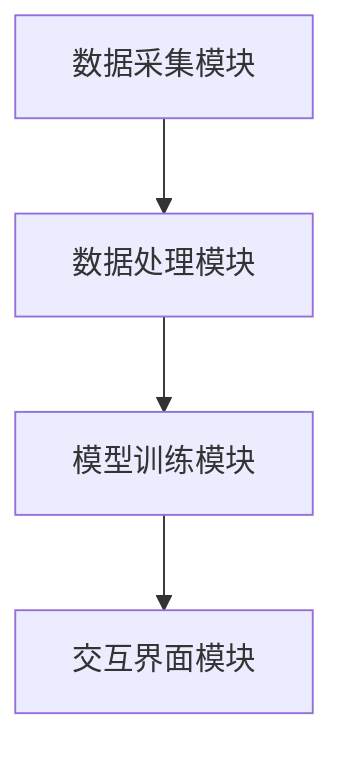
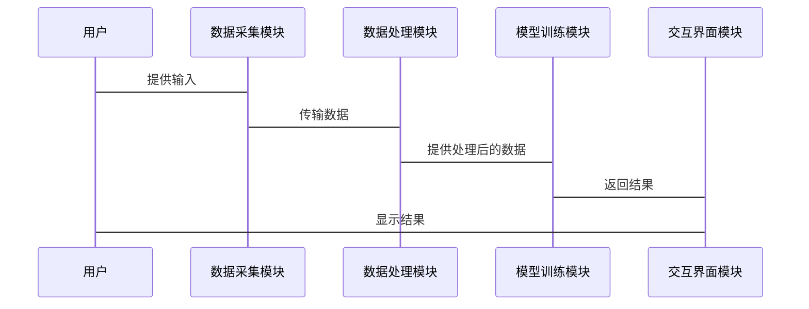

                 


# 开发多模态交互的AI Agent系统

> 关键词：多模态交互，AI Agent，系统架构，算法原理，项目实战

> 摘要：本文将详细介绍如何开发一个多模态交互的AI Agent系统，涵盖从核心概念到系统架构设计，再到项目实战的各个方面。通过本文，读者将深入了解多模态数据处理、融合方法、模型训练优化策略，以及系统架构设计的最佳实践。

---

# 第1章: 多模态交互与AI Agent系统概述

## 1.1 多模态交互的定义与特点

### 1.1.1 多模态交互的定义
多模态交互是指通过多种感知方式（如视觉、听觉、触觉等）与智能系统进行互动的过程。与单模态交互（如仅文本或仅语音交互）相比，多模态交互能够更自然地模拟人类的交流方式。

### 1.1.2 多模态交互的核心特点
- **多样性**：支持多种输入模态（文本、语音、图像等）。
- **实时性**：能够快速响应用户的输入。
- **智能性**：通过融合多模态信息，提供更精准的交互体验。

### 1.1.3 多模态交互与单模态交互的对比
| 特性          | 单模态交互            | 多模态交互            |
|---------------|-----------------------|-----------------------|
| 输入方式      | 单一（如仅文本或语音）| 多种（文本、语音、图像等）|
| 信息处理      | 简单                  | 复杂                  |
| 用户体验      | 有限                  | 更高                  |

## 1.2 AI Agent系统的定义与特点

### 1.2.1 AI Agent的定义
AI Agent（智能体）是指在环境中能够感知并自主行动以实现目标的实体。它可以是一个软件程序，也可以是一个物理设备。

### 1.2.2 AI Agent的核心特点
- **自主性**：能够在没有外部干预的情况下自主运行。
- **反应性**：能够实时感知环境并做出反应。
- **目标导向**：所有行动都是为了实现特定目标。

### 1.2.3 AI Agent与传统软件的区别
| 特性          | 传统软件            | AI Agent              |
|---------------|---------------------|-----------------------|
| 智能性        | 低                  | 高                    |
| 自主性        | 无                  | 有                    |
| 适应性        | 无                  | 有                    |

## 1.3 多模态交互AI Agent系统的背景与应用

### 1.3.1 多模态交互AI Agent系统的背景
随着人工智能技术的快速发展，用户对交互体验的要求越来越高。传统的单模态交互方式已难以满足用户需求，因此多模态交互逐渐成为主流。

### 1.3.2 多模态交互AI Agent系统的应用领域
- **智能家居**：通过语音、触控等多种方式控制家居设备。
- **虚拟助手**：如Siri、Alexa等，支持语音和文本交互。
- **智能客服**：通过多模态交互为用户提供更便捷的服务。

### 1.3.3 多模态交互AI Agent系统的未来发展趋势
随着5G、AI、物联网等技术的发展，多模态交互AI Agent系统将更加智能化、个性化。

## 1.4 本章小结
本章介绍了多模态交互和AI Agent系统的定义、特点及应用领域，为后续内容奠定了基础。

---

# 第2章: 多模态交互AI Agent系统的算法原理

## 2.1 多模态数据的预处理

### 2.1.1 数据清洗与标准化
数据清洗是去除噪声数据，确保数据质量。标准化则是将数据转换到统一的格式。

### 2.1.2 数据增强技术
数据增强通过增加数据的多样性和丰富性，提高模型的泛化能力。

### 2.1.3 数据格式转换与整合
将不同格式的数据（如文本、图像）转换为统一格式，并进行整合。

## 2.2 多模态数据的融合方法

### 2.2.1 基于特征融合的方法
将不同模态的特征向量进行线性组合或非线性变换。

### 2.2.2 基于模型融合的方法
将多个模态分别输入不同的模型，再将结果进行融合。

### 2.2.3 基于注意力机制的融合方法
通过注意力机制，动态调整不同模态的重要性。

## 2.3 基于Transformer的多模态模型

### 2.3.1 Transformer模型的原理
Transformer模型由编码器和解码器组成，通过自注意力机制捕获序列中的全局依赖关系。

### 2.3.2 多模态Transformer的结构设计
将不同模态的特征输入到共享的Transformer编码器中，进行联合表示。

### 2.3.3 多模态Transformer的应用案例
例如，在自然语言处理中，将文本和图像特征输入到多模态Transformer中，进行联合分类。

## 2.4 本章小结
本章详细介绍了多模态数据的预处理方法和融合策略，以及基于Transformer的多模态模型。

---

# 第3章: 多模态交互AI Agent系统的系统架构设计

## 3.1 系统整体架构设计

### 3.1.1 系统模块划分
- **数据采集模块**：负责采集多种模态的数据。
- **数据处理模块**：对数据进行预处理和融合。
- **模型训练模块**：训练多模态模型。
- **交互界面模块**：与用户进行多模态交互。

### 3.1.2 各模块的功能描述
- 数据采集模块：通过传感器或API获取数据。
- 数据处理模块：对数据进行清洗、增强和融合。
- 模型训练模块：使用预处理后的数据训练模型。
- 交互界面模块：通过图形界面或API与用户交互。

### 3.1.3 系统架构的优缺点分析
- 优点：模块化设计，便于维护和扩展。
- 缺点：模块之间的通信可能增加系统的复杂性。

## 3.2 系统架构图



## 3.3 系统交互流程图



## 3.4 本章小结
本章详细描述了多模态交互AI Agent系统的整体架构设计和各模块的功能，以及系统交互流程。

---

# 第4章: 多模态交互AI Agent系统的项目实战

## 4.1 项目介绍

### 4.1.1 项目背景
开发一个多模态交互AI Agent系统，支持文本和语音交互。

### 4.1.2 项目目标
实现一个能够理解多模态输入并进行智能响应的系统。

## 4.2 环境安装

### 4.2.1 安装Python
```bash
python --version
```

### 4.2.2 安装依赖库
```bash
pip install numpy pandas tensorflow
```

## 4.3 核心实现代码

### 4.3.1 数据预处理代码
```python
import numpy as np

def preprocess_data(data):
    # 数据清洗
    cleaned_data = data.dropna()
    # 数据标准化
    normalized_data = (cleaned_data - cleaned_data.mean()) / cleaned_data.std()
    return normalized_data
```

### 4.3.2 模型训练代码
```python
import tensorflow as tf
from tensorflow.keras import layers

def build_model(input_shape):
    inputs = layers.Input(shape=input_shape)
    x = layers.Dense(64, activation='relu')(inputs)
    x = layers.Dense(32, activation='relu')(x)
    outputs = layers.Dense(1, activation='sigmoid')(x)
    model = tf.keras.Model(inputs=inputs, outputs=outputs)
    return model
```

## 4.4 项目小结
本章通过一个具体的项目案例，详细讲解了多模态交互AI Agent系统的开发过程，包括环境安装和核心代码实现。

---

# 第5章: 总结与展望

## 5.1 总结
本文详细介绍了多模态交互AI Agent系统的开发过程，包括核心概念、算法原理和系统架构设计。

## 5.2 最佳实践 Tips
- 在数据预处理阶段，建议进行充分的数据清洗和增强。
- 在模型训练阶段，建议使用合适的优化策略和评价指标。

## 5.3 未来展望
随着技术的发展，多模态交互AI Agent系统将更加智能化和个性化。

---

# 作者：AI天才研究院/AI Genius Institute & 禅与计算机程序设计艺术 /Zen And The Art of Computer Programming

---

通过本文，读者可以系统地掌握多模态交互AI Agent系统的开发过程，从理论到实践，全面了解相关技术和最佳实践。

