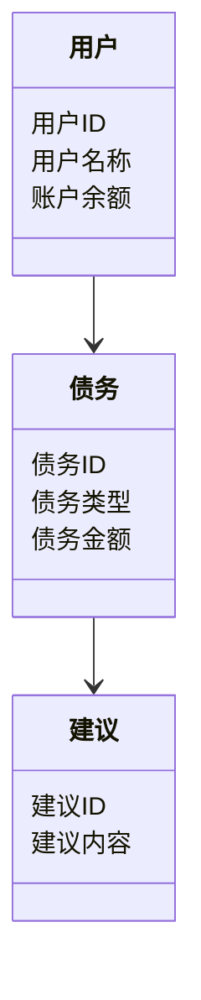
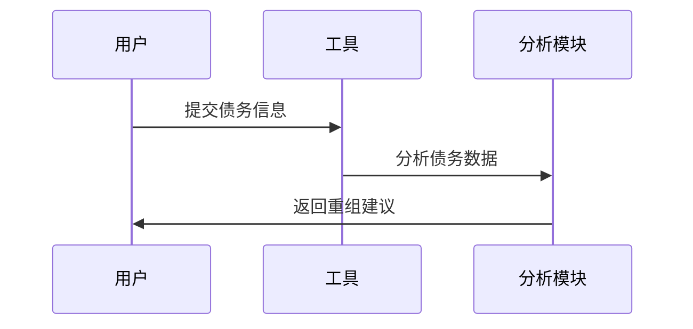

                 


# 开发智能化的个人债务重组建议工具

## 关键词：个人债务重组、智能化工具、自然语言处理、机器学习、数学模型

## 摘要：本文详细介绍了开发智能化个人债务重组建议工具的过程，涵盖背景分析、核心概念、算法原理、系统架构、项目实战及最佳实践等多方面内容，深入剖析了技术实现的关键点和创新点。

## 第1章: 个人债务重组建议工具的背景介绍

### 1.1 问题背景
#### 1.1.1 当前个人债务问题的现状
随着经济的发展和个人信用消费的普及，个人债务问题日益突出，尤其是在全球经济不景气的背景下，个人债务重组的需求急剧增加。传统的债务重组方法依赖人工分析，效率低下且成本高昂，难以满足大规模用户的需求。

#### 1.1.2 传统债务重组方法的局限性
传统的债务重组方法主要依赖于人工分析和经验判断，存在以下问题：
- **效率低下**：人工分析需要大量时间，难以快速响应用户需求。
- **成本高昂**：专业人员的费用较高，普通用户难以负担。
- **主观性强**：不同分析师可能给出不同的建议，缺乏统一标准。

#### 1.1.3 智能化工具的必要性
智能化工具可以通过自动化处理和大数据分析，快速、准确地为用户提供个性化的债务重组建议，显著降低了成本并提高了效率。

### 1.2 问题描述
#### 1.2.1 债务重组的核心问题
债务重组的核心问题是如何在有限的资源下，优化债务结构，降低偿债压力，实现财务健康。

#### 1.2.2 用户需求分析
用户主要需求包括：
- 快速获取债务分析结果。
- 获得个性化的债务重组建议。
- 了解不同重组方案的优缺点及潜在风险。

#### 1.2.3 工具的目标与范围
工具的目标是通过智能化算法，为用户提供高效、准确的债务重组建议。范围包括数据采集、分析、建议生成和用户交互。

### 1.3 问题解决
#### 1.3.1 智能化工具的解决方案
智能化工具通过整合自然语言处理、机器学习和数学建模等技术，实现债务分析和重组建议的自动化。

#### 1.3.2 工具的核心功能与价值
- **数据采集**：快速收集和整理用户债务信息。
- **智能分析**：利用算法对债务情况进行深度分析。
- **个性化建议**：提供量身定制的重组方案。

#### 1.3.3 边界与外延
工具的边界包括用户债务信息的采集、分析和建议生成。外延则不包括实际的债务执行和法律咨询。

### 1.4 概念结构与核心要素
#### 1.4.1 核心概念的定义
- **债务重组**：调整债务结构和偿债方式，降低债务负担。
- **智能化工具**：利用AI技术提供自动化债务分析和建议。

#### 1.4.2 核心要素的组成
- 数据采集模块：负责收集用户债务信息。
- 分析模块：对债务数据进行处理和建模。
- 建议生成模块：根据分析结果生成重组方案。

#### 1.4.3 概念之间的关系
用户通过工具输入债务信息，工具通过分析模块生成建议，并反馈给用户。分析模块依赖于数据采集模块提供的数据和数学模型的支持。

## 第2章: 核心概念与联系

### 2.1 债务重组建议系统的原理
#### 2.1.1 智能化建议系统的定义
智能化建议系统是一个基于AI的工具，能够自动分析用户债务情况并提供优化建议。

#### 2.1.2 债务分析模型的原理
债务分析模型通过分析用户的收入、支出和债务情况，评估财务状况并提出重组建议。

#### 2.1.3 个性化建议生成的机制
个性化建议生成机制根据用户的财务状况和偏好，推荐最优的债务重组方案。

### 2.2 核心概念对比
#### 2.2.1 概念属性特征对比表格
| 概念         | 定义                              | 属性特征         |
|--------------|-----------------------------------|------------------|
| 债务重组     | 调整债务结构和偿债方式           | 需求驱动         |
| 智能化工具   | 自动化分析和建议生成             | 高效、准确       |

#### 2.2.2 比较结果分析
智能化工具通过自动化和数据分析，显著提高了债务重组的效率和准确性。

### 2.3 ER实体关系图
#### 2.3.1 用户、债务、建议的实体关系
用户是核心实体，债务是用户拥有的债务信息，建议是基于债务分析生成的重组方案。

#### 2.3.2 关系图的 Mermaid 表示
```mermaid
er
  actor 用户 {
    key: 用户ID
    属性: 用户名称, 账户余额, 债务总额
  }
  actor 债务 {
    key: 债务ID
    属性: 债务类型, 债务金额, 债务

----------------------------------------------------------------

## 第三部分：算法原理与数学模型

### 第3章: 算法原理与数学模型

#### 3.1 算法原理
##### 3.1.1 自然语言处理在债务分析中的应用
自然语言处理用于解析用户提供的债务相关信息，提取关键数据。

##### 3.1.2 机器学习在个性化建议生成中的作用
机器学习算法用于训练模型，预测最佳的债务重组方案。

##### 3.1.3 算法流程图
```mermaid
graph TD
    A[开始] --> B[数据采集]
    B --> C[数据预处理]
    C --> D[特征提取]
    D --> E[模型训练]
    E --> F[生成建议]
    F --> G[结束]
```

##### 3.1.4 核心算法实现
```python
def debt_analysis(user_data):
    # 数据预处理
    cleaned_data = preprocess(user_data)
    # 特征提取
    features = extract_features(cleaned_data)
    # 模型训练
    model = train_model(features)
    # 预测
    prediction = predict(model, features)
    return prediction
```

#### 3.2 数学模型与公式
##### 3.2.1 债务分析模型
$$ 债务风险等级 = f(收入, 支出, 债务总额) $$

##### 3.2.2 个性化建议生成模型
$$ 重组方案 = g(债务风险等级, 用户偏好) $$

### 第4章: 系统分析与架构设计

#### 4.1 问题场景介绍
用户输入债务信息，系统分析并生成重组建议。

#### 4.2 系统功能设计
##### 4.2.1 领域模型


#### 4.3 系统架构设计
##### 4.3.1 分层架构


#### 4.4 接口设计与交互流程
##### 4.4.1 接口设计
- **数据采集接口**：用于获取用户债务信息。
- **分析接口**：处理债务数据并生成建议。

##### 4.4.2 交互流程


### 第5章: 项目实战

#### 5.1 环境安装
```bash
pip install numpy pandas scikit-learn
```

#### 5.2 核心代码实现
##### 5.2.1 数据预处理
```python
import pandas as pd

def preprocess(data):
    # 假设data是pandas DataFrame
    # 删除缺失值
    data = data.dropna()
    # 标准化数据
    data = (data - data.mean()) / data.std()
    return data
```

##### 5.2.2 模型训练
```python
from sklearn.tree import DecisionTreeRegressor

def train_model(features):
    model = DecisionTreeRegressor()
    model.fit(features, labels)
    return model
```

#### 5.3 案例分析与结果解读
##### 5.3.1 案例分析
用户A的债务情况：信用卡欠款$5000，个人贷款$20000，月收入$3000。

##### 5.3.2 分析结果
系统建议将信用卡欠款优先偿还，将个人贷款进行展期。

### 第6章: 最佳实践与注意事项

#### 6.1 小贴士
- 数据隐私保护：确保用户数据的安全。
- 算法优化：定期更新模型以提高准确性。

#### 6.2 小结
本文详细介绍了智能化个人债务重组建议工具的开发过程，从背景分析到系统实现，为用户提供了一套高效、准确的解决方案。

#### 6.3 注意事项
- 用户应谨慎处理债务信息，确保数据安全。
- 工具建议作为辅助决策工具，用户需结合自身情况做出最终决定。

#### 6.4 拓展阅读
- 《机器学习实战》
- 《债务重组与风险管理》

## 作者：AI天才研究院/AI Genius Institute & 禅与计算机程序设计艺术/Zen And The Art of Computer Programming

