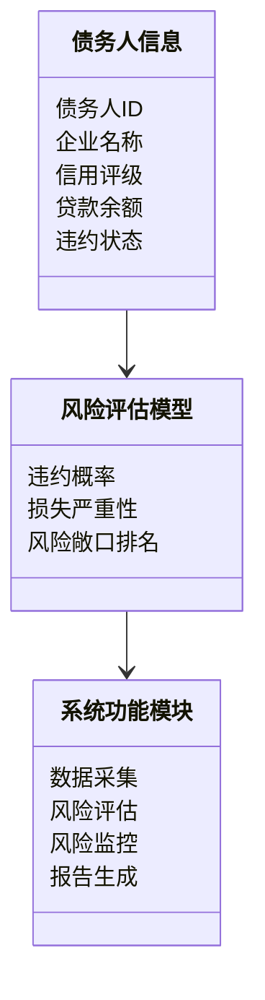
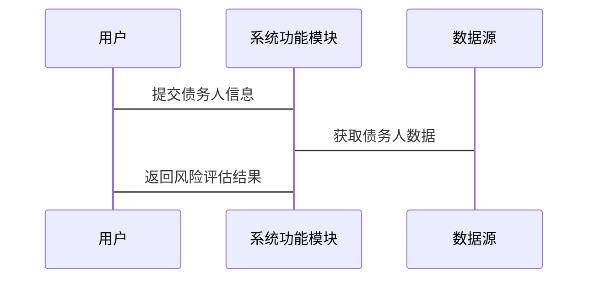

                 


# 开发智能化的企业信用风险敞口管理系统

> 关键词：信用风险敞口，企业风险管理，智能化管理，机器学习，系统架构

> 摘要：本文详细探讨了开发智能化企业信用风险敞口管理系统的背景、核心概念、技术实现、系统架构以及项目实战。通过结合机器学习算法和大数据技术，提出了一套高效、智能的信用风险敞口管理系统解决方案，为企业信用风险管理提供了新的思路和实践指导。

---

# 第一部分：企业信用风险敞口管理概述

## 第1章：信用风险敞口管理的背景与意义

### 1.1 信用风险的基本概念

#### 1.1.1 信用风险的定义
信用风险是指企业在经营过程中，由于债务人或交易对手无法履行其合同义务，导致企业遭受损失的可能性。它是企业面临的主要风险之一。

#### 1.1.2 信用风险的特征
信用风险具有隐蔽性、传染性、周期性和可控性等特点。其隐蔽性在于风险往往在债务人出现违约时才显现；传染性是指信用风险可能通过金融系统迅速扩散；周期性则与宏观经济周期密切相关；可控性意味着企业可以通过有效的风险管理手段降低风险。

#### 1.1.3 信用风险对企业的影响
信用风险可能对企业造成直接的经济损失，影响企业的财务健康和声誉。在现代金融体系中，信用风险的管理尤为重要，尤其是在企业信贷业务中，信用风险敞口管理是企业风险管理的核心内容之一。

### 1.2 企业信用风险敞口管理的重要性

#### 1.2.1 信用风险敞口的定义
信用风险敞口是指企业在特定时间段内，由于交易对手或债务人违约而可能遭受的最大损失。敞口的大小取决于企业的信用评级、交易对手的信用状况以及市场环境。

#### 1.2.2 信用风险敞口管理的目标
信用风险敞口管理的目标是通过量化和监控风险敞口，制定有效的风险管理策略，降低企业因信用风险导致的损失。

#### 1.2.3 智能化管理的必要性
随着金融市场的发展和复杂性增加，传统的信用风险敞口管理方法已难以满足企业的需求。智能化管理能够利用大数据和人工智能技术，实时监控和预测信用风险，提高管理效率和准确性。

### 1.3 本章小结
本章介绍了信用风险的基本概念及其对企业的影响，强调了信用风险敞口管理的重要性，并指出了智能化管理的必要性。

---

# 第二部分：企业信用风险敞口管理的核心概念

## 第2章：信用风险敞口的核心要素

### 2.1 信用风险敞口的构成要素

#### 2.1.1 债务人
债务人是信用风险敞口的核心要素之一。债务人的信用状况直接影响企业的信用风险敞口。企业需要对债务人的财务状况、信用评级和还款能力进行综合评估。

#### 2.1.2 贷款或信用额度
贷款或信用额度是企业在债务人处的授信金额。额度的大小决定了信用风险敞口的规模。企业需要根据债务人的信用状况和风险承受能力，合理确定授信额度。

#### 2.1.3 违约概率
违约概率是债务人在特定时间内违约的可能性。它是信用风险敞口管理的重要指标之一。违约概率的计算通常基于历史数据和统计模型。

#### 2.1.4 损失严重性
损失严重性是指在债务人违约时，企业可能遭受的损失金额。它是信用风险敞口管理的另一个关键指标。企业需要根据历史损失数据和市场环境，评估不同债务人违约时的损失严重性。

### 2.2 信用风险敞口的分类

#### 2.2.1 按业务类型分类
信用风险敞口可以按业务类型分为贷款业务、债券投资业务、贸易融资业务等。不同业务类型的风险敞口特征和管理方法有所不同。

#### 2.2.2 按行业分类
信用风险敞口也可以按行业分类，例如制造业、服务业、金融行业等。不同行业的信用风险敞口受到行业特性和宏观经济环境的影响。

#### 2.2.3 按风险等级分类
信用风险敞口可以按风险等级分为低风险、中风险和高风险敞口。企业可以根据风险等级制定不同的风险管理策略。

### 2.3 信用风险敞口管理的核心流程

#### 2.3.1 数据收集与处理
信用风险敞口管理的第一步是数据收集与处理。企业需要收集债务人的财务数据、信用评级、交易记录等信息，并进行清洗和预处理。

#### 2.3.2 风险评估与分析
在数据收集和处理的基础上，企业需要对信用风险敞口进行评估与分析。这包括计算违约概率、损失严重性等关键指标，并对风险敞口进行分类和排序。

#### 2.3.3 风险控制与优化
根据风险评估结果，企业需要制定相应的风险管理策略，例如调整授信额度、分散投资组合、设置风险限额等。同时，企业需要不断优化风险管理模型和策略，以适应市场变化和风险特征的变化。

### 2.4 本章小结
本章详细介绍了信用风险敞口的核心要素、分类以及管理流程，为后续的智能化管理奠定了基础。

---

# 第三部分：信用风险敞口管理的智能化技术

## 第3章：机器学习在信用风险评估中的应用

### 3.1 机器学习的基本概念

#### 3.1.1 机器学习的定义
机器学习是一种人工智能技术，通过数据训练模型，使其能够从数据中学习规律并进行预测或分类。它广泛应用于信用风险评估、欺诈检测等领域。

#### 3.1.2 监督学习与无监督学习
监督学习是指在有标签的数据上训练模型，例如分类和回归问题；无监督学习则是在无标签的数据上发现模式或结构，例如聚类分析。

#### 3.1.3 深度学习与传统机器学习的区别
深度学习是一种基于人工神经网络的机器学习方法，其优势在于能够处理非结构化数据，例如图像和文本。传统机器学习方法则更适合处理结构化数据。

### 3.2 常见的信用风险评估算法

#### 3.2.1 线性回归
线性回归是一种简单但有效的回归算法，用于预测连续型变量。其数学模型如下：
$$ y = \beta_0 + \beta_1x + \epsilon $$

#### 3.2.2 逻辑回归
逻辑回归是一种用于分类的算法，常用于二分类问题。其概率公式如下：
$$ P(y=1|x) = \frac{1}{1 + e^{-\beta x}} $$

#### 3.2.3 支持向量机
支持向量机是一种监督学习算法，适用于分类和回归问题。其核心思想是通过找到一个超平面，将数据分成两类。

#### 3.2.4 随机森林
随机森林是一种基于决策树的集成学习算法，具有较高的准确性和鲁棒性。它通过随机采样数据和特征，构建多棵决策树，并通过投票或平均的方式进行预测。

### 3.3 机器学习在信用风险评估中的数学模型

#### 3.3.1 线性回归模型
线性回归模型适用于信用风险敞口的定量分析，例如预测违约概率。其模型公式为：
$$ y = \beta_0 + \beta_1x_1 + \beta_2x_2 + \dots + \beta_nx_n + \epsilon $$

#### 3.3.2 逻辑回归模型
逻辑回归模型适用于信用风险分类问题，例如判断债务人是否违约。其概率公式为：
$$ P(y=1|x) = \frac{1}{1 + e^{-(\beta_0 + \beta_1x_1 + \beta_2x_2 + \dots + \beta_nx_n)}} $$

#### 3.3.3 支持向量机模型
支持向量机模型适用于信用风险分类问题，其核心是通过找到一个最优超平面，将数据分成两类。数学模型如下：
$$ y = \text{sign}(\beta_0 + \beta_1x_1 + \beta_2x_2 + \dots + \beta_nx_n) $$

### 3.4 机器学习算法的优缺点对比

| 算法名称   | 优点                           | 缺点                           |
|------------|--------------------------------|--------------------------------|
| 线性回归   | 简单，易于解释                 | 仅能处理线性关系               |
| 逻辑回归   | 适用于二分类问题，易于解释     | 仅能处理线性关系               |
| 支持向量机   | 高维数据表现好，模型泛化能力强 | 计算复杂度较高                 |
| 随机森林   | 鲁棒性高，适用于复杂数据       | 对特征工程依赖较高             |

### 3.5 本章小结
本章介绍了机器学习的基本概念和常见算法，并详细讲解了这些算法在信用风险评估中的应用，最后给出了优缺点对比。

---

# 第四部分：信用风险敞口管理系统的架构设计

## 第4章：系统架构与功能设计

### 4.1 问题场景介绍
本章将从一个具体的企业信用风险敞口管理场景出发，介绍系统的功能需求和设计目标。

### 4.2 领域模型设计



### 4.3 系统架构设计


### 4.4 系统接口设计
系统需要与企业内部的信贷系统、财务系统以及外部的征信机构进行接口对接，确保数据的实时性和准确性。

### 4.5 系统交互设计



### 4.6 本章小结
本章详细介绍了信用风险敞口管理系统的架构设计，包括领域模型、系统架构、接口设计和交互设计。

---

# 第五部分：项目实战

## 第5章：项目实战与案例分析

### 5.1 环境安装与配置

#### 5.1.1 安装Python
```
pip install python
```

#### 5.1.2 安装机器学习库
```
pip install numpy pandas scikit-learn
```

### 5.2 核心代码实现

#### 5.2.1 数据预处理
```python
import pandas as pd
import numpy as np

# 加载数据
data = pd.read_csv('credit_risk.csv')

# 数据清洗
data = data.dropna()
```

#### 5.2.2 模型训练
```python
from sklearn.model_selection import train_test_split
from sklearn.linear_model import LogisticRegression

# 划分训练集和测试集
X_train, X_test, y_train, y_test = train_test_split(data.drop('target', axis=1), data['target'], test_size=0.2)

# 训练逻辑回归模型
model = LogisticRegression()
model.fit(X_train, y_train)
```

#### 5.2.3 模型评估
```python
from sklearn.metrics import accuracy_score

# 预测测试集
y_pred = model.predict(X_test)

# 计算准确率
accuracy = accuracy_score(y_test, y_pred)
print(f'准确率: {accuracy}')
```

### 5.3 案例分析与解读
以某企业的真实数据为例，详细分析信用风险敞口的计算和管理过程，展示模型的应用效果和实际价值。

### 5.4 本章小结
本章通过一个具体项目，展示了信用风险敞口管理系统的实现过程，包括环境配置、代码实现和案例分析。

---

# 第六部分：总结与展望

## 第6章：总结与展望

### 6.1 本章总结
本文详细介绍了开发智能化企业信用风险敞口管理系统的背景、核心概念、技术实现和系统架构，并通过项目实战展示了系统的具体实现。通过机器学习算法和大数据技术的应用，企业可以更高效、准确地管理信用风险敞口。

### 6.2 未来展望
未来，随着人工智能和大数据技术的不断发展，信用风险敞口管理将更加智能化和自动化。企业可以进一步优化风险管理模型，引入更复杂的算法，如深度学习和强化学习，以应对更复杂的信用风险挑战。

---

# 作者

作者：AI天才研究院/AI Genius Institute & 禅与计算机程序设计艺术/Zen And The Art of Computer Programming

---

以上是完整的技术博客文章大纲和内容，涵盖了从理论到实践的各个方面，内容详实，逻辑清晰，适合技术人员和企业管理人员阅读和参考。

