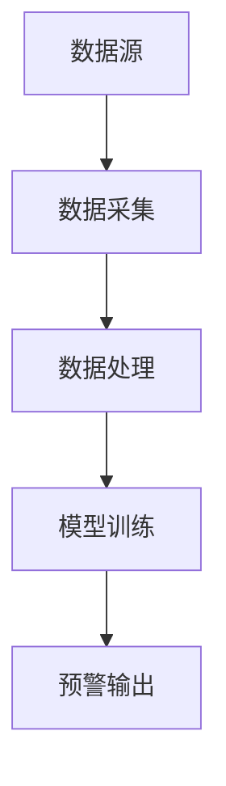

                 


# 开发智能化的供应链金融风险预警模型

> **关键词**：供应链金融、风险预警、机器学习、模型开发、系统架构、项目实战  
> **摘要**：本文详细探讨了供应链金融风险预警模型的开发过程，从背景分析、核心概念到算法选择、系统设计，再到项目实战和最佳实践，系统地分析了智能化供应链金融风险预警模型的构建与应用。

---

# 第一部分: 供应链金融与风险预警模型概述

## 第1章: 供应链金融的基本概念

### 1.1 供应链金融的定义与特点

#### 1.1.1 供应链金融的定义
供应链金融（Supply Chain Finance，SCF）是一种通过整合供应链上下游企业之间的资金流、信息流和物流，优化资源配置，降低融资成本的金融模式。其核心在于通过供应链的整体运作，为参与企业提供融资支持。

#### 1.1.2 供应链金融的核心特点
供应链金融具有以下特点：
- **协同性**：强调供应链上下游企业的协同合作。
- **嵌入性**：金融服务嵌入到供应链的日常运营中。
- **动态性**：随着供应链的动态变化而调整融资方案。
- **风险分担**：通过多方协作降低单点风险。

#### 1.1.3 供应链金融的参与者与角色
参与者包括：
- **核心企业**：供应链中的主导企业，通常是采购方或销售方。
- **供应商**：为供应链提供原材料或服务的企业。
- **客户**：供应链的最终消费者或下游企业。
- **金融机构**：提供融资服务的银行、保理公司等。
- **物流公司**：负责供应链中的物流环节。

---

### 1.2 供应链金融的风险类型

#### 1.2.1 信用风险
信用风险是指交易对手无法履行合同义务的风险。例如，供应商或客户因财务问题无法偿还贷款。

#### 1.2.2 市场风险
市场风险是指由于市场价格波动导致的损失。例如，原材料价格波动影响供应商的融资能力。

#### 1.2.3 操作风险
操作风险是指由于人为错误或系统故障导致的损失。例如，数据录入错误或系统故障导致的交易失败。

#### 1.2.4 其他风险
包括政策风险、法律风险等。

---

### 1.3 供应链金融的风险预警的重要性

#### 1.3.1 风险预警的定义
风险预警是指通过分析相关数据和信息，提前识别和预测潜在风险的过程。

#### 1.3.2 风险预警在供应链金融中的作用
- **提前防范**：通过预警机制，提前采取措施降低风险。
- **优化决策**：帮助金融机构和企业做出更明智的融资和投资决策。
- **提高效率**：通过自动化预警，减少人工干预，提高效率。

#### 1.3.3 智能化风险预警的优势
智能化风险预警通过大数据和人工智能技术，能够实时分析海量数据，快速识别潜在风险，显著提高预警的准确性和效率。

---

## 第2章: 供应链金融风险预警模型的背景与需求

### 2.1 供应链金融风险预警的背景

#### 2.1.1 供应链金融发展的现状
随着全球化和信息化的发展，供应链金融已成为企业优化资金流、降低运营成本的重要手段。

#### 2.1.2 传统风险预警方法的局限性
传统风险预警方法通常基于静态数据分析，难以应对供应链中的动态风险。

#### 2.1.3 智能化技术在供应链金融中的应用趋势
随着人工智能和大数据技术的发展，智能化风险预警成为供应链金融的未来发展方向。

---

### 2.2 风险预警模型的需求分析

#### 2.2.1 企业对风险预警的需求
企业希望通过风险预警模型，提前识别和应对供应链中的潜在风险。

#### 2.2.2 技术驱动的风险预警创新
人工智能和大数据技术为风险预警提供了新的工具和方法。

#### 2.2.3 智能化供应链金融的风险预警目标
目标是通过智能化技术，实现风险的实时监测和预测，提高供应链的稳定性和安全性。

---

## 第3章: 供应链金融风险预警模型的核心概念

### 3.1 模型的核心要素

#### 3.1.1 数据来源
数据来源包括供应链中的交易数据、物流数据、库存数据、财务数据等。

#### 3.1.2 风险评估指标
常见的风险评估指标包括信用评分、违约概率、波动率等。

#### 3.1.3 模型算法
常用的算法包括逻辑回归、随机森林、支持向量机（SVM）等。

#### 3.1.4 输出结果
输出结果包括风险等级、预警信号、建议措施等。

---

### 3.2 核心概念的联系与对比

#### 3.2.1 数据特征对比表格

| 数据特征 | 描述 |
|----------|------|
| 连续性   | 数据是否连续 |
| 可解释性 | 数据是否易于解释 |
| 噪声     | 数据中的噪声水平 |

#### 3.2.2 实体关系图（ER图）
```mermaid
er
 供应商
   id: int
   name: string
   credit_score: int
 产品
   id: int
   name: string
   price: float
 订单
   id: int
   supplier_id: int
   customer_id: int
   order_date: date
 客户
   id: int
   name: string
   payment_history: boolean
```

---

### 3.3 模型的输入与输出

#### 3.3.1 输入数据的结构化处理
输入数据需要进行清洗、特征提取和标准化处理。

#### 3.3.2 输出结果的解释与应用
输出结果需要结合业务背景进行解释，并制定相应的风险应对措施。

---

# 第二部分: 供应链金融风险预警模型的算法原理

## 第4章: 常见的机器学习算法与模型

### 4.1 机器学习算法概述

#### 4.1.1 监督学习
监督学习是一种基于标记数据的机器学习方法，适用于分类和回归问题。

#### 4.1.2 无监督学习
无监督学习适用于聚类和降维问题，常用于处理无标记数据。

#### 4.1.3 半监督学习
半监督学习结合了监督学习和无监督学习的优势，适用于数据部分标记的场景。

---

### 4.2 常见算法的优缺点对比

| 算法       | 优点                   | 缺点                     |
|------------|------------------------|--------------------------|
| 逻辑回归   | 简单易用，可解释性高     | 适用于线性可分问题         |
| 支持向量机（SVM） | 适用于高维数据         | 计算复杂度较高             |
| 随机森林   | 鲁棒性强，可处理非线性问题 | 对超参数敏感               |
| 神经网络   | 表现能力强               | 需要大量数据和计算资源       |

---

### 4.3 算法选择与优化

#### 4.3.1 逻辑回归
逻辑回归是一种常用的分类算法，适用于二分类问题。

#### 4.3.2 随机森林
随机森林是一种基于决策树的集成算法，适用于分类和回归问题。

#### 4.3.3 算法优化
算法优化包括参数调优、特征选择和模型集成等方法。

---

## 第5章: 供应链金融风险预警模型的数学模型

### 5.1 逻辑回归模型

#### 5.1.1 模型公式
$$ P(y=1) = \frac{e^{\beta_0 + \beta_1 x_1 + \beta_2 x_2 + \dots + \beta_n x_n}}{1 + e^{\beta_0 + \beta_1 x_1 + \beta_2 x_2 + \dots + \beta_n x_n}} $$

#### 5.1.2 模型解释
逻辑回归模型通过计算概率，判断企业违约的可能性。

---

### 5.2 随机森林模型

#### 5.2.1 模型公式
随机森林通过集成多个决策树的预测结果，提高模型的准确性和稳定性。

---

## 第6章: 供应链金融风险预警模型的实现

### 6.1 数据预处理

#### 6.1.1 数据清洗
数据清洗包括去除重复数据、处理缺失值和异常值。

#### 6.1.2 特征工程
特征工程包括特征选择、特征提取和特征转换。

---

### 6.2 模型训练

#### 6.2.1 训练逻辑回归模型
```python
from sklearn.linear_model import LogisticRegression

model = LogisticRegression()
model.fit(X_train, y_train)
```

#### 6.2.2 训练随机森林模型
```python
from sklearn.ensemble import RandomForestClassifier

model = RandomForestClassifier()
model.fit(X_train, y_train)
```

---

### 6.3 模型评估

#### 6.3.1 评估指标
评估指标包括准确率、召回率、F1分数和AUC值。

#### 6.3.2 模型优化
模型优化包括调整参数和交叉验证。

---

## 第7章: 供应链金融风险预警模型的系统架构设计

### 7.1 系统功能设计

#### 7.1.1 数据采集模块
数据采集模块负责从供应链各环节采集数据。

#### 7.1.2 数据处理模块
数据处理模块负责对数据进行清洗和特征工程。

#### 7.1.3 模型训练模块
模型训练模块负责训练和优化风险预警模型。

#### 7.1.4 预警输出模块
预警输出模块负责生成风险预警信号并通知相关人员。

---

### 7.2 系统架构设计

#### 7.2.1 分层架构


---

### 7.3 系统接口设计

#### 7.3.1 数据接口
数据接口负责与供应链各环节的数据源对接。

#### 7.3.2 API接口
API接口负责提供风险预警服务。

---

## 第8章: 项目实战

### 8.1 项目背景

#### 8.1.1 项目目标
项目目标是开发一个智能化的供应链金融风险预警模型。

#### 8.1.2 项目范围
项目范围包括数据采集、模型训练和预警输出。

---

### 8.2 环境安装

#### 8.2.1 安装Python
安装Python 3.8及以上版本。

#### 8.2.2 安装库
安装必要的库，如scikit-learn、pandas和numpy。

---

### 8.3 代码实现

#### 8.3.1 数据预处理代码
```python
import pandas as pd
import numpy as np

data = pd.read_csv('data.csv')
data = data.dropna()
data = (data - data.mean()) / data.std()
```

#### 8.3.2 模型训练代码
```python
from sklearn.model_selection import train_test_split
from sklearn.linear_model import LogisticRegression

X_train, X_test, y_train, y_test = train_test_split(data.drop('label', axis=1), data['label'], test_size=0.2)
model = LogisticRegression()
model.fit(X_train, y_train)
```

---

### 8.4 案例分析

#### 8.4.1 案例背景
案例背景是一个供应链企业希望通过风险预警模型降低融资风险。

#### 8.4.2 模型应用
通过模型预测潜在风险，提前采取措施。

---

### 8.5 结果解读

#### 8.5.1 模型表现
模型表现包括准确率、召回率和F1分数。

#### 8.5.2 风险预警信号
根据模型输出的预警信号，采取相应的风险控制措施。

---

# 第三部分: 最佳实践与总结

## 第9章: 最佳实践

### 9.1 小结
通过本文的介绍，我们了解了供应链金融风险预警模型的开发过程。

### 9.2 注意事项
在实际应用中，需要注意数据质量和模型的可解释性。

### 9.3 拓展阅读
建议读者进一步阅读相关领域的书籍和论文。

---

# 作者：AI天才研究院/AI Genius Institute & 禅与计算机程序设计艺术 /Zen And The Art of Computer Programming

---

通过本文的详细讲解，读者可以系统地了解供应链金融风险预警模型的开发过程，并能够实际操作和应用。希望本文对读者有所帮助。

