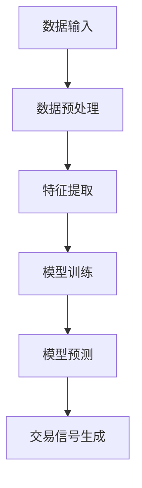
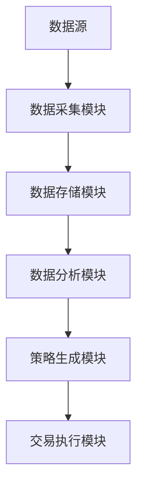
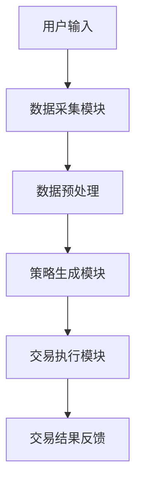

                 


# 开发智能化的外汇交易策略系统

> 关键词：外汇交易，人工智能，机器学习，系统架构，智能化策略

> 摘要：本文详细探讨了开发智能化外汇交易策略系统的各个方面，包括系统背景、核心概念、算法原理、系统架构设计、项目实战以及最佳实践。通过理论与实践相结合的方式，深入分析了如何利用人工智能技术提升外汇交易的效率与准确性。

---

## 第一部分: 智能化外汇交易策略系统概述

### 第1章: 外汇交易与智能化策略开发背景

#### 1.1 外汇市场的基本概念
外汇市场是全球最大的金融市场，24小时连续运行，参与者包括银行、企业和个人。外汇交易的目的是通过买卖货币对汇率变动进行投机或 hedging。

#### 1.2 智能化外汇交易策略的必要性
传统交易方式依赖人工判断，存在主观性强、效率低下的问题。随着数据量的爆炸式增长和算法交易的普及，智能化交易成为必然趋势。

#### 1.3 智能化外汇交易策略的核心目标
- 提高交易效率
- 增强风险控制能力
- 实现自动化交易与优化

---

### 第2章: 智能化外汇交易策略的核心概念与联系

#### 2.1 外汇市场数据的特征分析
- 时间序列数据的特性
- 数据的波动性与相关性
- 数据的噪声与有效信息提取

#### 2.2 机器学习在外汇交易中的应用
- 监督学习与无监督学习的对比
- 算法选择的依据
- 模型评估与优化

#### 2.3 外汇交易策略系统的整体架构
- 数据采集模块
- 数据分析与建模模块
- 策略执行与优化模块

---

### 第3章: 智能化外汇交易策略的算法原理

#### 3.1 时间序列预测模型
- ARIMA模型的原理与实现
- LSTM网络的结构与优势
- GRU网络的改进与应用

#### 3.2 基于机器学习的交易信号生成
- 分类算法在交易信号中的应用
- 回归算法在价格预测中的应用
- 聚类算法在市场状态识别中的应用

#### 3.3 算法实现的数学模型与公式
- LSTM模型的数学公式
$$ \text{LSTM}(x_t, h_{t-1}, c_{t-1}) = (f_t, g_t, h_t) $$
- GRU模型的数学公式
$$ \text{GRU}(x_t, h_{t-1}) = (z_t, r_t, h_t) $$

#### 3.4 算法实现的流程图


---

### 第4章: 智能化外汇交易策略系统的架构设计

#### 4.1 系统功能模块划分
- 数据采集模块
- 数据分析模块
- 策略执行模块
- 风险控制模块

#### 4.2 系统架构设计


#### 4.3 系统接口设计
- 数据接口
- 策略接口
- 交易接口

#### 4.4 系统交互流程图


---

## 第五部分: 项目实战与优化

### 第5章: 项目实战
#### 5.1 环境安装与配置
- 安装 Python 和相关库（如 numpy、pandas、tensorflow）
- 数据源获取与预处理

#### 5.2 系统核心实现
```python
import numpy as np
import pandas as pd
from tensorflow.keras.models import Sequential
from tensorflow.keras.layers import LSTM, Dense, Dropout

# 数据预处理
data = pd.read_csv('forex_data.csv')
train_data = data.iloc[:1000].values
test_data = data.iloc[1000:].values

# LSTM 模型构建
model = Sequential()
model.add(LSTM(units=50, input_shape=(timesteps, features)))
model.add(Dropout(0.2))
model.add(Dense(1))
model.compile(loss='mean_squared_error', optimizer='adam')

# 模型训练
model.fit(train_data, epochs=10, batch_size=32)
```

#### 5.3 代码实现与解读
- 数据预处理：将原始数据转换为适合模型输入的格式
- 模型训练：使用 LSTM 进行时间序列预测
- 模型预测：生成交易信号并执行交易

#### 5.4 实际案例分析
- 案例背景：某货币对的历史数据
- 模型训练：使用 LSTM 进行预测
- 交易信号生成与执行
- 结果分析：比较自动化交易与人工交易的收益

---

### 第6章: 系统优化与扩展

#### 6.1 系统性能优化
- 数据处理的优化
- 模型训练的加速
- 系统架构的扩展

#### 6.2 系统功能扩展
- 风险控制模块的优化
- 新算法的引入（如强化学习）
- 多市场、多品种的扩展

#### 6.3 最佳实践 tips
- 数据质量的重要性
- 模型选择的策略
- 系统监控与维护

---

### 第7章: 总结与展望

#### 7.1 本章总结
本文详细探讨了智能化外汇交易策略系统的开发过程，从背景分析到算法实现，再到系统架构设计和项目实战，全面展示了如何利用人工智能技术提升外汇交易的效率和准确性。

#### 7.2 对未来的展望
- 更加复杂的模型（如Transformer）
- 更高效的算法
- 更智能化的交易策略

---

## 作者信息

作者：AI天才研究院/AI Genius Institute & 禅与计算机程序设计艺术 /Zen And The Art of Computer Programming

---

通过以上内容，我们详细分析了开发智能化外汇交易策略系统的各个方面，并通过实际案例展示了如何将理论应用于实践。希望本文能为读者提供有价值的参考和启发。

