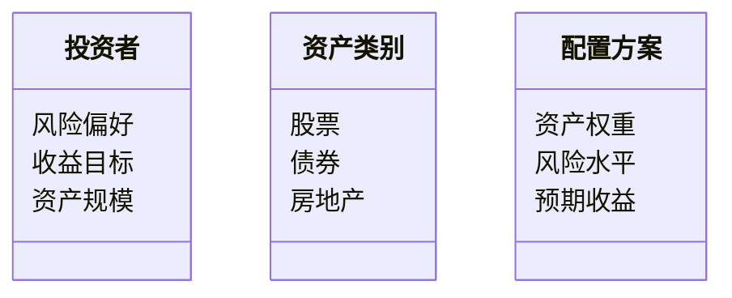

                 


# 开发智能化的资产配置优化模型

> 关键词：资产配置优化，人工智能，大数据分析，投资组合管理，风险控制

> 摘要：本文详细探讨了如何利用人工智能和大数据技术开发智能化的资产配置优化模型，解决传统方法的局限性，提高投资组合的效率和准确性。

---

# 目录

1. [背景介绍](#背景介绍)
2. [核心概念](#核心概念)
3. [算法原理](#算法原理)
4. [系统架构设计](#系统架构设计)
5. [项目实战](#项目实战)
6. [最佳实践与总结](#最佳实践与总结)

---

## 背景介绍

### 1.1 资产配置优化的定义与问题背景

#### 1.1.1 资产配置的定义
资产配置是指将资金分配到不同资产类别（如股票、债券、房地产等）以实现投资目标的过程。合理的资产配置能够平衡风险与收益，是投资成功的关键。

#### 1.1.2 资产配置优化的必要性
传统资产配置依赖经验判断，存在主观性强、效率低、难以适应市场变化等问题。随着市场复杂化，优化资产配置的需求日益迫切。

#### 1.1.3 智能化资产配置的挑战与机遇
通过AI和大数据技术，智能化资产配置能够快速处理海量数据，实时调整配置策略，显著提升了效率和准确性。

### 1.2 资产配置优化的核心概念

#### 1.2.1 问题背景与问题描述
在金融投资中，投资者需在不同资产间分配资金，以在满足风险承受能力的前提下实现收益最大化。

#### 1.2.2 问题解决的思路与方法
使用数学优化模型和智能算法，如遗传算法、模拟退火等，寻找最优资产组合。

#### 1.2.3 边界与外延
明确优化目标、约束条件和决策变量，如收益目标、风险承受度和可投资资产种类。

#### 1.2.4 核心要素与组成结构
包括目标函数、约束条件、决策变量和优化算法。

---

## 核心概念

### 2.1 智能化资产配置的核心概念与联系

#### 2.1.1 核心概念原理
智能化资产配置结合AI和大数据，通过分析市场数据和投资者需求，动态调整资产配置。

#### 2.1.2 核心算法与技术
使用遗传算法、模拟退火等优化算法，以及数据挖掘和机器学习技术。

#### 2.1.3 数据特征与模型关系
资产收益、风险数据是模型输入，优化算法处理后输出最优配置。

### 2.2 核心概念对比表格

| 特性        | 传统资产配置 | 智能化资产配置 |
|-------------|--------------|----------------|
| 方法        | 经验驱动     | 数据驱动       |
| 效率        | 低           | 高             |
| 适应性      | 差           | 强             |

### 2.3 ER实体关系图

```mermaid
erd
  投资者
  资产类别
  配置方案
  风险约束
  收益目标
  优化算法
  投资组合
  决策变量
```

---

## 算法原理

### 3.1 遗传算法

#### 3.1.1 算法流程

1. 初始化种群
2. 计算适应度
3. 选择
4. 交叉
5. 变异
6. 保留适应者

#### 3.1.2 代码实现

```python
def genetic_algorithm(population, fitness_func, mutation_rate):
    # 初始化种群
    # 计算适应度
    # 选择
    # 交叉
    # 变异
    # 保留适应者
    pass
```

#### 3.1.3 优缺点

- 优点：全局搜索能力强。
- 缺点：计算复杂度高。

### 3.2 模拟退火算法

#### 3.2.1 算法流程

1. 初始化温度
2. 计算目标函数
3. 变量邻居解
4. 计算能量差
5. 接受或拒绝
6. 降温

#### 3.2.2 代码实现

```python
def simulated_annealing(initial_state, cost_func, temperature_schedule):
    # 初始化
    # 计算成本
    # 变量邻居解
    # 接受或拒绝
    pass
```

#### 3.2.3 优缺点

- 优点：避免局部最优。
- 缺点：收敛速度慢。

---

## 系统架构设计

### 4.1 系统功能设计

#### 4.1.1 领域模型类图



### 4.2 系统架构设计


---

## 项目实战

### 5.1 环境安装

- 安装Python
- 安装必要的库（如NumPy、Pandas、Scipy）

### 5.2 核心代码实现

```python
import numpy as np
from scipy.optimize import minimize

def portfolio_optimization(returns, weights):
    # 使用最小化函数优化权重
    n = len(weights)
    # 定义目标函数
    def objective(x):
        return np.dot(x, returns)
    # 约束条件
    constraints = [{'type': 'eq', 'fun': lambda x: sum(x - 1)}]
    # 使用scipy优化
    result = minimize(objective, weights, constraints=constraints)
    return result.x

# 示例数据
returns = np.array([0.1, 0.2, 0.15])
weights_initial = np.array([0.3, 0.3, 0.4])

# 优化
optimal_weights = portfolio_optimization(returns, weights_initial)
print(optimal_weights)
```

### 5.3 代码解读与分析

- 使用`scipy.optimize.minimize`进行优化，目标是最化收益。
- 约束条件为权重之和等于1。

### 5.4 实际案例分析

假设有一个包含股票、债券和房地产的组合，通过优化找到最优权重。

### 5.5 项目小结

展示了如何利用Python和优化算法实现资产配置优化。

---

## 最佳实践与总结

### 6.1 总结

智能化资产配置模型通过AI和大数据提升效率和准确性，帮助投资者实现更好的收益。

### 6.2 注意事项

- 数据质量至关重要。
- 模型需定期更新。
- 风险控制是关键。

### 6.3 拓展阅读

推荐相关书籍和论文，深入学习优化算法和金融建模。

---

作者：AI天才研究院/AI Genius Institute & 禅与计算机程序设计艺术 /Zen And The Art of Computer Programming

---

通过本文的详细讲解，读者能够理解智能化资产配置模型的开发过程，并在实际应用中提升投资效率和准确性。

