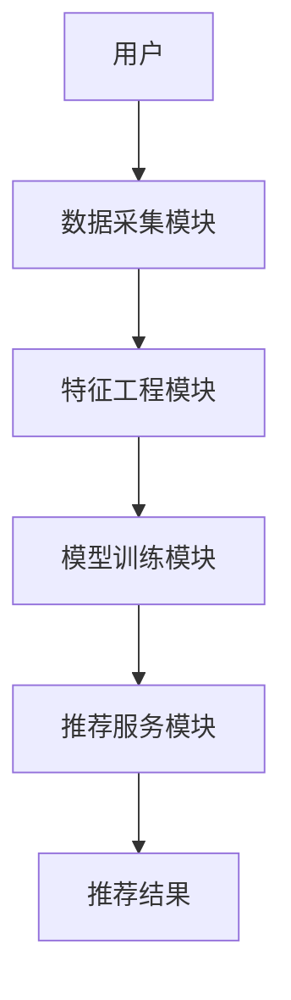
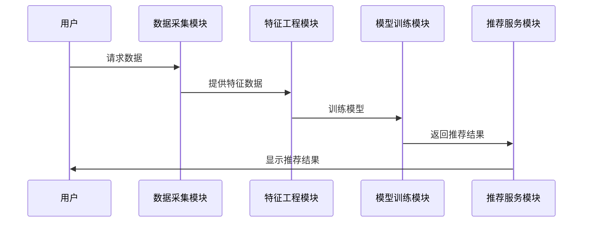

                 


# 开发智能化的金融产品推荐个性化引擎

> 关键词：金融推荐系统，个性化推荐，协同过滤，机器学习，深度学习

> 摘要：本文深入探讨了开发智能化的金融产品推荐个性化引擎的核心概念、算法原理、系统架构设计及项目实战。通过分析用户需求与行为，结合协同过滤、基于内容的推荐以及机器学习算法，构建高效、精准的推荐系统。同时，详细讲解了系统架构设计、实现步骤及实际案例，为金融行业智能化转型提供理论支持与实践指导。

---

# 第一部分: 金融产品推荐个性化引擎的背景与核心概念

## 第1章: 金融产品推荐系统概述

### 1.1 金融产品推荐的背景与意义
#### 1.1.1 传统金融产品的销售模式
传统金融产品的销售模式主要依赖于销售人员的经验和人际关系，这种方式效率低下且难以覆盖大规模用户。随着互联网和大数据技术的发展，金融机构亟需一种更高效、更精准的推荐方式。

#### 1.1.2 数字化转型对金融推荐系统的需求
数字化转型使得金融机构能够通过大数据和人工智能技术，实时分析用户的金融需求，提供个性化的金融产品推荐，从而提升用户体验和销售效率。

#### 1.1.3 个性化推荐在金融领域的价值
个性化推荐能够帮助金融机构精准匹配用户需求，提高用户满意度和忠诚度，同时降低营销成本，提升销售效率。

### 1.2 个性化推荐的基本概念
#### 1.2.1 推荐系统的定义与分类
推荐系统是一种基于用户行为和偏好，通过算法生成个性化推荐内容的技术。金融推荐系统根据推荐对象的不同，可以分为股票推荐、基金推荐、保险推荐等多种类型。

#### 1.2.2 金融产品推荐的独特性
金融产品的推荐需要考虑用户的财务状况、风险承受能力、投资目标等多方面因素，推荐结果直接影响用户的财务决策。

#### 1.2.3 个性化推荐的核心要素
个性化推荐的核心要素包括用户数据、产品数据、推荐算法和实时反馈机制。

### 1.3 金融产品的特点与分类
#### 1.3.1 金融产品的基本分类
金融产品可以分为存款、贷款、基金、股票、保险、外汇等多种类型，每种类型的特点和风险不同。

#### 1.3.2 不同金融产品的推荐策略
不同金融产品的推荐策略需要根据其特点进行调整。例如，高风险的股票需要推荐给风险承受能力较高的用户。

#### 1.3.3 金融产品的风险与收益分析
金融产品的收益与风险成正比，推荐系统需要综合考虑用户的风险偏好和收益目标。

### 1.4 用户需求与行为分析
#### 1.4.1 用户需求的多样性
用户在金融产品的需求上存在多样性，包括投资期限、风险偏好、收益目标等。

#### 1.4.2 用户行为数据的采集与分析
通过采集用户的浏览记录、点击行为、购买记录等数据，分析用户的偏好和行为模式。

#### 1.4.3 用户画像的构建与应用
基于用户数据构建用户画像，包括年龄、性别、职业、财务状况等，为个性化推荐提供基础。

---

## 第2章: 个性化推荐的核心概念与原理

### 2.1 推荐系统的核心原理
#### 2.1.1 协同过滤算法
协同过滤算法通过分析用户的行为数据，找到与目标用户相似的其他用户，基于这些用户的偏好进行推荐。

#### 2.1.2 基于内容的推荐
基于内容的推荐通过分析金融产品的属性（如收益率、风险等级）和用户偏好，生成推荐结果。

#### 2.1.3 基于机器学习的推荐
基于机器学习的推荐算法能够从海量数据中挖掘用户和产品的隐含关系，生成个性化推荐。

### 2.2 个性化推荐的数学模型
#### 2.2.1 协同过滤的数学公式
协同过滤的相似度计算公式可以表示为：
$$
sim(i, j) = \frac{\sum_{k=1}^{n} (r_{i,k} - \bar{r}_i)(r_{j,k} - \bar{r}_j)}{\sqrt{\sum_{k=1}^{n} (r_{i,k} - \bar{r}_i)^2} \cdot \sqrt{\sum_{k=1}^{n} (r_{j,k} - \bar{r}_j)^2}}
$$
其中，$r_{i,k}$表示用户i对产品k的评分，$\bar{r}_i$表示用户i的平均评分。

#### 2.2.2 基于内容的相似性计算
基于内容的相似性可以通过向量点积公式计算：
$$
sim(i, j) = \frac{\sum_{k=1}^{n} w_{i,k} \cdot w_{j,k}}{\sqrt{\sum_{k=1}^{n} w_{i,k}^2} \cdot \sqrt{\sum_{k=1}^{n} w_{j,k}^2}}
$$
其中，$w_{i,k}$表示用户i对产品k的权重。

#### 2.2.3 机器学习模型的输入输出关系
机器学习模型通常将用户特征和产品特征作为输入，输出推荐概率或评分。

### 2.3 金融推荐系统中的特征工程
#### 2.3.1 特征的提取与选择
特征提取需要考虑用户的财务状况、投资目标、风险偏好等。

#### 2.3.2 特征的标准化与归一化
为了提高模型的性能，需要对特征进行标准化和归一化处理。

#### 2.3.3 高维特征的降维方法
使用主成分分析（PCA）等方法对高维特征进行降维，降低计算复杂度。

### 2.4 推荐系统的评价指标
#### 2.4.1 准确率与召回率
准确率和召回率是衡量推荐系统性能的重要指标，通常使用F1分数综合评价。

#### 2.4.2 F1分数与AUC值
F1分数是准确率和召回率的调和平均数，AUC值是评估分类器性能的指标。

#### 2.4.3 业务指标与用户反馈的结合
结合业务指标（如转化率）和用户反馈（如点击率）进行综合评价。

### 2.5 本章小结

---

## 第3章: 金融推荐系统中的算法原理

### 3.1 协同过滤算法
#### 3.1.1 基于用户的协同过滤
基于用户的协同过滤通过分析用户行为，找到相似用户进行推荐。

#### 3.1.2 基于物品的协同过滤
基于物品的协同过滤通过分析产品属性，找到相似产品进行推荐。

#### 3.1.3 混合协同过滤的优缺点
混合协同过滤结合了基于用户和基于物品的推荐方法，具有较高的推荐精度。

### 3.2 基于内容的推荐算法
#### 3.2.1 文本相似度计算
文本相似度计算可以通过余弦相似度实现。

#### 3.2.2 基于向量空间模型的推荐
基于向量空间模型的推荐算法将产品表示为向量，通过向量相似度进行推荐。

#### 3.2.3 基于深度学习的内容推荐
深度学习模型（如Word2Vec）可以自动提取产品特征，生成推荐结果。

### 3.3 基于机器学习的推荐算法
#### 3.3.1 矩阵分解与深度学习
矩阵分解（如SVD）是协同过滤的一种常用方法，深度学习模型（如神经网络）能够捕捉复杂的用户偏好。

#### 3.3.2 基于神经网络的推荐系统
神经网络推荐系统通过多层感知机（MLP）进行特征提取和推荐。

#### 3.3.3 增量学习与实时推荐
增量学习能够实时更新模型，适应用户行为的变化。

### 3.4 算法的优缺点对比
#### 3.4.1 协同过滤的局限性
协同过滤在用户稀疏数据下表现不佳。

#### 3.4.2 基于内容推荐的适用场景
基于内容的推荐适用于产品属性明确的场景。

#### 3.4.3 机器学习推荐的灵活性与复杂性
机器学习推荐算法具有较高的灵活性，但实现复杂且计算成本较高。

### 3.5 本章小结

---

## 第4章: 金融推荐系统的系统架构设计

### 4.1 系统模块划分
#### 4.1.1 数据采集模块
负责采集用户行为数据和产品数据。

#### 4.1.2 特征工程模块
对数据进行清洗、转换和特征提取。

#### 4.1.3 模型训练模块
基于特征数据训练推荐模型。

#### 4.1.4 推荐服务模块
根据模型输出生成个性化推荐结果。

### 4.2 系统架构设计
#### 4.2.1 分层架构设计
系统分为数据层、计算层和应用层，各层之间通过接口进行交互。

#### 4.2.2 微服务架构设计
采用微服务架构，各模块独立部署，便于扩展和维护。

### 4.3 系统架构图
使用Mermaid绘制系统架构图：



### 4.4 系统接口设计
定义RESTful API接口，如：
- `/api/users`：获取用户信息
- `/api/products`：获取产品信息
- `/api/recommend`：生成推荐结果

### 4.5 系统交互序列图
使用Mermaid绘制系统交互序列图：



### 4.6 本章小结

---

## 第5章: 项目实战——开发智能化的金融推荐引擎

### 5.1 环境安装
安装Python、TensorFlow、Pandas、NumPy等依赖库。

### 5.2 核心代码实现
#### 5.2.1 数据采集与预处理
```python
import pandas as pd

# 读取数据
df = pd.read_csv('user_data.csv')
```

#### 5.2.2 特征工程与模型训练
```python
from sklearn.decomposition import PCA

# 特征提取
X = df.drop(columns=['user_id', 'label'])
y = df['label']

# PCA降维
pca = PCA(n_components=10)
X_pca = pca.fit_transform(X)
```

#### 5.2.3 推荐系统实现
```python
from sklearn.neighbors import NearestNeighbors

# 训练模型
model = NearestNeighbors(n_neighbors=5).fit(X_pca)

# 生成推荐
distances, indices = model.kneighbors(X_pca)
```

### 5.3 实际案例分析
分析一个具体用户的金融需求，通过模型生成推荐结果，并解释推荐理由。

### 5.4 项目小结
总结项目实现的关键步骤和注意事项，为后续优化提供参考。

---

## 第6章: 总结与展望

### 6.1 最佳实践 tips
- 数据预处理是关键，特征工程直接影响推荐效果。
- 选择合适的推荐算法，根据实际场景进行调整。

### 6.2 小结
本文详细介绍了金融产品推荐系统的开发过程，从理论到实践，为读者提供了全面的指导。

### 6.3 未来展望
未来，随着AI技术的进步，金融推荐系统将更加智能化和个性化，结合区块链和边缘计算等新技术，推荐系统将具有更高的安全性和实时性。

---

## 作者：AI天才研究院/AI Genius Institute & 禅与计算机程序设计艺术 /Zen And The Art of Computer Programming

---

**注意**：以上目录大纲为简化版，实际撰写时需根据具体需求进行扩展和补充。

