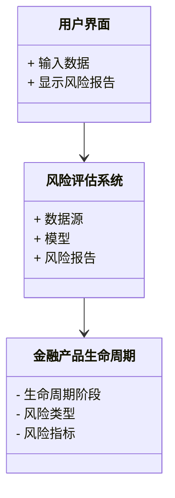

                 


# 开发智能化的金融产品生命周期风险动态评估平台

> 关键词：金融产品生命周期，风险评估，动态风险，人工智能，金融风险管理，智能化评估

> 摘要：本文详细探讨了开发智能化的金融产品生命周期风险动态评估平台的核心概念、算法原理、系统架构及其实现。文章从金融产品生命周期和风险评估的基本概念出发，分析了动态风险评估的必要性，深入讲解了基于机器学习和深度学习的算法原理，结合系统架构设计，提供了具体的实现方案和项目实战案例。最后，总结了开发过程中需要注意的最佳实践和未来的发展方向。

---

# 第一部分: 金融产品生命周期与风险评估概述

## 第1章: 金融产品生命周期与风险评估概述

### 1.1 金融产品生命周期的概念

#### 1.1.1 金融产品的定义与分类
金融产品是金融机构提供给客户的各种金融工具和服务，包括但不限于存款、贷款、证券、基金、保险、衍生品等。金融产品的分类可以从多个维度进行，例如按期限分为短期和长期产品，按风险等级分为低风险和高风险产品，按类型分为债权类、股权类和混合类产品等。

#### 1.1.2 金融产品生命周期的阶段划分
金融产品生命周期通常包括以下几个阶段：
1. **设计与开发阶段**：金融机构根据市场需求设计金融产品，并进行风险评估和合规性审查。
2. **发行与销售阶段**：通过销售渠道将产品推向市场，吸引客户购买。
3. **存续期管理阶段**：对产品运行情况进行实时监控，确保产品按预期运行。
4. **终止与清算阶段**：产品到期后，按照合同约定进行清算和终止。

#### 1.1.3 金融产品生命周期管理的重要性
金融产品生命周期管理是金融机构有效管理风险、提高产品竞争力的重要手段。通过生命周期管理，金融机构可以更好地识别和应对市场变化，优化产品设计，提高客户满意度。

### 1.2 风险评估的基本概念

#### 1.2.1 风险的定义与分类
风险是指在特定条件下，某一事件可能发生的概率及其影响程度的组合。在金融领域，风险主要分为市场风险、信用风险、流动性风险、操作风险和合规风险等。

#### 1.2.2 风险评估的常用方法
常见的风险评估方法包括：
1. **定量分析法**：通过数学模型和数据分析方法对风险进行量化评估，例如VaR（Value at Risk）模型和CVaR（Conditional Value at Risk）模型。
2. **定性分析法**：通过专家判断和情景分析等方法对风险进行定性描述和评估。
3. **混合分析法**：结合定量和定性分析方法，对风险进行全面评估。

#### 1.2.3 金融行业中的风险管理挑战
金融行业的风险管理面临以下挑战：
1. **数据获取与处理**：金融市场的数据复杂且多样化，如何高效获取和处理数据是关键。
2. **模型选择与优化**：选择合适的模型并对其进行优化，以提高风险评估的准确性。
3. **实时性要求**：金融市场变化迅速，要求风险评估能够实时进行，这对系统的性能提出了高要求。

### 1.3 动态风险评估的必要性

#### 1.3.1 静态风险评估的局限性
传统的静态风险评估方法通常在产品设计阶段进行一次性的风险评估，无法应对市场环境和客户需求的变化。这种评估方式难以捕捉产品生命周期中的动态风险，可能导致风险漏测或误测。

#### 1.3.2 动态风险评估的优势
动态风险评估能够实时跟踪金融产品的风险变化，及时发现潜在风险，并采取相应的风险控制措施。这种方法能够提高风险管理的及时性和有效性，帮助金融机构更好地应对市场波动和客户需求变化。

#### 1.3.3 金融产品生命周期中的动态风险评估应用场景
动态风险评估在金融产品生命周期中的应用场景包括：
1. **产品设计阶段**：评估产品的潜在风险，优化产品设计。
2. **产品发行阶段**：实时监控产品的市场表现，及时发现和应对风险。
3. **产品存续期管理阶段**：动态调整风险管理策略，确保产品稳健运行。
4. **产品终止阶段**：评估产品终止可能带来的风险，确保终止过程顺利进行。

---

## 第2章: 核心概念与系统架构

### 2.1 核心概念原理

#### 2.1.1 金融产品生命周期中的关键风险点
在金融产品生命周期中，关键风险点包括：
1. **设计阶段**：产品设计不合理可能导致市场风险或信用风险。
2. **发行阶段**：销售策略不当可能导致流动性风险或操作风险。
3. **存续期管理阶段**：市场波动可能导致市场风险或流动性风险。
4. **终止阶段**：终止策略不合理可能导致合规风险或流动性风险。

#### 2.1.2 动态风险评估的核心要素
动态风险评估的核心要素包括：
1. **实时数据采集**：从金融市场、客户行为和产品运行中采集实时数据。
2. **风险模型构建**：基于机器学习和深度学习算法，构建动态风险评估模型。
3. **风险指标计算**：根据模型输出，计算产品的实时风险指标。
4. **风险预警与控制**：根据风险指标，触发预警机制并采取相应的风险控制措施。

#### 2.1.3 智能化评估的关键技术
智能化评估的关键技术包括：
1. **机器学习技术**：用于风险特征提取和风险预测。
2. **深度学习技术**：用于复杂风险模型的构建和优化。
3. **自然语言处理技术**：用于从非结构化数据中提取风险信息。
4. **实时计算技术**：用于快速处理和分析实时数据。

### 2.2 核心概念属性特征对比表

| 概念       | 属性1：数据来源 | 属性2：风险类型 | 属性3：评估频率 |
|------------|----------------|----------------|----------------|
| 金融产品   | 市场数据、产品数据、客户数据 | 市场风险、信用风险、流动性风险 | 实时评估、周期性评估 |
| 风险评估   | 数据分析、模型计算 | 风险指标、风险预警 | 实时评估、定期评估 |

### 2.3 ER实体关系图

```mermaid
er
  actor(用户)
  actor(系统)
  actor(数据源)
  actor(风险指标)
  actor(风险报告)
  actor(日志)
  actor(用户) --> (数据源)
  (数据源) --> (系统)
  (系统) --> (风险指标)
  (风险指标) --> (风险报告)
  (风险报告) --> (用户)
  (风险报告) --> (日志)
```

---

## 第3章: 动态风险评估算法原理

### 3.1 算法原理概述

#### 3.1.1 基于机器学习的动态风险评估
基于机器学习的动态风险评估是一种常用的方法，通过训练模型来预测产品的风险指标。常用的算法包括线性回归、支持向量机（SVM）和随机森林等。

#### 3.1.2 基于深度学习的风险评估
基于深度学习的风险评估能够捕捉复杂的非线性关系，适用于处理高维和非结构化数据。常用的模型包括神经网络、卷积神经网络（CNN）和循环神经网络（RNN）等。

#### 3.1.3 算法选择与实现
在选择算法时，需要考虑数据的特征、模型的复杂度以及计算资源等因素。通常，复杂的数据结构和高维数据更适合深度学习模型，而简单线性关系的数据则可以选择传统机器学习算法。

### 3.2 动态风险评估模型的数学模型

#### 3.2.1 线性回归模型
线性回归模型是一种简单的机器学习模型，适用于预测连续型风险指标。

$$ y = \beta_0 + \beta_1x_1 + \beta_2x_2 + \ldots + \beta_nx_n $$

其中，$y$ 是预测的风险指标，$x_i$ 是输入特征，$\beta_i$ 是模型参数。

#### 3.2.2 支持向量机（SVM）
支持向量机是一种常用的分类算法，适用于分类型风险评估。

$$ \text{目标函数：} \quad \min_{\beta, \beta_0} \frac{1}{2}\|\beta\|^2 + C \sum_{i=1}^n \xi_i $$

$$ \text{约束条件：} \quad y_i (\beta \cdot x_i + \beta_0) \geq 1 - \xi_i, \quad \xi_i \geq 0 $$

### 3.3 算法实现的Python代码示例

```python
import numpy as np
from sklearn.linear_model import LinearRegression
from sklearn.svm import SVC

# 示例数据
X = np.array([[1, 2], [3, 4], [5, 6]])
y = np.array([2, 4, 6])

# 线性回归模型
model_linear = LinearRegression()
model_linear.fit(X, y)
print("线性回归系数：", model_linear.coef_)

# 支持向量机模型
model_svm = SVC()
model_svm.fit(X, y)
print("支持向量机模型：", model_svm)
```

---

## 第4章: 系统分析与架构设计

### 4.1 问题场景介绍

#### 4.1.1 项目背景
随着金融市场的日益复杂化，金融机构需要一种智能化的金融产品生命周期风险动态评估平台，以实时监控和评估产品风险，确保产品的稳健运行。

#### 4.1.2 项目目标
本项目旨在开发一个智能化的金融产品生命周期风险动态评估平台，实现对金融产品的实时风险评估和预警，帮助金融机构有效管理风险。

### 4.2 系统功能设计

#### 4.2.1 领域模型类图


#### 4.2.2 系统架构设计


### 4.3 系统接口设计

#### 4.3.1 接口设计
系统接口主要包括数据接口和用户接口。数据接口用于与数据源进行交互，用户接口用于与用户进行交互。

#### 4.3.2 接口交互流程图
```mermaid
sequenceDiagram
    用户 --> 数据源：请求数据
    数据源 --> 用户：返回数据
    用户 --> 模型：进行风险评估
    模型 --> 用户：返回风险报告
```

---

## 第5章: 项目实战

### 5.1 环境安装与配置

#### 5.1.1 环境要求
开发智能化的金融产品生命周期风险动态评估平台需要以下环境：
- 操作系统：Linux/Windows/MacOS
- Python：3.6+
- 开发工具：PyCharm/VS Code
- 第三方库：NumPy, Scikit-learn, TensorFlow, Pandas

### 5.2 系统核心实现源代码

#### 5.2.1 数据处理代码
```python
import pandas as pd

# 读取数据
data = pd.read_csv('data.csv')

# 数据清洗
data = data.dropna()
data = data.replace({np.nan: 0})
```

#### 5.2.2 风险评估模型实现
```python
from sklearn.ensemble import RandomForestClassifier

# 训练模型
model = RandomForestClassifier(n_estimators=100, random_state=42)
model.fit(X_train, y_train)

# 预测风险
y_pred = model.predict(X_test)
```

### 5.3 案例分析与详细解读

#### 5.3.1 案例分析
以某银行的理财产品为例，分析其生命周期中的风险变化。假设该产品在设计阶段存在较高的信用风险，在销售阶段由于市场需求波动导致流动性风险上升，在存续期由于市场环境变化导致市场风险增加。

#### 5.3.2 详细解读
通过对产品的风险指标进行实时监控，及时发现潜在风险，并采取相应的风险控制措施，例如调整产品结构、优化投资组合等。

### 5.4 项目小结
通过本项目的实施，我们可以看到智能化的金融产品生命周期风险动态评估平台在实际应用中的巨大潜力。该平台能够帮助金融机构有效管理风险，提高产品竞争力，实现可持续发展。

---

## 第6章: 总结与展望

### 6.1 总结
本文详细探讨了开发智能化的金融产品生命周期风险动态评估平台的核心概念、算法原理、系统架构及其实现。通过理论与实践相结合的方式，为金融机构提供了有效的风险管理解决方案。

### 6.2 展望
未来，随着人工智能和大数据技术的不断发展，金融产品生命周期风险动态评估平台将更加智能化和自动化。金融机构可以通过不断优化模型和算法，提高风险评估的准确性和实时性，更好地应对市场变化和客户需求。

---

## 参考文献
1. 《金融风险管理》
2. 《机器学习实战》
3. 《深度学习导论》
4. 《系统架构设计方法》

---

## 作者信息
作者：AI天才研究院/AI Genius Institute  
联系邮箱：[contact@aising genius.com](mailto:contact@aising genius.com)  
个人博客：[https://blog.aising genius.com](https://blog.aising genius.com)

