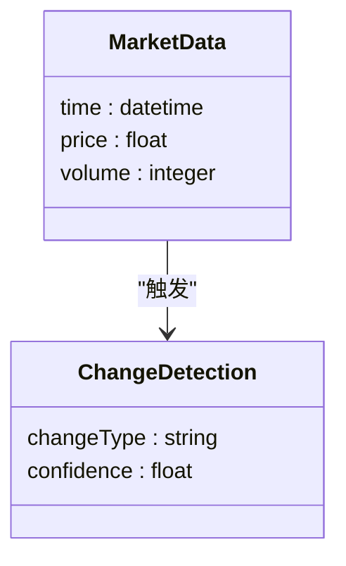

                 


# 开发智能化的金融市场微观结构变化检测工具

## 关键词
- 金融市场微观结构
- 变化检测
- 人工智能
- 机器学习
- 时间序列分析

## 摘要
本文详细探讨了开发智能化的金融市场微观结构变化检测工具的背景、核心概念、算法原理、系统架构设计以及项目实战。通过结合时间序列分析、异常检测和机器学习技术，本文提出了一种高效的方法来检测金融市场微观结构中的变化。文章还提供了详细的系统架构图和代码示例，帮助读者理解如何实现这一工具。

---

# 第1章 金融市场微观结构变化检测工具概述

## 1.1 问题背景与描述
### 1.1.1 金融市场微观结构的定义
金融市场微观结构是指市场参与者的交易行为、订单簿、成交情况等微观层面的市场运行机制。理解这些机制对于市场风险控制和交易策略制定至关重要。

### 1.1.2 微观结构变化的描述
微观结构变化可能由市场参与者的行为变化、订单簿的异常波动或外部事件引发。这些变化可能影响市场价格、波动性和交易量。

### 1.1.3 检测工具的解决方法
通过结合时间序列分析和机器学习，我们能够实时检测市场微观结构的变化，及时预警潜在风险。

### 1.1.4 工具的边界与外延
工具适用于高频交易数据，但不包括宏观经济因素或政策变化的影响。

## 1.2 核心概念与属性
### 1.2.1 核心概念的定义与关系
金融市场微观结构变化检测涉及订单簿、交易量、价格波动等多个维度。

### 1.2.2 概念结构与核心要素
- 数据源：高频交易数据、订单簿数据
- 变化检测方法：统计分析、机器学习模型
- 工具功能：实时监控、异常预警、历史分析

---

# 第2章 核心概念与原理

## 2.1 金融市场微观结构的核心原理
### 2.1.1 市场参与者的角色与行为
- 做市商：提供流动性
- 投资者：根据信息交易

### 2.1.2 价格形成的机制
价格由买卖双方的订单匹配决定，受市场情绪和信息影响。

## 2.2 变化检测的核心原理
### 2.2.1 时间序列分析的基本原理
时间序列分析用于识别数据中的趋势、周期性变化和异常点。

### 2.2.2 异常检测的核心算法
- 基于统计的方法：Z-score、孤立森林
- 基于机器学习的方法：孤立森林、神经网络

## 2.3 核心概念的ER实体关系图
```mermaid
erDiagram
    participant MarketParticipant {
        id : integer
        role : string
        behavior : string
    }
    participant MarketData {
        id : integer
        time : datetime
        price : float
        volume : integer
    }
    participant ChangeDetection {
        id : integer
        detectionTime : datetime
        changeType : string
        confidence : float
    }
    MarketParticipant --> MarketData : "生成"
    MarketData --> ChangeDetection : "触发"
```

---

# 第3章 算法原理与实现

## 3.1 时间序列分析算法
### 3.1.1 算法流程
1. 数据预处理：标准化、去噪
2. 模型训练：ARIMA、LSTM
3. 预测与异常检测

### 3.1.2 时间序列分析的数学模型
$$ ARIMA(p, d, q) $$
其中，p为自回归阶数，d为差分阶数，q为移动平均阶数。

## 3.2 异常检测算法
### 3.2.1 基于统计的方法
- Z-score：计算数据点与均值的距离标准化值。
$$ z = \frac{x - \mu}{\sigma} $$
- Isolation Forest：通过随机树检测异常点。

### 3.2.2 基于机器学习的方法
- Isolation Forest：适用于高维数据。
- 神经网络：使用LSTM检测时间序列中的异常。

---

# 第4章 系统分析与架构设计

## 4.1 系统功能设计
### 4.1.1 领域模型类图


### 4.1.2 系统架构图
```mermaid
containerDiagram
    container WebServer {
        WebServer
        Database
    }
    container API Gateway {
        API Gateway
        Cache
    }
    WebServer --> API Gateway : "请求"
    API Gateway --> Database : "查询"
```

---

# 第5章 项目实战

## 5.1 环境安装
- Python 3.8+
- Pandas、NumPy、Scikit-learn

## 5.2 核心代码实现
### 5.2.1 时间序列分析代码
```python
from statsmodels.tsa.arima_model import ARIMA
import numpy as np

# 示例数据
data = np.array([1, 2, 3, 4, 5])

# 模型训练
model = ARIMA(data, order=(1, 1, 1))
model_fit = model.fit(disp=0)

# 预测
forecast = model_fit.forecast(steps=5)
print(forecast)
```

### 5.2.2 异常检测代码
```python
from sklearn.ensemble import IsolationForest

# 示例数据
X = np.random.randn(100, 2)
clf = IsolationForest(random_state=42)
clf.fit(X)
```

---

# 第6章 总结与展望

## 6.1 最佳实践
- 数据预处理是关键，尤其是高频数据。
- 使用多种算法组合提高检测准确率。

## 6.2 本章小结
本文详细介绍了开发智能化的金融市场微观结构变化检测工具的背景、核心概念、算法原理和系统架构设计。通过实战案例，展示了工具的实际应用价值。

## 6.3 注意事项
- 数据隐私和安全性需高度重视。
- 系统需要实时性，优化算法性能。

## 6.4 拓展阅读
- 时间序列分析的经典书籍：《Forecasting: principles and practice》
- 异常检测的最新研究：《Isolation Forest: A New Algorithm for Outlier Detection in High-Dimensional Space》

---

# 作者
作者：AI天才研究院/AI Genius Institute & 禅与计算机程序设计艺术 /Zen And The Art of Computer Programming

