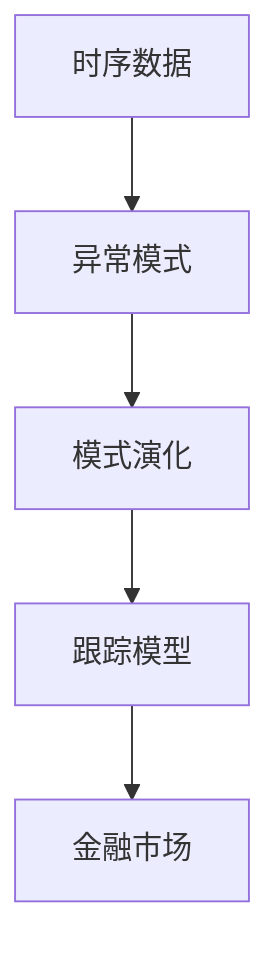
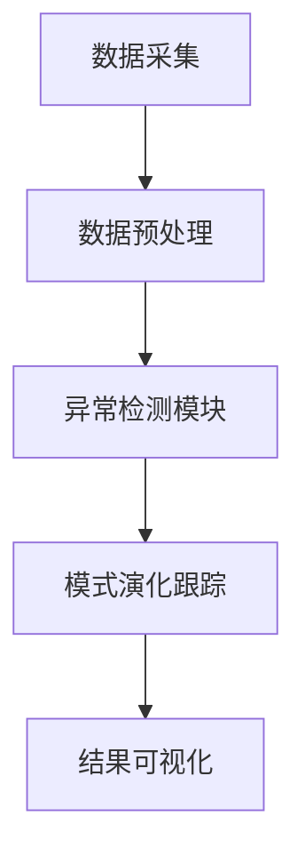

                 


# 开发智能化的金融时序数据异常模式演化跟踪模型

> 关键词：金融时序数据，异常模式，模型演化，智能化跟踪，深度学习

> 摘要：本文将详细探讨如何开发一种智能化的金融时序数据异常模式演化跟踪模型。通过分析金融数据的特性，结合深度学习技术，提出一种能够自动识别和跟踪异常模式的模型，并通过实际案例展示其应用效果。本文内容涵盖背景介绍、核心概念、算法原理、系统架构设计、项目实战等部分，帮助读者全面理解模型开发的全过程。

---

## 第一部分：背景介绍

### 第1章：问题背景与目标

#### 1.1 问题背景

在金融领域，时序数据的分析和预测具有重要意义。金融市场的波动性、复杂性和不确定性使得异常模式的识别和跟踪成为一项具有挑战性的任务。传统的异常检测方法通常基于统计学或规则引擎，但在面对复杂演化模式时，往往难以适应动态变化的市场环境。随着人工智能技术的发展，深度学习在金融领域的应用逐渐成为研究热点。

#### 1.2 核心目标

本文的核心目标是开发一种智能化的金融时序数据异常模式演化跟踪模型，能够实现以下目标：

1. **实时监控**：实时跟踪金融时序数据中的异常模式。
2. **动态适应**：能够动态适应数据分布的变化，跟踪异常模式的演化过程。
3. **高精度识别**：准确识别复杂金融环境下的异常模式。
4. **可解释性**：模型结果具有较高的可解释性，便于金融分析师理解和决策。

#### 1.3 问题解决思路

为实现上述目标，本文提出了一种结合深度学习和时序数据分析的智能化模型。具体思路如下：

1. **数据预处理**：对金融时序数据进行清洗、归一化等预处理，为后续建模奠定基础。
2. **特征提取**：利用深度学习模型（如LSTM）提取时序数据中的深层特征。
3. **异常检测**：基于提取的特征，采用异常检测算法（如基于深度学习的异常检测方法）识别异常模式。
4. **模式演化跟踪**：通过动态更新模型参数或引入演化机制，跟踪异常模式的演化过程。

---

## 第二部分：核心概念与联系

### 第2章：核心概念原理

#### 2.1 核心概念定义

1. **时序数据**：是指按照时间顺序记录的数据，通常具有趋势、周期性和随机性等特性。
2. **异常模式**：指在时序数据中偏离正常模式的特殊数据点或序列，可能预示着市场波动、欺诈行为或其他异常事件。
3. **模式演化**：指异常模式随时间变化的过程，可能是从正常模式到异常模式，或异常模式之间的形态变化。

#### 2.2 核心概念之间的关系

| 概念         | 属性特征                          |
|--------------|-----------------------------------|
| 时序数据     | 时间顺序性、连续性、周期性        |
| 异常模式     | 突发性、局部性、可变性            |
| 模式演化     | 动态性、渐变性、跳跃性            |

#### 2.3 实体关系图



---

## 第三部分：算法原理讲解

### 第3章：异常模式识别算法

#### 3.1 基于LSTM的异常检测

LSTM（长短期记忆网络）是一种适用于时序数据的深度学习模型，能够捕捉数据中的长期依赖关系。其核心思想是通过记忆单元（Memory Cell）和门控机制（Gate）来记忆重要的历史信息。

#### 3.2 异常检测算法实现

以下是基于LSTM的异常检测算法的Python代码示例：

```python
import numpy as np
from tensorflow.keras.models import Sequential
from tensorflow.keras.layers import LSTM, Dense, Dropout

# 示例数据：假设有n个样本，每个样本长度为timesteps，特征维度为input_dim
n, timesteps, input_dim = 100, 20, 5

# 模型定义
model = Sequential()
model.add(LSTM(64, input_shape=(timesteps, input_dim)))
model.add(Dropout(0.2))
model.add(Dense(1, activation='sigmoid'))

# 模型编译
model.compile(loss='binary_crossentropy', optimizer='adam', metrics=['accuracy'])

# 模型训练
# 假设X为输入数据，y为标签（0表示正常，1表示异常）
X = np.random.randn(n, timesteps, input_dim)
y = np.random.randint(2, size=n)

model.fit(X, y, epochs=10, batch_size=32)
```

---

### 第4章：模型演化算法

#### 4.1 模型演化机制

模型演化的核心思想是通过动态更新模型参数或引入新的数据来适应异常模式的变化。具体步骤如下：

1. **初始模型训练**：基于历史数据训练初始模型。
2. **实时更新**：在实时数据流中，定期更新模型参数。
3. **模式跟踪**：通过模型预测结果，跟踪异常模式的变化。

#### 4.2 基于增量学习的模型演化

增量学习是一种在新数据到达时更新模型的技术。以下是基于增量学习的模型演化算法示例：

```python
# 假设模型已经训练好
# 新数据X_new，标签y_new
model.fit(X_new, y_new, epochs=1, batch_size=32, verbose=0)
```

---

## 第四部分：系统分析与架构设计

### 第5章：系统功能设计

#### 5.1 功能模块划分

1. **数据采集模块**：从金融市场获取时序数据。
2. **数据预处理模块**：清洗和归一化数据。
3. **异常检测模块**：基于深度学习模型识别异常模式。
4. **模式演化跟踪模块**：动态跟踪异常模式的变化。
5. **结果可视化模块**：将检测结果可视化，便于分析。

#### 5.2 系统架构设计



---

## 第五部分：项目实战

### 第6章：项目实现

#### 6.1 环境安装

- **Python 3.8+**
- **TensorFlow 2.0+**
- **numpy、pandas、matplotlib**

#### 6.2 核心代码实现

以下是完整的项目代码示例：

```python
import numpy as np
import tensorflow as tf
from tensorflow.keras.models import Sequential
from tensorflow.keras.layers import LSTM, Dense, Dropout
import matplotlib.pyplot as plt

# 示例数据生成
n, timesteps, input_dim = 100, 20, 5
X = np.random.randn(n, timesteps, input_dim)
y = np.random.randint(2, size=n)

# 模型定义
model = Sequential()
model.add(LSTM(64, input_shape=(timesteps, input_dim)))
model.add(Dropout(0.2))
model.add(Dense(1, activation='sigmoid'))

# 模型编译
model.compile(loss='binary_crossentropy', optimizer='adam', metrics=['accuracy'])

# 模型训练
model.fit(X, y, epochs=10, batch_size=32, verbose=1)

# 模型预测
X_test = np.random.randn(1, timesteps, input_dim)
y_pred = model.predict(X_test)
print(y_pred)

# 模型保存
model.save('financial_anomaly_model.h5')
```

#### 6.3 实际案例分析

假设我们有一个金融时间序列数据集，包含股票价格的开盘价、收盘价、最高价、最低价和成交量。我们需要训练一个模型来检测股票价格的异常波动。

1. **数据预处理**：归一化数据，处理缺失值。
2. **模型训练**：使用训练数据训练模型。
3. **实时预测**：在实时数据流中，使用训练好的模型预测异常模式。

---

## 第六部分：总结与展望

### 第7章：总结与展望

#### 7.1 总结

本文详细探讨了开发智能化的金融时序数据异常模式演化跟踪模型的过程，包括背景介绍、核心概念、算法原理、系统架构设计和项目实战。通过深度学习技术，我们能够有效地识别和跟踪金融数据中的异常模式，为金融市场的实时监控和风险控制提供有力支持。

#### 7.2 展望

未来的研究方向可以包括：

1. **模型优化**：进一步优化模型结构，提高检测精度。
2. **多模态数据融合**：结合文本、图像等多种数据源，提升模型的综合分析能力。
3. **实时性优化**：通过分布式计算和流数据处理技术，提升模型的实时性。

---

作者：AI天才研究院/AI Genius Institute & 禅与计算机程序设计艺术 /Zen And The Art of Computer Programming

