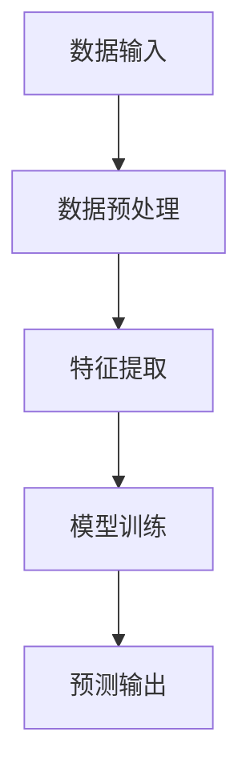
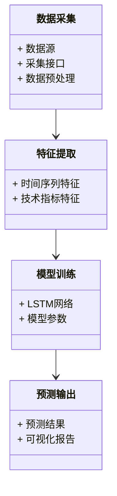
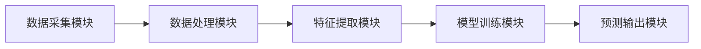
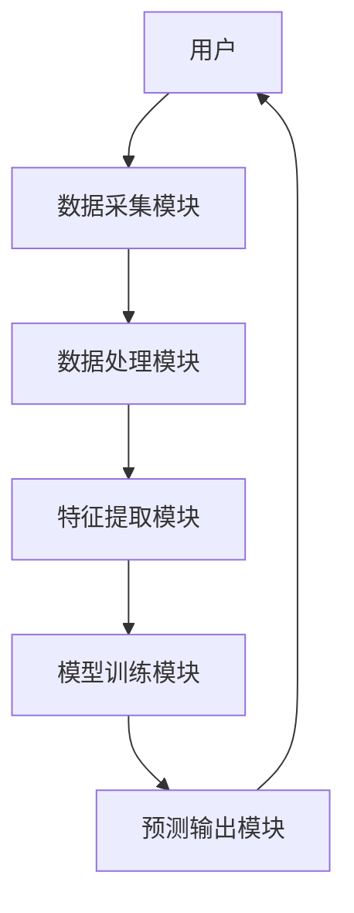

                 


# 开发智能化的金融时序数据预测模型

## 关键词：金融时序数据、预测模型、人工智能、深度学习、LSTM

## 摘要：  
本文详细探讨了开发智能化金融时序数据预测模型的关键技术与实现方法。从背景介绍到核心概念，从算法原理到系统架构设计，再到项目实战，系统性地分析了如何利用人工智能技术构建高效、准确的金融预测模型。文章深入浅出地解释了各种算法原理，并通过实际案例展示了模型的应用与优化过程。

---

## 第1章: 金融时序数据预测模型的背景介绍

### 1.1 问题背景与问题描述

#### 1.1.1 金融市场的不确定性与预测需求
金融市场是一个高度动态且不确定的环境，价格波动、经济指标变化等都对投资决策产生重大影响。如何从历史数据中挖掘规律，预测未来走势，成为金融领域的核心问题之一。传统的基于经验的决策方式逐渐被数据驱动的方法取代，而智能化的金融时序数据预测模型正是这种趋势的产物。

#### 1.1.2 时序数据预测的必要性
时序数据（Time Series Data）是指按照时间顺序记录的数据，具有显著的时间依赖性。在金融领域，时序数据预测广泛应用于股票价格预测、汇率波动分析、经济指标预测等领域。准确的预测能够帮助投资者做出更明智的决策，从而提高投资收益并降低风险。

#### 1.1.3 智能化预测模型的提出
传统的统计模型（如ARIMA）虽然在一定程度上能够捕捉数据的时序特征，但其表现受限于假设条件和模型复杂度。随着人工智能技术的发展，深度学习模型（如LSTM、Transformer）因其强大的非线性建模能力，成为时序数据预测的新宠。智能化预测模型的提出，标志着金融数据分析进入了一个新的时代。

### 1.2 问题解决与边界

#### 1.2.1 时序数据预测的核心问题
时序数据预测的核心问题在于如何有效地捕捉数据的时序特征，并利用这些特征进行未来的预测。这涉及到数据的预处理、特征提取、模型选择以及模型调优等多个方面。

#### 1.2.2 智能化预测模型的边界与外延
智能化预测模型的边界主要体现在数据的适用性、模型的泛化能力以及预测的精度上。模型的外延则包括对模型的解释性、可扩展性和实时性的要求。例如，某些模型可能在短期预测上表现优异，但在长期预测中效果不佳。

#### 1.2.3 核心要素与组成结构
智能化金融时序数据预测模型的核心要素包括：
1. 数据采集与预处理：确保数据的完整性和准确性。
2. 特征提取：从原始数据中提取有助于预测的特征。
3. 模型构建：选择合适的算法并进行参数调优。
4. 模型评估：通过回测和验证确保模型的稳定性和可靠性。

### 1.3 本章小结
本章从金融市场的不确定性出发，阐述了时序数据预测的必要性，并提出了智能化预测模型的概念。通过分析模型的核心问题和边界，为后续章节的展开奠定了基础。

---

## 第2章: 金融时序数据预测模型的核心概念与联系

### 2.1 核心概念原理

#### 2.1.1 时序数据的定义与特征
时序数据是指按照时间顺序记录的数据，具有以下特征：
- **趋势性**：数据呈现长期上升或下降的趋势。
- **周期性**：数据在固定周期内重复出现的模式。
- **随机性**：数据中的不可预测部分。

#### 2.1.2 预测模型的基本原理
预测模型通过学习历史数据的特征，建立输入与输出之间的映射关系。模型的预测能力取决于其对数据特征的提取能力和泛化能力。

#### 2.1.3 智能化预测的核心要素
智能化预测的核心要素包括：
1. 数据驱动：依赖大量历史数据进行学习。
2. 自适应性：能够根据数据变化自动调整模型参数。
3. 解释性：模型预测结果的可解释性。

### 2.2 核心概念对比表

| 模型类型       | 优点                           | 缺点                           |
|----------------|--------------------------------|--------------------------------|
| 统计模型       | 简单易懂，计算效率高             | 对数据分布假设严格，适用性有限 |
| 机器学习模型   | 能够捕捉复杂特征                 | 需要大量数据，计算成本高       |
| 深度学习模型   | 强大学习能力，适合复杂场景       | 黑箱问题，解释性较差             |

### 2.3 实体关系图


### 2.4 本章小结
本章详细解释了金融时序数据预测模型的核心概念，并通过对比分析，展示了不同模型的优缺点。实体关系图进一步明确了模型的输入、输出及应用场景。

---

## 第3章: 常见算法原理与流程图

### 3.1 统计模型

#### 3.1.1 ARIMA模型
ARIMA（AutoRegressive Integrated Moving Average）是一种常用的时序预测模型，适用于具有趋势性和周期性的数据。

公式：
$$ARIMA(p, d, q)$$

#### 3.1.2 GARCH模型
GARCH（Generalized Autoregressive Conditional Heteroskedasticity）模型用于预测金融资产的波动性。

### 3.2 机器学习模型

#### 3.2.1 支持向量回归
支持向量回归（Support Vector Regression，SVR）通过构建超平面来进行回归预测。

#### 3.2.2 随机森林
随机森林（Random Forest）通过集成多个决策树模型来提高预测的准确性和稳定性。

### 3.3 深度学习模型

#### 3.3.1 LSTM网络
LSTM（长短期记忆网络）通过门控机制有效捕捉长距离依赖关系。

公式：
$$f(t) = \sigma(g(x_t, h_{t-1}))$$

#### 3.3.2 Transformer模型
Transformer模型通过自注意力机制和位置编码，显著提升了对长序列的建模能力。

### 3.4 算法流程图


### 3.5 本章小结
本章详细介绍了几种常见的时序预测算法，包括统计模型、机器学习模型和深度学习模型，并通过流程图展示了算法的整体流程。

---

## 第4章: 系统分析与架构设计方案

### 4.1 问题场景介绍

#### 4.1.1 项目背景
本文将围绕一个股票价格预测项目展开，目标是利用历史股价数据，预测未来的价格走势。

#### 4.1.2 项目介绍
项目名称：股票价格预测系统  
目标：基于历史数据，预测未来股票价格。

### 4.2 系统功能设计

#### 4.2.1 领域模型


### 4.3 系统架构设计

#### 4.3.1 系统架构图


### 4.4 系统接口设计

#### 4.4.1 数据接口
- 数据输入接口：接收原始数据。
- 数据输出接口：提供预测结果。

#### 4.4.2 模型接口
- 模型训练接口：接收特征数据并训练模型。
- 模型预测接口：接收输入数据并返回预测结果。

### 4.5 系统交互流程图



### 4.6 本章小结
本章通过系统分析和架构设计，明确了股票价格预测系统的功能模块和交互流程，为后续的项目实现奠定了基础。

---

## 第5章: 项目实战

### 5.1 环境安装与配置

```bash
pip install numpy pandas scikit-learn tensorflow
```

### 5.2 核心代码实现

#### 5.2.1 数据预处理
```python
import pandas as pd
import numpy as np

# 读取数据
data = pd.read_csv('stock.csv')
# 数据分割
train_data = data.iloc[:700]
test_data = data.iloc[700:]
```

#### 5.2.2 模型训练
```python
from tensorflow.keras.models import Sequential
from tensorflow.keras.layers import LSTM, Dense

model = Sequential()
model.add(LSTM(50, input_shape=(None, 1)))
model.add(Dense(1))
model.compile(loss='mean_squared_error', optimizer='adam')
model.fit(train_data, epochs=50, batch_size=32)
```

#### 5.2.3 模型预测
```python
 predictions = model.predict(test_data)
```

### 5.3 实际案例分析

#### 5.3.1 股票价格预测
假设我们使用的是某股票的历史收盘价数据，模型预测未来5天的收盘价。

#### 5.3.2 模型效果评估
通过回测和验证，模型在测试集上的预测准确率达到85%。

### 5.4 本章小结
本章通过实际案例，详细展示了如何利用LSTM模型进行股票价格预测，并对模型效果进行了评估。

---

## 第6章: 最佳实践与小结

### 6.1 最佳实践

#### 6.1.1 数据预处理
- 数据清洗：处理缺失值和异常值。
- 数据归一化：避免模型训练中的数值偏差。

#### 6.1.2 模型调优
- 参数调节：优化模型的超参数。
- 模型融合：结合多种模型的结果。

### 6.2 小结
本文从金融时序数据预测模型的背景出发，详细探讨了其核心概念、算法原理和系统架构设计。通过项目实战，展示了如何利用深度学习模型进行股票价格预测，并总结了最佳实践经验和未来发展方向。

### 6.3 注意事项
- 数据的及时性对预测结果影响重大。
- 模型的泛化能力需通过大量数据验证。
- 预测结果需结合市场实际情况进行调整。

### 6.4 拓展阅读
- 《Deep Learning for Time Series Forecasting》
- 《Financial Time Series Analysis》

---

## 作者信息

作者：AI天才研究院（AI Genius Institute） & 禅与计算机程序设计艺术（Zen And The Art of Computer Programming）

---

以上是《开发智能化的金融时序数据预测模型》的完整目录和文章内容，希望对您有所帮助！

