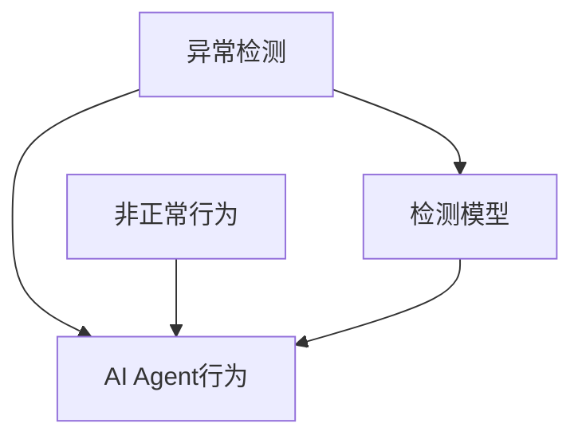
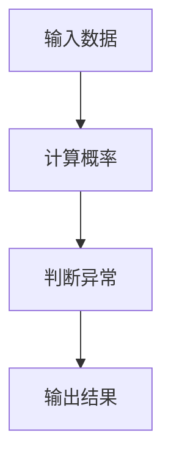
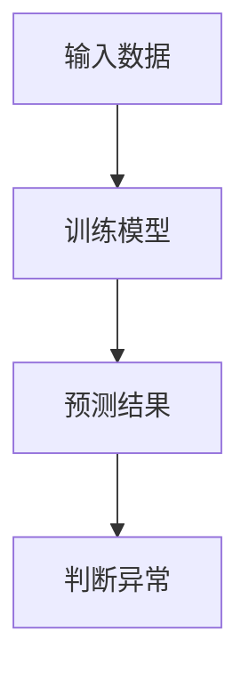
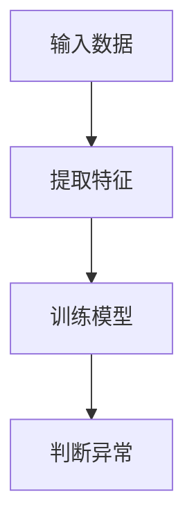
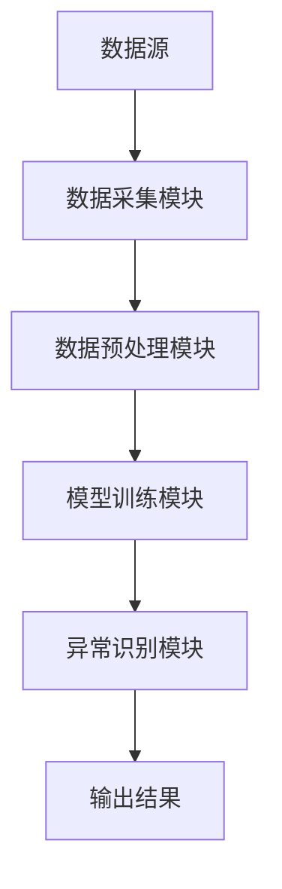
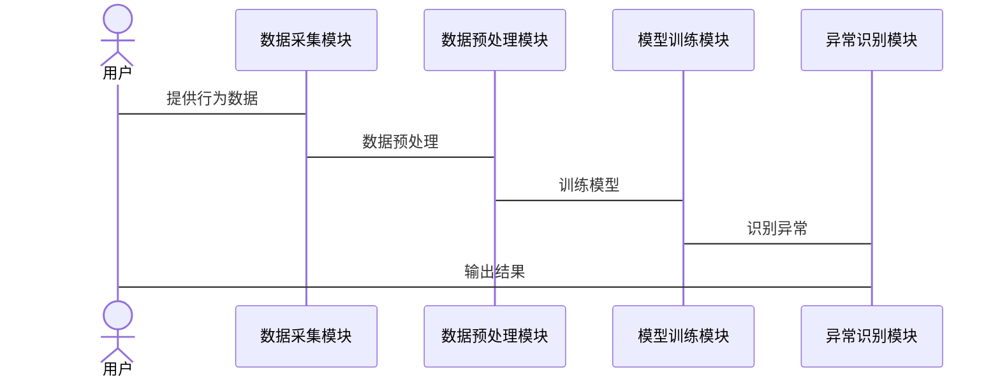

                 


# 异常检测：识别AI Agent的非正常行为

> **关键词**：AI Agent、异常检测、行为分析、安全监控、机器学习  
> 
> **摘要**：本文系统地探讨了异常检测在识别AI Agent非正常行为中的应用。从基础概念到高级算法，从系统架构到实际案例，文章全面分析了如何检测和应对AI Agent的异常行为，确保其安全性和可靠性。通过深入的技术分析和实例讲解，本文为AI Agent的异常检测提供了全面的解决方案和实践指导。

---

# 目录

1. 异常检测的背景与概念
   1.1 异常检测的定义与目标
   1.2 AI Agent的非正常行为
   1.3 异常检测在AI Agent中的重要性

2. 异常检测的核心概念与联系
   2.1 异常检测的基本原理
   2.2 异常检测的核心要素
   2.3 异常检测与AI Agent的实体关系

3. 异常检测的算法原理
   3.1 基于统计的异常检测方法
   3.2 基于机器学习的异常检测方法
   3.3 基于深度学习的异常检测方法

4. 异常检测的系统架构设计
   4.1 系统功能设计
   4.2 系统架构设计
   4.3 系统接口设计
   4.4 系统交互流程

5. 异常检测的项目实战
   5.1 项目背景与目标
   5.2 项目环境与工具安装
   5.3 核心功能实现
   5.4 代码解读与分析
   5.5 案例分析与总结

6. 异常检测的高级主题与未来展望
   6.1 对抗攻击与防御
   6.2 自适应异常检测算法
   6.3 实时异常检测系统
   6.4 未来挑战与趋势

---

## 第1章: 异常检测的背景与概念

### 1.1 异常检测的定义与目标
异常检测是指通过分析数据或行为，识别出与预期模式或行为显著不同的个体、事件或数据点。其目标是发现潜在的异常情况，从而采取相应的措施。在AI Agent的应用中，异常检测的核心目标是识别其行为中的异常，确保其行为符合预期。

### 1.2 AI Agent的非正常行为
AI Agent的非正常行为可能包括：
- **输入异常**：处理错误的输入数据。
- **逻辑偏差**：执行不符合预期的决策。
- **输出异常**：生成不符合规范的输出结果。
- **行为偏离**：在特定场景下表现出不符合预期的行为。

### 1.3 异常检测在AI Agent中的重要性
- **安全风险**：及时发现异常行为，防止安全漏洞。
- **性能优化**：通过分析异常行为，优化AI Agent的性能。
- **用户体验**：提升用户对AI Agent的信任和满意度。

---

## 第2章: 异常检测的核心概念与联系

### 2.1 异常检测的基本原理
异常检测的核心原理是通过分析数据的分布、模式或行为，识别出与正常情况不同的数据点或行为。常见的方法包括统计方法、机器学习方法和深度学习方法。

### 2.2 异常检测的核心要素
- **数据特征**：用于检测异常的特征，如行为模式、数据分布等。
- **检测模型**：用于识别异常的算法或模型。
- **评估指标**：用于衡量检测效果的指标，如准确率、召回率等。

### 2.3 异常检测与AI Agent的实体关系


---

## 第3章: 异常检测的算法原理

### 3.1 基于统计的异常检测方法
- **马尔可夫模型**：通过概率分布分析序列数据中的异常。
- **高斯分布模型**：假设数据服从正态分布，检测偏离均值的点。



### 3.2 基于机器学习的异常检测方法
- **支持向量机**：通过学习正常数据的边界，识别异常点。
- **线性回归**：通过拟合正常数据的分布，检测异常点。



### 3.3 基于深度学习的异常检测方法
- **卷积神经网络**：适用于图像或时间序列数据的异常检测。
- **循环神经网络**：适用于处理序列数据，捕捉时序关系。



---

## 第4章: 异常检测的系统架构设计

### 4.1 系统功能设计
- **数据采集模块**：收集AI Agent的行为数据。
- **数据预处理模块**：清洗和转换数据，使其适合检测模型。
- **模型训练模块**：训练异常检测模型。
- **异常识别模块**：实时或批量识别异常行为。

### 4.2 系统架构设计


### 4.3 系统接口设计
- **输入接口**：接收AI Agent的行为数据。
- **输出接口**：输出异常检测结果。

### 4.4 系统交互流程


---

## 第5章: 异常检测的项目实战

### 5.1 项目背景与目标
本项目旨在通过构建一个异常检测系统，识别AI Agent的非正常行为，确保其安全性和可靠性。

### 5.2 项目环境与工具安装
- **环境要求**：Python 3.8以上版本。
- **工具安装**：安装numpy、scikit-learn、tensorflow等库。

### 5.3 核心功能实现
```python
import numpy as np
from sklearn.svm import OneClassSVM

# 示例数据
X = np.random.randn(100, 2)
X[10] = [10, 10]

# 训练模型
model = OneClassSVM(nu=0.1)
model.fit(X)

# 预测异常
y_pred = model.predict(X)
print(y_pred)
```

### 5.4 代码解读与分析
- **数据准备**：生成示例数据，并引入异常点。
- **模型训练**：使用OneClassSVM训练模型。
- **异常识别**：通过模型预测结果，识别异常点。

### 5.5 案例分析与总结
通过实际案例分析，验证模型的检测效果，并总结经验教训。

---

## 第6章: 异常检测的高级主题与未来展望

### 6.1 对抗攻击与防御
探讨异常检测在对抗攻击中的应用，如对抗样本的检测。

### 6.2 自适应异常检测算法
研究自适应算法，提升检测的准确性和鲁棒性。

### 6.3 实时异常检测系统
设计实时检测系统，实现快速响应。

### 6.4 未来挑战与趋势
展望未来，异常检测在AI Agent中的挑战与发展趋势。

---

## 作者：AI天才研究院 & 禅与计算机程序设计艺术

