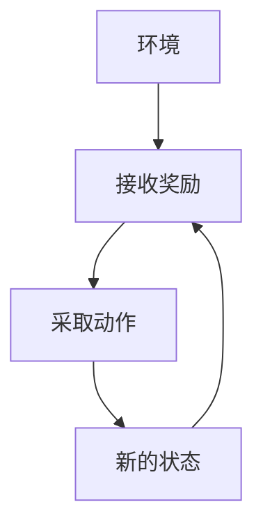
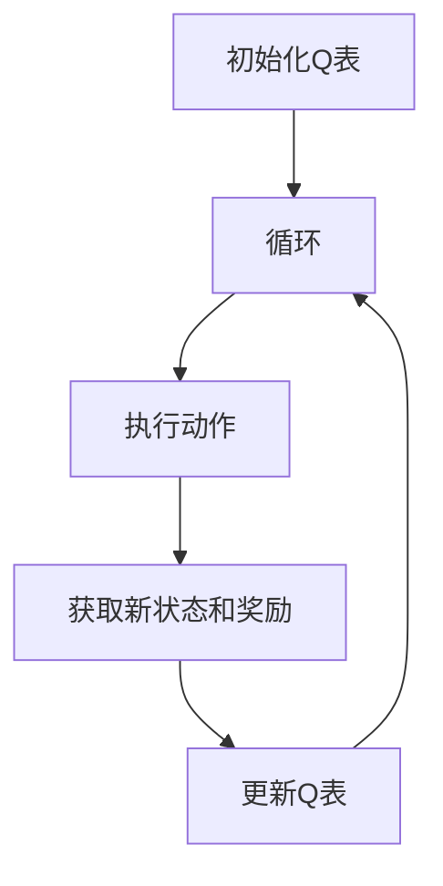
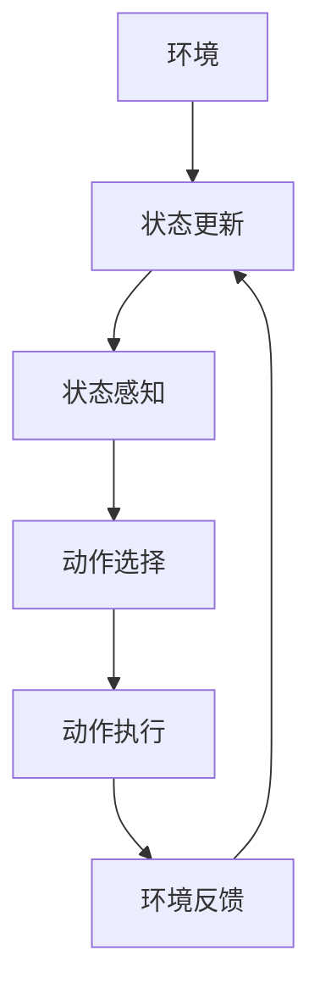
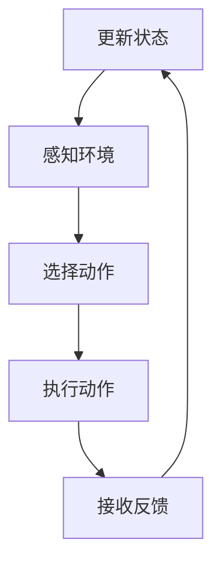

                 


# 强化学习在AI Agent决策中的应用

> 关键词：强化学习、AI Agent、马尔可夫决策过程、Q-learning、DQN、深度强化学习

> 摘要：本文详细探讨强化学习在AI Agent决策中的应用，从基础概念到核心算法，再到系统设计与项目实战，全面解析如何利用强化学习优化AI Agent的决策能力。通过数学模型、算法流程图和系统架构图的详细展示，帮助读者深入理解强化学习在AI Agent中的应用原理和实现方法。

---

# 第1章: 强化学习与AI Agent概述

## 1.1 强化学习的基本概念

### 1.1.1 强化学习的定义
强化学习是一种机器学习方法，通过智能体与环境的交互，学习最优策略以最大化累积奖励。与监督学习和无监督学习不同，强化学习强调实时交互和目标导向的学习过程。

### 1.1.2 强化学习的核心要素
强化学习的核心要素包括：
- **状态（State）**：智能体所处的环境信息。
- **动作（Action）**：智能体根据当前状态做出的行为选择。
- **奖励（Reward）**：环境对智能体行为的反馈，指导智能体优化策略。
- **策略（Policy）**：智能体在不同状态下选择动作的概率分布。
- **价值函数（Value Function）**：评估某个状态或状态-动作对的优劣。

### 1.1.3 AI Agent与强化学习的关系
AI Agent通过强化学习不断优化决策能力，实现复杂环境中的自主行动。强化学习为AI Agent提供了一种从经验中学习的机制，使其能够适应动态变化的环境。

### 图1-1：强化学习的基本流程图


## 1.2 强化学习的数学模型

### 1.2.1 状态空间
状态空间描述了所有可能的状态，可以是离散的（如棋盘上的位置）或连续的（如温度传感器的读数）。

### 1.2.2 动作空间
动作空间定义了智能体在每个状态下可能采取的所有动作，可以是离散动作（如游戏中的移动方向）或连续动作（如自动驾驶中的转向角度）。

### 1.2.3 奖励函数
奖励函数R(s, a, s')定义了智能体在状态s采取动作a后到达状态s'所获得的奖励。奖励函数的设计对算法性能至关重要。

### 1.2.4 策略与价值函数
- **策略π(a|s)**：在状态s下选择动作a的概率。
- **价值函数V(s)**：评估从状态s开始的长期累积奖励的期望值。

## 1.3 强化学习的应用场景

### 1.3.1 游戏AI
强化学习广泛应用于游戏AI，如AlphaGo和OpenAI的Dota AI，通过大量对弈优化策略。

### 1.3.2 机器人控制
在机器人导航和抓取任务中，强化学习帮助机器人通过试错学习最优动作序列。

### 1.3.3 推荐系统
强化学习用于推荐系统，通过优化用户的点击率和满意度，提升推荐效果。

### 1.3.4 自动驾驶
强化学习在自动驾驶中应用，帮助车辆在复杂交通环境中做出最优决策。

## 1.4 本章小结
本章介绍了强化学习的基本概念、数学模型及其在AI Agent中的应用场景，为后续章节的深入学习奠定了基础。

---

# 第2章: 强化学习的核心算法

## 2.1 马尔可夫决策过程

### 2.1.1 定义与特点
马尔可夫决策过程（MDP）假设环境满足马尔可夫性质，即当前状态足以预测未来的状态，而无需考虑历史信息。

### 2.1.2 状态转移概率
状态转移概率P(s' | s, a)描述了在状态s下采取动作a后，转移到状态s'的概率。

### 2.1.3 策略评估与改进
- **策略评估**：计算策略π下的价值函数Vπ(s)。
- **策略改进**：根据价值函数改进策略，最大化累积奖励。

## 2.2 Q-learning算法

### 2.2.1 算法原理
Q-learning通过更新Q值表Q(s, a)来学习最优策略。智能体在每个时间步更新Q值，逐步逼近最优解。

### 2.2.2 Q值更新公式
$$ Q(s, a) = Q(s, a) + \alpha [r + \gamma \max_{a'} Q(s', a') - Q(s, a)] $$
其中：
- α为学习率，
- γ为折扣因子，
- r为即时奖励。

### 2.2.3 探索与利用策略
Q-learning通过探索（随机选择动作）和利用（选择当前最优动作）平衡，避免陷入局部最优。

### 图2-1：Q-learning算法流程图


## 2.3 Deep Q-Network (DQN)

### 2.3.1 网络结构
DQN使用卷积神经网络或全连接神经网络近似Q值函数，输入为状态s，输出为各动作的Q值。

### 2.3.2 经验回放机制
经验回放通过存储历史经验（s, a, r, s'）并随机采样，减少样本之间的相关性，加速收敛。

### 2.3.3 优势与挑战
- 优势：解决离散动作空间中的高维状态问题。
- 挑战：状态空间过于复杂时，训练困难。

## 2.4 Actor-Critic方法

### 2.4.1 算法原理
Actor-Critic同时学习策略（Actor）和价值函数（Critic），策略网络负责选择动作，价值网络评估当前状态的价值。

### 2.4.2 Actor网络与Critic网络
- Actor网络输出动作概率分布。
- Critic网络评估状态-动作对的Q值。

### 2.4.3 应用场景
Actor-Critic适用于连续动作空间和高维状态空间的问题。

### 图2-2：Actor-Critic算法流程图
```mermaid
graph TD
    A[输入状态s] --> B[Actor选择动作a]
    B --> C[Critic评估Q(s,a)]
    C --> D[更新Actor和Critic参数]
    D --> A[循环]
```

## 2.5 本章小结
本章详细介绍了强化学习的核心算法，包括Q-learning、DQN和Actor-Critic，为后续章节的系统设计和项目实战奠定了算法基础。

---

# 第3章: 强化学习的数学模型与公式

## 3.1 状态转移模型

### 3.1.1 马尔可夫假设
假设当前状态s和动作a决定了下一个状态s'，即满足马尔可夫性质。

### 3.1.2 转移概率矩阵
对于离散状态空间，转移概率矩阵P描述了从状态s到s'的概率。

### 3.1.3 状态价值函数
状态价值函数V(s)定义为从状态s开始的长期累积奖励的期望值：
$$ V(s) = \sum_{a} \pi(a|s) \left[ r + \gamma V(s') \right] $$

## 3.2 Q-learning公式推导

### 3.2.1 Bellman方程
Q值的贝尔曼方程为：
$$ Q(s, a) = r + \gamma \max_{a'} Q(s', a') $$

### 3.2.2 Q值更新公式
Q-learning通过样本 experiences (s, a, r, s') 更新Q表：
$$ Q(s, a) = Q(s, a) + \alpha \left( r + \gamma \max_{a'} Q(s', a') - Q(s, a) \right) $$

## 3.3 DQN的数学模型

### 3.3.1 神经网络结构
DQN使用深度神经网络近似Q值函数，输入为状态s，输出为各动作的Q值。

### 3.3.2 损失函数
DQN使用均方误差作为损失函数：
$$ L = \mathbb{E} \left[ (y - Q(s, a))^2 \right] $$
其中，$$ y = r + \gamma \max Q'(s', a') $$

### 3.3.3 优化算法
通常使用随机梯度下降（SGD）或Adam优化器更新网络参数。

## 3.4 本章小结
本章通过数学模型和公式详细解析了强化学习的核心原理，为后续章节的算法实现提供了理论基础。

---

# 第4章: 强化学习的系统架构与设计

## 4.1 系统架构概述

### 4.1.1 环境与智能体交互
智能体通过感知环境状态、选择动作并执行，与环境形成闭环。

### 4.1.2 状态感知与处理
智能体接收环境输入，如图像、传感器数据等，并将其转换为内部状态表示。

### 4.1.3 动作选择与执行
智能体根据当前状态选择动作，并通过执行机构作用于环境。

### 图4-1：系统架构图


## 4.2 系统功能设计

### 4.2.1 状态空间建模
根据问题需求，定义智能体需要感知的状态量，并建立状态空间模型。

### 4.2.2 动作空间设计
根据智能体的能力和环境约束，定义可用的动作及其执行方式。

### 4.2.3 奖励机制实现
设计合理的奖励函数，确保智能体的行为朝着目标方向优化。

## 4.3 系统架构图

### 4.3.1 分层架构
系统通常分为感知层、决策层和执行层，各层之间通过接口传递数据。

### 4.3.2 并行处理机制
在分布式系统中，智能体可以通过多线程或多进程并行处理感知和决策任务。

### 4.3.3 学习模块设计
学习模块负责更新策略或价值函数，通常采用神经网络或强化学习算法。

## 4.4 接口设计与交互流程

### 4.4.1 系统接口定义
定义智能体与环境之间的接口，如感知接口和执行接口。

### 4.4.2 交互流程图
描述智能体与环境的交互流程，包括感知、决策和执行三个步骤。

### 图4-2：系统交互流程图


## 4.5 本章小结
本章详细描述了强化学习系统的架构设计，包括功能模块、接口设计和交互流程，为实际项目提供了参考。

---

# 第5章: 强化学习的项目实战

## 5.1 环境搭建与工具安装

### 5.1.1 Python环境配置
安装Python 3.8及以上版本，并配置虚拟环境。

### 5.1.2 深度学习框架选择
推荐使用TensorFlow或PyTorch框架。

### 5.1.3 开发工具安装
安装必要的开发工具，如Jupyter Notebook、VS Code等。

## 5.2 核心代码实现

### 5.2.1 DQN算法实现

```python
import numpy as np
import gym
import tensorflow as tf

class DQNetwork:
    def __init__(self, state_space, action_space, learning_rate=0.001):
        self.state_space = state_space
        self.action_space = action_space
        self.model = tf.keras.Sequential([
            tf.keras.layers.Dense(64, activation='relu', input_shape=(state_space,)),
            tf.keras.layers.Dense(action_space)
        ])
        self.optimizer = tf.keras.optimizers.Adam(learning_rate=learning_rate)

    def predict(self, state):
        return self.model.predict(state)

    def train(self, states, targets):
        with tf.GradientTape() as tape:
            predictions = self.model.predict(states)
            loss = tf.keras.losses.mean_squared_error(targets, predictions)
        gradients = tape.gradient(loss, self.model.trainable_variables)
        self.optimizer.apply_gradients(zip(gradients, self.model.trainable_variables))

def main():
    env = gym.make('CartPole-v1')
    state_space = env.observation_space.shape[0]
    action_space = env.action_space.n
    DQN = DQNetwork(state_space, action_space)
    max_episodes = 1000
    batch_size = 32
    gamma = 0.99
    epsilon = 1.0
    epsilon_min = 0.01
    epsilon_decay = 0.995

    for episode in range(max_episodes):
        state = env.reset()
        total_reward = 0
        done = False
        while not done:
            if np.random.random() < epsilon:
                action = np.random.randint(0, action_space)
            else:
                state_tensor = np.array([state])
                Q_values = DQN.predict(state_tensor)
                action = np.argmax(Q_values[0])
            
            next_state, reward, done, _ = env.step(action)
            total_reward += reward

            experience = (state, action, reward, next_state, done)
            memory.append(experience)

            if len(memory) >= batch_size:
                batch = random.sample(memory, batch_size)
                states = np.array([e[0] for e in batch])
                actions = np.array([e[1] for e in batch])
                rewards = np.array([e[2] for e in batch])
                next_states = np.array([e[3] for e in batch])
                dones = np.array([e[4] for e in batch])

                targets = DQN.predict(states)
                next_Q = DQN.predict(next_states)
                targets[range(batch_size), actions] = rewards + gamma * (1 - dones) * np.max(next_Q, axis=1)
                DQN.train(states, targets)

            state = next_state
            epsilon = max(epsilon_min, epsilon * epsilon_decay)
        
        print(f'Episode {episode}, Reward: {total_reward}')
    
    env.close()

if __name__ == "__main__":
    main()
```

### 5.2.2 状态处理函数
```python
def process_state(state):
    return state
```

### 5.2.3 动作选择与执行
```python
def choose_action(DQN, state, epsilon):
    if np.random.random() < epsilon:
        return np.random.randint(0, DQN.action_space)
    else:
        Q_values = DQN.predict(np.array([state]))
        return np.argmax(Q_values[0])
```

## 5.3 代码解读与分析

### 5.3.1 网络结构代码
DQNetwork类定义了一个全连接神经网络，输入为状态空间，输出为动作空间的Q值。

### 5.3.2 损失函数与优化器
使用均方误差作为损失函数，并采用Adam优化器更新网络参数。

### 5.3.3 训练循环
智能体通过与环境交互，收集经验并更新神经网络参数，逐步逼近最优策略。

## 5.4 项目小结
本章通过实现DQN算法，展示了如何将强化学习应用于实际问题，如CartPole环境。通过代码实现和结果分析，验证了算法的有效性。

---

# 作者：AI天才研究院/AI Genius Institute & 禅与计算机程序设计艺术 /Zen And The Art of Computer Programming

---

通过以上内容，读者可以系统地学习强化学习在AI Agent决策中的应用，从理论到实践，逐步掌握相关知识和技能。

