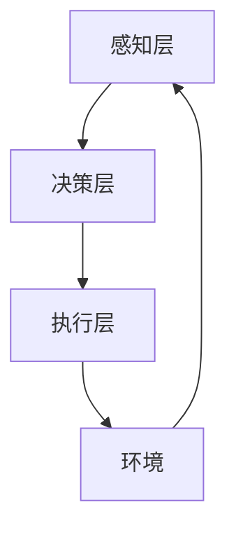
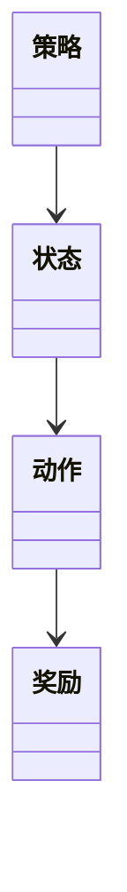
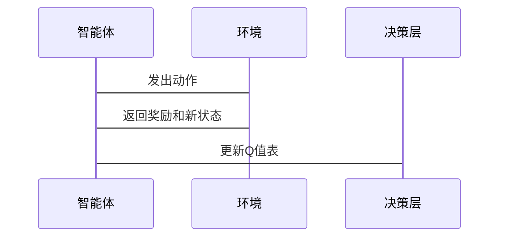

                 


# 强化学习在AI Agent决策中的运用

## 关键词：强化学习, AI Agent, 决策过程, Q-learning, DQN, 系统架构

## 摘要：强化学习是一种通过智能体与环境交互来优化决策策略的技术。本文详细探讨了强化学习的核心概念、算法及其在AI Agent中的应用，分析了系统架构设计，并通过项目实战展示了如何将强化学习应用于实际问题中。

---

# 第一部分: 强化学习基础

## 第1章: 强化学习的基本概念

### 1.1 什么是强化学习

#### 1.1.1 强化学习的定义
强化学习是一种机器学习范式，通过智能体与环境的交互，智能体通过试错和奖励/惩罚机制来优化其决策策略。

#### 1.1.2 强化学习的核心要素
- **状态（State）**：环境在某一时刻的观察。
- **动作（Action）**：智能体在某一状态下做出的行为。
- **奖励（Reward）**：智能体行为后获得的反馈，用于评估行为的好坏。
- **策略（Policy）**：智能体选择动作的规则。
- **值函数（Value Function）**：评估某个状态下策略的期望奖励。

#### 1.1.3 强化学习与监督学习的区别
| 方面         | 监督学习                     | 强化学习                     |
|--------------|------------------------------|----------------------------|
| 数据类型     | 标签数据（已知正确答案）      | 环境反馈（奖励或惩罚）        |
| 目标         | 最小化预测误差                | 最大化累积奖励                |
| 交互方式     | 静态数据                    | 动态交互                    |

### 1.2 马尔可夫决策过程

#### 1.2.1 状态、动作和奖励的定义
- **状态（S）**：环境的当前情况，例如在迷宫中的位置。
- **动作（A）**：智能体的行为，例如向右移动。
- **奖励（R）**：对动作的反馈，例如到达终点得到+1。

#### 1.2.2 策略与价值函数
- **策略（π）**：从状态到动作的映射，即π(a|s)表示在状态s下选择动作a的概率。
- **值函数（V）**：衡量策略在状态s下的期望累积奖励。

#### 1.2.3 马尔可夫决策过程的数学模型
$$ V^{\pi}(s) = E[R | s, \pi] $$

### 1.3 强化学习的基本算法

#### 1.3.1 Q-learning算法

##### 算法原理
Q-learning通过学习Q值表，即Q(s, a)，表示在状态s下执行动作a后的预期累积奖励。

##### 数学公式
$$ Q(s, a) = r + \gamma \max_{a'} Q(s', a') $$

#### 1.3.2 深度Q网络（DQN）

##### 网络结构
DQN使用两个神经网络：主网络和目标网络，用于近似Q值函数。

##### 算法步骤
1. 从经验回放中随机抽取一批样本。
2. 更新目标网络权重以匹配主网络。
3. 计算损失函数并反向传播更新主网络。

#### 1.3.3 策略梯度方法

##### 算法原理
策略梯度通过直接优化策略参数，使得累积奖励最大化。

##### 数学公式
$$ \nabla J = \nabla \log \pi(a|s) \cdot Q(s,a) $$

---

## 第2章: 强化学习的核心算法

### 2.1 价值函数方法

#### 2.1.1 状态值函数
衡量状态s下的期望累积奖励。

#### 2.1.2 动作值函数
衡量状态s下执行动作a后的期望累积奖励。

#### 2.1.3 剩余价值定理
剩余价值是指在当前状态下，智能体能获得的最大累积奖励。

### 2.2 策略搜索方法

#### 2.2.1 最大化期望奖励
通过优化策略参数，使得期望奖励最大化。

#### 2.2.2 策略梯度方法
通过梯度下降优化策略参数。

#### 2.2.3 REINFORCE算法
一种基于策略梯度的强化学习算法。

### 2.3 Q-learning算法

#### 2.3.1 Q-learning的基本原理
通过更新Q值表，逼近最优Q值函数。

#### 2.3.2 Q-learning的收敛性分析
在折扣因子γ < 1时，Q-learning算法收敛到最优值。

#### 2.3.3 Q-learning在AI Agent中的应用
例如在游戏控制、机器人导航等领域。

---

## 第3章: 强化学习的数学模型与公式

### 3.1 贝尔曼方程

#### 3.1.1 贝尔曼方程的定义
$$ V^{\pi}(s) = E[R | s, \pi] $$

#### 3.1.2 贝尔曼方程的解法
通过动态规划或值迭代方法求解。

#### 3.1.3 贝尔曼方程的数学推导
$$ V(s) = \max_a (r + \gamma V(s')) $$

### 3.2 Q-learning的数学公式

#### 3.2.1 Q-learning的更新公式
$$ Q(s, a) = r + \gamma \max_{a'} Q(s', a') $$

#### 3.2.2 Q-learning的收敛性证明
在经验回放和目标网络的帮助下，DQN算法收敛到近似最优策略。

#### 3.2.3 Q-learning的数学实现
使用神经网络近似Q值函数。

### 3.3 深度强化学习的数学模型

#### 3.3.1 DQN的数学模型
使用两个深度神经网络分别作为主网络和目标网络。

#### 3.3.2 DQN的网络结构
主网络和目标网络具有相同的架构，但权重不同步。

#### 3.3.3 DQN的训练过程
通过经验回放和目标网络更新，减少近似Q值函数的偏差。

---

## 第4章: 系统分析与架构设计

### 4.1 AI Agent的系统结构

#### 4.1.1 AI Agent的组成
包括感知层、决策层和执行层。

#### 4.1.2 AI Agent的功能模块
- 感知模块：处理环境反馈。
- 决策模块：执行强化学习算法。
- 执行模块：输出动作。

#### 4.1.3 AI Agent的架构图



### 4.2 项目介绍

#### 4.2.1 系统功能设计
设计一个AI Agent在迷宫中导航的系统，目标是找到出口。

#### 4.2.2 领域模型（类图）



#### 4.2.3 系统架构设计


#### 4.2.4 系统接口设计
- 输入接口：接收环境反馈。
- 输出接口：输出决策动作。

#### 4.2.5 系统交互流程



---

## 第5章: 项目实战

### 5.1 环境配置

#### 5.1.1 安装依赖
```bash
pip install gym numpy torch
```

### 5.2 系统核心实现源代码

#### 5.2.1 Q-learning实现

```python
import numpy as np

class QLearning:
    def __init__(self, state_space, action_space, gamma=0.99):
        self.gamma = gamma
        self.Q = np.zeros((state_space, action_space))
    
    def choose_action(self, state, epsilon=0.1):
        if np.random.random() < epsilon:
            return np.random.randint(0, action_space)
        else:
            return np.argmax(self.Q[state])
    
    def update_Q(self, state, action, reward, next_state):
        self.Q[state][action] = reward + self.gamma * np.max(self.Q[next_state])
```

#### 5.2.2 DQN实现

```python
import torch
import torch.nn as nn

class DQN(nn.Module):
    def __init__(self, input_size, output_size):
        super(DQN, self).__init__()
        self.fc1 = nn.Linear(input_size, 64)
        self.fc2 = nn.Linear(64, output_size)
    
    def forward(self, x):
        x = torch.relu(self.fc1(x))
        x = self.fc2(x)
        return x
```

### 5.3 代码应用解读与分析

#### 5.3.1 Q-learning的应用
在迷宫导航中，Q-learning通过更新Q值表，找到最优路径。

#### 5.3.2 DQN的应用
DQN使用神经网络近似Q值函数，处理高维状态空间。

### 5.4 案例分析

#### 5.4.1 迷宫导航案例
智能体在迷宫中导航，通过强化学习找到出口。

#### 5.4.2 游戏控制案例
智能体通过强化学习掌握游戏控制技能。

### 5.5 项目总结

#### 5.5.1 项目成果
成功实现Q-learning和DQN算法，应用于AI Agent决策。

#### 5.5.2 项目经验
经验回放和目标网络是DQN成功的关键。

---

## 第6章: 总结与展望

### 6.1 总结
强化学习通过试错和反馈优化决策，广泛应用于AI Agent领域。

### 6.2 最佳实践 tips
- 合理选择算法和参数。
- 充分利用经验回放减少样本偏差。
- 定期更新目标网络以稳定训练。

### 6.3 未来的发展方向
- 更复杂的环境建模。
- 更高效的算法优化。
- 多智能体协作决策。

---

# 作者：AI天才研究院 & 禅与计算机程序设计艺术

---

通过本文，读者可以全面了解强化学习在AI Agent中的运用，从基础概念到算法实现，再到系统设计和项目实战，为实际应用提供了深入的指导和参考。

