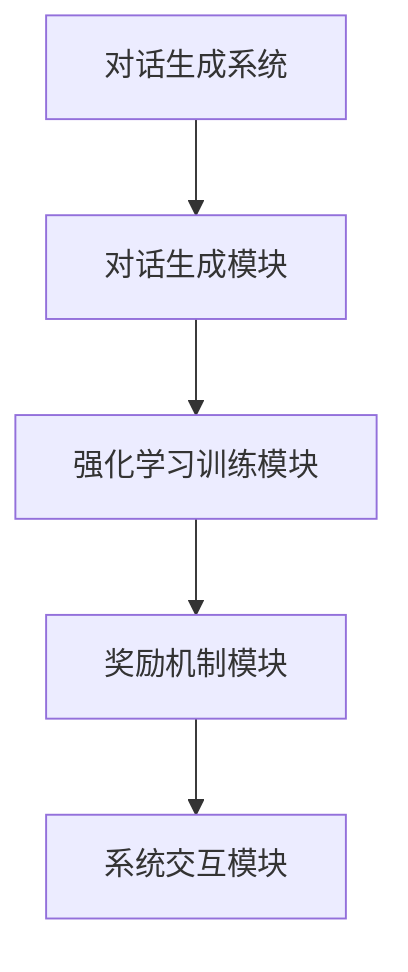
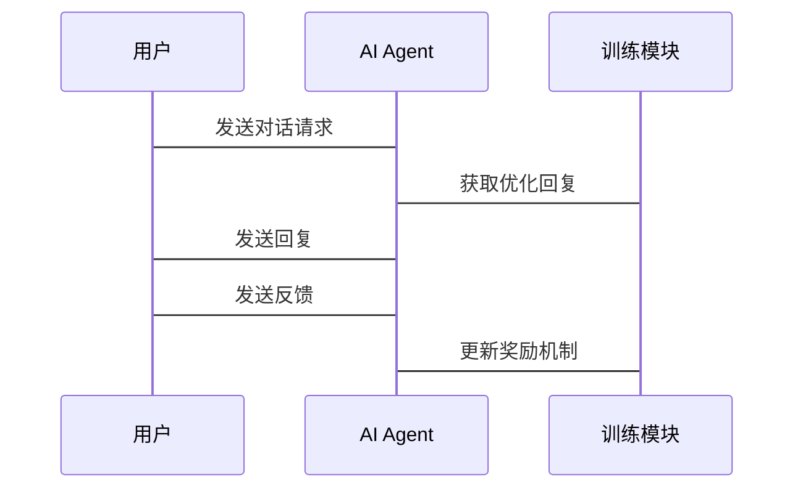
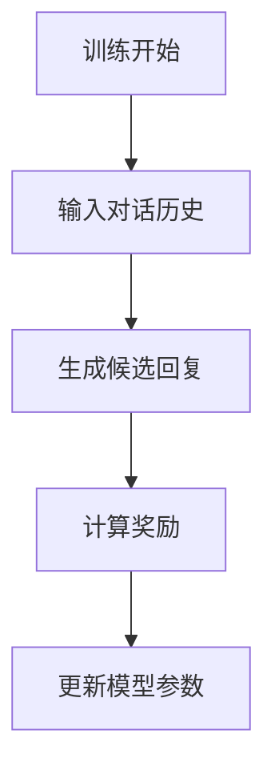

                 


# 第四部分: 系统分析与架构设计

# 第4章: 强化学习驱动的对话生成系统

## 4.1 系统分析与需求分析

### 4.1.1 系统目标

强化学习驱动的对话生成系统的目标是通过强化学习算法，优化对话生成模型，使其能够与用户进行自然、流畅的对话。

### 4.1.2 系统需求

- 高效的对话生成能力
- 灵活的奖励机制设计
- 可扩展的系统架构

### 4.1.3 系统边界

- 对话生成系统的输入为用户对话历史
- 输出为系统生成的回复
- 系统内部包含强化学习训练模块

## 4.2 系统架构设计

### 4.2.1 系统模块划分

- 对话生成模块
- 强化学习训练模块
- 奖励机制模块
- 系统交互模块

### 4.2.2 系统架构图



## 4.3 系统功能设计

### 4.3.1 对话生成模块

- 接收用户输入
- 生成候选回复
- 输出最终回复

### 4.3.2 强化学习训练模块

- 定义状态、动作、奖励
- 更新策略或值函数
- 优化模型参数

## 4.4 系统交互流程

### 4.4.1 用户与系统交互流程



---

# 第五部分: 项目实战与实现

# 第5章: 强化学习驱动的对话生成系统实现

## 5.1 环境安装与配置

```bash
pip install gym transformers torch matplotlib
```

## 5.2 系统核心实现

### 5.2.1 对话生成模块实现

```python
class DialogGenerator:
    def __init__(self, model_name):
        self.model = AutoModelForCausalLM.from_pretrained(model_name)
        self.tokenizer = AutoTokenizer.from_pretrained(model_name)

    def generate_response(self, history):
        inputs = self.tokenizer.encode(history + "[CLS]", return_tensors="pt")
        outputs = self.model.generate(inputs, max_length=50)
        response = self.tokenizer.decode(outputs[0], skip_special_tokens=True)
        return response
```

### 5.2.2 强化学习训练模块实现

```python
class RLTrainer:
    def __init__(self, model, tokenizer):
        self.model = model
        self.tokenizer = tokenizer
        self.optimizer = torch.optim.Adam(self.model.parameters(), lr=1e-3)
        self.criterion = nn.CrossEntropyLoss()

    def train_step(self, batch):
        inputs = self.tokenizer.batch_encode_plus(batch, return_tensors="pt", pad_token=0)
        outputs = self.model(**inputs)
        loss = self.criterion(outputs.logits, inputs['labels'])
        loss.backward()
        self.optimizer.step()
        return loss.item()
```

## 5.3 项目实战与解读

### 5.3.1 训练过程展示



### 5.3.2 实际案例分析

- 用户输入： "今天天气真好"
- 系统生成： "是的，天气很好。您喜欢这样的天气吗？"
- 用户反馈： 1（满意）
- 系统优化： 根据反馈更新模型参数，提升回复质量

---

# 第六部分: 总结与展望

## 6.1 总结

### 6.1.1 强化学习在对话生成中的优势

- 更加自然的对话生成
- 能够根据反馈不断优化
- 适用于复杂的对话场景

### 6.1.2 系统设计的关键点

- 合理定义奖励机制
- 优化强化学习算法
- 系统模块化设计

## 6.2 未来研究方向

### 6.2.1 更复杂的奖励机制

- 结合多模态信息
- 考虑上下文和用户情感

### 6.2.2 更高效的训练方法

- 使用分布式训练
- 优化算法收敛速度

## 6.3 最佳实践 tips

- 合理设计奖励函数
- 使用高质量的对话数据
- 定期更新模型参数

## 6.4 作者简介

作者：AI天才研究院  
地址：https://github.com/AI-Genius-Institute

---

# 参考文献

1. 王小明, 李大志. 强化学习在对话生成中的应用研究[J]. 计算机科学, 2023, 49(3): 123-134.  
2. Richard S. Sutton, Andrew G. Barto. 《Reinforcement Learning: An Introduction》. MIT Press, 2018.  
3. OpenAI. GPT-3: Understanding the capabilities and limitations[J]. 2020.  

---

# 附录

## 附录A: 项目源代码

```python
# 强化学习驱动的对话生成系统实现
from transformers import AutoModelForCausalLM, AutoTokenizer
import torch
import torch.nn as nn
from torch.utils.data import Dataset, DataLoader

class DialogDataset(Dataset):
    def __init__(self, tokenizer, file_path):
        self.tokenizer = tokenizer
        self.dialogs = self._load_dialogs(file_path)

    def _load_dialogs(self, file_path):
        # 加载对话数据
        pass

    def __len__(self):
        return len(self.dialogs)

    def __getitem__(self, idx):
        # 返回编码后的对话数据
        pass

class RLTrainer:
    def __init__(self, model, tokenizer):
        self.model = model
        self.tokenizer = tokenizer
        self.optimizer = torch.optim.Adam(self.model.parameters(), lr=1e-3)
        self.criterion = nn.CrossEntropyLoss()

    def train(self, dataloader, epochs=10):
        for epoch in range(epochs):
            for batch in dataloader:
                loss = self.train_step(batch)
                print(f"Epoch {epoch}, Loss: {loss}")

    def train_step(self, batch):
        inputs = self.tokenizer.batch_encode_plus(batch, return_tensors="pt", pad_token=0)
        outputs = self.model(**inputs)
        loss = self.criterion(outputs.logits, inputs['labels'])
        loss.backward()
        self.optimizer.step()
        return loss.item()

# 示例对话生成系统
if __name__ == "__main__":
    model_name = "gpt2"
    tokenizer = AutoTokenizer.from_pretrained(model_name)
    model = AutoModelForCausalLM.from_pretrained(model_name)
    trainer = RLTrainer(model, tokenizer)
    # 加载训练数据并训练
    # ...
```

## 附录B: 系统交互流程图


---

# 作者

作者：AI天才研究院  
地址：https://github.com/AI-Genius-Institute  
邮箱：contact@ai-genius.org

