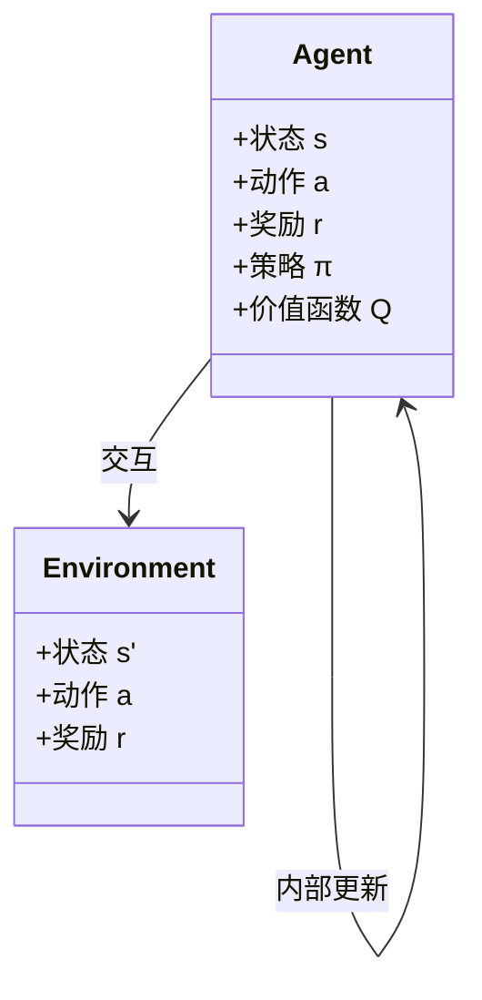
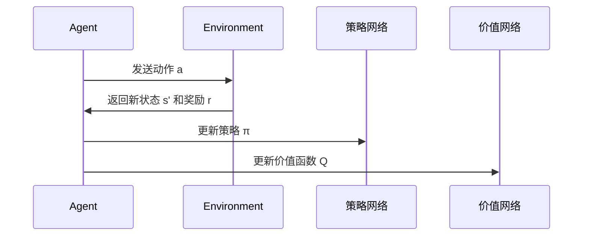

                 


# 强化学习在AI Agent开发中的应用

> 关键词：强化学习，AI Agent，马尔可夫决策过程，策略梯度，深度强化学习，Q-Learning

> 摘要：本文深入探讨了强化学习在AI Agent开发中的应用，从基本概念到核心算法，再到系统架构和项目实战，全面解析了强化学习如何推动AI Agent的发展。文章首先介绍了强化学习和AI Agent的基本概念，随后详细讲解了强化学习的核心算法，包括Q-Learning、Sarsa、REINFORCE和Actor-Critic算法。接着，分析了AI Agent的系统架构与设计，包括类图、架构图和交互序列图。最后，通过一个实际案例展示了强化学习在AI Agent开发中的应用，并总结了最佳实践和注意事项。

---

## 第一部分：强化学习与AI Agent的基本概念

### 第1章：强化学习的定义与特点

#### 1.1 强化学习的定义与特点
强化学习是一种机器学习范式，通过智能体与环境的交互，学习如何采取一系列行动来最大化累计奖励。其核心特点包括：
- **试错性**：通过与环境交互不断尝试，逐步优化策略。
- **延迟奖励**：奖励可能在多个动作后才获得，需要考虑长期利益。
- **不确定性**：环境可能具有不确定性，智能体需要在不确定中做出决策。

#### 1.2 AI Agent的基本概念
AI Agent（智能体）是能够感知环境并采取行动以实现目标的实体。AI Agent可以分为：
- **简单反射型智能体**：基于当前状态直接行动。
- **基于模型的智能体**：维护对环境的模型，用于决策。
- **实用基于目标的智能体**：基于目标进行复杂决策。

#### 1.3 强化学习在AI Agent中的应用背景
强化学习适用于AI Agent需要在动态环境中自主决策的任务，如游戏AI、机器人控制和自动驾驶。其优势在于能够处理复杂、动态和不确定的环境，通过不断试错优化策略。

---

## 第二部分：强化学习的核心算法与数学原理

### 第2章：强化学习的基本算法

#### 2.1 马尔可夫决策过程（MDP）
MDP将环境建模为状态、动作、奖励和转移概率的组合。MDP的数学模型如下：
$$ P(s' | s, a) $$
表示从状态s采取动作a后转移到状态s'的概率。

#### 2.2 策略与价值函数
- **策略**：描述智能体在每个状态下选择动作的概率分布。
- **价值函数**：衡量从当前状态开始采取某种策略的期望奖励。

#### 2.3 基于值函数的强化学习算法
- **Q-Learning算法**：通过更新Q表来学习最优策略。
$$ Q(s,a) = Q(s,a) + \alpha [r + \gamma \max Q(s',a') - Q(s,a)] $$
- **Sarsa算法**：在选择当前动作时，更新下一个动作的Q值。

#### 2.4 基于策略梯度的强化学习算法
- **REINFORCE算法**：通过梯度下降优化策略，公式为：
$$ \nabla \theta \leftarrow \alpha (r - b) \nabla \log \pi(a|s) $$
- **Actor-Critic方法**：结合价值函数和策略，通过Actor网络选择动作，Critic网络评估价值。

#### 2.5 强化学习中的数学公式
以下是Q-Learning和REINFORCE算法的数学模型示例：
$$ Q(s,a) = Q(s,a) + \alpha [r + \gamma \max Q(s',a') - Q(s,a)] $$
$$ \nabla \theta \leftarrow \alpha (r - b) \nabla \log \pi(a|s) $$

---

## 第三部分：AI Agent的系统架构与设计

### 第3章：AI Agent的系统架构

#### 3.1 AI Agent的组成
AI Agent通常由感知模块、决策模块、执行模块和学习模块组成。感知模块负责接收环境信息，决策模块基于强化学习算法做出决策，执行模块将决策转化为行动，学习模块负责更新策略和价值函数。

#### 3.2 系统功能设计
以下是AI Agent的领域模型类图：


#### 3.3 系统架构设计
以下是AI Agent的系统架构图：
```mermaid
graph TD
    A[Agent] --> E[Environment]
    A --> C[策略网络]
    A --> V[价值网络]
    C --> A: 动作选择
    V --> A: 价值评估
```

#### 3.4 接口设计与交互
以下是AI Agent与环境交互的序列图：


---

## 第四部分：项目实战与案例分析

### 第4章：强化学习在游戏AI中的应用

#### 4.1 项目背景
以经典游戏《Pong》为例，展示强化学习如何训练AI Agent掌握游戏规则。

#### 4.2 环境配置
使用OpenAI Gym库创建游戏环境，并定义智能体的观测空间和动作空间。

#### 4.3 系统核心实现
以下是Q-Learning算法的Python实现示例：
```python
import gym
import numpy as np

env = gym.make('Pong-v0')
state_space = env.observation_space.shape[0]
action_space = env.action_space.n

Q = np.zeros((state_space, action_space))
alpha = 0.1
gamma = 0.99

for episode in range(1000):
    state = env.reset()
    while True:
        action = np.argmax(Q[state])
        new_state, reward, done, _ = env.step(action)
        Q[state][action] += alpha * (reward + gamma * np.max(Q[new_state]) - Q[state][action])
        state = new_state
        if done:
            break
```

#### 4.4 案例分析
通过实验展示AI Agent在游戏中的表现，分析算法的收敛性和稳定性。

---

## 第五部分：最佳实践与总结

### 第5章：强化学习在AI Agent开发中的最佳实践

#### 5.1 算法选择
根据具体任务选择合适的算法，如Q-Learning适用于离散动作空间，Actor-Critic适用于连续动作空间。

#### 5.2 状态表示
合理设计状态表示，简化问题复杂性，同时保留关键信息。

#### 5.3 探索与利用
平衡探索与利用，避免陷入局部最优，可以采用ε-greedy策略。

#### 5.4 超参数调优
合理设置学习率α、折扣因子γ等超参数，确保算法性能。

#### 5.5 多智能体协作
在多智能体系统中，需考虑协作与竞争，采用分布式强化学习方法。

#### 5.6 案例小结
通过案例分析，总结强化学习在AI Agent开发中的成功经验与改进方向。

---

## 作者信息

作者：AI天才研究院 & 禅与计算机程序设计艺术

---

**结语**：强化学习作为AI Agent的核心技术，正在推动人工智能向更智能、更自主的方向发展。通过本文的深入分析和案例展示，希望能够为读者提供有价值的参考，帮助他们在AI Agent开发中更好地应用强化学习技术。

