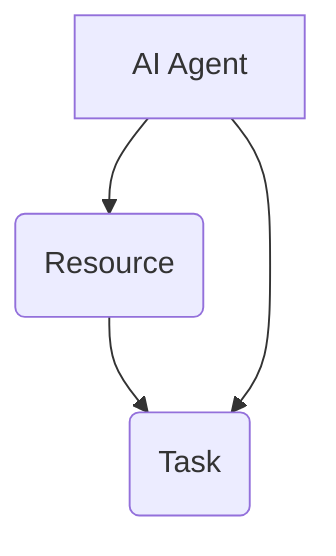
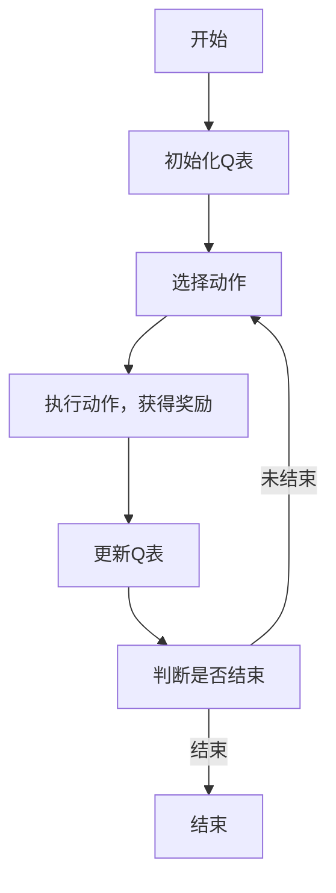
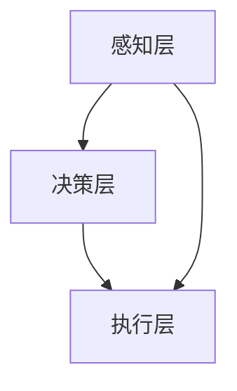
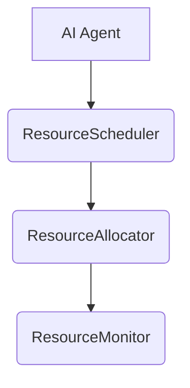

                 


# 强化学习在AI Agent资源调度中的应用

## 关键词：强化学习，AI Agent，资源调度，算法原理，系统架构，项目实战

## 摘要：  
本文深入探讨了强化学习在AI Agent资源调度中的应用，从理论基础到实际案例，系统地分析了强化学习在资源调度中的核心概念、算法原理、系统架构及项目实战。通过详细的数学公式、算法流程图、系统架构图和项目代码实现，全面解析了强化学习在资源调度中的应用过程和实际效果。本文适合对人工智能和资源调度感兴趣的读者阅读，帮助读者理解强化学习在资源调度中的重要作用和实现方法。

---

# 第一部分: 强化学习与AI Agent基础

## 第1章: 强化学习与AI Agent概述

### 1.1 强化学习的基本概念  
强化学习（Reinforcement Learning, RL）是一种机器学习范式，通过智能体与环境的交互，学习如何采取最优动作以最大化累计奖励。与监督学习和无监督学习不同，强化学习强调智能体在动态环境中的自主决策能力。  

#### 1.1.1 强化学习的定义  
强化学习是一种通过试错方法，使智能体在与环境交互的过程中学习策略，从而在长期目标下实现最优行为的算法。  

#### 1.1.2 强化学习的核心要素  
强化学习的核心要素包括：  
1. **状态（State）**：智能体所处的环境情况。  
2. **动作（Action）**：智能体在某一状态下选择的行为。  
3. **奖励（Reward）**：智能体执行动作后，环境对其行为的反馈。  
4. **策略（Policy）**：智能体选择动作的概率分布函数。  
5. **价值函数（Value Function）**：衡量某状态下策略的好坏。  

#### 1.1.3 AI Agent的基本概念  
AI Agent是一种能够感知环境并采取行动以实现目标的智能体。它可以是一个软件程序、机器人或其他智能系统。  

### 1.2 强化学习与资源调度的关系  
资源调度是指在有限资源条件下，合理分配资源以满足任务需求的过程。强化学习通过智能体与环境的交互，能够有效解决资源调度中的动态性和不确定性问题。  

#### 1.2.1 资源调度的定义与特点  
资源调度是将有限的资源（如计算资源、存储资源等）分配给多个任务，以最大化资源利用率和任务执行效率。其特点包括动态性、不确定性、多目标性等。  

#### 1.2.2 强化学习在资源调度中的优势  
强化学习在资源调度中的优势包括：  
1. 能够处理动态变化的环境。  
2. 能够在不确定性条件下做出最优决策。  
3. 能够通过试错方法找到最优策略。  

#### 1.2.3 资源调度的典型场景  
资源调度的典型场景包括：  
1. 云计算资源调度。  
2. 网络资源分配。  
3. 多智能体协作任务分配。  

### 1.3 强化学习的基本原理  
强化学习通过智能体与环境的交互，逐步优化策略以最大化累计奖励。  

#### 1.3.1 马尔可夫决策过程（MDP）  
马尔可夫决策过程是一种描述强化学习问题的数学模型，由状态空间、动作空间、奖励函数和转移概率构成。  

#### 1.3.2 状态、动作、奖励的定义  
1. **状态（State）**：环境的当前情况，如资源使用情况。  
2. **动作（Action）**：智能体的选择，如分配资源。  
3. **奖励（Reward）**：对动作的反馈，如资源利用率提升。  

#### 1.3.3 策略与价值函数  
1. **策略（Policy）**：定义智能体在某一状态下选择动作的概率分布。  
2. **价值函数（Value Function）**：衡量某状态下策略的好坏，通常表示为Q值或V值。  

### 1.4 强化学习的核心算法  
强化学习的核心算法包括Q-learning和策略梯度方法。  

#### 1.4.1 Q-learning算法  
Q-learning是一种基于值函数的强化学习算法，通过更新Q表中的值来逼近最优策略。  

#### 1.4.2 策略梯度方法  
策略梯度方法是一种基于策略的强化学习算法，通过优化策略的参数来最大化累计奖励。  

#### 1.4.3 深度强化学习（Deep RL）  
深度强化学习结合了深度学习和强化学习，通过神经网络近似值函数或策略函数。  

---

## 第2章: 强化学习的核心概念与联系  

### 2.1 强化学习的核心概念  
1. **状态空间与动作空间**：智能体所处的环境状态和可执行的动作。  
2. **奖励函数的设计**：设计合理的奖励函数是强化学习成功的关键。  
3. **策略与价值函数的关系**：策略指导动作的选择，价值函数衡量策略的好坏。  

### 2.2 强化学习与资源调度的核心要素  
1. **资源分配的公平性**：确保所有任务都能获得足够的资源。  
2. **资源使用的效率**：最大化资源利用率和任务执行效率。  
3. **调度策略的实时性**：能够快速响应环境的变化。  

### 2.3 实体关系图（ER图）  
以下是强化学习在资源调度中的实体关系图：



---

## 第3章: 强化学习算法原理  

### 3.1 算法原理概述  
1. **Q-learning算法的数学模型**  
   Q-learning算法通过更新Q表中的值来逼近最优策略，数学公式为：  
   $$ Q(s, a) = Q(s, a) + \alpha (r + \gamma \max Q(s', a') - Q(s, a)) $$  

2. **策略梯度方法的数学推导**  
   策略梯度方法通过优化策略的参数来最大化累计奖励，数学公式为：  
   $$ \nabla \theta J(\theta) = \mathbb{E}[ \nabla \log \pi(a|s) Q(s, a) ] $$  

3. **深度强化学习的网络结构**  
   深度强化学习通过神经网络近似值函数或策略函数，网络结构包括输入层、隐藏层和输出层。  

### 3.2 算法流程图  
以下是Q-learning算法的流程图：



### 3.3 算法实现代码  
以下是Q-learning算法的Python实现代码：  

```python
import numpy as np

class QLearning:
    def __init__(self, state_space, action_space, alpha=0.1, gamma=0.9):
        self.state_space = state_space
        self.action_space = action_space
        self.Q = np.zeros((state_space, action_space))
        self.alpha = alpha
        self.gamma = gamma

    def choose_action(self, state):
        return np.argmax(self.Q[state])

    def update_Q(self, state, action, reward, next_state):
        self.Q[state, action] += self.alpha * (reward + self.gamma * np.max(self.Q[next_state]) - self.Q[state, action])
```

---

## 第4章: 资源调度的系统分析与架构设计  

### 4.1 系统分析  
1. **资源调度的场景分析**：分析资源调度的典型场景，如云计算资源调度。  
2. **系统功能需求**：明确系统的功能需求，如资源分配、任务调度等。  
3. **系统性能指标**：定义系统的性能指标，如资源利用率、响应时间等。  

### 4.2 系统架构设计  
1. **分层架构设计**：将系统划分为感知层、决策层和执行层。  
2. **分布式架构设计**：设计分布式架构，实现多智能体协作。  

### 4.3 系统架构图  
以下是资源调度系统的架构图：



---

## 第5章: 项目实战  

### 5.1 环境配置  
1. **安装Python和相关库**：如numpy、pandas、matplotlib等。  
2. **配置强化学习环境**：如OpenAI Gym或其他仿真环境。  

### 5.2 系统核心实现  
以下是资源调度系统的Python实现代码：  

```python
import numpy as np

class ResourceScheduler:
    def __init__(self, num_resources, num_tasks):
        self.num_resources = num_resources
        self.num_tasks = num_tasks
        self.resource_usage = np.zeros(num_resources)

    def get_state(self):
        return self.resource_usage

    def allocate_resource(self, task_idx, resource_idx):
        self.resource_usage[resource_idx] += 1

    def get_reward(self):
        return np.sum(self.resource_usage)
```

### 5.3 系统交互图  
以下是资源调度系统的交互图：



---

## 第6章: 最佳实践与小结  

### 6.1 最佳实践  
1. **奖励函数的设计**：确保奖励函数能够有效引导智能体的行为。  
2. **算法的调参**：合理调整学习率和折扣因子等参数。  
3. **系统的实时性**：确保系统能够快速响应环境的变化。  

### 6.2 小结  
本文深入探讨了强化学习在AI Agent资源调度中的应用，从理论基础到实际案例，全面解析了强化学习在资源调度中的实现过程和实际效果。通过本文的学习，读者可以掌握强化学习在资源调度中的核心概念和算法实现方法。  

### 6.3 注意事项  
1. 强化学习的训练过程可能较长，需要耐心和时间。  
2. 系统设计时需要考虑多智能体协作和动态环境的挑战。  
3. 实际应用中需要结合具体场景进行调整和优化。  

### 6.4 拓展阅读  
1. 《Reinforcement Learning: Theory and Algorithms》  
2. 《Multi-Agent Systems: Algorithm and Applications》  

---

作者：AI天才研究院/AI Genius Institute & 禅与计算机程序设计艺术 /Zen And The Art of Computer Programming

