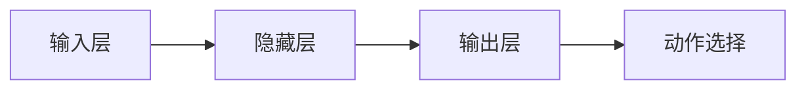
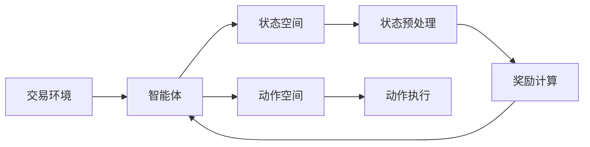

                 


# 强化学习在算法交易中的实时优化

## 关键词：
- 强化学习
- 算法交易
- 实时优化
- Q-learning
- DQN
- 策略梯度
- 系统架构

## 摘要：
本文深入探讨强化学习在算法交易中的应用，特别是实时优化方面。通过详细分析强化学习的核心算法、数学模型及系统架构，结合实际项目案例，展示如何利用强化学习优化交易策略。文章内容涵盖从基础概念到高级主题，提供全面的技术指导和实践方案。

---

## 第二章：强化学习核心算法

### 2.1 Q-learning算法

#### 2.1.1 Q-learning的基本原理

Q-learning是一种经典的强化学习算法，通过学习状态-动作值函数（Q值）来优化决策。其核心思想是：智能体通过与环境交互，更新Q值以最大化累积奖励。

**数学公式：**
$$ Q(s, a) = Q(s, a) + \alpha (r + \gamma \max Q(s', a') - Q(s, a)) $$

其中：
- \( s \)：当前状态
- \( a \)：当前动作
- \( r \)：获得的奖励
- \( s' \)：下一个状态
- \( \alpha \)：学习率
- \( \gamma \)：折扣因子

#### 2.1.2 Q-learning在交易中的应用

在算法交易中，Q-learning可用于学习最优交易策略。例如，智能体可以根据市场状态（如价格走势、成交量）选择买入、卖出或持有动作。

**示例代码：**

```python
import numpy as np

class QLearning:
    def __init__(self, state_size, action_size, alpha=0.1, gamma=0.9):
        self.q_table = np.zeros((state_size, action_size))
        self.alpha = alpha
        self.gamma = gamma

    def get_action(self, state):
        return np.argmax(self.q_table[state])

    def update_q(self, state, action, reward, next_state):
        current_q = self.q_table[state, action]
        next_max_q = np.max(self.q_table[next_state])
        self.q_table[state, action] = current_q + self.alpha * (reward + self.gamma * next_max_q - current_q)
```

---

### 2.2 Deep Q-Networks（DQN）

#### 2.2.1 DQN的网络结构

DQN通过深度神经网络近似Q值函数，解决高维状态空间问题。网络结构通常包括输入层、隐藏层和输出层。

**网络结构示意图：**



#### 2.2.2 DQN的损失函数

DQN使用均方误差作为损失函数，优化网络参数以最小化预测与目标值的差异。

**数学公式：**
$$ \mathcal{L} = \mathbb{E}[(r + \gamma Q(s', a') - Q(s, a))^2] $$

#### 2.2.3 DQN在实时优化中的应用

DQN可处理实时交易中的非平稳环境，通过经验回放和目标网络提高稳定性。

**代码示例：**

```python
import torch
import torch.nn as nn

class DQN(nn.Module):
    def __init__(self, input_dim, hidden_dim, output_dim):
        super(DQN, self).__init__()
        self.fc1 = nn.Linear(input_dim, hidden_dim)
        self.fc2 = nn.Linear(hidden_dim, output_dim)
    
    def forward(self, x):
        x = torch.relu(self.fc1(x))
        x = self.fc2(x)
        return x
```

---

## 第三章：策略梯度方法

### 3.1 REINFORCE算法

REINFORCE基于策略直接优化，通过梯度上升最大化累积奖励。

**数学公式：**
$$ \nabla \theta \log \pi(a|s) \cdot Q(s, a) $$

### 3.2 Proximal Policy Optimization (PPO)

PPO通过限制策略更新幅度，确保稳定收敛。

**代码示例：**

```python
import torch
import torch.optim as optim

class PPO:
    def __init__(self, policy, optimizer, clip_range=0.2):
        self.policy = policy
        self.optimizer = optimizer
        self.clip_range = clip_range

    def update(self, states, actions, rewards):
        old_policy = self.policy(states).detach()
        loss = -torch.mean(torch.log(old_policy) * rewards) + 0.5 * torch.mean(old_policy.pow(2))
        self.optimizer.zero_grad()
        loss.backward()
        self.optimizer.step()
```

---

## 第四章：系统架构设计

### 4.1 系统架构图



---

## 第五章：项目实战

### 5.1 环境搭建

#### 5.1.1 安装依赖

```bash
pip install numpy torch matplotlib
```

#### 5.1.2 数据准备

使用历史价格数据构建交易环境，生成状态和奖励。

### 5.2 核心实现

#### 5.2.1 训练过程

```python
def train():
    agent = DQN(input_dim, hidden_dim, output_dim)
    optimizer = optim.Adam(agent.parameters(), lr=0.001)
    
    for epoch in range(num_epochs):
        state = get_state()
        action = agent.get_action(state)
        next_state = take_action(state, action)
        reward = compute_reward(state, action, next_state)
        agent.update(state, action, reward, next_state)
```

#### 5.2.2 部署与测试

在实时环境中部署训练好的模型，监控表现并持续优化。

---

## 第六章：高级主题与扩展

### 6.1 多资产交易策略

扩展至多资产配置，优化全局风险收益比。

### 6.2 分布式训练

利用分布式计算加速训练过程，提升模型收敛速度。

---

## 附录

### A. 数据源与工具栈

- 数据源：Yahoo Finance API
- 工具栈：Python, PyTorch, Pandas

### B. 参考文献

- Mnih, V., et al. "Human-level control through deep reinforcement learning."

---

## 作者：AI天才研究院/AI Genius Institute & 禅与计算机程序设计艺术 /Zen And The Art of Computer Programming

---

通过以上结构，文章系统地介绍了强化学习在算法交易中的应用，从基础算法到高级主题，结合实际案例，为读者提供全面的技术指导。

