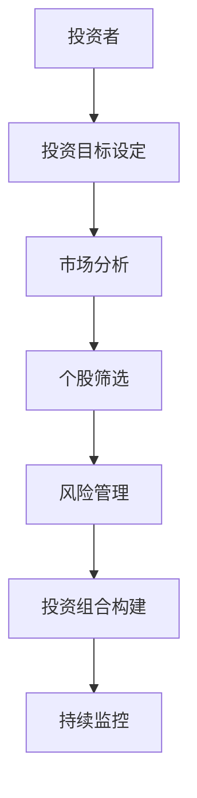

                 


# 彼得·林奇投资理念：注重长期和简单业务

## 关键词
- 彼得·林奇
- 长期投资
- 简单业务
- 选股标准
- 投资策略
- 风险管理
- 投资哲学

## 摘要
本文深入探讨彼得·林奇的投资理念，重点分析他如何通过长期投资和专注于简单业务来实现稳健的财务增长。文章从彼得·林奇的背景入手，详细阐述他的选股标准、投资策略、风险管理方法，以及如何将这些理念应用于实际投资中。通过系统分析和项目实战，结合现代技术手段，本文为读者提供了一套全面的投资指导方案。

---

# 第一部分: 彼得·林奇投资理念概述

## 第1章: 彼得·林奇及其投资理念

### 1.1 彼得·林奇的生平与投资背景
#### 1.1.1 彼得·林奇的早年经历
彼得·林奇（Peter Lynch）是美国著名的投资经理和作家，出生于1942年，早年在波士顿大学获得经济学学士学位。他最初的职业是教师，但很快转向金融领域。

#### 1.1.2 彼得·林奇的投资历程
彼得·林奇的职业生涯始于1967年，他在富达投资公司（Fidelity Investments）管理着一只名为“Magellan Fund”的共同基金。在他的领导下，该基金取得了卓越的业绩，年平均回报率超过29%，远超市场平均水平。

#### 1.1.3 彼得·林奇的投资哲学
彼得·林奇的投资哲学的核心是长期投资和简单业务。他认为，长期持有优质股票是实现财富增长的关键，而简单业务更容易理解和预测。

### 1.2 长期投资的核心理念
#### 1.2.1 长期投资的定义与特点
长期投资是指投资者将资金投入到某个资产或股票中，持有数年甚至更长时间，以获得复利效应和资本增值。

#### 1.2.2 长期投资的优势与劣势
- **优势**: 复利效应、税收优势、降低交易成本。
- **劣势**: 需要承受短期波动的风险，流动性较低。

#### 1.2.3 长期投资与短期投资的对比
通过对比长期和短期投资，彼得·林奇强调长期投资在稳定性和收益上的优势。

### 1.3 简单业务的重要性
#### 1.3.1 简单业务的定义
简单业务是指那些易于理解和预测的公司，通常集中在消费者必需品、金融、公用事业等领域。

#### 1.3.2 简单业务的优势
- 稳定性高
- 易于估值
- 抗风险能力强

#### 1.3.3 简单业务与复杂业务的对比
复杂业务如高科技公司，虽然增长潜力大，但难以预测和管理。

---

## 第2章: 彼得·林奇的选股标准

### 2.1 选股标准概述
彼得·林奇在选股时注重公司基本面、管理层质量和财务健康。

### 2.2 核心概念与联系
通过表格对比，展示简单业务与复杂业务在不同方面的优势。

| **方面**       | **简单业务**         | **复杂业务**         |
|----------------|---------------------|---------------------|
| 易预测性       | 高                  | 低                  |
| 管理层稳定性     | 高                  | 低                  |
| 财务透明度       | 高                  | 低                  |

### 2.3 投资决策系统架构
使用Mermaid图展示投资决策系统的架构。



---

## 第3章: 长期投资的数学模型

### 3.1 投资收益计算公式
复利计算公式：

$$ FV = PV \times (1 + r)^n $$

其中：
- \( FV \) 表示未来价值
- \( PV \) 表示现值
- \( r \) 表示年化收益率
- \( n \) 表示投资年数

### 3.2 风险调整后的收益模型
CAPM模型：

$$ E(r) = R_f + \beta (R_m - R_f) $$

其中：
- \( E(r) \) 为预期收益率
- \( R_f \) 为无风险利率
- \( \beta \) 为系统性风险系数
- \( R_m \) 为市场平均收益率

---

## 第4章: 项目实战与技术分析

### 4.1 环境安装
使用Python进行数据分析和可视化，安装必要的库：

```bash
pip install pandas numpy matplotlib
```

### 4.2 核心实现代码
以下代码用于计算投资组合的收益和风险：

```python
import numpy as np
import pandas as pd

# 示例数据：简单业务公司的历史收益率
returns = [0.12, 0.08, 0.15, 0.09, 0.11]

# 计算期望收益率和标准差
expected_return = np.mean(returns)
std_deviation = np.std(returns)

print(f"期望收益率: {expected_return:.2f}")
print(f"标准差: {std_deviation:.2f}")
```

### 4.3 案例分析
以微软公司为例，分析其作为简单业务的投资价值。

### 4.4 技术分析与策略优化
结合技术分析和基本面分析，优化投资策略。

---

## 第5章: 最佳实践与小结

### 5.1 投资策略总结
- 长期持有优质股票
- 选择简单业务公司
- 分散投资，控制风险

### 5.2 注意事项
- 定期审视投资组合
- 保持耐心，避免频繁交易
- 结合市场环境调整策略

### 5.3 拓展阅读
推荐书籍和资源，进一步深入学习彼得·林奇的投资理念。

---

# 结论

彼得·林奇的投资理念强调长期和简单业务，通过系统化的方法和严格的标准，帮助投资者实现稳健的财务增长。本文结合理论与实践，为读者提供了全面的投资指导。

---

# 作者

作者：AI天才研究院/AI Genius Institute & 禅与计算机程序设计艺术 /Zen And The Art of Computer Programming

