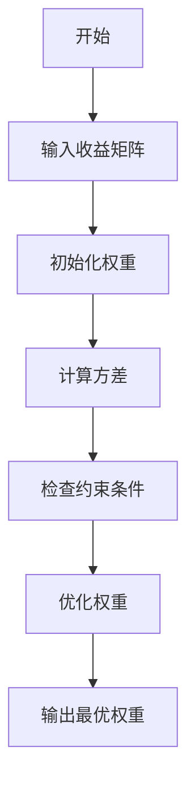
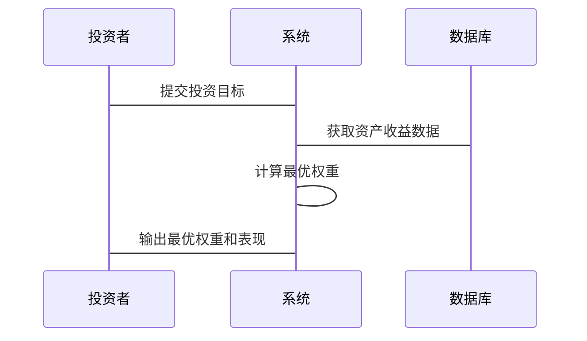

                 


# 彼得·林奇的多元化投资组合构建

> 关键词：投资组合，多元化，彼得·林奇，资产配置，风险分散，现代投资组合理论（MPT）

> 摘要：本文深入分析了彼得·林奇的多元化投资组合构建方法，从理论基础到实际应用，详细探讨了投资组合构建的核心概念、算法原理、系统架构及项目实战。通过本文，读者将能够掌握如何运用技术手段优化投资组合，降低风险，实现收益最大化。

---

## 第一部分: 投资组合构建的背景与基础

### 第1章: 投资组合构建的基本概念

#### 1.1 投资组合的基本概念
投资组合是指将一定资金按照一定比例分配到不同资产类别（如股票、债券、现金等）上的配置方式。其核心目标是通过资产多样化来降低风险，同时追求收益的最大化。

- **投资组合的定义**：将资金分散投资于不同资产或资产类别，以降低特定资产的风险。
- **投资组合的核心要素**：
  1. 资产配置：决定每种资产在组合中的权重。
  2. 风险与收益：量化投资组合的风险和预期收益。
  3. 再平衡：定期调整资产权重以维持目标配置。
- **投资组合的分类与特点**：
  - 按风险：保守型、稳健型、激进型。
  - 按期限：短期、中期、长期。
  - 按策略：价值型、成长型、指数型。

#### 1.2 多元化投资的重要性
多元化是投资组合构建的核心原则，通过将资金分散投资于不同的资产或资产类别，投资者可以降低特定资产的风险。

- **多元化与风险分散**：
  - 单一资产的风险较高，例如股票市场的波动。
  - 通过分散投资，投资者可以降低非系统性风险（特定资产的风险）。
- **资产配置的重要性**：
  - 资产配置决定了投资组合的风险和收益。
  - 不同资产类别在不同经济周期下的表现不同。

#### 1.3 彼得·林奇的投资理念
彼得·林奇是著名的投资专家，他的多元化投资策略强调长期投资和资产分散化。

- **彼得·林奇的背景介绍**：
  - 曾任富达投资集团麦哲伦基金的经理，创造了卓越的投资业绩。
  - 以选股能力和长期投资策略闻名。
- **林奇的多元化投资策略**：
  - 通过分散投资于不同行业和资产类别，降低风险。
  - 长期持有优质资产，避免频繁交易。
- **林奇投资哲学的核心思想**：
  - 避免盲目跟风，注重基本面分析。
  - 选择具有长期增长潜力的资产。

### 第2章: 投资组合构建的核心概念与联系

#### 2.1 投资组合的核心概念原理
- **资产配置的数学模型**：
  - 投资组合的收益由各资产的权重和收益组成。
  - 投资组合的风险由各资产的风险和相关性决定。
- **风险与收益的平衡**：
  - 高收益通常伴随着高风险。
  - 通过资产配置在收益与风险之间找到平衡点。
- **现代投资组合理论（MPT）的概述**：
  - MPT由哈里·马科维茨提出，强调通过分散投资降低风险。
  - 通过优化投资组合的收益-风险比，找到最优配置。

#### 2.2 核心概念属性特征对比
- **不同资产类别对比表格**：

| 资产类别 | 风险 | 收益 | 流动性 |
|----------|------|------|--------|
| 股票     | 高   | 高   | 低     |
| 债券     | 中   | 中   | 高     |
| 现金     | 低   | 低   | 高     |
| 房地产   | 中高 | 中高 | 低     |

- **投资组合风险与收益对比分析**：
  - 风险和收益通常呈正相关关系。
  - 通过资产配置，可以在不同风险水平下选择最优收益。

- **资产配置与投资目标的关系**：
  - 投资目标决定了资产配置的结构。
  - 长期目标通常需要更高的风险承受能力。

#### 2.3 投资组合的ER实体关系图


---

## 第二部分: 现代投资组合理论（MPT）的算法原理

### 第3章: 现代投资组合理论（MPT）的算法原理

#### 3.1 MPT的核心算法
MPT的核心思想是通过优化投资组合的收益-风险比，找到最优配置。

- **优化目标**：最大化收益，同时最小化风险。
- **优化方法**：使用均值-方差优化模型。

#### 3.2 投资组合优化的数学模型
- **目标函数**：最小化投资组合的风险（方差）。
  $$ \min_w \sigma^2(w) $$
- **约束条件**：
  - 投资权重之和为1：$$ w^T \mathbf{1} = 1 $$
  - 投资组合的收益等于目标收益：$$ w^T \mathbf{R} = \mathbf{r} $$
- **变量**：
  - \( w \)：投资权重向量。
  - \( \sigma^2(w) \)：投资组合的风险（方差）。
  - \( \mathbf{R} \)：资产收益矩阵。
  - \( \mathbf{r} \)：目标收益向量。

#### 3.3 投资组合优化的Python实现
以下是使用Python实现投资组合优化的代码示例：

```python
import numpy as np
import pandas as pd
from scipy.optimize import minimize

# 示例数据：资产收益矩阵
R = np.array([[0.1, 0.15, 0.05],
              [0.15, 0.2, 0.08],
              [0.05, 0.08, 0.03]])

# 定义目标函数：最小化方差
def objective(w):
    return (w.dot(R).dot(w.T))  # 方差 = w^T R w

# 约束条件
def constraint(w):
    return np.sum(w) - 1

# 初始猜测：等权重配置
w_initial = np.array([1/3, 1/3, 1/3])

# 使用SciPy求解
result = minimize(objective, w_initial, method='SLSQP')

# 输出结果
print("最优权重：", result.x)
print("最优方差：", result.fun)
```

#### 3.4 算法原理的图形化解释
以下使用Mermaid绘制算法流程图：



---

## 第三部分: 投资组合构建的系统架构与设计

### 第4章: 投资组合构建的系统架构

#### 4.1 问题场景介绍
- **目标**：构建一个多元化的投资组合，优化收益-风险比。
- **输入**：历史资产收益数据。
- **输出**：最优资产配置权重。

#### 4.2 系统功能设计
- **领域模型**：
  ```mermaid
  classDiagram
      class 投资者 {
          资金; 目标收益;
      }
      class 资产 {
          名称; 收益率;
      }
      class 投资组合 {
          权重; 风险; 收益;
      }
      投资者 --> 资产
      资产 --> 投资组合
  ```

- **系统架构设计**：
  ```mermaid
  graph TD
      UI --> Controller
      Controller --> Service
      Service --> Repository
      Repository --> Database
  ```

- **系统接口设计**：
  - 输入接口：资产收益数据。
  - 输出接口：最优权重和投资组合表现。

#### 4.3 系统交互设计


---

## 第四部分: 投资组合构建的项目实战

### 第5章: 投资组合构建的项目实战

#### 5.1 环境安装与配置
- **工具**：
  - Python 3.8+
  - NumPy、Pandas、SciPy
  - Matplotlib 或 Seaborn（可选）
- **安装命令**：
  ```bash
  pip install numpy pandas scipy matplotlib
  ```

#### 5.2 核心代码实现
以下是完整的投资组合优化代码：

```python
import numpy as np
import pandas as pd
from scipy.optimize import minimize

def portfolio_optimization(R, target_return=0.1):
    n = R.shape[1]
    # 初始化权重向量
    w_initial = np.array([1/n]*n)
    # 定义目标函数：最小化方差
    def objective(w):
        return (w.dot(R).dot(w.T))  # 方差 = w^T R w
    # 定义约束条件
    def constraint(w):
        return np.sum(w) - 1
    # 求解优化问题
    result = minimize(objective, w_initial, method='SLSQP',
                      constraints={'type': 'eq', 'fun': constraint})
    # 返回结果
    return result.x, result.fun

# 示例数据：资产收益矩阵
R = np.array([[0.1, 0.15, 0.05],
              [0.15, 0.2, 0.08],
              [0.05, 0.08, 0.03]])

# 调用优化函数
weights, variance = portfolio_optimization(R)
print("最优权重：", weights)
print("最优方差：", variance)
```

#### 5.3 应用与分析
- **案例分析**：
  - 假设投资者有3种资产，目标收益为10%。
  - 通过优化，得到最优权重分配。
- **结果解读**：
  - 最优权重表示每种资产在组合中的配置比例。
  - 最小方差表示在目标收益下，风险最低的组合。

#### 5.4 项目小结
通过本项目，读者可以掌握如何使用Python优化投资组合，理解MPT的核心思想，并能够在实际中应用这些方法。

---

## 第五部分: 最佳实践与小结

### 第6章: 最佳实践与小结

#### 6.1 小结
- **核心要点回顾**：
  - 投资组合构建的基本概念。
  - 多元化投资的重要性。
  - 现代投资组合理论（MPT）的算法原理。
  - 系统架构与项目实战。

#### 6.2 注意事项
- **风险管理**：
  - 优化模型仅是参考，实际投资需考虑市场变化。
  - 需定期调整投资组合，以适应市场变化。
- **数据选择**：
  - 数据的质量和时间跨度直接影响结果。
  - 建议使用历史数据和预期收益。

#### 6.3 拓展阅读
- **推荐阅读书籍**：
  - 《投资学》——加尔曼·西蒙斯
  - 《投资组合管理》——查尔斯·埃勒特
- **在线资源**：
  - QuantStack Academy
  - Coursera上的投资组合优化课程

---

## 作者：AI天才研究院/AI Genius Institute & 禅与计算机程序设计艺术 /Zen And The Art of Computer Programming

---

通过本文的详细分析，读者可以系统地理解彼得·林奇的多元化投资组合构建方法，并能够将其应用于实际投资中。希望本文能为投资者和技术爱好者提供有价值的见解和指导。

