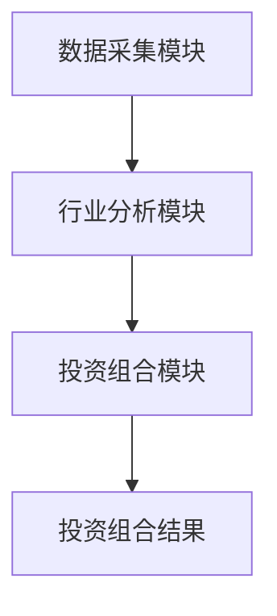
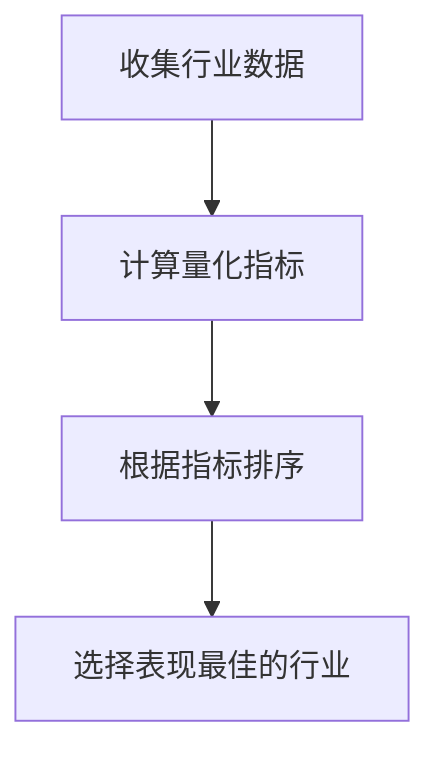
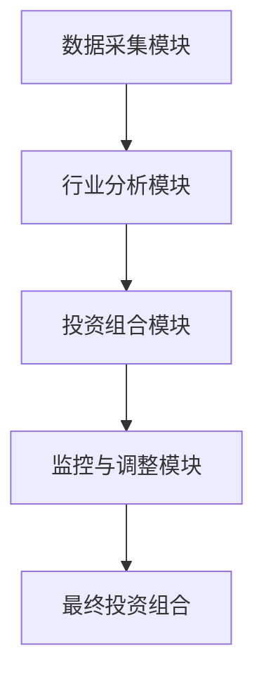

                 

# 彼得·林奇的行业轮动投资策略

> 关键词：行业轮动、投资策略、彼得·林奇、经济周期、量化投资、投资组合

> 摘要：本文深入分析了彼得·林奇的行业轮动投资策略，探讨了其背后的理论基础、核心概念、量化筛选方法以及系统架构设计。通过实际案例分析和数学模型的构建，详细阐述了如何在实际投资中应用这一策略，并总结了最佳实践和注意事项。

---

## 第一部分: 行业轮动投资策略背景与基础

### 第1章: 行业轮动投资策略概述

#### 1.1 行业轮动的基本概念

##### 1.1.1 行业轮动的定义
行业轮动（Industry Rotation）是一种投资策略，指根据经济周期的变化，选择表现优于市场平均水平的行业进行投资。其核心在于通过行业间的轮动，捕捉不同经济阶段下的投资机会。

##### 1.1.2 行业轮动的核心要素
- **经济周期**：行业轮动的核心驱动力是经济周期的变化。
- **行业选择**：根据当前经济周期阶段，选择表现最佳的行业。
- **投资组合**：通过动态调整行业权重，构建最优投资组合。

##### 1.1.3 行业轮动的背景与现状
行业轮动策略起源于对经济周期的研究，彼得·林奇是该领域的代表人物之一。随着量化投资的兴起，行业轮动策略逐渐从定性分析转向定量分析。

#### 1.2 彼得·林奇的投资理念

##### 1.2.1 彼得·林奇的个人简介
彼得·林奇（Peter Lynch）是美国著名投资经理人，曾任富达麦哲伦基金的经理。他以出色的长期投资业绩闻名，强调长期投资和基本面分析。

##### 1.2.2 林奇的投资哲学
林奇主张投资那些容易被忽视的小盘股，并长期持有。他认为，市场短期是投票器，长期才是称重机。

##### 1.2.3 林奇对行业轮动策略的贡献
林奇将行业轮动策略与基本面分析相结合，提出在不同经济周期下选择不同行业的投资理念。

#### 1.3 行业轮动的理论基础

##### 1.3.1 经济周期与行业轮动的关系
经济周期分为复苏、过热、滞胀和衰退四个阶段，不同阶段下表现最佳的行业不同。

##### 1.3.2 行业轮动的驱动因素
- **宏观经济指标**：GDP增长率、利率、通胀率等。
- **行业特性**：不同行业的盈利周期与经济周期相关。
- **市场情绪**：投资者情绪影响行业轮动。

##### 1.3.3 行业轮动的市场环境分析
在不同的市场环境下，行业轮动的策略需要灵活调整。例如，在低利率环境下，周期性行业表现较好；在高通胀环境下，防御性行业表现较好。

---

## 第二部分: 行业轮动策略的核心概念与联系

### 第2章: 行业轮动策略的核心概念

#### 2.1 行业轮动的原理

##### 2.1.1 经济周期对行业轮动的影响
- **复苏阶段**：原材料、工业品等行业表现较好。
- **过热阶段**：金融、房地产等行业表现较好。
- **滞胀阶段**：防御性行业（如公用事业、医疗保健）表现较好。
- **衰退阶段**：消费品、必需品等行业表现较好。

##### 2.1.2 不同经济周期下的行业表现
通过对比不同经济周期下的行业表现，可以发现行业轮动的规律。

##### 2.1.3 行业轮动的核心策略
- **行业筛选**：根据当前经济周期阶段，选择表现最佳的行业。
- **动态调整**：定期跟踪经济指标，动态调整行业配置。

#### 2.2 行业轮动的核心概念原理

##### 2.2.1 行业轮动的逻辑框架
行业轮动的逻辑基于经济周期和行业特性的相互作用。

##### 2.2.2 行业轮动的数学模型
- **行业轮动模型**：根据宏观经济指标，构建行业轮动的权重分配模型。

##### 2.2.3 行业轮动的对比表格
以下表格对比了不同经济周期阶段下，表现较好的行业：

| 经济周期阶段 | 表现较好的行业         |
|--------------|------------------------|
| 复苏阶段     | 原材料、工业品         |
| 过热阶段     | 金融、房地产           |
| 滞胀阶段     | 公用事业、医疗保健     |
| 衰退阶段     | 必需品、消费品         |

#### 2.3 行业轮动的系统架构

##### 2.3.1 系统功能设计
- **数据采集模块**：采集宏观经济指标、行业数据等。
- **行业分析模块**：分析行业表现，生成行业轮动策略。
- **投资组合模块**：根据分析结果，构建投资组合。

##### 2.3.2 系统架构设计
以下为系统架构的Mermaid图：

---

## 第三部分: 行业轮动策略的量化筛选与模型构建

### 第3章: 量化筛选与算法实现

#### 3.1 行业轮动的量化筛选方法

##### 3.1.1 量化筛选的逻辑
- **指标筛选**：根据量化指标（如市盈率、ROE）筛选行业。
- **趋势分析**：根据行业价格走势，判断行业是否进入上升周期。

##### 3.1.2 筛选算法流程
- 收集行业数据。
- 计算量化指标。
- 根据指标排序，选择表现最佳的行业。

##### 3.1.3 筛选流程图
以下为筛选流程的Mermaid图：

#### 3.2 行业轮动的数学模型

##### 3.2.1 行为金融学模型
- **CAPM模型**：用于评估行业的风险和收益。

##### 3.2.2 回归分析
- 通过回归分析，发现行业表现与宏观经济指标之间的关系。

##### 3.2.3 行为金融学公式
$$ E(R_i) = R_f + \beta_i (R_m - R_f) $$

其中，\( E(R_i) \) 是行业 \( i \) 的预期收益，\( R_f \) 是无风险利率，\( \beta_i \) 是行业 \( i \) 的贝塔系数，\( R_m \) 是市场预期收益。

---

## 第四部分: 行业轮动策略的系统架构与投资流程

### 第4章: 系统架构与投资流程

#### 4.1 行业轮动的系统架构

##### 4.1.1 系统功能模块
- **数据采集**：采集宏观经济数据、行业数据等。
- **行业分析**：分析行业表现，生成投资策略。
- **投资组合**：根据分析结果，构建投资组合。
- **监控与调整**：实时监控市场变化，动态调整投资组合。

##### 4.1.2 系统架构设计
以下为系统架构的Mermaid图：

#### 4.2 投资流程与实战案例

##### 4.2.1 投资流程
1. 数据采集：收集宏观经济指标和行业数据。
2. 行业分析：分析行业表现，生成投资策略。
3. 投资组合：根据分析结果，构建投资组合。
4. 监控与调整：实时监控市场变化，动态调整投资组合。

##### 4.2.2 实战案例分析
假设当前经济处于复苏阶段，行业轮动策略建议超配原材料行业，低配防御性行业。

---

## 第五部分: 行业轮动策略的实战应用与总结

### 第5章: 实战案例与总结

#### 5.1 项目实战

##### 5.1.1 市场分析
分析当前经济周期阶段，判断行业轮动的方向。

##### 5.1.2 行业筛选
根据量化指标，筛选出表现最佳的行业。

##### 5.1.3 投资组合构建
根据行业筛选结果，构建投资组合。

##### 5.1.4 投资组合监控
实时监控市场变化，动态调整投资组合。

#### 5.2 总结与最佳实践

##### 5.2.1 总结
行业轮动策略是一种有效的投资策略，但需要结合宏观经济分析和行业基本面分析。

##### 5.2.2 投资建议
- 定期调整投资组合。
- 结合量化指标和基本面分析。
- 风险控制是关键。

##### 5.2.3 注意事项
- 行业轮动需要实时跟踪市场变化。
- 风险控制是投资成功的关键。
- 行业轮动策略需要结合宏观经济分析。

##### 5.2.4 拓展阅读
建议阅读彼得·林奇的著作《彼得·林奇的成功投资》。

---

## 第六部分: 行业轮动策略的未来展望

### 第6章: 未来展望

#### 6.1 人工智能与行业轮动
随着人工智能技术的发展，行业轮动策略将更加智能化和自动化。

#### 6.2 量化投资的未来
量化投资将更加依赖于大数据和机器学习技术。

#### 6.3 行业轮动的未来发展
行业轮动策略将更加精准和高效，成为投资领域的重要工具。

---

## 作者：AI天才研究院/AI Genius Institute & 禅与计算机程序设计艺术 /Zen And The Art of Computer Programming

