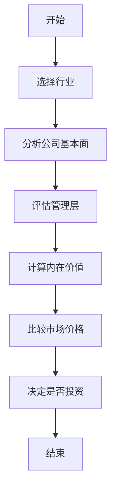
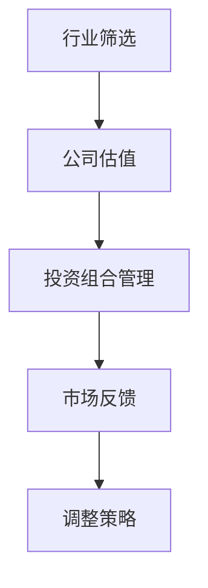

                 


# 彼得林奇与价值投资的关系

> 关键词：彼得林奇、价值投资、投资策略、选股模型、内在价值

> 摘要：本文深入探讨了彼得林奇的投资理念及其与价值投资的关系，分析了彼得林奇的核心策略，包括他的选股标准、投资哲学以及如何将价值投资原则应用于实际操作。通过详细解析，揭示了彼得林奇如何将价值投资的理念系统化，并为投资者提供了实用的策略和工具。

---

# {{此处是文章标题}}

> 关键词：{{此处列出文章的5-7个核心关键词}}

> 摘要：{{此处给出文章的核心内容和主题思想}}

---

### 作者：AI天才研究院/AI Genius Institute & 禅与计算机程序设计艺术 /Zen And The Art of Computer Programming

---

# 第一部分：彼得林奇与价值投资的关系概述

## 第1章：彼得林奇与价值投资的背景介绍

### 1.1 彼得林奇的生平与投资理念

#### 1.1.1 彼得林奇的早期经历

彼得·林奇（Peter Lynch）是美国著名的投资经理，以其在富达投资管理公司（Fidelity Management）的卓越表现而闻名。他在1977年至2000年期间管理的麦哲伦基金（Magellan Fund）取得了非凡的业绩，年平均回报率超过29%，远超市场平均水平。林奇的投资风格以基本面分析和长期持有策略著称。

#### 1.1.2 彼得林奇的投资风格

彼得林奇的投资风格可以总结为以下几点：

1. **价值导向**：他注重寻找那些被市场低估的公司，这些公司具有良好的盈利能力和成长潜力。
2. **分散投资**：林奇认为分散投资可以降低风险，因此他管理的基金投资于数百只股票。
3. **行业轮动**：他善于根据市场变化调整投资组合，避免过度集中在单一行业或领域。
4. **长期持有**：林奇倾向于长期持有优质股票，避免频繁交易以减少成本。

#### 1.1.3 彼得林奇的代表作与影响力

彼得林奇的代表作《彼得林奇的成功投资》（*The Peter Lynch Letter*）和《彼得林奇选股术》（*Beating the Street*）等书籍，详细阐述了他的投资理念和方法，影响了无数投资者。

---

### 1.2 价值投资的基本概念

#### 1.2.1 价值投资的定义

价值投资是一种投资策略，强调以低于内在价值的价格购买优质股票。其核心在于识别市场低估的公司，并长期持有，等待其价值回归。

#### 1.2.2 价值投资的核心原则

价值投资的核心原则包括：

1. **安全边际**：购买价格低于内在价值，以降低风险。
2. **长期视角**：关注公司的长期盈利能力，而非短期市场波动。
3. **基本面分析**：通过分析财务报表、行业地位等因素评估公司价值。

#### 1.2.3 价值投资的历史与发展

价值投资起源于20世纪初，本杰明·格雷厄姆（Benjamin Graham）和戴维·多德（David Dodd）是其主要倡导者。彼得林奇的投资理念深受格雷厄姆的影响，但他在实践中进行了创新和调整。

---

## 第2章：彼得林奇与价值投资的核心联系

### 2.1 彼得林奇的价值投资策略

#### 2.1.1 彼得林奇的选股标准

彼得林奇的选股标准可以总结为以下几点：

1. **盈利能力**：公司应具有稳定的盈利能力，并且ROE（净资产收益率）较高。
2. **成长潜力**：公司应处于成长阶段，具有扩张的潜力。
3. **估值合理**：股票的价格应低于其内在价值，通常通过市盈率、市净率等指标衡量。
4. **管理层质量**：公司管理层应具备良好的管理能力和道德水平。

#### 2.1.2 彼得林奇的投资哲学

彼得林奇认为，投资成功的关键在于找到那些“容易被忽视”的公司。他倾向于投资那些在特定行业中有竞争优势，并且能够持续增长的公司。

#### 2.1.3 彼得林奇与安全边际的关系

彼得林奇强调安全边际的重要性。他通常选择那些价格低于内在价值的股票，并且在市场恐慌时买入优质股票。

---

### 2.2 彼得林奇与价值投资的对比分析

#### 2.2.1 投资目标的差异

| 投资目标         | 彼得林奇                 | 价值投资             |
|------------------|--------------------------|----------------------|
| 盈利能力         | 稳定且高ROE              | 稳定且高ROE          |
| 成长潜力         | 高                      | 高                  |
| 估值             | 合理且低于内在价值      | 合理且低于内在价值  |
| 行业偏好         | 多样化                   | 多样化              |
| 管理层质量       | 高                      | 高                  |

#### 2.2.2 投资策略的异同

- **相同点**：两者都强调基本面分析和长期持有。
- **不同点**：彼得林奇更注重行业轮动和分散投资，而价值投资更注重安全边际和长期估值。

---

## 第3章：彼得林奇与价值投资的核心概念与联系

### 3.1 彼得林奇的价值投资模型

#### 3.1.1 模型的构成要素

彼得林奇的价值投资模型包括以下几个关键要素：

1. **内在价值计算**：通过分析财务报表和行业趋势，估算公司的内在价值。
2. **选股标准**：基于盈利能力、成长潜力、估值和管理层质量等因素筛选股票。
3. **投资组合管理**：通过分散投资和行业轮动降低风险，优化收益。

#### 3.1.2 模型的运作机制

彼得林奇的价值投资模型通过以下步骤实现：

1. **筛选潜在投资标的**：基于选股标准筛选出符合条件的公司。
2. **评估内在价值**：计算公司的内在价值，确定其是否被低估。
3. **构建投资组合**：根据评估结果，构建分散化的投资组合。
4. **动态调整**：根据市场变化和公司基本面调整投资组合。

#### 3.1.3 模型的优缺点分析

- **优点**：分散投资降低了风险，长期持有策略有助于获得超额收益。
- **缺点**：模型依赖于对管理层的判断，且行业轮动可能增加操作难度。

---

### 3.2 彼得林奇与价值投资的对比表格

#### 3.2.1 比较维度

| 比较维度         | 彼得林奇                 | 价值投资             |
|------------------|--------------------------|----------------------|
| 投资目标         | 超额收益                 | 资本增值             |
| 投资策略         | 基于价值导向             | 基于安全边际         |
| 风险管理         | 行业分散与动态调整       | 估值导向与长期持有   |

---

## 第4章：彼得林奇与价值投资的算法原理讲解

### 4.1 彼得林奇选股算法的流程图



---

### 4.2 算法原理的数学模型

#### 4.2.1 内在价值计算公式

$$ \text{内在价值} = \frac{\text{每股收益} \times (1 + g)}{\text{资本成本} - g} $$

其中，\( g \) 是公司的预期增长率，资本成本是投资者要求的回报率。

---

## 第5章：彼得林奇与价值投资的系统分析与架构设计方案

### 5.1 系统功能设计

- **模块1**：行业筛选模块，根据基本面指标筛选潜在投资标的。
- **模块2**：公司估值模块，计算内在价值并评估是否低估。
- **模块3**：投资组合管理模块，动态调整投资组合以适应市场变化。

---

### 5.2 系统架构图



---

## 第6章：彼得林奇与价值投资的项目实战

### 6.1 环境配置

- **工具**：Python、Excel、投资分析软件。
- **数据源**：历史股价、财务报表、行业报告。

---

### 6.2 核心代码实现

```python
def calculate_intrinsic_value(eps, growth_rate, required_return):
    return (eps * (1 + growth_rate)) / (required_return - growth_rate)
```

---

### 6.3 案例分析

以某科技公司为例，假设其每股收益（EPS）为$2，预期年增长率为15%，资本成本为10%。计算其内在价值：

$$ \text{内在价值} = \frac{2 \times (1 + 0.15)}{0.10 - 0.15} = \frac{2.3}{-0.05} = -46 $$

由于结果为负数，说明该公司的增长预期可能过高，或者资本成本过高，需要重新评估。

---

## 第7章：彼得林奇与价值投资的最佳实践

### 7.1 最佳实践 tips

- **长期持有优质股票**：避免频繁交易，减少成本。
- **分散投资**：降低行业或公司的特定风险。
- **定期评估**：根据市场变化和公司基本面调整投资组合。

---

### 7.2 小结

彼得林奇的投资理念与价值投资密切相关，他通过基本面分析和长期持有策略，成功实现了超额收益。他的选股标准和投资哲学为投资者提供了实用的指导。

---

### 7.3 注意事项

- **风险提示**：投资有风险，需谨慎决策。
- **持续学习**：市场变化快，需不断更新知识和策略。

---

### 7.4 拓展阅读

- 《彼得林奇的成功投资》
- 《价值投资入门》
- 《投资学原理》

---

通过本文的分析，我们可以看到彼得林奇与价值投资之间的深刻联系。他的投资策略不仅继承了价值投资的核心原则，还在此基础上进行了创新和实践。对于投资者而言，理解和应用这些理念将有助于实现长期稳定的收益。

