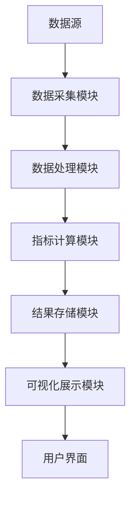
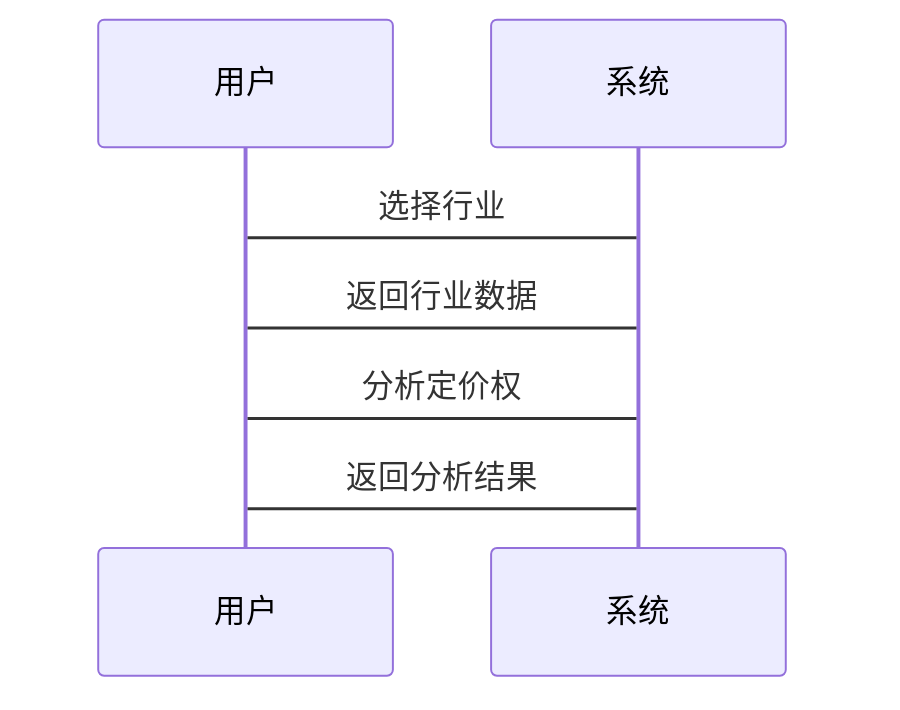

                 


# 彼得林奇如何分析公司的定价权随行业周期的变化

## 关键词：定价权，行业周期，彼得·林奇，投资分析，企业估值

## 摘要：本文深入分析了彼得·林奇如何通过定价权来评估公司的投资价值。文章首先介绍了定价权的基本概念和行业周期的影响，然后详细探讨了定价权的量化分析方法，包括数学模型、算法原理和系统设计。通过具体案例分析，展示了如何在实际投资中应用这些方法，并提供了最佳实践建议。

---

# 第五章: 行业周期分析与定价权量化模型

## 第5章: 定价权的行业周期分析

### 5.1 定价权的行业周期分析方法
#### 5.1.1 行业周期对定价权的影响
#### 5.1.2 不同行业周期下的定价权策略
#### 5.1.3 行业周期分析的步骤与工具

### 5.2 行业周期对定价权的具体影响
#### 5.2.1 成长期：定价权的扩张
#### 5.2.2 成熟期：定价权的稳定
#### 5.2.3 衰退期：定价权的丧失

## 第6章: 定价权的量化模型与数学公式

### 6.1 定价权的量化指标
#### 6.1.1 毛利率（Gross Profit Margin）
#### 6.1.2 净利率（Net Profit Margin）
#### 6.1.3 价格敏感性指数（Price Sensitivity Index）

### 6.2 定价权的数学模型
#### 6.2.1 定价权指数公式
$$
\text{定价权指数} = \frac{\text{毛利率} \times \text{品牌影响力} \times \text{市场占有率}}{\text{行业平均毛利率} \times \text{行业平均市场占有率}}
$$

#### 6.2.2 行业周期与定价权的关系公式
$$
\text{周期影响因子} = \frac{\text{行业周期阶段权重}}{\text{行业平均周期权重}}
$$

### 6.3 定价权的算法实现
#### 6.3.1 数据输入与预处理
#### 6.3.2 指标计算与权重分配
#### 6.3.3 结果输出与可视化

## 第7章: 系统设计与架构方案

### 7.1 系统功能设计
#### 7.1.1 数据采集模块
#### 7.1.2 指标计算模块
#### 7.1.3 可视化展示模块

### 7.2 系统架构设计


### 7.3 系统接口设计
#### 7.3.1 数据接口
#### 7.3.2 计算接口
#### 7.3.3 展示接口

### 7.4 系统交互流程


---

# 第八章: 项目实战与案例分析

## 第8章: 项目实战

### 8.1 项目环境安装
#### 8.1.1 安装Python与相关库
#### 8.1.2 数据源获取与准备

### 8.2 核心代码实现
#### 8.2.1 数据预处理代码
```python
import pandas as pd

# 读取数据
data = pd.read_csv('industry_data.csv')

# 数据清洗
data.dropna(inplace=True)
data = data[data['行业'] == '目标行业']
```

#### 8.2.2 定价权指数计算代码
```python
def calculate pricing_power_index(data):
    # 计算毛利率
    gross_margin = data['毛利率']
    # 计算品牌影响力
    brand_influence = data['品牌影响力']
    # 计算市场占有率
    market_share = data['市场占有率']
    
    # 定价权指数计算
    pp_index = (gross_margin * brand_influence * market_share) / (data['行业平均毛利率'] * data['行业平均市场占有率'])
    return pp_index

# 应用计算
pp_index = calculate_pricing_power_index(data)
```

### 8.3 实际案例分析
#### 8.3.1 案例选择与背景
#### 8.3.2 数据分析与结果展示
#### 8.3.3 结果解读与投资建议

---

# 第九章: 总结与最佳实践

## 第9章: 总结与注意事项

### 9.1 总结
#### 9.1.1 定价权的核心作用
#### 9.1.2 行业周期对定价权的影响
#### 9.1.3 投资分析的关键点

### 9.2 最佳实践
#### 9.2.1 数据准确性的重要性
#### 9.2.2 指标计算的注意事项
#### 9.2.3 投资决策的综合考量

## 第10章: 注意事项与拓展阅读

### 10.1 投资分析中的常见误区
#### 10.1.1 过度依赖单一指标
#### 10.1.2 忽视行业周期变化
#### 10.1.3 未考虑宏观经济因素

### 10.2 拓展阅读与工具推荐
#### 10.2.1 相关书籍推荐
#### 10.2.2 数据分析工具推荐
#### 10.2.3 投资分析社区与资源

---

# 作者：AI天才研究院/AI Genius Institute & 禅与计算机程序设计艺术 /Zen And The Art of Computer Programming

---

**注意事项：**
- 本文基于彼得·林奇的投资理念，结合技术分析方法，提供定价权分析的系统化方法。实际投资需结合多方面因素，谨慎决策。
- 如需进一步探讨，可参考《彼得·林奇的投资哲学》和《技术分析的进阶指南》。

**延伸思考：**
- 结合人工智能技术，如何进一步优化定价权的分析模型？
- 在新兴行业（如科技、人工智能领域），定价权的分析方法是否有所不同？

