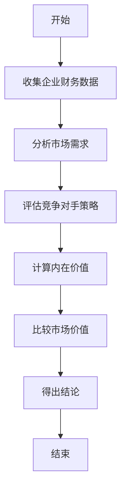
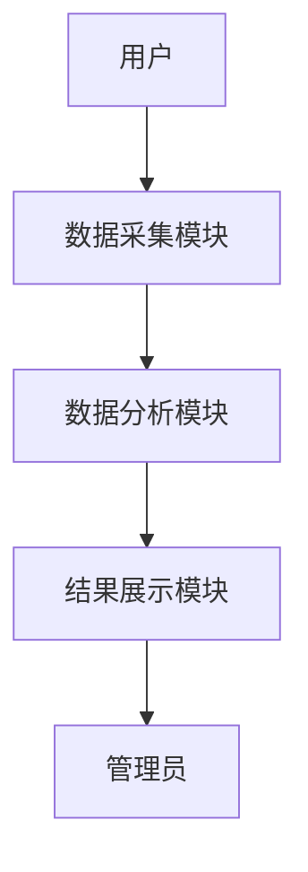

                 


# 彼得林奇如何分析公司的定价策略演变

## 关键词：定价策略，彼得·林奇，策略演变，定价模型，定价算法

## 摘要：本文深入探讨了彼得·林奇分析公司定价策略演变的方法，结合定价策略的基本概念、核心模型、算法原理、系统架构以及实际案例，系统地展示了如何通过定价策略的演变分析来优化企业定价策略，提升企业绩效。文章内容详实，结合理论与实践，适合对定价策略和投资分析感兴趣的读者阅读。

---

# 第一部分: 背景介绍

## 第1章: 定价策略的基本概念

### 1.1 定价策略的定义与重要性

定价策略是企业在市场中确定产品或服务价格的一系列规则和方法。它是企业制定价格时所遵循的策略，旨在实现利润最大化、市场占有率或其他商业目标。定价策略的重要性体现在企业的生存与发展上，合理的定价策略能够帮助企业应对市场变化，提高竞争力。

---

### 1.2 彼得·林奇的分析方法

彼得·林奇是著名的投资家，他的分析方法以基本面分析为核心，注重对企业内在价值的评估。他通过对企业财务数据、行业地位、竞争优势等多方面的分析，来判断企业的定价策略是否合理，是否能够为股东创造价值。

---

### 1.3 定价策略演变的背景

定价策略的演变受到市场环境、技术进步、消费者需求变化等多种因素的影响。随着市场的变化，企业需要不断调整定价策略，以适应新的竞争环境和客户需求。彼得·林奇的分析方法为我们提供了一种系统性的视角，帮助我们理解定价策略演变的内在逻辑。

---

# 第二部分: 核心概念与联系

## 第4章: 定价策略的核心要素

### 4.1 定价模型的构成要素

定价模型通常包括以下几个核心要素：

- **成本因素**：包括生产成本、研发投入、供应链成本等，是定价的最低界限。
- **市场需求**：反映消费者对产品或服务的需求程度，影响定价的上限。
- **竞争对手的定价策略**：分析竞争对手的价格策略，有助于制定差异化或跟随策略。
- **品牌价值**：品牌价值高的企业可以采用溢价定价策略。

---

## 第5章: 定价策略与企业绩效的关系

### 5.1 定价策略对企业利润的影响

- **高价策略**：能够带来更高的利润率，但可能限制销量。
- **低价策略**：可以扩大市场份额，但利润空间有限。
- **中间价策略**：在利润和市场份额之间寻求平衡。

---

## 第6章: 彼得·林奇定价策略分析模型

### 6.1 模型的核心要素

- **企业基本面分析**：包括收入、利润、现金流等财务指标。
- **市场需求分析**：包括市场规模、增长率、消费者偏好等。
- **竞争对手分析**：分析竞争对手的定价策略和市场反应。
- **宏观经济分析**：包括经济周期、通货膨胀、政策环境等。

---

# 第三部分: 算法原理讲解

## 第7章: 定价策略分析算法

### 7.1 相对价值分析法

相对价值分析法是一种基于企业内在价值和市场价值的定价策略分析方法。彼得·林奇常用这种方法来评估企业的定价是否合理。

- **内在价值计算**：通过企业的财务数据和行业基准，估算企业的合理价值。
- **市场价值比较**：将企业的市场价值与内在价值进行比较，判断定价的合理性。

---

### 7.2 算法流程图



---

### 7.3 Python实现代码

```python
import pandas as pd

def calculate_intrinsic_value(financial_data, market_data):
    # 计算内在价值
    intrinsic_value = financial_data['收入'] * (1 - financial_data['成本率']) - financial_data['研发投入']
    # 比较市场价值
    market_ratio = market_data['市场价值'] / intrinsic_value
    return market_ratio

# 示例数据
financial_data = {
    '收入': 1000,
    '成本率': 0.6,
    '研发投入': 200
}
market_data = {
    '市场价值': 800
}

market_ratio = calculate_intrinsic_value(financial_data, market_data)
print(f"市场价值与内在价值的比率为：{market_ratio}")
```

---

## 第8章: 算法数学模型

### 8.1 内在价值计算公式

$$ \text{内在价值} = \text{收入} \times (1 - \text{成本率}) - \text{研发投入} $$

### 8.2 市场价值比较公式

$$ \text{市场价值比率} = \frac{\text{市场价值}}{\text{内在价值}} $$

---

# 第四部分: 系统分析与架构设计方案

## 第9章: 定价策略分析系统

### 9.1 系统功能设计

- **数据采集模块**：收集企业的财务数据和市场数据。
- **数据分析模块**：进行内在价值计算和市场价值比较。
- **结果展示模块**：以图表形式展示分析结果。

### 9.2 系统架构设计



---

## 第10章: 系统接口设计

- **API接口**：提供数据接口，供其他系统调用分析结果。
- **用户界面**：友好的用户界面，方便用户输入数据和查看结果。

---

# 第五部分: 项目实战

## 第11章: 项目实战

### 11.1 环境安装

- **Python环境**：安装Python 3.8及以上版本。
- **依赖库安装**：安装pandas、numpy等库。

### 11.2 核心算法实现

```python
import pandas as pd

def analyze_pricing_strategy(financial_data, market_data):
    # 计算内在价值
    intrinsic_value = financial_data['收入'] * (1 - financial_data['成本率']) - financial_data['研发投入']
    # 比较市场价值
    market_ratio = market_data['市场价值'] / intrinsic_value
    return market_ratio

# 示例数据
financial_data = pd.DataFrame({
    '收入': [1000],
    '成本率': [0.6],
    '研发投入': [200]
})
market_data = pd.DataFrame({
    '市场价值': [800]
})

# 分析并输出结果
result = analyze_pricing_strategy(financial_data.iloc[0], market_data.iloc[0])
print(f"市场价值与内在价值的比率为：{result}")
```

---

## 第12章: 案例分析

### 12.1 案例背景

假设我们有一家制造公司，收入为1000万元，成本率为60%，研发投入为200万元，市场价值为800万元。

### 12.2 分析过程

1. 计算内在价值：
$$ \text{内在价值} = 1000 \times (1 - 0.6) - 200 = 200 \text{万元} $$

2. 比较市场价值：
$$ \text{市场价值比率} = \frac{800}{200} = 4 $$

### 12.3 结论

市场价值比率高于1，说明市场价值被高估，建议调整定价策略。

---

# 第六部分: 最佳实践

## 第13章: 最佳实践

### 13.1 注意事项

- 定价策略的制定需要结合企业的实际情况。
- 定期回顾和调整定价策略，以应对市场变化。

### 13.2 小结

通过彼得·林奇的分析方法，我们可以系统地评估企业的定价策略，找出定价策略中的问题，并提出改进建议。

### 13.3 拓展阅读

- 彼得·林奇的《彼得·林奇的投资哲学》
- 定价策略相关的书籍和文献

### 13.4 未来趋势

随着人工智能和大数据技术的发展，定价策略的分析将更加精准和动态化。

---

# 结语

通过本文的分析，我们可以看到，定价策略的演变是一个复杂而动态的过程。彼得·林奇的分析方法为我们提供了一种系统性的视角，帮助我们理解定价策略的内在逻辑和演变趋势。希望本文能够为读者在定价策略的分析和实践中提供有价值的参考。

---

作者：AI天才研究院/AI Genius Institute & 禅与计算机程序设计艺术 /Zen And The Art of Computer Programming

