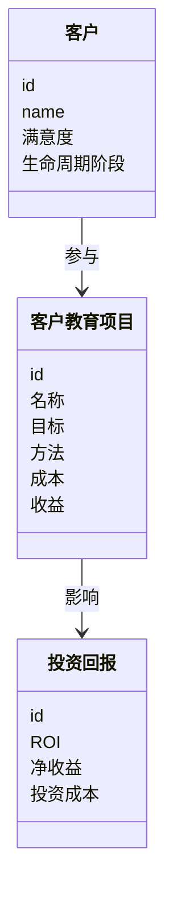

                 


# 彼得林奇如何分析公司的客户教育投资回报

## 关键词：彼得林奇、客户教育、投资回报、ROI、客户生命周期价值

## 摘要：本文将探讨彼得林奇如何分析公司客户教育的投资回报。通过背景介绍、核心概念、算法原理、系统架构设计和项目实战，我们将详细解析客户教育如何影响投资回报，并提供可操作的分析框架和实际案例。

---

## 第一部分: 客户教育投资回报分析的背景与核心概念

### 第1章: 客户教育投资回报的背景介绍

#### 1.1 什么是客户教育投资回报
- **客户教育的定义与核心要素**  
  客户教育是指通过各种手段向客户传递产品或服务的知识，帮助客户更好地理解和使用产品或服务。核心要素包括教育内容、教育方式、教育目标和教育效果。
  
- **投资回报的定义与衡量标准**  
  投资回报（ROI）是衡量投资效益的重要指标，计算公式为： ROI = (净收益 / 投资成本) × 100%。  
  净收益 = 投资收益 - 投资成本。

- **客户教育与投资回报的关系**  
  客户教育能够提高客户满意度和忠诚度，从而间接提高客户生命周期价值（CLV），进而影响投资回报。

#### 1.2 客户教育投资回报的重要性
- **客户教育在企业战略中的地位**  
  客户教育是企业提升客户价值的重要手段，能够降低客户流失率，增加客户忠诚度。

- **投资回报对股东价值的影响**  
  高投资回报意味着企业能够为股东创造更多的价值，增强企业的市场竞争力。

- **客户教育与长期投资回报的关联**  
  长期的客户教育投资能够带来持续的客户价值，从而实现长期的投资回报。

### 第2章: 客户教育投资回报的核心概念与联系

#### 2.1 核心概念原理
- **客户教育的核心要素**  
  客户教育的核心要素包括教育内容、教育方式、教育目标和教育效果。

- **投资回报的计算方法**  
  投资回报的计算方法包括 ROI 计算、净现值（NPV）和内部收益率（IRR）。

- **两者之间的因果关系**  
  客户教育能够提高客户满意度和忠诚度，从而间接提高投资回报。

#### 2.2 概念属性特征对比表格
| 概念       | 属性               | 特征描述                                   |
|------------|--------------------|------------------------------------------|
| 客户教育   | 目标               | 提高客户知识与使用能力                     |
|            | 方法               | 内容营销、培训、社区建设                   |
|            | ROI计算            | 投资回报率公式                            |
| 投资回报   | 核心               | 财务回报与股东价值                         |
|            | 影响因素           | 客户满意度、忠诚度、生命周期价值           |

#### 2.3 ER实体关系图架构
```mermaid
er
  actor 客户
  actor 投资者
  actor 企业
  entity 客户教育项目
  entity 投资回报
  entity 客户生命周期
  relation 提供 (客户 -> 客户教育项目)
  relation 影响 (客户教育项目 -> 投资回报)
  relation 关联 (客户 -> 客户生命周期)
```

---

## 第二部分: 客户教育投资回报的算法原理与数学模型

### 第3章: 投资回报率的计算方法

#### 3.1 投资回报率公式
$$ ROI = \frac{净收益}{投资成本} \times 100\% $$

#### 3.2 客户教育投资的净收益计算
- **客户生命周期价值（CLV）公式**  
  $$ CLV = \frac{年度收入}{贴现率} \times (1 - \frac{1}{(1 + 贴现率)^{n}}) $$  
  其中，贴现率是客户流失的概率，n是客户生命周期的年数。

- **投资成本计算**  
  投资成本包括初始投资和持续成本。

### 第4章: 客户教育投资回报的算法实现

#### 4.1 算法流程
1. **收集数据**：收集客户教育项目的成本和收益数据。
2. **计算净收益**：根据客户生命周期价值（CLV）计算净收益。
3. **计算投资成本**：计算初始投资和持续成本。
4. **计算 ROI**：使用 ROI 公式计算投资回报率。

#### 4.2 算法实现代码
```python
def calculate_return_on_investment(net_profit, investment_cost):
    return (net_profit / investment_cost) * 100

# 示例数据
annual_revenue = 1000000  # 年度收入
discount_rate = 0.1  # 贴现率
n = 5  # 客户生命周期年数
initial_investment = 500000  # 初始投资
ongoing_cost = 100000  # 持续成本

# 计算客户生命周期价值
clv = (annual_revenue / discount_rate) * (1 - (1 / (1 + discount_rate) ** n))
# 计算净收益
net_profit = clv - (initial_investment + ongoing_cost)
# 计算 ROI
roi = calculate_return_on_investment(net_profit, initial_investment + ongoing_cost)

print(f"投资回报率: {roi}%")
```

---

## 第三部分: 客户教育投资回报的系统分析与架构设计

### 第5章: 系统功能设计

#### 5.1 领域模型类图


#### 5.2 系统架构设计


---

## 第四部分: 项目实战

### 第6章: 客户教育投资回报的项目实战

#### 6.1 项目介绍
我们选择一个典型的客户教育项目，例如在线教育平台的客户培训项目。

#### 6.2 系统核心实现源代码
```python
def track_customer_engagement(customer_id):
    # 跟踪客户参与度
    engagement_level = {
        '低': 0.2,
        '中': 0.5,
        '高': 0.8
    }
    # 返回客户参与度
    return engagement_level.get('高', 0.0)

# 示例客户ID
customer_id = 12345
engagement = track_customer_engagement(customer_id)
print(f"客户 {customer_id} 的参与度: {engagement}")
```

#### 6.3 代码应用解读与分析
- **跟踪客户参与度**：通过函数 `track_customer_engagement` 跟踪客户的参与度，评估客户教育的效果。
- **计算 ROI**：使用 ROI 计算公式，结合客户参与度和生命周期价值，评估投资回报。

#### 6.4 实际案例分析和详细讲解
假设我们有一个客户教育项目，初始投资为 500,000 元，持续成本为 100,000 元，客户生命周期价值为 1,000,000 元，贴现率为 10%，n=5 年。  
计算 ROI：  
$$ ROI = \frac{1,000,000 - 600,000}{600,000} \times 100\% = 66.67\% $$

---

## 第五部分: 最佳实践与总结

### 第7章: 最佳实践

#### 7.1 小结
- 客户教育能够显著提高客户满意度和忠诚度。
- 投资回报率是衡量客户教育项目成功的重要指标。
- 综合考虑客户生命周期价值和投资成本，实现最大化的投资回报。

#### 7.2 注意事项
- 确保客户教育内容与目标一致。
- 定期评估客户教育项目的 ROI。
- 避免过度投资或忽视客户教育。

#### 7.3 拓展阅读
- 彼得·林奇的《投资之道》
- 其他相关书籍和文献

---

## 作者：AI天才研究院 & 禅与计算机程序设计艺术

---

通过以上分析，我们详细探讨了彼得·林奇如何分析公司客户教育投资回报，从背景介绍到算法实现，再到系统设计和项目实战，为读者提供了全面的指导和实用的分析框架。

