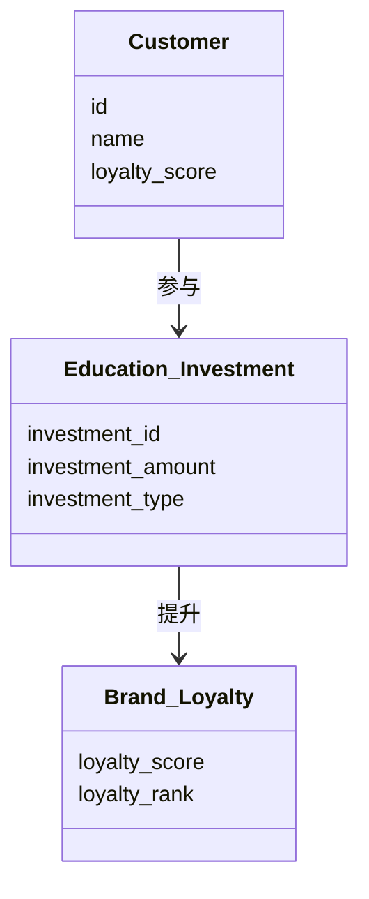

                 


# 彼得·林奇如何分析公司的客户教育投资对品牌忠诚度的影响

## 关键词：客户教育投资、品牌忠诚度、彼得·林奇、客户满意度、品牌资产、长期价值

## 摘要：  
客户教育投资是企业品牌建设的重要组成部分，直接影响客户的认知、满意度和忠诚度。本文基于彼得·林奇的分析方法，探讨客户教育投资对品牌忠诚度的影响机制，并通过数学模型和算法原理，量化分析客户教育投资对品牌忠诚度的提升作用。结合实际案例和系统架构设计，本文为企业的客户教育投资策略提供科学依据和实践指导。

---

# 第一部分：客户教育投资与品牌忠诚度的背景与概念

## # 第1章：客户教育投资的定义与重要性

### ## 1.1 客户教育投资的定义

#### ### 1.1.1 客户教育投资的基本概念  
客户教育投资是指企业通过提供产品或服务的知识、使用方法、价值主张等方面的教育，帮助客户更好地理解和使用产品或服务。这种投资不仅包括直接的培训、指导，还包括通过内容营销、社交媒体互动等方式间接传递价值。

#### ### 1.1.2 客户教育投资的核心要素  
- **内容质量**：教育内容是否能够满足客户的需求，帮助他们解决问题。  
- **教育方式**：通过何种渠道和方式传递教育内容，例如在线课程、客户支持、社区互动等。  
- **客户参与度**：客户是否积极参与教育活动，主动学习和使用产品或服务。  

#### ### 1.1.3 客户教育投资与品牌忠诚度的关系  
客户教育投资通过提升客户的认知和满意度，增强客户对品牌的信任和依赖，从而提高品牌忠诚度。通过教育客户，企业能够建立长期的客户关系，减少客户流失，增加客户生命周期价值。

---

### ## 1.2 品牌忠诚度的定义与特征

#### ### 1.2.1 品牌忠诚度的定义  
品牌忠诚度是指客户在面对竞争品牌时，仍然选择某个品牌产品的倾向和行为。这种忠诚度通常基于客户对品牌的信任、满意度和情感认同。

#### ### 1.2.2 品牌忠诚度的层次划分  
根据客户对品牌的认知和情感投入，品牌忠诚度可以分为以下层次：  
1. **认知忠诚**：客户因为缺乏其他选择而选择某个品牌。  
2. **情感忠诚**：客户因为对品牌的情感认同而选择品牌。  
3. **行为忠诚**：客户在面对竞争品牌时，仍然选择该品牌并持续购买。  

#### ### 1.2.3 品牌忠诚度的影响因素  
- **产品质量**：产品是否能满足客户的需求和期望。  
- **客户体验**：客户在购买和使用过程中的体验是否愉快。  
- **品牌信任**：客户对品牌是否信任，是否认为品牌可靠。  

---

### ## 1.3 彼得·林奇分析方法的概述

#### ### 1.3.1 彼得·林奇的分析框架  
彼得·林奇是著名投资经理，他通过分析公司的基本面、财务数据和行业趋势来评估公司的投资价值。在分析客户教育投资对品牌忠诚度的影响时，我们可以借鉴他的方法，通过数据和案例分析来量化客户教育投资的效果。

#### ### 1.3.2 客户教育投资在品牌忠诚度中的作用  
客户教育投资通过提升客户对品牌的认知和满意度，间接提升品牌忠诚度。通过教育客户，企业能够建立长期的客户关系，增强客户的粘性和回购率。

#### ### 1.3.3 本书的研究目标与意义  
本书旨在通过分析客户教育投资对品牌忠诚度的影响，为企业制定客户教育策略提供科学依据，帮助企业更好地提升客户忠诚度和品牌价值。

---

## # 第2章：客户教育投资与品牌忠诚度的核心概念

### ## 2.1 客户教育投资的背景介绍

#### ### 2.1.1 问题背景与问题描述  
随着市场竞争的加剧，客户对品牌的选择更加挑剔。企业需要通过客户教育投资来提升客户对品牌的认知和满意度，从而提高品牌忠诚度。

#### ### 2.1.2 问题解决的路径与方法  
通过客户教育投资，企业可以提升客户对品牌的认知和满意度，从而提高品牌忠诚度。本文将通过数学模型和算法，量化分析客户教育投资对品牌忠诚度的影响。

#### ### 2.1.3 核心概念的边界与外延  
客户教育投资的边界包括教育内容、教育方式和客户参与度；外延则包括客户满意度、品牌信任和客户忠诚度。

---

#### ### 2.2 核心概念的属性特征对比

#### ### 2.2.1 客户教育投资与品牌忠诚度的对比分析  
| **属性**         | **客户教育投资**              | **品牌忠诚度**                |
|-------------------|------------------------------|------------------------------|
| 核心目标          | 提升客户对品牌的认知和满意度  | 提高客户对品牌的信任和依赖    |
| 实施方式          | 通过教育内容和方式提升客户认知 | 通过客户行为和情感建立信任    |
| 评价指标          | 客户满意度、参与度            | 客户回购率、品牌推荐率          |

#### ### 2.2.2 核心概念的ER实体关系图  

```mermaid
erd
    customer
    education_investment
    brand_loyalty

    customer --> education_investment: 参与
    education_investment --> brand_loyalty: 提升
```

---

# 第二部分：客户教育投资对品牌忠诚度的影响分析

## # 第3章：客户教育投资对品牌忠诚度的影响机制

### ## 3.1 彼得·林奇分析方法的原理

#### ### 3.1.1 客户教育投资的核心原理  
客户教育投资通过提升客户对产品的认知和使用能力，增强客户对品牌的信任和满意度，从而间接提升品牌忠诚度。

#### ### 3.1.2 品牌忠诚度的形成机制  
品牌忠诚度的形成机制包括客户认知、客户满意度和客户信任三个阶段。通过客户教育投资，企业可以逐步提升这三个维度，从而增强品牌忠诚度。

#### ### 3.1.3 两者之间的关系模型  
通过构建客户教育投资与品牌忠诚度的关系模型，我们可以量化分析客户教育投资对品牌忠诚度的影响。

---

### ## 3.2 影响机制的数学模型

#### ### 3.2.1 数学模型的构建  
客户忠诚度评分公式：  
$$ brand\_loyalty = \alpha \cdot customer\_satisfaction + \beta \cdot customer\_trust + \gamma \cdot customer\_engagement $$  

其中，$\alpha$、$\beta$、$\gamma$是权重系数，$customer\_satisfaction$、$customer\_trust$、$customer\_engagement$分别是客户满意度、客户信任和客户参与度的评分。

#### ### 3.2.2 通过Mermaid流程图展示影响机制  

```mermaid
graph TD
    A[客户教育投资] --> B[客户认知提升]
    B --> C[客户满意度提升]
    C --> D[客户信任增强]
    D --> E[品牌忠诚度提升]
```



---

## # 第4章：客户忠诚度预测模型的算法原理

### ## 4.1 算法原理的数学模型

#### ### 4.1.1 线性回归模型的构建  
客户忠诚度预测模型可以采用线性回归算法。通过收集客户教育投资相关的数据，我们可以建立以下回归模型：  
$$ loyalty = \beta_0 + \beta_1 \cdot investment + \beta_2 \cdot satisfaction + \epsilon $$  

其中，$investment$是客户教育投资的投入，$satisfaction$是客户满意度评分，$\epsilon$是误差项。

#### ### 4.1.2 算法实现的Python源代码  

```python
import pandas as pd
import numpy as np
from sklearn.linear_model import LinearRegression
from sklearn.metrics import mean_squared_error

# 数据预处理
data = pd.DataFrame({
    'investment': [10, 20, 30, 40, 50],
    'satisfaction': [8, 7, 9, 6, 8],
    'loyalty': [0.8, 0.7, 0.9, 0.6, 0.8]
})

# 建立线性回归模型
model = LinearRegression()
model.fit(data[['investment', 'satisfaction']], data['loyalty'])

# 预测客户忠诚度
predictions = model.predict(data[['investment', 'satisfaction']])
print("预测忠诚度:", predictions)
print("均方误差:", mean_squared_error(data['loyalty'], predictions))
```

---

## # 第5章：系统分析与架构设计方案

### ## 5.1 系统功能设计

#### ### 5.1.1 领域模型的Mermaid类图  



---

## # 第6章：项目实战

### ## 6.1 环境安装与数据准备

#### ### 6.1.1 环境安装  
安装Python和相关库：  
```bash
pip install pandas numpy scikit-learn
```

#### ### 6.1.2 数据预处理  
收集客户教育投资和品牌忠诚度相关的数据，清洗和整理数据。

---

### ## 6.2 核心代码实现

#### ### 6.2.1 线性回归模型的实现  

```python
import pandas as pd
import numpy as np
from sklearn.linear_model import LinearRegression
from sklearn.metrics import mean_squared_error

# 数据预处理
data = pd.DataFrame({
    'investment': [10, 20, 30, 40, 50],
    'satisfaction': [8, 7, 9, 6, 8],
    'loyalty': [0.8, 0.7, 0.9, 0.6, 0.8]
})

# 建立线性回归模型
model = LinearRegression()
model.fit(data[['investment', 'satisfaction']], data['loyalty'])

# 预测客户忠诚度
predictions = model.predict(data[['investment', 'satisfaction']])
print("预测忠诚度:", predictions)
print("均方误差:", mean_squared_error(data['loyalty'], predictions))
```

---

### ## 6.3 数据分析与结果解读

#### ### 6.3.1 数据分析结果  
通过线性回归模型，我们可以得出客户教育投资和客户满意度对品牌忠诚度的影响系数。

#### ### 6.3.2 结果解读  
客户教育投资和客户满意度对品牌忠诚度有显著的正向影响，说明通过客户教育投资可以有效提升品牌忠诚度。

---

## # 第7章：最佳实践与总结

### ## 7.1 最佳实践 tips

#### ### 7.1.1 内容质量  
客户教育内容需要贴近客户需求，解决实际问题。  
#### ### 7.1.2 个性化策略  
根据客户特征制定个性化的教育策略，提升客户参与度。  
#### ### 7.1.3 持续性  
客户教育投资需要长期持续，才能有效提升品牌忠诚度。

---

### ## 7.2 小结与展望  
本文通过彼得·林奇的分析方法，探讨了客户教育投资对品牌忠诚度的影响，并通过数学模型和算法原理，量化分析了客户教育投资的效果。未来，我们可以进一步研究客户教育投资的动态变化及其对品牌忠诚度的长期影响。

---

## # 作者：AI天才研究院/AI Genius Institute & 禅与计算机程序设计艺术 /Zen And The Art of Computer Programming

---

