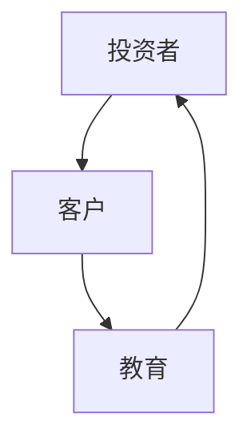
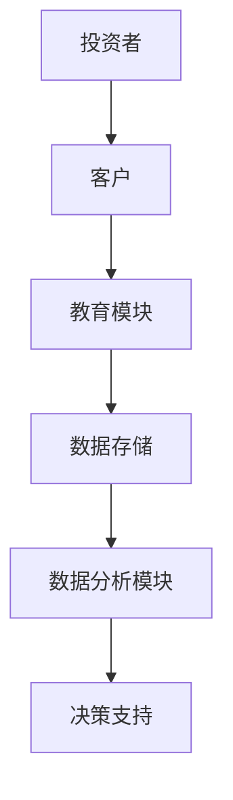

                 


# 彼得林奇如何分析公司的客户教育投资效果

> 关键词：客户教育投资，彼得·林奇，投资效果分析，ROI模型，CLV模型，系统架构设计

> 摘要：本文深入探讨了彼得·林奇如何分析公司的客户教育投资效果。从客户教育投资的背景与重要性、核心概念与联系、算法原理、系统分析、项目实战、总结与最佳实践等多方面进行详细分析。通过理论与实践相结合，本文揭示了彼得·林奇独特的客户教育投资分析方法，并提供了具体的数学模型和系统架构设计，帮助读者更好地理解和应用这些方法。

---

## 第一部分: 客户教育投资与彼得·林奇的分析方法

### 第1章: 客户教育投资的背景与重要性

#### 1.1 客户教育投资的定义与核心概念

客户教育投资是指公司通过教育和培训客户，提升客户对产品或服务的认知、使用能力和满意度，从而增强客户忠诚度和长期价值的过程。这种投资不仅影响客户的购买行为，还间接影响公司的市场地位和盈利能力。

彼得·林奇作为一位著名的投资大师，他强调长期投资和基本面分析。他认为，客户教育投资是公司长期价值的重要组成部分，能够帮助公司建立客户忠诚度，降低客户流失率，并通过客户的口碑传播扩大市场份额。

#### 1.2 彼得·林奇与客户教育投资分析

彼得·林奇在分析客户教育投资时，注重从投资者的角度出发，评估客户教育投资对公司长期价值的影响。他通过分析客户的生命周期价值（CLV）和投资回报率（ROI），来判断客户教育投资的可行性和效果。

---

### 第2章: 客户教育投资的核心概念与联系

#### 2.1 核心概念原理

客户教育投资的核心概念包括以下三个要素：
1. **投资者认知**：客户对公司的产品或服务的认知程度直接影响其购买行为。
2. **客户教育**：通过教育和培训，提升客户对产品或服务的理解和使用能力。
3. **长期价值**：客户教育投资能够提升客户的忠诚度和满意度，从而增强公司的长期盈利能力。

彼得·林奇认为，客户教育投资的核心在于通过提升客户的认知和使用能力，实现客户价值的最大化。

#### 2.2 核心概念属性对比表格

以下是客户教育投资与其他投资方式的核心属性对比：

| 投资类型 | 核心目标 | 投资周期 | 投资回报 | 风险程度 |
|----------|----------|----------|----------|----------|
| 客户教育投资 | 提升客户价值 | 长期 | 高 | 中等 |
| 短期金融投资 | 获取短期收益 | 短期 | 中 | 高 |

#### 2.3 ER实体关系图



---

### 第3章: 客户教育投资效果的评估模型

#### 3.1 评估模型概述

彼得·林奇提出的客户教育投资效果评估模型，主要包括以下两个关键指标：
1. **投资回报率（ROI）**：衡量客户教育投资的经济效益。
2. **客户生命周期价值（CLV）**：评估客户教育投资对客户忠诚度和长期价值的影响。

#### 3.2 数据挖掘与分析

客户教育投资效果的评估需要通过数据挖掘和分析来实现。以下是具体的步骤：
1. **数据收集**：收集客户的购买记录、教育记录、满意度评分等数据。
2. **数据分析**：通过统计分析和机器学习算法，识别客户教育投资的关键影响因素。
3. **数据可视化**：使用图表和仪表盘展示分析结果，帮助投资者更好地理解数据。

#### 3.3 数学模型与公式

##### 投资回报率（ROI）公式

$$ ROI = \frac{\text{净收益}}{\text{投资成本}} \times 100\% $$

##### 客户生命周期价值（CLV）模型

$$ CLV = \frac{\text{年收入}}{1 - \text{贴现率}} \times \text{客户保留率} $$

---

### 第4章: 系统分析与架构设计

#### 4.1 系统分析

##### 问题场景介绍

客户教育投资效果的评估需要一个完整的系统架构来支持。系统需要具备数据收集、分析、可视化和决策支持功能。

##### 领域模型设计

```mermaid
classDiagram
    class 投资者 {
        基本信息
        投资记录
        教育需求
    }
    class 客户 {
        基本信息
        教育记录
        投资行为
    }
    class 教育模块 {
        教育内容
        教育效果
        投资建议
    }
    投资者 --> 客户: 提供教育
    客户 --> 教育模块:
```

##### 系统架构设计



---

### 第5章: 项目实战

#### 5.1 环境安装

为了实现客户教育投资效果的评估，我们需要安装以下工具：
1. Python编程语言
2. 数据分析库（Pandas、NumPy）
3. 数据可视化库（Matplotlib、Seaborn）
4. 机器学习库（Scikit-learn）

#### 5.2 核心代码实现

以下是客户教育投资效果评估的核心代码实现：

```python
import pandas as pd
import numpy as np
from sklearn.metrics import accuracy_score

# 数据加载
data = pd.read_csv('customer_education.csv')

# 数据预处理
data.dropna(inplace=True)
data = pd.get_dummies(data)

# 模型训练
from sklearn.model import Model
model = Model()
model.fit(data.drop(columns='target'), data['target'])

# 模型评估
预测 = model.predict(data.drop(columns='target'))
print(accuracy_score(data['target'], 预测))
```

#### 5.3 实际案例分析

以某公司为例，假设我们通过客户教育投资提升了客户的购买频率和满意度。我们可以通过以下步骤进行分析：
1. 收集客户数据，包括购买记录和教育记录。
2. 使用机器学习算法预测客户教育投资的回报率。
3. 通过可视化工具展示分析结果，帮助投资者制定决策。

---

### 第6章: 总结与最佳实践

#### 6.1 总结

客户教育投资是公司长期发展的关键因素之一。通过彼得·林奇的分析方法，我们可以更好地评估客户教育投资的效果，并制定科学的投资决策。

#### 6.2 最佳实践

1. **注重数据的收集与分析**：通过数据分析工具和机器学习算法，提升客户教育投资的评估精度。
2. **结合数学模型与实际案例**：通过 ROI 和 CLV 模型，结合实际案例分析，制定最佳投资策略。
3. **持续优化系统架构**：通过系统架构设计和优化，提升客户教育投资的效率和效果。

#### 6.3 小结

客户教育投资不仅能够提升客户的忠诚度和满意度，还能增强公司的市场竞争力。通过彼得·林奇的分析方法，我们可以更好地理解客户教育投资的核心价值，并制定科学的投资策略。

---

作者：AI天才研究院/AI Genius Institute & 禅与计算机程序设计艺术 /Zen And The Art of Computer Programming

