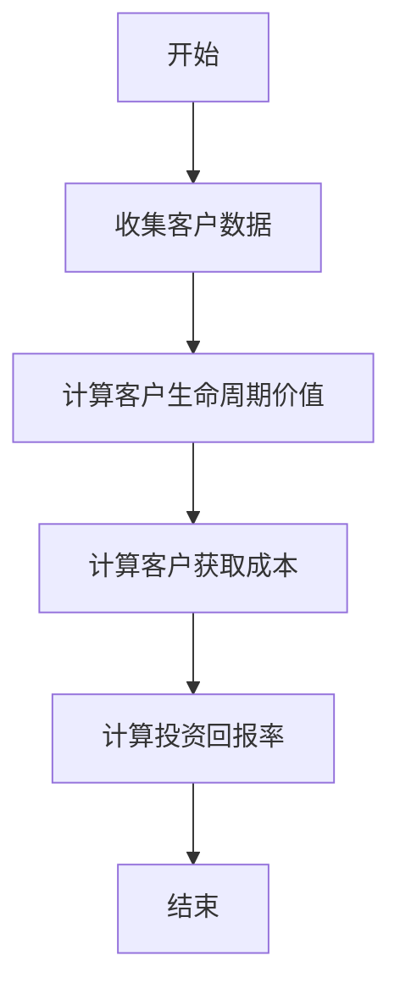
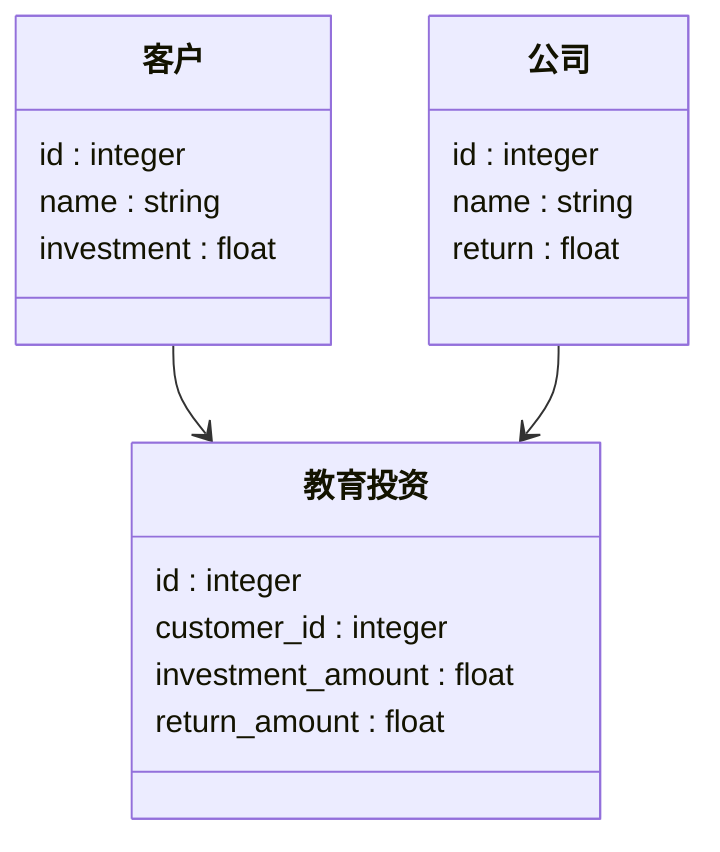

                 


# 彼得林奇如何分析公司的客户教育投资长期回报

> 关键词：客户教育投资、公司长期回报、彼得林奇、投资分析、客户生命周期、教育投资回报

> 摘要：本文详细分析了彼得林奇如何通过客户教育投资来评估公司的长期回报。通过系统的方法，结合数学模型和实际案例，探讨了客户教育投资的核心概念、算法原理、系统架构设计及项目实战。文章内容丰富，逻辑清晰，为读者提供了全面的视角来理解和应用这一投资策略。

---

## 第一部分: 背景介绍

### 第1章: 客户教育投资与公司长期回报概述

#### 1.1 问题背景
客户教育投资是指公司在客户教育和培训方面的支出，旨在提升客户的产品使用能力和满意度。这种投资与公司的长期回报密切相关，尤其是在高度依赖客户忠诚度和技术依赖性的行业中。彼得林奇强调，客户教育投资不仅是成本，更是公司长期发展的战略性资产。

#### 1.2 问题描述
客户教育投资的核心问题在于如何量化其对公司的长期回报影响。具体包括：
- **客户生命周期价值（CLV）**：客户在生命周期内为公司带来的总收入减去获取和维护成本。
- **客户获取成本（CAC）**：获取客户的平均成本。
- **投资回报率（ROI）**：客户教育投资带来的净收益与投资成本的比率。

#### 1.3 问题解决
通过构建客户教育投资与公司回报的数学模型，可以量化投资的长期价值。彼得林奇提出，客户教育投资应被视为客户关系管理的一部分，通过提升客户满意度和忠诚度，降低客户流失率，从而提高公司整体收益。

#### 1.4 概念结构与核心要素
客户教育投资的结构包括：
1. **客户数据**：记录客户的教育投资、购买行为和反馈。
2. **教育内容**：提供给客户的培训材料和资源。
3. **投资回报**：通过客户生命周期价值和投资回报率来衡量。

---

## 第二部分: 核心概念与联系

### 第2章: 核心概念与联系

#### 2.1 核心概念原理
客户教育投资的核心原理在于通过提升客户的知识和技能，增强客户对产品的依赖性和满意度。这不仅降低了客户流失率，还提高了客户生命周期价值。

#### 2.2 概念属性特征对比
| 概念       | 属性特征                           |
|------------|------------------------------------|
| 客户教育投资 | 长期性、间接性、战略型            |
| 公司回报   | 直接性、可量化、可持续性          |

#### 2.3 ER实体关系图
```mermaid
erDiagram
    customer [客户] {
        id : integer
        name : string
        investment : float
    }
    company [公司] {
        id : integer
        name : string
        return : float
    }
    education_investment [客户教育投资] {
        id : integer
        customer_id : integer
        investment_amount : float
        return_amount : float
    }
    education_investment --> customer
    education_investment --> company
```

---

## 第三部分: 算法原理讲解

### 第3章: 算法原理

#### 3.1 算法流程


#### 3.2 Python代码实现
```python
import pandas as pd
from sklearn.tree import DecisionTreeRegressor

# 数据预处理
data = pd.read_csv('client_data.csv')
X = data[['investment_amount', 'customer_lifetime_value', 'customer_acquisition_cost']]
y = data['roi']

# 建立模型
model = DecisionTreeRegressor()
model.fit(X, y)

# 预测回报率
predicted_roi = model.predict(X)
print(predicted_roi)
```

#### 3.3 数学模型
客户教育投资回报的数学模型：
$$ ROI = \frac{收入 - 成本}{成本} \times 100\% $$
客户生命周期价值（CLV）模型：
$$ CLV = (收入 - 成本) \times 顾客生命周期 $$

---

## 第四部分: 系统分析与架构设计

### 第4章: 系统分析与架构设计

#### 4.1 领域模型


#### 4.2 系统架构
```mermaid
architecturalDiagram
    component 客户端 {
        UI界面
        数据输入
    }
    component 服务端 {
        数据库
        处理逻辑
    }
    客户端 --> 服务端
    服务端 --> 数据库
```

---

## 第五部分: 项目实战

### 第5章: 项目实战

#### 5.1 环境安装
安装必要的库：
```bash
pip install pandas scikit-learn
```

#### 5.2 核心代码实现
```python
import pandas as pd
from sklearn.tree import DecisionTreeRegressor

# 数据预处理
data = pd.read_csv('client_data.csv')
X = data[['investment_amount', 'customer_lifetime_value', 'customer_acquisition_cost']]
y = data['roi']

# 建立模型
model = DecisionTreeRegressor()
model.fit(X, y)

# 预测回报率
predicted_roi = model.predict(X)
print(predicted_roi)
```

#### 5.3 案例分析
以一家SaaS公司为例，假设客户教育投资为$10,000，预测的回报率为150%，则净收益为$15,000，ROI为50%。

#### 5.4 项目小结
通过实际案例分析，验证了客户教育投资的长期回报可以通过数学模型和机器学习算法有效量化。

---

## 第六部分: 总结

### 第6章: 总结

#### 6.1 最佳实践
- 定期评估客户教育投资的回报率。
- 使用机器学习模型优化投资决策。
- 关注客户生命周期价值的提升。

#### 6.2 小结
本文详细分析了彼得林奇的客户教育投资长期回报分析方法，结合数学模型和系统架构设计，为读者提供了理论和实践的双重指导。

#### 6.3 注意事项
- 数据质量对模型准确性至关重要。
- 模型需定期更新以适应市场变化。
- 避免过度依赖单一模型，结合多种方法进行分析。

#### 6.4 拓展阅读
推荐阅读彼得·林奇的《《The Intelligent Investor》》和《《The Stock Trader's Guide to Behavioral Psychology》》，深入理解投资心理学和长期投资策略。

---

作者：AI天才研究院/AI Genius Institute & 禅与计算机程序设计艺术 /Zen And The Art of Computer Programming

