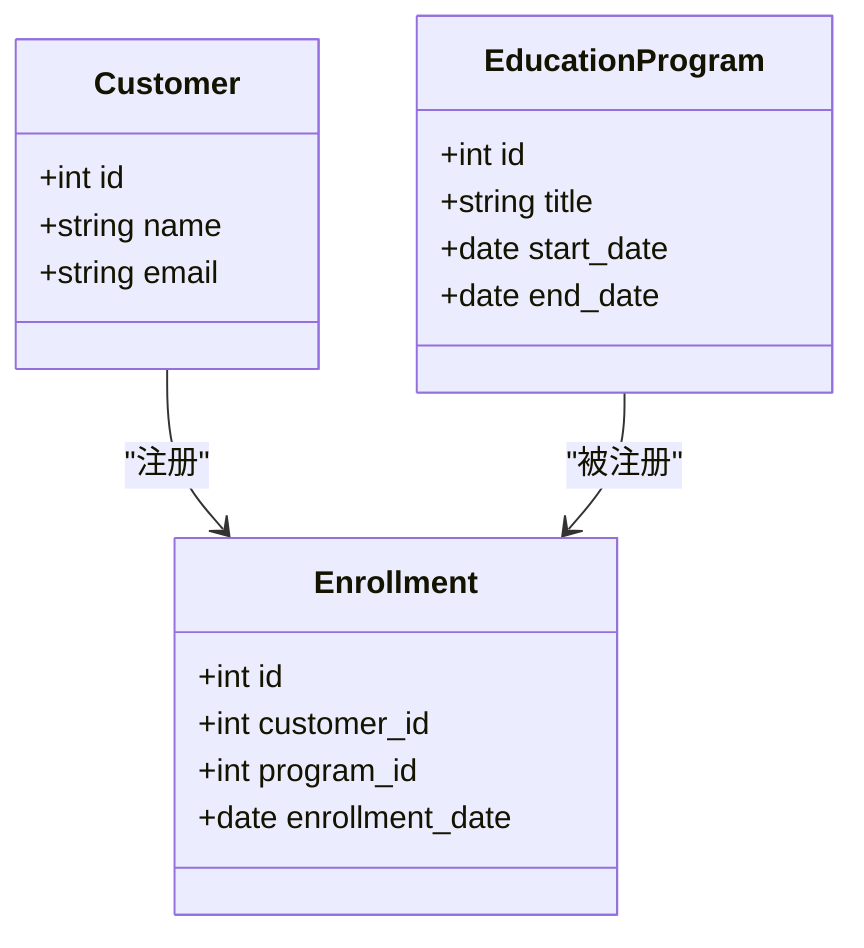
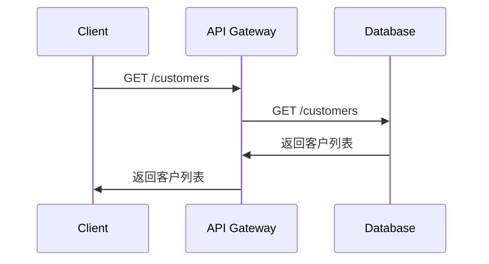

                 


# 彼得林奇如何分析公司的客户教育投资长期效果

## 关键词：客户教育投资，长期效果，彼得·林奇，投资分析，公司发展

## 摘要：彼得·林奇通过分析客户教育投资的长期效果，揭示了客户教育投资对客户忠诚度、品牌价值和公司收益的影响。本文从客户教育投资的核心概念、算法原理、系统架构、项目实战等方面进行详细分析，帮助读者掌握如何有效评估和优化客户教育投资。

---

# 第1章: 客户教育投资的核心概念与背景

## 1.1 客户教育投资的定义与背景

### 1.1.1 什么是客户教育投资
客户教育投资是指公司通过提供教育性的内容或服务，帮助客户更好地理解和使用公司的产品或服务。这种投资旨在提升客户的知识水平和使用能力，从而增强客户对公司的忠诚度和满意度。

### 1.1.2 客户教育投资的重要性
客户教育投资是公司长期发展的关键因素之一。通过教育客户，公司可以提高客户的产品使用效率，降低客户流失率，并增强客户对公司品牌和产品的认可。

### 1.1.3 客户教育投资的边界与外延
客户教育投资的边界在于其目标是通过教育客户来提升客户价值，而非直接销售产品。其外延包括各种教育渠道和内容，如在线课程、培训研讨会、用户手册等。

---

## 1.2 客户教育投资的核心要素

### 1.2.1 教育内容的设计
教育内容的设计是客户教育投资的关键。内容应针对不同客户群体的需求，提供个性化和实用的教育信息。

### 1.2.2 教育渠道的选择
教育渠道的选择影响教育效果。公司应根据目标客户的偏好选择合适的渠道，如在线、面对面培训或邮件 newsletters。

### 1.2.3 教育效果的评估
教育效果的评估是确保投资回报的重要步骤。公司应通过客户反馈、使用数据和市场表现来衡量教育投资的效果。

---

## 1.3 客户教育投资与公司长期发展的关系

### 1.3.1 客户教育投资对客户忠诚度的影响
通过教育客户，公司可以增强客户对产品的信任和依赖，从而提高客户忠诚度。

### 1.3.2 客户教育投资对品牌价值的提升
客户教育投资有助于提升公司的品牌形象，使客户对公司产生更高的信任和忠诚度。

### 1.3.3 客户教育投资对公司长期收益的贡献
客户教育投资通过提升客户满意度和忠诚度，间接推动公司的长期收益增长。

---

## 1.4 本章小结

---

# 第2章: 客户教育投资的核心概念与联系

## 2.1 客户教育投资的原理

### 2.1.1 教育投资的基本原理
客户教育投资通过提供有价值的知识和技能，提升客户的使用能力和满意度，从而增强客户对公司产品的依赖。

### 2.1.2 教育投资的核心要素
教育内容的设计、教育渠道的选择和教育效果的评估是教育投资的核心要素。

---

## 2.2 客户教育投资的属性特征对比

### 2.2.1 不同教育渠道的特征对比

| 教育渠道   | 优点                           | 缺点                           |
|------------|--------------------------------|--------------------------------|
| 在线课程   | 成本低，覆盖面广               | 互动性差                     |
| 面对面培训 | 互动性强，效果显著           | 成本高，覆盖面小               |
| 邮件 newsletter | 成本低，便于自动化           | 内容深度有限                   |

### 2.2.2 不同教育内容的特征对比

| 教育内容     | 优点                           | 缺点                           |
|--------------|--------------------------------|--------------------------------|
| 基础知识培训 | 易理解，适合新客户           | 内容过于基础，不适合资深客户   |
| 高级技能培训 | 提高客户的专业能力           | 学习曲线陡峭，适合资深客户     |

---

## 2.3 客户教育投资的ER实体关系图

```mermaid
erDiagram
    customer {
        +int id
        +string name
        +string email
    }
    education_program {
        +int id
        +string title
        +date start_date
        +date end_date
    }
    enrollment {
        +int id
        +int customer_id
        +int program_id
        +date enrollment_date
    }
    customer -> enrollment : "注册了"
    education_program -> enrollment : "被注册"
```

---

## 2.4 本章小结

---

# 第3章: 客户教育投资的算法原理讲解

## 3.1 客户教育投资的算法概述

### 3.1.1 算法的基本原理
客户教育投资的算法基于客户生命周期价值（CLV）模型，通过分析客户的长期价值，评估教育投资的回报。

### 3.1.2 算法的核心步骤
1. 收集客户数据
2. 分析客户行为
3. 计算客户终身价值
4. 评估教育投资回报

---

## 3.2 客户教育投资的数学模型与公式

### 3.2.1 客户终身价值（Customer Lifetime Value, CLV）公式

$$
CLV = \frac{R}{(1 - d)^n}
$$

其中：
- R 是客户每年带来的收入
- d 是客户流失率
- n 是客户生命周期的年数

### 3.2.2 客户教育投资回报（ROI）计算

$$
ROI = \frac{CLV - C}{C} \times 100\%
$$

其中：
- C 是客户教育投资成本
- CLV 是客户终身价值

---

## 3.3 客户教育投资的算法实现

### 3.3.1 Python代码实现

```python
def calculate_clv(customers, retention_rate, discount_rate, years):
    clv = 0
    for year in range(years):
        clv += (customers * (retention_rate ** year)) / (1 + discount_rate)
    return clv

def calculate_roi(clv, cost):
    roi = (clv - cost) / cost * 100
    return roi

# 示例
customers = 1000
retention_rate = 0.8
discount_rate = 0.05
years = 5
cost = 10000

clv = calculate_clv(customers, retention_rate, discount_rate, years)
roi = calculate_roi(clv, cost)

print(f"CLV: {clv}")
print(f"ROI: {roi}%")
```

---

## 3.4 本章小结

---

# 第4章: 客户教育投资的系统分析与架构设计方案

## 4.1 系统功能设计

### 4.1.1 领域模型类图



---

## 4.2 系统架构设计

### 4.2.1 系统架构图

```mermaid
graph TD
    Client --> API Gateway
    API Gateway --> Database
    Database --> Customer
    Database --> EducationProgram
    Database --> Enrollment
```

---

## 4.3 系统接口设计

### 4.3.1 接口设计

- **GET /customers**: 获取所有客户信息
- **POST /programs**: 创建新的教育计划
- **GET /enrollments**: 获取所有注册记录

---

## 4.4 系统交互设计

### 4.4.1 交互流程图



---

## 4.5 本章小结

---

# 第5章: 客户教育投资的项目实战

## 5.1 环境安装

### 5.1.1 安装Python
```bash
python --version
pip install --upgrade pip
```

### 5.1.2 安装依赖
```bash
pip install pandas numpy matplotlib
```

---

## 5.2 系统核心实现

### 5.2.1 实现客户终身价值计算

```python
import pandas as pd

def calculate_clv(customers, retention_rate, discount_rate, years):
    clv = 0
    for year in range(years):
        clv += (customers * (retention_rate ** year)) / (1 + discount_rate)
    return clv

# 示例数据
customers = 1000
retention_rate = 0.8
discount_rate = 0.05
years = 5

clv = calculate_clv(customers, retention_rate, discount_rate, years)
print(f"CLV: {clv}")
```

---

## 5.3 代码应用解读与分析

### 5.3.1 代码解读
上述代码实现了客户终身价值的计算，通过循环累加每年的客户价值，考虑了客户流失率和贴现率的影响。

---

## 5.4 实际案例分析

### 5.4.1 案例分析
假设某公司投入10,000美元用于客户教育，计算其ROI：

```python
def calculate_roi(clv, cost):
    roi = (clv - cost) / cost * 100
    return roi

roi = calculate_roi(clv, 10000)
print(f"ROI: {roi}%")
```

---

## 5.5 项目小结

---

# 第6章: 最佳实践与未来展望

## 6.1 最佳实践 tips

### 6.1.1 定期评估教育投资效果
定期评估教育投资的效果，根据反馈调整教育内容和渠道。

### 6.1.2 结合客户生命周期管理
将客户教育投资与客户生命周期管理相结合，提升客户全生命周期价值。

### 6.1.3 利用数据分析工具
利用数据分析工具和机器学习算法，优化教育投资策略。

---

## 6.2 小结

---

## 6.3 注意事项

### 6.3.1 数据隐私保护
在收集和分析客户数据时，需注意数据隐私保护，遵守相关法律法规。

### 6.3.2 教育内容的实用性
教育内容应贴近客户实际需求，避免过于理论化。

---

## 6.4 拓展阅读

### 6.4.1 客户教育投资的经济学分析
深入理解客户教育投资的经济学原理，优化投资策略。

### 6.4.2 机器学习在客户教育中的应用
探索机器学习技术在客户教育中的应用，进一步提升教育效果。

---

# 作者：AI天才研究院/AI Genius Institute & 禅与计算机程序设计艺术 /Zen And The Art of Computer Programming

