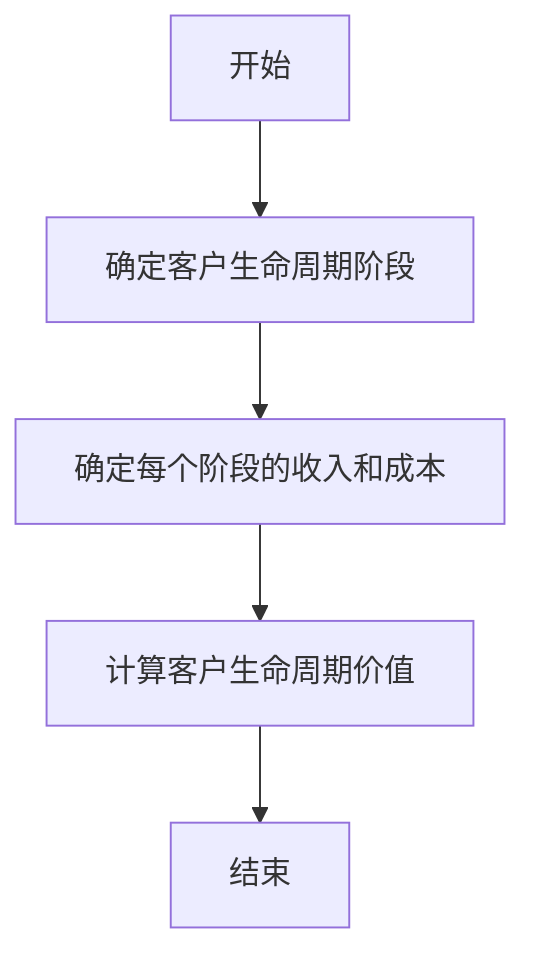

                 


# 彼得林奇如何分析公司的客户生命周期价值

## 关键词：客户生命周期价值、彼得林奇、投资分析、企业价值评估、客户管理

## 摘要：客户生命周期价值（Customer Lifetime Value，简称 CLV）是衡量客户为企业带来的长期价值的重要指标。本文将深入探讨彼得·林奇如何通过分析客户的生命周期价值来评估公司的投资价值。从客户生命周期价值的核心概念、计算方法、系统架构设计到实际应用案例，本文将全面解析这一方法，并结合具体的技术实现和最佳实践，帮助读者掌握如何将客户生命周期价值应用于企业决策中。

---

## 第一部分: 客户生命周期价值的背景与概念

### 第1章: 客户生命周期价值的背景与意义

#### 1.1 客户生命周期价值的定义与重要性

- **1.1.1 什么是客户生命周期价值**
  - 客户生命周期价值是指客户在其生命周期内为企业带来的净收益总和。
  - 它综合考虑了客户在不同阶段的收入贡献、成本投入和流失风险。

- **1.1.2 客户生命周期价值的重要性**
  - 通过分析客户生命周期价值，企业可以更精准地制定客户获取和保留策略。
  - 彼得·林奇认为，客户生命周期价值是评估企业长期盈利能力的关键指标。

- **1.1.3 彼得·林奇对客户生命周期价值的重视**
  - 彼得·林奇在投资分析中，特别关注客户生命周期价值，认为它是企业竞争优势的核心体现。
  - 他通过分析客户生命周期价值，评估企业的客户忠诚度和长期盈利能力。

#### 1.2 客户生命周期价值的核心概念

- **1.2.1 客户生命周期的阶段划分**
  - 初期阶段：客户刚接触企业，尚未产生交易。
  - 成熟阶段：客户开始频繁购买，贡献收入。
  - 衰退阶段：客户逐渐减少购买，最终流失。

- **1.2.2 客户生命周期价值的计算公式**
  - $$ CLV = \frac{R \times (1 + w \times (1 - \delta))}{\delta} $$
    - 其中，R是客户在某个阶段的收入，w是客户在该阶段的权重，δ是客户流失率。

- **1.2.3 客户生命周期价值与企业价值的关系**
  - 客户生命周期价值高的企业通常具有更强的市场竞争力和盈利能力。
  - 通过提升客户生命周期价值，企业可以实现可持续的收入增长。

#### 1.3 客户生命周期价值的行业应用

- **1.3.1 零售行业的客户生命周期价值分析**
  - 零售行业通过分析客户的购买频率和客单价，计算其生命周期价值。
  - 例如，通过分析客户购买历史，优化营销策略，提升客户忠诚度。

- **1.3.2 金融行业的客户生命周期价值分析**
  - 金融行业通过分析客户的信用评分和投资行为，评估其生命周期价值。
  - 例如，银行通过分析客户资产规模和交易活跃度，优化客户服务策略。

- **1.3.3 技术行业的客户生命周期价值分析**
  - 技术行业通过分析客户的订阅周期和使用频率，计算其生命周期价值。
  - 例如，软件公司通过分析客户续订率，优化产品设计和服务。

#### 1.4 本章小结

- 本章介绍了客户生命周期价值的定义、重要性及其在不同行业的应用。
- 强调了彼得·林奇对客户生命周期价值的重视，以及其在企业投资分析中的重要性。

---

## 第二部分: 客户生命周期价值的核心概念与联系

### 第2章: 客户生命周期价值的核心要素

#### 2.1 客户生命周期价值的核心要素

- **2.1.1 客户获取成本**
  - 客户获取成本是指企业在获取客户过程中所投入的资源和成本。
  - 包括广告费用、销售人员佣金、市场推广费用等。

- **2.1.2 客户保留成本**
  - 客户保留成本是指企业在保留客户过程中所投入的资源和成本。
  - 包括客户服务费用、技术支持费用、忠诚度计划费用等。

- **2.1.3 客户的生命周期阶段**
  - 初期阶段：客户刚接触企业，尚未产生交易。
  - 成熟阶段：客户开始频繁购买，贡献收入。
  - 衰退阶段：客户逐渐减少购买，最终流失。

- **2.1.4 客户的贡献价值**
  - 客户贡献价值是指客户在生命周期内为企业带来的净收益。
  - 计算公式：$$ \text{贡献价值} = \text{总收入} - \text{总成本} $$

#### 2.2 客户生命周期价值的属性特征对比

- **2.2.1 不同生命周期阶段的客户价值对比**
  - 初期阶段：客户价值较低，但潜力大。
  - 成熟阶段：客户价值最高，贡献收入最多。
  - 衰退阶段：客户价值下降，流失风险增加。

- **2.2.2 不同行业客户生命周期价值的对比**
  - 高科技行业：客户生命周期价值较高，但生命周期较短。
  - 零售行业：客户生命周期价值中等，但客户基数大。
  - 金融行业：客户生命周期价值较高，但获取成本较高。

- **2.2.3 客户生命周期价值与客户满意度的关系**
  - 客户满意度高，客户生命周期价值通常较高。
  - 但高满意度并不一定意味着高客户生命周期价值，需结合客户行为分析。

#### 2.3 客户生命周期价值的ER实体关系图

```mermaid
er
    顾客(顾客ID, 顾客姓名, 联系方式, 注册时间)
    客户生命周期阶段(生命周期阶段ID, 阶段名称, 开始时间, 结束时间)
    客户价值(客户价值ID, 顾客ID, 生命周期阶段ID, 价值金额, 计算时间)
    顾客 -[1..n]-> 客户生命周期阶段
    顾客 -[1..n]-> 客户价值
```

---

## 第三部分: 客户生命周期价值的算法原理

### 第3章: 客户生命周期价值的计算方法

#### 3.1 客户生命周期价值的计算公式

- **3.1.1 基本公式**
  $$ CLV = \frac{R \times (1 + w \times (1 - \delta))}{\delta} $$
  - R：客户在某个阶段的收入。
  - w：客户在该阶段的权重。
  - δ：客户流失率。

- **3.1.2 示例计算**
  - 假设R = $100，w = 0.3，δ = 0.1
  - $$ CLV = \frac{100 \times (1 + 0.3 \times (1 - 0.1))}{0.1} = \frac{100 \times 1.27}{0.1} = 1270 $$

#### 3.2 客户生命周期价值的计算流程



#### 3.3 客户生命周期价值的算法实现

- **3.3.1 Python代码实现**
  ```python
  def calculate_clv(customers, revenue_per_stage, weights, churn_rate):
      clv = {}
      for customer in customers:
          total_revenue = 0
          for stage in range(len(revenue_per_stage)):
              total_revenue += revenue_per_stage[stage] * weights[stage]
          clv[customer] = total_revenue / churn_rate
      return clv
  ```

- **3.3.2 代码解读**
  - 输入：客户列表、每个阶段的收入、每个阶段的权重、客户流失率。
  - 输出：每个客户的生命周期价值。
  - 计算过程：对每个客户，在每个阶段计算收入贡献，综合权重后求和，最后除以流失率得到CLV。

---

## 第四部分: 客户生命周期价值的系统分析与架构设计

### 第4章: 客户生命周期价值的系统架构

#### 4.1 系统功能设计

- **4.1.1 领域模型**
  ```mermaid
  classDiagram
      class 客户 {
          顾客ID
          顾客姓名
          联系方式
          注册时间
      }
      class 客户生命周期阶段 {
          生命周期阶段ID
          阶段名称
          开始时间
          结束时间
      }
      class 客户价值 {
          客户价值ID
          顾客ID
          生命周期阶段ID
          价值金额
          计算时间
      }
      客户 --> 客户生命周期阶段
      客户 --> 客户价值
  ```

- **4.1.2 系统架构设计**
  ```mermaid
  architecture
      [客户数据层] --> [客户生命周期阶段层]
      [客户生命周期阶段层] --> [客户价值层]
      [客户价值层] --> [业务逻辑层]
      [业务逻辑层] --> [用户界面层]
  ```

- **4.1.3 系统接口设计**
  - 输入接口：客户数据输入、阶段参数输入。
  - 输出接口：生命周期价值输出、可视化报告输出。

- **4.1.4 系统交互序列图**
  ```mermaid
  sequenceDiagram
      用户 -> 系统: 输入客户数据
      系统 -> 数据层: 获取客户生命周期阶段
      数据层 -> 系统: 返回生命周期阶段
      系统 -> 业务逻辑层: 计算客户价值
      业务逻辑层 -> 用户: 显示客户价值报告
  ```

---

## 第五部分: 客户生命周期价值的项目实战

### 第5章: 客户生命周期价值的项目实战

#### 5.1 环境安装

- 安装Python和必要的库：
  ```bash
  pip install numpy pandas matplotlib
  ```

#### 5.2 系统核心实现源代码

- **5.2.1 数据处理代码**
  ```python
  import pandas as pd
  import numpy as np

  def load_data():
      # 加载客户数据
      df = pd.read_csv('customers.csv')
      return df

  def process_data(df):
      # 数据预处理
      df['注册时间'] = pd.to_datetime(df['注册时间'])
      return df
  ```

- **5.2.2 客户生命周期价值计算代码**
  ```python
  def calculate_clv(df):
      # 假设df包含'顾客ID', '生命周期阶段ID', '收入', '成本'
      df['贡献价值'] = df['收入'] - df['成本']
      clv = df.groupby('顾客ID')['贡献价值'].sum()
      return clv
  ```

#### 5.3 代码应用解读与分析

- 通过数据处理代码，加载客户数据并进行预处理。
- 使用计算函数，对每个客户计算其生命周期价值。
- 生成可视化报告，展示客户生命周期价值分布。

#### 5.4 案例分析和详细讲解

- **案例分析**
  - 假设一家零售企业，有1000名客户。
  - 计算每个客户的生命周期价值，识别高价值客户。
  - 根据结果制定针对性的营销策略。

#### 5.5 项目小结

- 本章通过实际案例，展示了如何在企业中应用客户生命周期价值分析。
- 强调了数据处理和计算过程中的关键步骤。

---

## 第六部分: 客户生命周期价值的最佳实践

### 第6章: 客户生命周期价值的最佳实践

#### 6.1 最佳实践 tips

- 定期更新客户数据，确保计算结果准确。
- 根据行业特点，调整计算模型和参数。
- 结合客户行为分析，优化客户生命周期价值计算。

#### 6.2 小结

- 客户生命周期价值是企业分析客户价值的重要工具。
- 通过彼得·林奇的方法，企业可以更精准地评估投资价值。

#### 6.3 注意事项

- 客户数据的准确性和完整性是计算客户生命周期价值的基础。
- 需要结合企业实际情况，调整计算模型和参数。

#### 6.4 拓展阅读

- 推荐阅读《彼得·林奇的投资哲学》。
- 参考相关学术论文，深入理解客户生命周期价值的理论与实践。

---

## 作者：AI天才研究院/AI Genius Institute & 禅与计算机程序设计艺术 /Zen And The Art of Computer Programming

