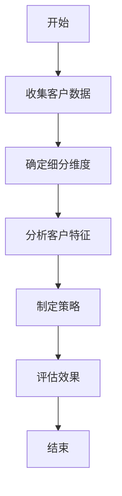
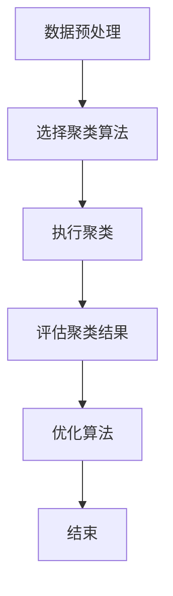
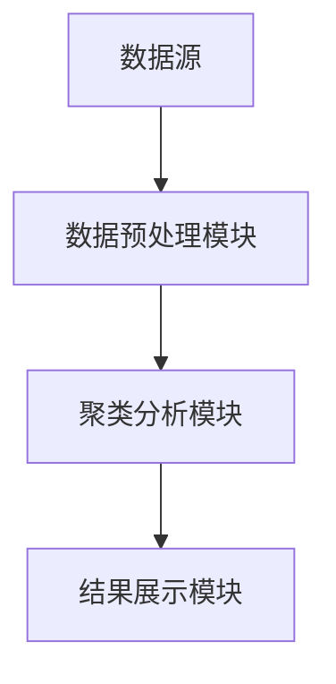
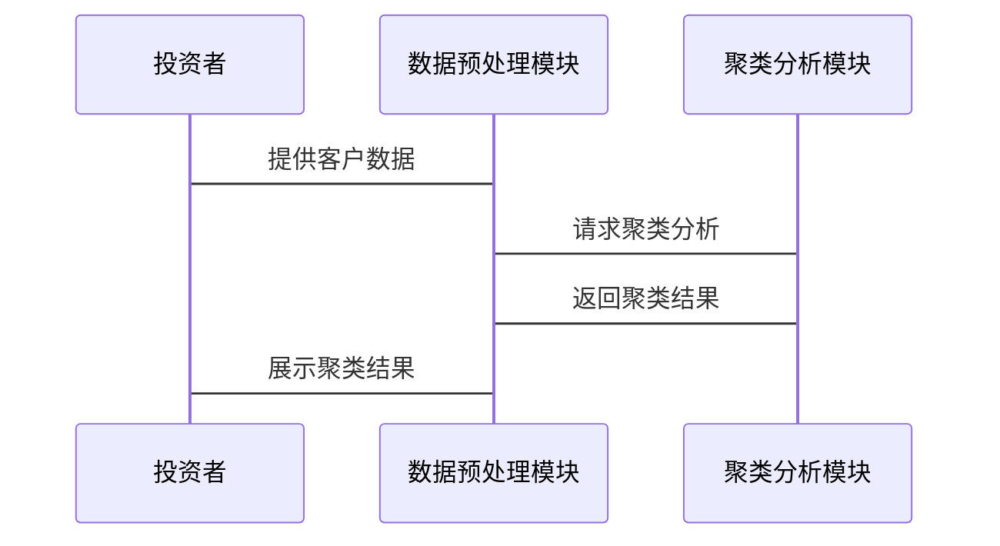

                 


# 彼得·林奇如何分析公司的客户细分策略演变

> 关键词：客户细分，彼得·林奇，投资分析，策略演变，企业价值

> 摘要：本文深入分析了彼得·林奇如何通过客户细分策略来评估和选择投资目标。从客户细分的基本概念到其在投资分析中的应用，再到具体的算法原理和系统架构设计，详细阐述了彼得·林奇客户细分策略的演变过程和实际案例。

---

## 第一部分：背景介绍

### 第1章：客户细分策略的基本概念

#### 1.1 什么是客户细分

客户细分是指将客户群体按照某些共同特征（如年龄、性别、收入水平、消费习惯等）进行分类的过程。通过客户细分，企业可以更好地理解客户的需求，制定更有针对性的营销策略。

- **客户细分的定义**：客户细分是将客户群体按照特定特征划分成若干子群体的过程。
- **客户细分的核心要素**：包括客户的基本属性（如年龄、性别）、行为特征（如购买频率、消费金额）和心理特征（如品牌忠诚度）。
- **客户细分与企业价值的关系**：客户细分帮助企业更好地满足不同客户群体的需求，从而提升客户满意度和忠诚度，进而增加企业价值。

#### 1.2 彼得·林奇的客户细分方法

彼得·林奇是美国著名投资家，以其对企业基本面的深入分析而闻名。他在选择投资目标时，非常注重对客户群体的细分和分析。

- **林奇的客户细分理念**：林奇认为，客户细分是理解企业市场地位和竞争优势的关键。他通过分析企业的客户群体特征，判断企业的市场定位和未来发展潜力。
- **林奇客户细分的三大原则**：
  1. **客户群体的稳定性**：客户群体是否稳定，是否具有持续的购买力。
  2. **客户群体的增长性**：客户群体是否具有增长潜力，是否能够为企业带来持续的收入增长。
  3. **客户群体的忠诚度**：客户群体是否对企业具有较高的忠诚度，是否会持续选择该企业的产品或服务。

- **林奇客户细分策略的演变过程**：随着市场环境的变化，林奇的客户细分策略也在不断演变。从最初的基于地理和人口统计的细分，到后来基于客户行为和需求的细分，再到如今结合大数据和人工智能的客户细分方法。

#### 1.3 投资分析中的客户细分策略

在投资分析中，客户细分策略是评估企业价值的重要工具。通过分析企业的客户群体特征，投资者可以更好地理解企业的市场地位和竞争优势。

- **客户细分在投资分析中的作用**：客户细分帮助企业识别核心客户群体，优化资源配置，提高客户满意度和忠诚度，从而提升企业价值。
- **林奇如何通过客户细分评估企业价值**：林奇通过分析企业的客户群体特征，判断企业的市场定位和未来发展潜力，从而做出投资决策。
- **林奇客户细分策略的边界与外延**：客户细分策略的边界在于企业的核心业务领域，外延则包括企业的客户关系管理和客户体验优化。

---

### 第2章：客户细分策略的核心概念与联系

#### 2.1 客户细分的核心概念

客户细分的核心概念包括客户群体的特征、细分维度以及客户群体与企业战略的关系。

- **客户细分的属性特征**：包括客户的基本属性（如年龄、性别）、行为特征（如购买频率、消费金额）和心理特征（如品牌忠诚度）。
- **客户细分的分类维度**：常见的分类维度包括地理维度、人口统计维度、行为维度和心理维度。
- **客户细分与企业战略的关系**：客户细分是企业制定市场战略的重要依据，通过细分客户群体，企业可以更好地满足客户需求，提升市场竞争力。

#### 2.2 客户细分策略的ER实体关系图

以下是客户细分策略的ER实体关系图：

```mermaid
er
actor: 投资者
actor -|> 战略: 客户细分策略
actor -|> 数据: 客户数据
actor -|> 分析: 细分分析
```

- **actor（投资者）**：投资者是客户细分策略的主要决策者，通过分析客户数据制定客户细分策略。
- **战略（客户细分策略）**：客户细分策略是投资者制定市场战略的重要工具。
- **数据（客户数据）**：客户数据是客户细分的基础，包括客户的各项特征和行为数据。
- **分析（细分分析）**：细分分析是客户细分的核心过程，通过对客户数据的分析，识别出不同的客户群体。

#### 2.3 客户细分策略的流程图

以下是客户细分策略的流程图：



- **开始**：开始客户细分分析。
- **收集客户数据**：收集客户的各项特征和行为数据。
- **确定细分维度**：根据客户数据的特征，确定细分维度。
- **分析客户特征**：通过数据分析，识别出不同的客户群体。
- **制定策略**：根据客户群体的特征，制定相应的市场策略。
- **评估效果**：评估客户细分策略的实施效果。
- **结束**：结束客户细分分析过程。

---

### 第3章：客户细分策略的算法原理

#### 3.1 客户细分的算法概述

客户细分的算法主要包括聚类分析、决策树分析和神经网络分析等。

- **聚类分析**：聚类分析是一种无监督学习方法，通过将客户数据分成若干个簇，每个簇代表一个客户群体。
- **决策树分析**：决策树分析是一种基于特征的客户细分方法，通过构建决策树来划分客户群体。
- **神经网络分析**：神经网络分析是一种基于深度学习的客户细分方法，通过训练神经网络模型来识别客户群体。

#### 3.2 聚类分析算法流程图

以下是聚类分析算法的流程图：



- **数据预处理**：对客户数据进行清洗和标准化处理。
- **选择聚类算法**：根据数据特征选择合适的聚类算法。
- **执行聚类**：通过聚类算法将客户数据分成若干个簇。
- **评估聚类结果**：评估聚类结果的质量，判断是否符合实际需求。
- **优化算法**：根据评估结果优化聚类算法，提高聚类效果。
- **结束**：结束聚类分析过程。

#### 3.3 聚类分析的数学模型

聚类分析的核心公式是计算客户之间的距离：

$$
距离 = \sqrt{(x_i - x_j)^2 + (y_i - y_j)^2}
$$

其中，$(x_i, y_i)$ 和 $(x_j, y_j)$ 分别表示两个客户的特征向量。

---

### 第4章：客户细分策略的系统分析与架构设计

#### 4.1 系统分析

客户细分策略的系统分析包括需求分析、系统设计和系统实现。

- **需求分析**：通过分析客户数据，确定客户细分的目标和需求。
- **系统设计**：设计客户细分系统的功能模块和数据流程。
- **系统实现**：根据系统设计，编写客户细分系统的代码实现。

#### 4.2 系统架构设计

以下是客户细分系统的架构设计图：



- **数据源**：客户数据的来源，包括客户的基本信息和行为数据。
- **数据预处理模块**：对客户数据进行清洗和标准化处理。
- **聚类分析模块**：通过聚类算法将客户数据分成若干个簇。
- **结果展示模块**：展示聚类结果，帮助投资者制定客户细分策略。

#### 4.3 系统交互设计

以下是客户细分系统的交互序列图：



---

### 第5章：客户细分策略的项目实战

#### 5.1 环境安装

以下是客户细分策略的环境安装步骤：

1. **安装Python**：安装Python编程语言，版本建议为3.6及以上。
2. **安装NumPy和Scipy**：安装NumPy和Scipy库，用于数据处理和聚类分析。
3. **安装Scikit-learn**：安装Scikit-learn库，用于聚类分析。

#### 5.2 核心代码实现

以下是客户细分策略的核心代码实现：

```python
from sklearn.cluster import KMeans
from sklearn.preprocessing import StandardScaler
import numpy as np

# 数据预处理
data = np.array([[25, 5000], [35, 7000], [45, 10000], [55, 8000]])
scaler = StandardScaler()
data_scaled = scaler.fit_transform(data)

# 聚类分析
kmeans = KMeans(n_clusters=2, random_state=0)
clusters = kmeans.fit_predict(data_scaled)

# 展示结果
print(clusters)
```

#### 5.3 案例分析

以下是一个客户细分策略的实际案例分析：

**案例背景**：某零售企业希望通过对客户数据的分析，制定更有针对性的营销策略。

**数据分析**：通过对客户的年龄、收入、消费金额等特征进行分析，将客户分成高收入、中收入和低收入三个群体。

**策略制定**：针对高收入客户，制定高端产品推广策略；针对中收入客户，制定中端产品推广策略；针对低收入客户，制定低端产品推广策略。

---

## 第二部分：总结与展望

### 6.1 最佳实践

- **数据质量管理**：确保客户数据的准确性和完整性。
- **算法选择**：根据客户数据的特征选择合适的聚类算法。
- **结果验证**：通过交叉验证等方法验证聚类结果的有效性。

### 6.2 小结

彼得·林奇的客户细分策略是投资分析中的重要工具。通过对客户群体的深入分析，投资者可以更好地理解企业的市场定位和竞争优势，从而做出更明智的投资决策。

### 6.3 注意事项

- **数据隐私保护**：在客户数据分析过程中，需要注意客户隐私保护，遵守相关法律法规。
- **模型解释性**：聚类模型的解释性需要足够强，以便投资者能够理解并应用聚类结果。

### 6.4 拓展阅读

- **书籍推荐**：《彼得·林奇的投资哲学》
- **技术博客**：深入探讨聚类分析的数学原理和实际应用。

---

作者：AI天才研究院/AI Genius Institute & 禅与计算机程序设计艺术 /Zen And The Art of Computer Programming

