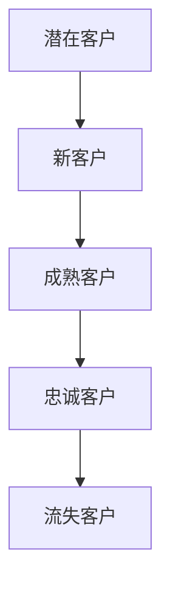
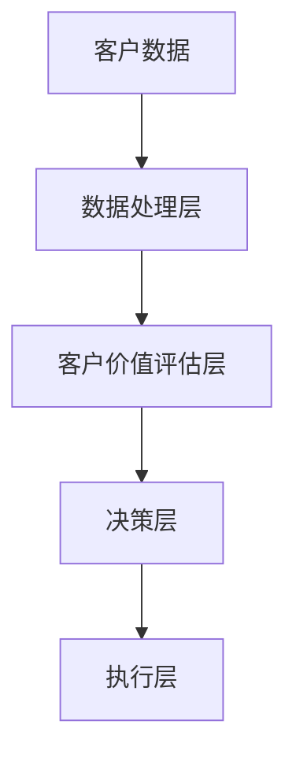

                 


# 彼得林奇如何分析公司的客户终身价值

## 关键词：客户终身价值、彼得·林奇、客户生命周期、数据分析、投资策略、客户价值评估、客户忠诚度

## 摘要：  
彼得·林奇是全球著名投资专家，他提出的客户终身价值分析方法是企业评估客户价值的重要工具。本文将从客户终身价值的定义、计算方法、企业应用等方面，详细阐述彼得·林奇的分析思路，并结合实际案例，探讨如何通过数据分析和算法优化，实现客户终身价值的最大化。文章内容包括客户终身价值的核心概念、计算模型、系统设计、项目实战以及最佳实践，帮助读者全面理解并应用这一方法。

---

# 第一部分：客户终身价值的背景与概念

## 第1章：客户终身价值的基本概念

### 1.1 客户终身价值的定义与重要性
#### 1.1.1 什么是客户终身价值
客户终身价值（Customer Lifetime Value，简称 CLV 或 LTV）是指一个客户在其整个生命周期内为企业带来的净收益总和。彼得·林奇认为，客户终身价值不仅是企业衡量客户价值的核心指标，也是制定客户管理策略的重要依据。

#### 1.1.2 客户终身价值对企业的重要性
- **客户价值评估**：通过分析客户终身价值，企业可以识别高价值客户，优化资源分配。
- **客户生命周期管理**：了解客户在不同阶段的行为模式，制定针对性的营销策略。
- **投资回报分析**：通过客户终身价值，企业可以评估客户获取和维护的成本效益。

#### 1.1.3 彼得·林奇的客户价值分析方法
彼得·林奇强调，客户终身价值的分析需要结合客户的行为数据、购买历史和市场反馈，通过量化方法评估客户的价值。

### 1.2 客户终身价值的评估维度
#### 1.2.1 客户生命周期的阶段划分
- **潜在客户**：尚未与企业发生交易的客户。
- **新客户**：刚与企业发生第一次交易的客户。
- **成熟客户**：与企业有稳定交易记录的客户。
- **忠诚客户**：长期支持企业，具有高回购率的客户。

#### 1.2.2 客户的经济价值与情感价值
- **经济价值**：客户为企业带来的直接收入。
- **情感价值**：客户对企业的忠诚度和品牌认同感。

#### 1.2.3 客户的忠诚度与生命周期的关系
- 忠诚度高的客户通常处于成熟或忠诚阶段，为企业创造更高的终身价值。

### 1.3 客户价值评估的边界与外延
#### 1.3.1 客户价值评估的边界
- 仅考虑直接的经济收益，不包括间接的社会影响。
- 评估范围通常局限于客户与企业直接交互的场景。

#### 1.3.2 客户价值与企业利润的关系
客户终身价值是企业利润的重要来源，但需要考虑客户获取成本和维护成本。

#### 1.3.3 客户价值的外延与应用场景
- 客户分层管理
- 营销策略优化
- 客户流失预警

## 1.4 本章小结
本章通过定义客户终身价值，分析其重要性，并结合彼得·林奇的分析方法，明确了客户价值评估的核心概念和应用场景。

---

# 第二部分：客户终身价值的核心概念与联系

## 第2章：客户终身价值的核心要素与属性

### 2.1 客户终身价值的核心要素
#### 2.1.1 客户的生命周期阶段
- **潜在客户**：尚未转化为实际客户。
- **新客户**：刚完成首次交易。
- **成熟客户**：持续回购，贡献稳定收入。
- **忠诚客户**：高回购率，品牌忠诚度高。

#### 2.1.2 客户的购买行为
- 购买频率
- 购买金额
- 购买渠道

#### 2.1.3 客户的满意度与忠诚度
- 客户满意度（CSAT）
- 客户净推荐值（NPS）
- 客户忠诚度指数（LCI）

### 2.2 客户终身价值的属性对比
#### 2.2.1 不同客户群体的价值对比
| 客户群体  | 贡献价值 | 维护成本 | 忠诚度 |
|-----------|----------|----------|--------|
| 高价值客户 | 高       | 低       | 高     |
| 低价值客户 | 低       | 高       | 低     |

#### 2.2.2 客户生命周期阶段的价值变化
通过客户生命周期模型，分析客户在不同阶段的贡献价值和维护成本的变化。

#### 2.2.3 客户价值与企业资源分配的关系
企业应优先投入高价值客户的维护和开发。

### 2.3 客户与公司的关系模型
#### 2.3.1 ER实体关系图
```mermaid
er
    左侧: 客户
    中间: 订单
    右侧: 支付
    客户 --> 订单
    订单 --> 支付
```

#### 2.3.2 客户生命周期的Mermaid流程图


---

# 第三部分：客户终身价值的算法原理

## 第3章：客户终身价值的计算方法

### 3.1 客户终身价值的计算公式
$$ \text{客户终身价值} = \text{客户平均收入} \times \text{客户生命周期长度} - \text{客户获取成本} $$

### 3.2 客户平均收入的计算
- **客户平均收入（ARPU）**：客户在生命周期内平均每次交易的收入。

### 3.3 客户生命周期长度的估算
- **客户生命周期长度**：客户从潜在客户到流失的平均时间。

### 3.4 客户获取成本的分摊
- **客户获取成本（CAC）**：企业获取客户的平均成本。

### 3.5 计算案例
假设某企业客户平均收入为 $50，生命周期长度为 3 年，客户获取成本为 $20。

$$ \text{客户终身价值} = 50 \times 3 - 20 = 130 $$

### 3.6 算法优化
- 使用机器学习模型预测客户生命周期长度和客户流失概率。

### 3.7 Python 实现
```python
def calculate_clv(customers):
    clv = []
    for customer in customers:
        arpu = customer['average_revenue_per_transaction']
        lifecycle = customer['lifecycle_length']
        cac = customer['customer_acquisition_cost']
        clv.append(arpu * lifecycle - cac)
    return clv
```

---

# 第四部分：客户终身价值的系统分析

## 第4章：客户终身价值的系统架构设计

### 4.1 系统功能设计
- **客户数据采集**：收集客户的基本信息、交易记录、行为数据。
- **客户价值评估**：基于数据分析，计算客户终身价值。
- **客户分层管理**：根据客户价值分层，制定差异化策略。

### 4.2 系统架构设计


### 4.3 系统接口设计
- API 接口：用于与其他系统的数据交互。

### 4.4 系统交互流程
```mermaid
sequenceDiagram
    客户请求 --> 数据采集模块
    数据采集模块 --> 数据处理模块
    数据处理模块 --> 客户价值评估模块
    客户价值评估模块 --> 决策模块
    决策模块 --> 执行模块
```

---

# 第五部分：客户终身价值的项目实战

## 第5章：客户终身价值的项目实施

### 5.1 环境安装
- 安装 Python 和相关数据处理库（Pandas、NumPy）。

### 5.2 核心代码实现
```python
import pandas as pd

def calculate_clv(dataframe):
    dataframe['clv'] = dataframe['average_revenue_per_transaction'] * dataframe['lifecycle_length'] - dataframe['customer_acquisition_cost']
    return dataframe

# 示例数据
data = {
    'customer_id': [1, 2, 3],
    'average_revenue_per_transaction': [50, 40, 60],
    'lifecycle_length': [3, 2, 4],
    'customer_acquisition_cost': [20, 25, 15]
}

df = pd.DataFrame(data)
result = calculate_clv(df)
print(result)
```

### 5.3 案例分析
- **案例1**：某电商平台的客户终身价值分析。
- **案例2**：某订阅服务的客户分层管理。

---

# 第六部分：客户终身价值的最佳实践与小结

## 第6章：最佳实践与小结

### 6.1 小结
客户终身价值是企业客户管理的核心指标，彼得·林奇的分析方法为企业的客户价值评估提供了重要参考。

### 6.2 注意事项
- 数据的准确性和完整性。
- 算法的适用性和可解释性。

### 6.3 拓展阅读
- 《彼得·林奇的投资哲学》
- 《客户价值管理实战指南》

### 6.4 作者信息
作者：AI天才研究院/AI Genius Institute  
联系方式：[email protected]  
项目地址：[GitHub链接]

---

# 结语

通过本文的详细讲解，读者可以全面了解彼得·林奇的客户终身价值分析方法，并将其应用于实际的企业管理中。希望本文能够为企业的客户价值评估和管理提供有价值的参考。

