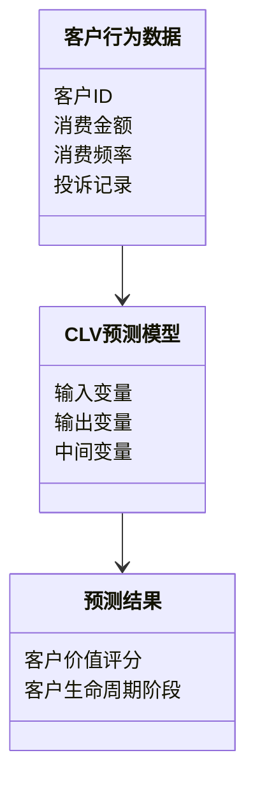
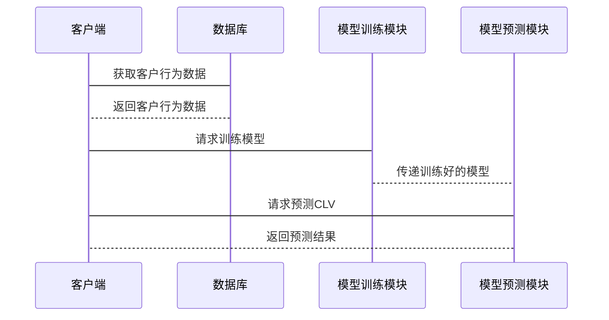

                 


# 彼得林奇如何分析公司的客户终身价值预测模型准确性

> 关键词：客户终身价值、预测模型、准确性分析、彼得·林奇、投资分析、模型评估

> 摘要：客户终身价值（CLV）是企业预测客户生命周期内为企业带来的总收益的重要指标，其准确性直接影响企业的营销策略和客户管理决策。本文从彼得·林奇的投资分析方法出发，探讨如何通过客户行为数据分析、模型选择与优化、算法原理、系统架构设计以及项目实战等多方面，提升CLV预测模型的准确性与可解释性，为企业制定精准的客户策略提供科学依据。

---

# 第1章：客户终身价值（CLV）的基本概念

## 1.1 CLV的定义与核心概念

### 1.1.1 CLV的定义与核心概念
客户终身价值（Customer Lifetime Value，CLV）是指一个客户在其生命周期内为企业带来的净收益总和。CLV的计算考虑了客户在未来一段时间内的消费行为、生命周期阶段、客户流失概率以及企业的成本结构等因素。CLV的核心在于量化客户对企业的长期价值，从而帮助企业制定更有效的客户 acquisition 和 retention策略。

### 1.1.2 CLV在企业价值管理中的重要性
CLV不仅是企业制定定价策略和营销策略的重要依据，还是评估客户关系管理（CRM）效果的关键指标。通过CLV，企业可以识别高价值客户，优化资源配置，提高客户满意度和忠诚度，最终实现企业价值的最大化。

### 1.1.3 CLV与企业可持续发展的关系
CLV不仅关注短期收益，还强调客户生命周期的长期价值，这与企业的可持续发展战略高度契合。通过优化CLV，企业可以在提高客户忠诚度的同时，降低客户获取成本，实现经济效益与社会责任的双重目标。

---

## 1.2 彼得·林奇的分析方法与投资哲学

### 1.2.1 彼得·林奇的投资理念概述
彼得·林奇是全球著名投资经理，以其独特的投资分析方法闻名。他强调基本面分析，注重研究企业的财务数据、行业地位、管理层能力和市场前景。林奇认为，成功的投资取决于对企业内在价值的准确评估。

### 1.2.2 林奇分析模型的核心要素
林奇的分析模型以基本面分析为核心，包括对企业财务报表（利润表、资产负债表、现金流量表）的深入研究、行业趋势分析、竞争优势评估以及管理层能力评估。他特别关注企业的ROE（净资产收益率）和周转率，认为这些指标是衡量企业盈利能力的重要标准。

### 1.2.3 林奇分析方法在CLV预测中的应用
林奇的分析方法强调对企业基本面的深入研究，这与CLV预测模型的核心要素高度契合。通过分析客户的消费行为数据、市场趋势和行业竞争格局，林奇的方法可以帮助企业更准确地预测客户价值，优化CLV模型的输入变量和评估指标。

---

# 第2章：CLV预测模型的结构与评估方法

## 2.1 CLV预测模型的核心要素

### 2.1.1 输入变量：客户行为数据
CLV预测模型的输入变量主要包括客户的消费频率、消费金额、购买时间间隔、客户满意度、投诉记录等数据。这些数据反映了客户的行为特征和偏好，是模型预测的基础。

### 2.1.2 输出变量：客户价值预测
输出变量是模型预测的客户终身价值，即客户在未来生命周期内为企业带来的净收益总和。CLV的预测结果通常以货币单位表示，为企业制定客户管理策略提供直接参考。

### 2.1.3 中间变量：客户生命周期阶段
客户生命周期阶段是CLV预测模型的重要中间变量，通常包括以下几个阶段：
1. **获取阶段**：客户首次接触企业并完成购买。
2. **发展阶段**：客户逐渐增加消费频率和金额。
3. **成熟阶段**：客户成为企业的核心客户，贡献稳定收入。
4. **衰退阶段**：客户消费减少，逐渐流失。

---

## 2.2 CLV预测模型的评估指标

### 2.2.1 模型准确性评估方法
模型准确性是CLV预测的关键指标，常用的评估方法包括均方误差（MSE）、平均绝对误差（MAE）和决定系数（R²）。

| 评估指标 | 公式 | 适用场景 |
|----------|------|----------|
| MSE     | $\frac{1}{n}\sum_{i=1}^{n}(y_i - \hat{y}_i)^2$ | 评估模型预测值与真实值的平均平方误差 |
| MAE     | $\frac{1}{n}\sum_{i=1}^{n}|y_i - \hat{y}_i|$ | 评估模型预测值与真实值的平均绝对误差 |
| R²      | $1 - \frac{\sum_{i=1}^{n}(y_i - \bar{y})^2}{\sum_{i=1}^{n}(y_i - \hat{y}_i)^2}$ | 评估模型解释变量的百分比 |

### 2.2.2 模型稳定性分析
模型稳定性是CLV预测的重要评估指标，通常通过交叉验证和时间序列分析来验证模型的稳定性。模型在不同数据集和时间窗口下的表现一致性是稳定性的重要体现。

### 2.2.3 模型的可解释性
CLV预测模型的可解释性是模型实际应用的关键。通过分析模型的输入变量权重和特征重要性，可以更好地理解客户的消费行为和价值贡献，从而制定更有针对性的客户管理策略。

---

# 第3章：CLV预测模型的算法原理

## 3.1 常见CLV预测算法概述

### 3.1.1 线性回归模型
线性回归是一种简单而有效的CLV预测算法，适用于线性关系明显的数据。线性回归模型的公式如下：

$$ y = \beta_0 + \beta_1x_1 + \beta_2x_2 + \cdots + \beta_nx_n + \epsilon $$

其中，$y$ 是输出变量（CLV预测值），$x_i$ 是输入变量，$\beta_i$ 是回归系数，$\epsilon$ 是误差项。

### 3.1.2 决策树模型
决策树是一种基于树状结构的分类和回归算法，适用于非线性关系的数据。决策树通过特征选择和分割策略，逐步划分客户群体，预测CLV值。

### 3.1.3 随机森林模型
随机森林是一种基于决策树的集成学习算法，通过组合多个决策树的预测结果，提高模型的准确性和稳定性。随机森林适用于高维数据和复杂关系的CLV预测。

### 3.1.4 神经网络模型
神经网络是一种基于人工神经网络的深度学习算法，适用于复杂非线性关系的数据。神经网络通过多层感知机结构，自动提取数据特征，预测CLV值。

---

## 3.2 算法原理的数学模型与公式

### 3.2.1 线性回归模型的公式推导
线性回归模型的参数估计通常采用最小二乘法。通过优化目标函数：

$$ \min_{\beta} \sum_{i=1}^{n}(y_i - \beta_0 - \beta_1x_{i1} - \cdots - \beta_kx_{ik})^2 $$

可以得到回归系数 $\beta$ 的最优解。

### 3.2.2 决策树模型的分类原理
决策树模型通过特征选择和信息增益最大化，逐步划分客户群体。信息增益公式如下：

$$ \text{信息增益} = H(T) - \sum_{v} p(v)H(T_v) $$

其中，$H(T)$ 是原始数据集的熵，$H(T_v)$ 是子数据集的熵，$p(v)$ 是子数据集的概率。

### 3.2.3 神经网络模型的结构与训练过程
神经网络模型通常包括输入层、隐藏层和输出层。通过反向传播算法和梯度下降方法，优化网络权重，提高CLV预测的准确性。

---

# 第4章：CLV预测模型的系统分析与架构设计

## 4.1 问题场景介绍

CLV预测模型的应用场景包括客户流失预测、精准营销、客户分层管理等。通过CLV预测，企业可以识别高价值客户，优化资源配置，提高客户满意度和忠诚度。

---

## 4.2 系统功能设计

### 4.2.1 领域模型（mermaid 类图）



---

## 4.3 系统架构设计（mermaid 架构图）


---

## 4.4 系统接口设计

### 4.4.1 数据输入接口
- 数据格式：JSON或CSV
- 数据字段：客户ID、消费金额、消费频率等

### 4.4.2 模型训练接口
- 方法：POST
- 接口地址：/train-model
- 请求参数：数据集路径、模型参数

### 4.4.3 模型预测接口
- 方法：POST
- 接口地址：/predict-clv
- 请求参数：客户ID

### 4.4.4 结果输出接口
- 方法：GET
- 接口地址：/get-predictions
- 响应格式：JSON

---

## 4.5 系统交互流程图（mermaid 序列图）



---

# 第5章：CLV预测模型的项目实战

## 5.1 环境安装与数据准备

### 5.1.1 环境安装
- Python 3.8+
- Pandas、Scikit-learn、XGBoost等库

### 5.1.2 数据准备
- 数据来源：企业CRM系统
- 数据清洗：处理缺失值、异常值
- 数据特征工程：编码、标准化、特征选择

## 5.2 核心代码实现

### 5.2.1 数据预处理代码

```python
import pandas as pd

# 读取数据
data = pd.read_csv('customer_data.csv')

# 数据清洗
data.dropna(inplace=True)
data['消费金额'] = data['消费金额'].apply(lambda x: float(x))

# 特征选择
features = ['消费金额', '消费频率']
target = 'CLV预测值'

X = data[features]
y = data[target]
```

### 5.2.2 模型训练与预测代码

```python
from sklearn.model import LinearRegression

# 模型训练
model = LinearRegression()
model.fit(X, y)

# 模型预测
predicted_clv = model.predict(X)
```

### 5.2.3 模型评估代码

```python
from sklearn.metrics import mean_squared_error, mean_absolute_error, r2_score

# 计算评估指标
mse = mean_squared_error(y, predicted_clv)
mae = mean_absolute_error(y, predicted_clv)
r2 = r2_score(y, predicted_clv)

print(f"MSE: {mse}")
print(f"MAE: {mae}")
print(f"R²: {r2}")
```

---

## 5.3 案例分析与结果解读

### 5.3.1 数据分析与可视化
- 使用Python的Matplotlib和Seaborn库，绘制客户消费金额和消费频率的分布图，分析客户行为特征。

### 5.3.2 模型结果分析
- 通过模型预测结果，识别高价值客户和低价值客户，制定针对性的营销策略。

### 5.3.3 模型优化建议
- 根据模型评估结果，优化特征选择和模型参数，提高预测准确性。

---

## 5.4 项目小结

通过本项目的实战，我们掌握了CLV预测模型的实现方法和评估技巧，验证了模型在实际应用中的可行性和准确性。同时，我们还总结了模型优化的策略和注意事项，为企业的客户价值管理提供了科学依据。

---

# 第6章：CLV预测模型的最佳实践与总结

## 6.1 最佳实践

### 6.1.1 数据质量管理
- 数据清洗、特征工程和数据增强是提高模型准确性的关键步骤。

### 6.1.2 模型选择与优化
- 根据数据特征和业务需求，选择合适的算法，并通过交叉验证和超参数调优优化模型性能。

### 6.1.3 模型解释与可视化
- 使用特征重要性分析和可视化工具，提升模型的可解释性，帮助业务部门理解模型结果。

---

## 6.2 小结

本文从彼得·林奇的投资分析方法出发，系统探讨了CLV预测模型的结构、算法、系统设计和项目实战。通过理论与实践的结合，我们验证了CLV预测模型在企业客户管理中的重要性，并总结了提高模型准确性的关键策略。

---

## 6.3 注意事项

- 数据隐私和安全问题需要高度重视，确保客户数据的合规使用。
- 模型的实时性和可扩展性需要根据业务需求进行优化。
- 模型的持续优化是提高CLV预测准确性的关键，建议定期更新模型和数据。

---

## 6.4 拓展阅读

- Peter Lynch, *The Intelligent Investor*
- Michael Lewis, *The New New Thing: A Silicon Valley Story*
- Philip E. Tetlock, *Superforecasting: The Art of Prediction in a Time of Uncertainty*

---

作者：AI天才研究院 & 禅与计算机程序设计艺术

