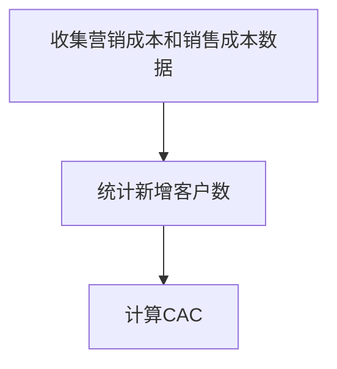
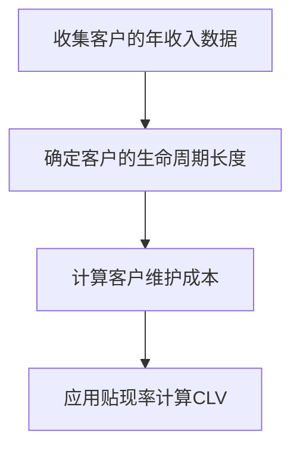
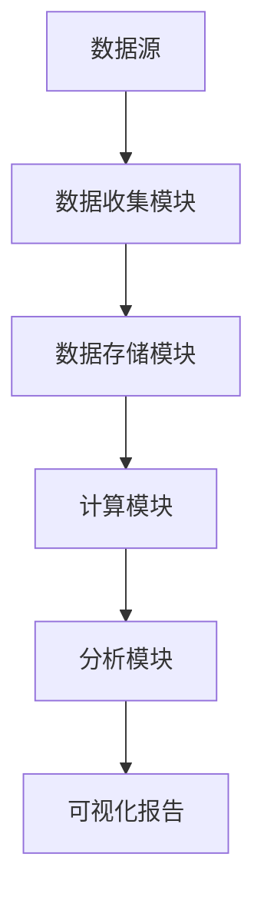

                 


# 彼得林奇如何分析公司的客户获取成本与终身价值比率

## 关键词：客户获取成本、终身价值、CAC、CLV、比率分析、投资决策、彼得林奇

## 摘要：本文将深入探讨彼得·林奇如何分析公司的客户获取成本（CAC）与客户终身价值（CLV）的比率。通过背景介绍、核心概念、算法原理、系统分析、项目实战和总结，本文将详细解析CAC和CLV的定义、计算方法、数学模型、系统架构以及实际应用案例，帮助读者理解如何通过CAC/CLV比率进行投资决策和优化企业策略。

---

## 第一部分：背景介绍

### 第1章：客户获取成本（CAC）与终身价值（CLV）的定义与计算

#### 1.1 CAC的基本概念

CAC（Customer Acquisition Cost）即客户获取成本，是指企业为了吸引一位新客户所花费的总成本。这些成本包括营销支出、销售团队的费用、渠道费用以及其他与客户获取相关的支出。

- **CAC的计算公式**：
  $$ CAC = \frac{\text{营销成本} + \text{销售成本}}{\text{新增客户数}} $$

- **影响CAC的因素**：
  - 营销渠道的效率
  - 销售团队的效能
  - 客户获取的市场竞争状况

#### 1.2 CLV的基本概念

CLV（Customer Lifetime Value）即客户终身价值，是指一位客户在其生命周期内为企业带来的总收入减去相关的成本。CLV不仅考虑了客户在当前阶段的贡献，还包括未来可能的收入。

- **CLV的计算公式**：
  $$ CLV = \frac{\text{年收入} \times \text{客户生命周期} - \text{客户维护成本}}{1 - \text{贴现率}} $$

- **影响CLV的因素**：
  - 客户的购买频率
  - 客户的平均消费金额
  - 客户的生命周期长度

#### 1.3 CAC与CLV的比率分析

CAC/CLV比率是衡量客户获取效率的重要指标。该比率越低，说明企业的客户获取成本相对于客户终身价值越低，企业的市场策略越有效。

- **CAC/CLV比率的意义**：
  - 当比率小于1时，客户获取成本低于其终身价值，企业具有投资价值。
  - 当比率大于1时，客户获取成本高于其终身价值，企业可能需要调整市场策略。

---

## 第二部分：核心概念与联系

### 第2章：CAC与CLV的核心概念

#### 2.1 CAC的核心属性

- **CAC的属性特征**：
  - 时间依赖性：CAC的计算与时间密切相关，不同时间点的市场活动会影响其值。
  - 渠道依赖性：不同营销渠道的效率不同，导致CAC在不同渠道中有所差异。

- **CAC与企业利润的关系**：
  - CAC的降低直接增加企业的净利润。
  - CAC的升高可能导致企业利润下降。

#### 2.2 CLV的核心属性

- **CLV的属性特征**：
  - 生命周期依赖性：CLV的计算依赖于客户的生命周期长度。
  - 收入贡献稳定性：高CLV的客户通常为企业带来稳定的收入流。

- **CLV与企业增长的关系**：
  - 高CLV客户有助于企业的可持续增长。
  - 低CLV客户可能导致企业增长受限。

### 第3章：CAC与CLV的联系

#### 3.1 CAC与CLV的关系

- **CAC与CLV的正相关关系**：
  - CLV的增加通常伴随着CAC的增加，因为获取高价值客户的成本可能更高。

- **CAC与CLV的反相关关系**：
  - 在某些情况下，CAC的增加可能不会导致CLV的相应增加，从而影响CAC/CLV比率。

#### 3.2 CAC/CLV比率的意义

- **CAC/CLV比率对企业价值的影响**：
  - 低CAC/CLV比率意味着企业能够高效地获取高价值客户，具有竞争优势。
  - 高CAC/CLV比率可能导致客户获取成本过高，影响企业的盈利能力。

---

## 第三部分：算法原理讲解

### 第3章：CAC与CLV的数学模型

#### 3.1 CAC的数学模型

- **CAC的计算步骤**：
  1. 收集营销成本和销售成本数据。
  2. 统计新增客户数。
  3. 计算CAC。

- **CAC计算的mermaid流程图**：



#### 3.2 CLV的数学模型

- **CLV的计算步骤**：
  1. 收集客户的年收入数据。
  2. 确定客户的生命周期长度。
  3. 计算客户维护成本。
  4. 应用贴现率计算CLV。

- **CLV计算的mermaid流程图**：



#### 3.3 CAC与CLV的比率计算

- **CAC/CLV比率的计算步骤**：
  1. 计算CAC。
  2. 计算CLV。
  3. 计算比率。

- **CAC/CLV比率的计算公式**：
  $$ CAC/CLV = \frac{CAC}{CLV} $$

---

## 第四部分：系统分析与架构设计方案

### 第4章：系统功能设计

#### 4.1 问题场景介绍

- **问题场景**：企业需要实时监控和分析CAC与CLV的比率，以优化市场策略和投资决策。

- **项目介绍**：设计一个实时分析系统，计算CAC和CLV的比率，并提供可视化报告。

#### 4.2 系统功能设计

- **功能模块**：
  - 数据收集模块：收集营销成本、销售成本、客户收入等数据。
  - 计算模块：计算CAC、CLV和CAC/CLV比率。
  - 分析模块：生成可视化报告，提供优化建议。

- **系统架构设计的mermaid图**：



---

## 第五部分：项目实战

### 第5章：CAC与CLV分析的实战案例

#### 5.1 项目环境安装

- **工具安装**：
  - 数据库：MySQL
  - 开发语言：Python
  - 可视化工具：Matplotlib

#### 5.2 核心代码实现

- **CAC计算的Python代码**：

```python
def calculate_cac(marketing_cost, sales_cost, new_customers):
    return (marketing_cost + sales_cost) / new_customers
```

- **CLV计算的Python代码**：

```python
def calculate_clv(revenue, customer_lifetime, maintenance_cost, discount_rate):
    return (revenue * customer_lifetime - maintenance_cost) / (1 - discount_rate)
```

#### 5.3 实际案例分析

- **案例分析**：
  某SaaS公司年收入为100万，客户生命周期为3年，客户维护成本为20万，贴现率为10%。

  计算CLV：
  $$ CLV = \frac{100 \times 3 - 20}{1 - 0.1} = \frac{280}{0.9} = 311.11 $$

  假设营销成本为50万，销售成本为30万，新增客户数为200。

  计算CAC：
  $$ CAC = \frac{50 + 30}{200} = 4 $$

  计算CAC/CLV比率：
  $$ CAC/CLV = 4 / 311.11 = 0.0128 $$

---

## 第六部分：总结与最佳实践

### 第6章：总结与投资建议

#### 6.1 小结

- CAC与CLV的比率分析是企业评估市场策略和投资决策的重要工具。
- 通过实时监控和优化CAC与CLV的比率，企业可以提高客户获取效率和盈利能力。

#### 6.2 投资建议

- 投资者应关注企业的CAC/CLV比率，选择比率低于1的企业进行投资。
- 企业应定期评估和优化其市场策略，以保持低CAC/CLV比率。

#### 6.3 注意事项

- CAC和CLV的计算需要准确的数据支持。
- 比率分析应结合企业的具体情况和其他财务指标进行综合评估。

#### 6.4 拓展阅读

- 彼得·林奇的《投资高手》
- 《客户获取成本与终身价值管理》

---

## 作者：AI天才研究院/AI Genius Institute & 禅与计算机程序设计艺术/Zen And The Art of Computer Programming

---

### 结语

通过本文的详细分析，读者可以掌握CAC与CLV的定义、计算方法、数学模型以及实际应用案例。希望本文能为投资者和企业提供有价值的见解，帮助他们优化市场策略，提升投资回报。

