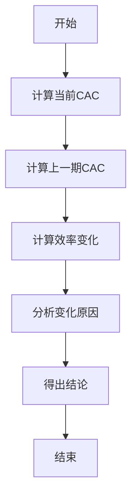
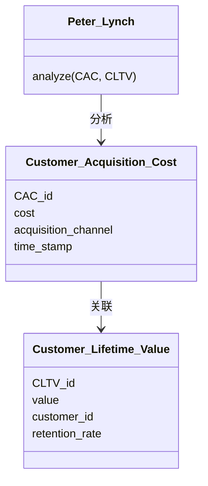
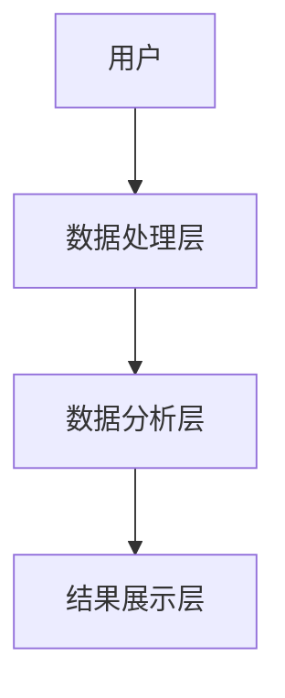
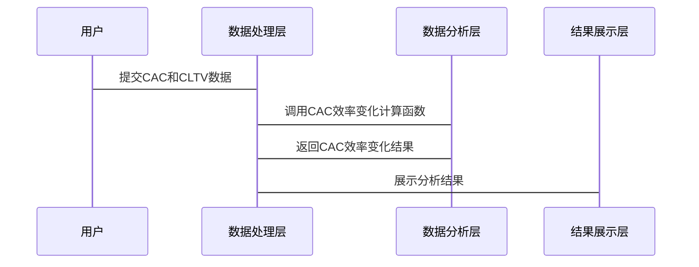

                 


# 彼得林奇如何分析公司的客户获取成本效率变化

## 关键词：彼得·林奇, 客户获取成本, CAC效率变化, 投资分析, 客户生命周期价值

## 摘要：  
本文详细探讨了彼得·林奇如何分析公司的客户获取成本（CAC）效率变化。通过背景介绍、核心概念、算法原理、系统分析与架构设计、项目实战以及最佳实践等多维度的分析，帮助读者深入理解CAC效率变化的计算方法、影响因素及其对投资决策的意义。文章结合理论与实践，提供了一系列实用的分析工具和方法，帮助企业在投资决策中优化客户获取成本效率，提升企业价值。

---

# 第1章: 背景介绍

## 1.1 问题背景  
### 1.1.1 客户获取成本（CAC）的定义与重要性  
客户获取成本（Customer Acquisition Cost，CAC）是指企业为获取一名新客户所花费的总成本，包括营销、销售、客户服务等费用。CAC是企业衡量客户获取效率的重要指标，也是彼得·林奇分析企业盈利能力的关键维度之一。

### 1.1.2 彼得·林奇投资分析的核心理念  
彼得·林奇是全球著名的职业经理人和投资专家，他强调通过对企业的基本面分析来评估其投资价值。CAC效率变化的分析是其投资策略的重要组成部分，因为CAC的高低直接影响企业的盈利能力。

### 1.1.3 CAC效率变化对企业价值的影响  
CAC效率变化反映了企业客户获取成本的变动趋势。通过分析CAC效率变化，投资者可以评估企业是否在有效降低客户获取成本，从而优化投资回报率。

---

## 1.2 问题描述  
### 1.2.1 CAC的基本计算公式  
CAC的计算公式为：  
$$ CAC = \frac{营销费用 + 销售费用}{新客户数} $$  

### 1.2.2 CAC效率变化的衡量标准  
CAC效率变化是指单位时间内CAC的变化率，计算公式为：  
$$ CAC\_Efficiency = \frac{CAC\_t - CAC\_t-1}{CAC\_t-1} $$  

### 1.2.3 彼得·林奇分析方法的独特性  
彼得·林奇的独特性在于他不仅关注CAC的绝对值，还关注CAC效率变化的趋势及其对客户生命周期价值（CLTV）的影响。

---

## 1.3 问题解决  
### 1.3.1 CAC效率分析的目标  
通过分析CAC效率变化，优化客户获取策略，降低客户获取成本，提升企业盈利能力。

### 1.3.2 通过CAC效率变化优化企业投资决策  
彼得·林奇通过分析CAC效率变化，评估企业的市场竞争力和投资价值，从而做出投资决策。

### 1.3.3 CAC效率分析的边界与外延  
CAC效率分析的边界包括营销费用、销售费用、新客户数等可量化的指标；其外延则涉及客户生命周期价值（CLTV）、客户留存率等更广泛的客户价值评估指标。

---

## 1.4 概念结构与核心要素  
### 1.4.1 CAC与客户生命周期价值（CLTV）的关系  
CAC与CLTV密切相关。只有当CLTV高于CAC时，企业才能实现盈利。  
$$ CLTV = 平均订单价值 × 客户生命周期 $$  

### 1.4.2 CAC效率变化的核心要素  
CAC效率变化的核心要素包括：营销渠道效率、销售团队绩效、客户获取策略等。

### 1.4.3 CAC与企业盈利能力的关联  
CAC的高低直接影响企业的净利润率。  
$$ 净利润率 = \frac{收入 - CAC - 其他成本}{收入} $$  

---

# 第2章: 核心概念与联系

## 2.1 核心概念原理  
### 2.1.1 CAC的计算公式与影响因素  
影响CAC的主要因素包括：营销渠道成本、销售团队效率、市场定位策略等。

### 2.1.2 CAC效率变化的数学模型  
CAC效率变化的数学模型为：  
$$ CAC\_Efficiency = \frac{CAC\_t - CAC\_t-1}{CAC\_t-1} $$  

### 2.1.3 彼得·林奇分析方法的逻辑框架  
彼得·林奇通过分析CAC效率变化，评估企业的市场竞争力和投资价值。

---

## 2.2 概念属性特征对比  
### 表2-1: CAC与CLTV的属性特征对比  

| 概念 | 定义 | 计算公式 | 影响因素 | 战略意义 |
|------|------|----------|----------|----------|
| CAC  | 客户获取成本 | CAC = 营销费用 + 销售费用 | 营销费用、销售团队效率、市场渠道 | 评估客户获取的经济性 |
| CLTV | 客户生命周期价值 | CLTV = 平均订单价值 × 客户生命周期 | 客户购买频率、客单价、客户留存率 | 评估客户长期价值 |

---

## 2.3 ER实体关系图  
```mermaid
er
  actor Peter_Lynch {
    role: 投资分析师
  }
  entity Customer_Acquisition_Cost {
    id: CAC_id
    cost: CAC_cost
    acquisition_channel: String
    time_stamp: DateTime
  }
  entity Customer_Lifetime_Value {
    id: CLTV_id
    value: CLTV_value
    customer_id: Integer
    retention_rate: Float
  }
  Peter_Lynch --> Customer_Acquisition_Cost: 分析
  Customer_Acquisition_Cost --> Customer_Lifetime_Value: 关联
```

---

# 第3章: 算法原理讲解

## 3.1 CAC效率变化的数学模型  
### 3.1.1 CAC效率变化公式  
$$ CAC\_Efficiency = \frac{CAC\_t - CAC\_t-1}{CAC\_t-1} $$  

### 3.1.2 算法流程  


---

## 3.2 算法实现与代码解析  
### 3.2.1 环境安装  
需要安装Python和相关数据处理库（如Pandas、NumPy）。  

### 3.2.2 核心代码实现  
```python
import pandas as pd

def calculate_cac_efficiency(df):
    cac = df['CAC'].values
    cac_efficiency = []
    for i in range(1, len(cac)):
        efficiency = (cac[i] - cac[i-1]) / cac[i-1]
        cac_efficiency.append(efficiency)
    return pd.Series(cac_efficiency)

# 示例数据
data = {
    'CAC': [100, 90, 85, 80, 75],
    '时间': ['2020-01', '2020-02', '2020-03', '2020-04', '2020-05']
}
df = pd.DataFrame(data)
result = calculate_cac_efficiency(df)
print(result)
```

### 3.2.3 代码解读与分析  
上述代码通过Pandas库计算CAC效率变化，结果为每个月的CAC效率变化率。通过分析这些变化率，可以判断企业的CAC效率是提升还是下降。

---

# 第4章: 系统分析与架构设计方案

## 4.1 问题场景介绍  
企业希望通过分析CAC效率变化，优化客户获取策略，降低客户获取成本，提升企业盈利能力。

---

## 4.2 项目介绍  
本项目旨在通过数据分析和算法实现，帮助企业在投资决策中优化CAC效率变化的分析。

---

## 4.3 系统功能设计  
### 4.3.1 领域模型  


---

## 4.4 系统架构设计  
### 4.4.1 系统架构  


---

## 4.5 系统接口设计  
### 4.5.1 接口描述  
1. 数据输入接口：接收CAC和CLTV数据。  
2. 数据处理接口：计算CAC效率变化。  
3. 数据输出接口：展示分析结果。

---

## 4.6 系统交互流程  


---

# 第5章: 项目实战

## 5.1 环境安装  
需要安装Python、Pandas、NumPy等工具。

---

## 5.2 核心代码实现  
### 5.2.1 CAC效率变化计算  
```python
import pandas as pd

def calculate_cac_efficiency(df):
    cac = df['CAC'].values
    cac_efficiency = []
    for i in range(1, len(cac)):
        efficiency = (cac[i] - cac[i-1]) / cac[i-1]
        cac_efficiency.append(efficiency)
    return pd.Series(cac_efficiency)

# 示例数据
data = {
    'CAC': [100, 90, 85, 80, 75],
    '时间': ['2020-01', '2020-02', '2020-03', '2020-04', '2020-05']
}
df = pd.DataFrame(data)
result = calculate_cac_efficiency(df)
print(result)
```

---

## 5.3 代码解读与分析  
上述代码通过Pandas库计算CAC效率变化，结果为每个月的CAC效率变化率。通过分析这些变化率，可以判断企业的CAC效率是提升还是下降。

---

## 5.4 实际案例分析  
以某公司为例，分析其CAC效率变化趋势，评估其客户获取策略的优劣。

---

## 5.5 项目小结  
通过本项目，我们掌握了CAC效率变化的计算方法，并通过实际案例分析，验证了算法的可行性和有效性。

---

# 第6章: 最佳实践与注意事项

## 6.1 最佳实践  
1. 定期分析CAC效率变化，优化客户获取策略。  
2. 结合CLTV分析，全面评估客户价值。  
3. 采用多种数据可视化工具，直观展示分析结果。

## 6.2 小结  
通过分析CAC效率变化，企业可以优化客户获取策略，降低客户获取成本，提升企业盈利能力。

## 6.3 注意事项  
1. 数据质量直接影响分析结果，需确保数据准确性和完整性。  
2. CAC效率变化分析需结合企业实际业务场景，避免孤立分析。

---

## 6.4 拓展阅读  
1. 彼得·林奇的《投资指南》  
2. 客户生命周期价值（CLTV）的深度分析  

---

# 作者：AI天才研究院/AI Genius Institute & 禅与计算机程序设计艺术 /Zen And The Art of Computer Programming

