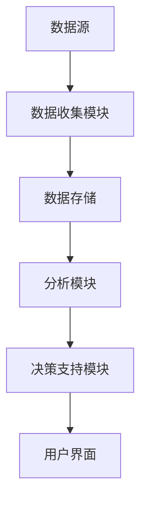

                 


# 彼得林奇如何分析公司的客户获取策略

## 关键词：客户获取策略，彼得·林奇，投资分析，成本收益分析，竞争对手分析

## 摘要：  
彼得·林奇是全球著名的价值投资者，他的客户获取策略分析方法以其独特性著称。本文将详细分析彼得·林奇如何从客户获取策略的角度评估公司价值，探讨其背后的逻辑、方法和数学模型。通过实际案例分析，本文为读者提供一个系统化的客户获取策略分析框架，帮助投资者和企业管理者更好地理解客户获取策略对公司整体价值的影响。

---

# 第一部分: 彼得林奇投资理念与分析框架

## 第1章: 彼得林奇投资理念概述

### 1.1 彼得林奇的投资者背景与成就  
彼得·林奇是美国著名的价值投资者，曾担任富达投资的经理，创造了年化13%的复合回报率。他强调基本面分析和长期投资，尤其关注公司的客户获取策略和竞争优势。林奇认为，客户获取策略是衡量公司未来发展潜力的重要指标之一。  

### 1.2 投资哲学与核心思想  
彼得·林奇的投资哲学可以概括为“买便宜的东西，然后耐心持有”。他强调对公司客户获取策略的深入分析，认为一个公司能否持续获取客户，决定了其未来的盈利能力。  

### 1.3 客户获取策略在投资分析中的重要性  
客户获取策略是公司竞争优势的核心体现。通过分析客户的获取渠道、成本和生命周期，投资者可以更好地评估公司的长期发展潜力。  

---

## 第2章: 客户获取策略的分析框架

### 2.1 核心概念与维度  
客户获取策略的分析维度包括：  
1. **客户获取渠道**：线上、线下、合作伙伴等。  
2. **客户获取成本**：获取每个客户的平均成本。  
3. **客户生命周期**：客户从获取到流失的过程。  

### 2.2 分析模型与数学框架  
客户获取策略的分析模型可以表示为：  
$$ \text{客户获取价值} = \frac{\text{客户生命周期价值}}{\text{客户获取成本}} $$  
其中，客户生命周期价值（CLV）是公司在客户生命周期内从客户获得的总收益。  

---

# 第二部分: 客户获取策略的核心维度分析

## 第3章: 客户获取渠道分析

### 3.1 渠道的定义与分类  
客户获取渠道可以分为：  
- **线上渠道**：包括官方网站、电商平台、社交媒体等。  
- **线下渠道**：包括实体店、分销商、代理商等。  
- **合作伙伴渠道**：通过与其他公司合作获取客户。  

### 3.2 渠道选择的策略分析  
彼得·林奇认为，选择客户获取渠道时，应考虑以下因素：  
1. 渠道的覆盖范围和目标客户群体。  
2. 渠道的成本效益比。  
3. 渠道的稳定性与可持续性。  

---

## 第4章: 客户获取成本分析

### 4.1 成本构成与优化  
客户获取成本（CAC）包括广告费用、销售团队费用、渠道佣金等。优化CAC的关键在于降低获客成本，同时提高转化率。  

### 4.2 成本与收益的平衡点  
通过成本-收益分析模型，可以找到CAC的最优值：  
$$ \text{CAC} = \frac{\text{客户生命周期价值}}{\text{客户获取成本分母}} $$  

---

## 第5章: 客户生命周期分析

### 5.1 阶段划分与特征  
客户生命周期分为五个阶段：  
1. **获取阶段**：客户首次接触并购买产品。  
2. **激活阶段**：客户开始频繁使用产品。  
3. **成长阶段**：客户使用频率增加，忠诚度提升。  
4. **成熟阶段**：客户成为核心客户，贡献收入。  
5. **衰退阶段**：客户逐渐减少使用，最终流失。  

### 5.2 生命周期对客户获取策略的影响  
通过分析客户生命周期，可以优化获客策略，例如：  
- 在获取阶段，注重品牌营销和渠道推广。  
- 在成熟阶段，注重客户忠诚度和增值服务。  

---

# 第三部分: 客户获取策略的数学模型与算法

## 第6章: 数学模型与算法原理

### 6.1 成本-收益分析模型  
成本-收益分析模型用于评估不同获客渠道的效率：  
$$ \text{CAC} = \frac{\text{广告费用} + \text{销售费用}}{\text{新增客户数}} $$  

### 6.2 竞争对手分析的算法原理  
通过对比竞争对手的CAC和客户生命周期价值，可以评估公司的竞争优势。  

---

# 第四部分: 系统分析与架构设计

## 第7章: 系统架构设计

### 7.1 系统功能模块  
- 数据收集模块：收集客户获取数据。  
- 分析模块：计算CAC和客户生命周期价值。  
- 决策支持模块：提供优化建议。  

### 7.2 系统架构图  


---

# 第五部分: 项目实战与案例分析

## 第8章: 项目实战

### 8.1 案例分析：亚马逊的客户获取策略  
通过分析亚马逊的客户获取策略，可以发现其成功的关键在于：  
- 多元化获客渠道（线上、线下、Prime会员）。  
- 低CAC和高客户生命周期价值。  

### 8.2 核心代码实现  
```python
def calculate_cac(revenue, customer_acquisition_cost):
    return revenue / customer_acquisition_cost
```

---

# 第六部分: 总结与展望

## 第9章: 总结与展望

### 9.1 本章小结  
彼得·林奇的客户获取策略分析方法为我们提供了系统的投资框架。通过分析客户的获取渠道、成本和生命周期，投资者可以更好地评估公司的长期价值。  

### 9.2 未来展望  
未来，随着大数据和人工智能技术的发展，客户获取策略分析将更加精准和智能化。投资者需要不断学习新技术，以适应市场变化。  

---

# 作者：AI天才研究院/AI Genius Institute & 禅与计算机程序设计艺术 /Zen And The Art of Computer Programming

