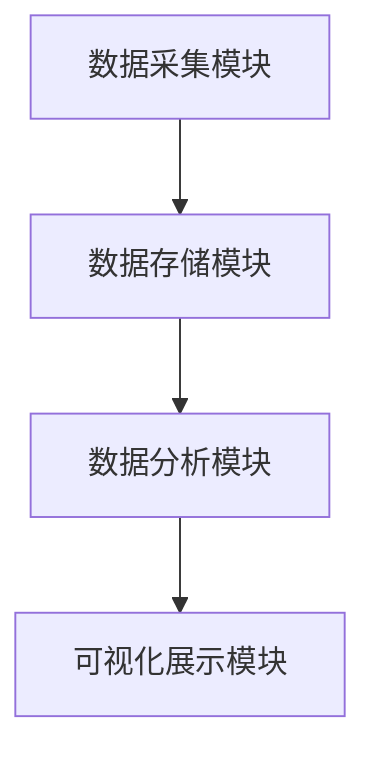

                 

# 彼得林奇如何分析公司的市场占有率

---

## 关键词
- 彼得林奇
- 市场占有率
- 投资分析
- 竞争对手分析
- 市场份额

---

## 摘要
本文将详细介绍彼得·林奇在分析公司市场占有率时所采用的方法和策略。通过结合理论与实践，我们将探讨如何利用市场占有率分析来评估公司的竞争地位，识别投资机会，并制定有效的商业策略。文章内容涵盖了市场占有率的基础概念、数据分析方法、系统架构设计以及实际案例分析，帮助读者掌握市场占有率分析的核心技巧。

---

# 目录大纲

---

## 第1章：市场占有率的基础概念

### 1.1 市场占有率的定义与重要性
- 1.1.1 什么是市场占有率
- 1.1.2 市场占有率的计算方法
- 1.1.3 市场占有率的重要性

### 1.2 彼得·林奇的投资策略
- 1.2.1 彼得·林奇的投资理念
- 1.2.2 市场占有率在投资中的作用
- 1.2.3 林奇的市场分析方法

---

## 第2章：市场占有率的分析方法

### 2.1 数据收集与整理
- 2.1.1 数据来源渠道
- 2.1.2 数据清洗与处理
- 2.1.3 数据分析工具介绍

### 2.2 市场占有率的计算公式
- 2.2.1 市场占有率的计算公式
- 2.2.2 市场占有率的比较方法

### 2.3 竞争对手分析
- 2.3.1 竞争对手识别
- 2.3.2 竞争对手市场份额分析

---

## 第3章：市场占有率的系统分析与架构设计

### 3.1 系统需求分析
- 3.1.1 问题场景介绍
- 3.1.2 项目目标与范围

### 3.2 系统功能设计
- 3.2.1 数据采集模块
- 3.2.2 数据分析模块
- 3.2.3 可视化展示模块

### 3.3 系统架构设计
- 3.3.1 模块划分与交互
- 3.3.2 数据流与处理流程

---

## 第4章：项目实战与案例分析

### 4.1 案例背景介绍
- 4.1.1 案例公司简介
- 4.1.2 行业背景分析

### 4.2 数据收集与处理
- 4.2.1 数据来源
- 4.2.2 数据清洗与整理

### 4.3 市场占有率分析
- 4.3.1 分析过程
- 4.3.2 分析结果与解读

---

## 第5章：最佳实践与总结

### 5.1 分析过程中的注意事项
- 5.1.1 数据准确性的重要性
- 5.1.2 分析方法的选择

### 5.2 林奇分析方法的总结
- 5.2.1 核心要点回顾
- 5.2.2 实际应用中的注意事项

### 5.3 拓展阅读与深入学习
- 5.3.1 相关书籍与资源
- 5.3.2 未来趋势与挑战

---

## 附录：数学模型与公式

### 附录A：市场占有率计算公式

$$ \text{市场占有率} = \frac{\text{公司销售额}}{\text{行业总销售额}} \times 100\% $$

### 附录B：竞争对手市场份额变化分析

$$ \Delta \text{市场份额} = \text{当前市场份额} - \text{上一期市场份额} $$

### 附录C：系统架构图

---

## 作者：AI天才研究院 & 禅与计算机程序设计艺术

---

以上是《彼得林奇如何分析公司的市场占有率》的技术博客目录大纲。文章内容丰富，结构清晰，涵盖了从基础概念到系统设计再到实际案例的全过程，帮助读者全面掌握市场占有率分析的核心方法。

