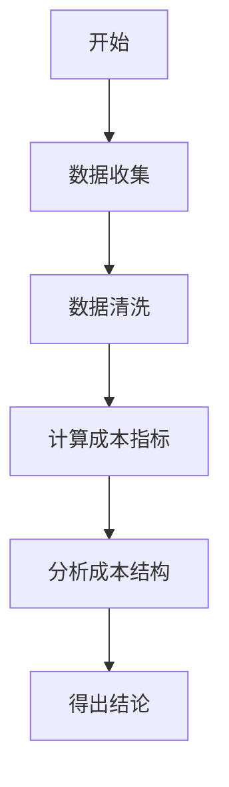
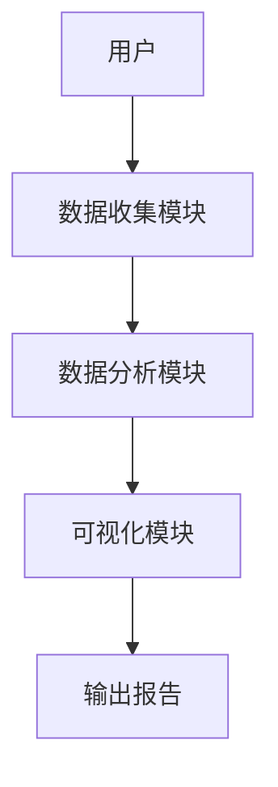

                 


# 彼得林奇如何分析公司的成本结构

> 关键词：成本结构、彼得林奇、投资分析、企业利润、风险管理

> 摘要：成本结构是企业财务健康的核心要素，也是投资决策的关键依据。本文以彼得·林奇的投资哲学为出发点，系统阐述了公司成本结构的定义、分类、驱动因素及其对利润的影响。通过构建成本结构分析的四象限模型，结合行业对比、财务指标分析和数学建模等方法，详细讲解了如何量化评估公司成本结构的优劣。同时，本文还提供了基于Python的算法实现和系统架构设计，帮助读者掌握成本结构分析的实战技巧。

---

# 第一部分: 背景介绍与核心概念

## 第1章: 成本结构分析的背景与重要性

### 1.1 什么是成本结构

#### 1.1.1 成本结构的定义

成本结构是企业运营过程中各项成本的构成和分配方式，包括直接成本、间接成本、固定成本和变动成本等。成本结构决定了企业如何获取和分配资源，是企业盈利能力的核心影响因素。

#### 1.1.2 成本结构的核心要素

| 成本类型 | 定义 | 示例 |
|----------|------|------|
| 直接成本 | 与产品或服务直接相关的成本 | 原材料采购成本、生产工人薪酬 |
| 间接成本 | 支持生产但不直接与产品相关 | 设备折旧、工厂租金 |
| 固定成本 | 不随产量变化而变化的成本 | 管理人员薪酬、厂房租金 |
| 变动成本 | 随产量变化而变化的成本 | 原材料消耗、销售佣金 |

#### 1.1.3 成本结构的分类与特征

成本结构的分类可以通过以下维度进行：

- **按成本类型**：直接成本、间接成本。
- **按成本性质**：固定成本、变动成本。
- **按成本用途**：生产成本、期间费用。

---

### 1.2 成本结构与企业利润的关系

#### 1.2.1 成本对利润的影响

利润 = 收入 - 成本

成本结构决定了企业的盈利能力。低效的成本结构会挤压利润空间，而优化的成本结构可以提升企业的竞争优势。

#### 1.2.2 成本结构优化的意义

- 提升利润率。
- 增强企业抗风险能力。
- 为投资决策提供依据。

#### 1.2.3 成本结构与企业竞争力

成本结构是企业竞争优势的核心之一。例如，制造行业可以通过规模效应降低成本，而科技企业可以通过技术创新降低边际成本。

---

### 1.3 彼得·林奇的投资哲学

#### 1.3.1 彼得·林奇的投资理念

彼得·林奇是美国著名投资经理，他强调通过基本面分析选择具有长期增长潜力的公司。他认为，成本结构是评估企业盈利能力的关键指标。

#### 1.3.2 成本结构分析在投资中的作用

- 识别企业的成本优势。
- 评估企业的盈利能力。
- 发现潜在的投资机会。

#### 1.3.3 彼得·林奇的成功案例

彼得·林奇通过分析公司的成本结构，成功投资于像强生公司（Johnson & Johnson）和麦当劳（McDonald's）这样的企业，这些企业在成本控制和盈利能力方面表现优异。

---

## 第2章: 公司成本结构的核心要素

### 2.1 成本的分类与构成

#### 2.1.1 直接成本与间接成本

- **直接成本**：可以直接追溯到产品或服务的成本。
- **间接成本**：无法直接追溯到产品或服务，需要通过分配方式计入。

#### 2.1.2 固定成本与变动成本

- **固定成本**：在一定产量范围内不变，如租金、管理人员薪酬。
- **变动成本**：随产量变化而变化，如原材料、销售佣金。

#### 2.1.3 生产成本与期间费用

- **生产成本**：直接用于产品生产的成本。
- **期间费用**：企业运营中发生的非生产性支出，如研发费用、管理费用。

---

### 2.2 成本结构的驱动因素

#### 2.2.1 行业特点对成本结构的影响

不同行业的成本结构差异显著。例如，制造行业的成本主要由原材料和人工成本构成，而软件行业的成本主要由研发和营销费用构成。

#### 2.2.2 规模效应与成本结构

规模效应可以通过 economies of scale 降低成本。例如，大型制造企业可以通过批量采购降低单位成本。

#### 2.2.3 技术创新对成本的影响

技术创新可以降低生产成本或提高效率。例如，自动化技术可以减少人工成本，同时提高生产效率。

---

### 2.3 成本结构与企业战略

#### 2.3.1 成本领先战略

成本领先战略通过降低生产成本来获得竞争优势。例如，沃尔玛通过高效的供应链管理和规模采购实现成本领先。

#### 2.3.2 差异化战略的成本结构

差异化战略注重产品的独特性，通常需要较高的研发和营销投入。例如，高端奢侈品品牌的成本结构中，营销费用和设计费用占比较高。

#### 2.3.3 成本结构与企业长期发展

企业的成本结构需要与长期战略目标一致。例如，技术创新型企业的成本结构应注重研发费用，而传统制造企业的成本结构应注重生产成本。

---

# 第二部分: 成本结构分析的核心方法

## 第3章: 彼得·林奇的成本结构分析框架

### 3.1 构建成本结构分析的四象限模型

#### 3.1.1 成本结构分析的四象限框架

- **左上象限**：直接成本与固定成本。
- **右上象限**：间接成本与变动成本。
- **左下象限**：生产成本与期间费用。
- **右下象限**：固定成本与变动成本。

#### 3.1.2 四象限模型的逻辑与应用

通过四象限模型，可以清晰地识别成本结构中的关键要素，并分析其对利润的影响。

#### 3.1.3 案例分析：某行业企业的成本结构分析

以制造企业为例，分析其直接成本（原材料）、间接成本（设备折旧）、固定成本（厂房租金）和变动成本（销售佣金）。

---

### 3.2 成本结构的财务指标分析

#### 3.2.1 毛利率分析

毛利率 = （收入 - 销售成本） / 收入

毛利率越高，说明企业的成本控制能力越强。

#### 3.2.2 营业利润率分析

营业利润率 = 净利润 / 收入

营业利润率反映了企业的整体盈利能力。

#### 3.2.3 净利润率分析

净利润率 = 净利润 / 收入

净利润率是衡量企业整体盈利能力的重要指标。

---

### 3.3 成本结构的行业对比分析

#### 3.3.1 行业成本结构的横向对比

通过行业横向对比，识别企业的成本优势。

#### 3.3.2 行业成本结构的纵向对比

通过行业纵向对比，分析成本结构的变化趋势。

#### 3.3.3 行业趋势对成本结构的影响

行业趋势（如技术升级、政策变化）会显著影响企业的成本结构。

---

## 第4章: 成本结构的定量分析与模型

### 4.1 成本结构的数学模型

#### 4.1.1 成本结构的线性回归模型

通过线性回归模型，可以分析成本结构与利润之间的关系。

#### 4.1.2 成本结构与利润的关系模型

利润 = α + β × 成本 + ε

其中，α 是截距，β 是成本的系数，ε 是误差项。

#### 4.1.3 成本结构优化的数学公式

通过优化数学公式，可以找到成本结构的最优解。

---

### 4.2 成本结构分析的算法原理

#### 4.2.1 成本结构分析的算法流程图



#### 4.2.2 成本结构分析的Python代码实现

```python
import pandas as pd

# 数据收集
data = pd.read_csv('cost_data.csv')

# 数据清洗
data.dropna(inplace=True)

# 计算成本指标
cost_indices = {
    '毛利率': (data['收入'] - data['销售成本']) / data['收入'],
    '营业利润率': data['净利润'] / data['收入'],
    '净利润率': (data['净利润'] / data['收入'])
}

# 分析成本结构
for name, metric in cost_indices.items():
    print(f"{name}: {metric.mean()}")
```

#### 4.2.3 成本结构分析的案例分析

通过Python代码分析某制造企业的成本结构，计算其毛利率、营业利润率和净利润率，并与行业平均水平进行对比。

---

## 第5章: 成本结构的风险评估与预警

### 5.1 成本结构的风险来源

#### 5.1.1 市场需求变化的风险

市场需求波动会影响企业的成本结构。

#### 5.1.2 原材料价格波动的风险

原材料价格波动会直接影响企业的生产成本。

#### 5.1.3 行业竞争加剧的风险

行业竞争加剧会增加企业的营销费用和研发费用。

---

### 5.2 成本结构的风险评估模型

#### 5.2.1 风险评估的指标体系

- 成本敏感性分析
- 成本波动性分析
- 成本相关性分析

#### 5.2.2 风险评估的数学公式

风险指数 = Σ（成本波动 × 权重）

---

### 5.3 成本结构的风险预警机制

通过实时监控成本指标的变化，及时发现潜在风险，并采取应对措施。

---

# 第三部分: 成本结构分析的系统架构设计

## 第6章: 系统分析与架构设计方案

### 6.1 问题场景介绍

我们需要构建一个成本结构分析系统，帮助投资者和企业管理者快速评估公司的成本结构。

---

### 6.2 系统功能设计

#### 6.2.1 数据收集模块

- 从财务报表中提取成本数据。
- 从行业报告中获取行业成本结构数据。

#### 6.2.2 数据分析模块

- 计算成本指标。
- 生成成本结构分析报告。

#### 6.2.3 可视化模块

- 展示成本结构的图表。
- 提供交互式分析界面。

---

### 6.3 系统架构设计



---

## 第7章: 项目实战

### 7.1 环境配置与数据准备

安装Python和相关库（如Pandas、Matplotlib）。

---

### 7.2 系统核心实现源代码

```python
import pandas as pd
import matplotlib.pyplot as plt

# 数据收集
data = pd.read_csv('cost_data.csv')

# 数据清洗
data.dropna(inplace=True)

# 数据分析
cost_indices = {
    '毛利率': (data['收入'] - data['销售成本']) / data['收入'],
    '营业利润率': data['净利润'] / data['收入'],
    '净利润率': (data['净利润'] / data['收入'])
}

# 可视化
for name, metric in cost_indices.items():
    plt.hist(metric, bins=10)
    plt.title(f"{name}分布")
    plt.show()
```

---

## 第8章: 总结与展望

### 8.1 总结

本文系统阐述了彼得·林奇的成本结构分析方法，并通过数学建模和Python代码实现，帮助读者掌握成本结构分析的核心技巧。

---

### 8.2 展望

未来，随着人工智能和大数据技术的发展，成本结构分析将更加智能化和精准化。

---

# 作者

作者：AI天才研究院/AI Genius Institute & 禅与计算机程序设计艺术 /Zen And The Art of Computer Programming

---

通过以上结构，我们可以清晰地看到，彼得·林奇的成本结构分析方法是如何帮助投资者和企业管理者优化成本结构，提升企业利润的。希望这篇文章能为读者提供有价值的见解和实战指导。

