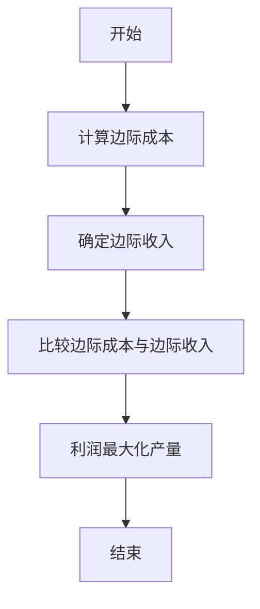

                 


# 彼得林奇如何分析公司的成本结构优化对盈利能力的影响

**关键词**：彼得林奇、成本结构、盈利能力、边际成本、投资策略

**摘要**：本文将详细分析彼得林奇如何通过优化公司成本结构来提升盈利能力。我们将从成本结构的核心概念、算法原理、系统分析、项目实战等多个维度展开，结合实际案例和数学模型，深入探讨成本结构优化对盈利能力的影响。文章内容详实，逻辑清晰，适合投资专业人士和企业管理者阅读。

---

## 第1章: 成本结构优化的背景与重要性

### 1.1 成本结构的基本概念

#### 1.1.1 成本结构的定义与组成
成本结构是指企业在生产和运营过程中所涉及的各种成本的构成和比例。它通常包括固定成本和变动成本两大类：
- **固定成本**：如租金、工资、设备折旧等，这些成本在一定范围内不随产量变化而变化。
- **变动成本**：如原材料、直接人工等，这些成本会随着产量的增加而增加。

此外，成本结构还包括间接成本（如 utilities 和 maintenance）和机会成本（隐含成本）。

#### 1.1.2 成本结构优化的必要性
优化成本结构是企业提升盈利能力的关键。通过降低固定成本或减少变动成本的比例，企业可以显著提高净利润。彼得林奇在其投资分析中，特别关注企业的成本结构是否合理，因为这直接影响企业的盈利能力。

#### 1.1.3 彼得林奇的成本分析方法
彼得林奇在分析公司成本结构时，通常会关注以下几个方面：
1. **边际成本分析**：通过计算每增加一单位产品或服务的成本，评估企业的成本效率。
2. **成本分摊**：分析固定成本和变动成本的分配是否合理。
3. **成本与收益的匹配**：确保成本增长速度不超过收入增长速度。

---

### 1.2 成本结构对盈利能力的影响

#### 1.2.1 成本在企业利润中的占比
成本在企业利润中的占比通常较高，尤其是对于制造型企业。优化成本结构可以显著提升利润率。

#### 1.2.2 成本结构变化对企业利润的影响
- **降低固定成本**：减少租金、工资等固定支出，可以直接提高净利润。
- **降低变动成本**：通过采购更便宜的原材料或提高生产效率，可以降低单位产品的成本。
- **边际成本与利润的关系**：当边际成本低于边际收入时，企业可以增加产量以提高利润。

#### 1.2.3 彼得林奇的成本优化策略
彼得林奇在投资过程中，会重点关注那些能够通过优化成本结构提高盈利能力的公司。例如，他会寻找那些能够通过规模经济降低单位产品成本的企业。

---

## 第2章: 成本结构的核心要素与分析框架

### 2.1 成本结构的核心要素

#### 2.1.1 固定成本与变动成本
- **固定成本**：如租金、工资、设备折旧等，这些成本在短期内不会随产量变化而变化。
- **变动成本**：如原材料、直接人工等，这些成本会随着产量的增加而增加。

#### 2.1.2 边际成本与平均成本
- **边际成本（MC）**：每增加一单位产量所增加的成本。
- **平均成本（AC）**：总成本除以产量。

#### 2.1.3 直接成本与间接成本
- **直接成本**：可以直接追溯到产品的成本，如原材料。
- **间接成本**：无法直接追溯到产品的成本，如工厂的租金。

### 2.2 成本结构的分析框架

#### 2.2.1 成本-产量-利润关系分析
通过分析成本、产量和利润之间的关系，可以帮助企业找到利润最大化的产量点。

#### 2.2.2 边际成本分析法
- **边际成本公式**：
$$ MC = \frac{\Delta C}{\Delta Q} $$
其中，$\Delta C$ 是总成本的变化量，$\Delta Q$ 是产量的变化量。

#### 2.2.3 成本分摊与利润分配
- 成本分摊需要考虑固定成本和变动成本的分配比例。
- 利润分配需要考虑收入与成本的关系。

### 2.3 核心概念对比表

| **成本类型** | **定义** | **是否随产量变化** |
|--------------|----------|---------------------|
| 固定成本    | 租金、工资等 | 不随产量变化       |
| 变动成本    | 原材料、直接人工 | 随产量变化         |
| 边际成本    | 每增加一单位产量的成本 | 随产量变化         |

### 2.4 ER实体关系图

```mermaid
erd
actor: 成本结构分析者
model: 成本结构模型
model --> 固定成本表: 包含固定成本数据
model --> 变动成本表: 包含变动成本数据
model --> 边际成本表: 包含边际成本数据
```

---

## 第3章: 成本结构优化的算法原理

### 3.1 算法原理概述

#### 3.1.1 边际成本分析法
- **目标**：通过计算边际成本，确定利润最大化的产量。
- **步骤**：
  1. 计算每增加一单位产量的边际成本。
  2. 确定边际成本低于边际收入的产量范围。
  3. 在边际成本等于边际收入时，找到利润最大化的产量。

#### 3.1.2 成本分摊法
- **目标**：合理分配固定成本和变动成本。
- **步骤**：
  1. 计算总成本。
  2. 确定固定成本和变动成本的比例。
  3. 根据产量分配固定成本和变动成本。

#### 3.1.3 盈利能力最大化模型
- **目标**：通过优化成本结构，最大化净利润。
- **步骤**：
  1. 计算总成本和总收入。
  2. 确定成本结构是否合理。
  3. 调整成本结构以最大化净利润。

### 3.2 算法流程图



### 3.3 数学模型与公式

#### 3.3.1 边际成本公式
$$ MC = \frac{\Delta C}{\Delta Q} $$

#### 3.3.2 利润最大化公式
$$ 利润 = 收入 - 成本 $$

#### 3.3.3 边际收入公式
$$ MR = \frac{\Delta R}{\Delta Q} $$

---

## 第4章: 系统分析与架构设计

### 4.1 系统分析

#### 4.1.1 问题场景介绍
假设我们有一个制造公司，其成本结构包括固定成本和变动成本。我们需要优化成本结构以提高盈利能力。

#### 4.1.2 系统目标与范围
- **目标**：通过优化成本结构，提高公司净利润。
- **范围**：分析固定成本和变动成本，优化成本结构。

#### 4.1.3 系统功能需求
- 计算边际成本。
- 分析成本结构。
- 提供优化建议。

### 4.2 系统架构设计

#### 4.2.1 系统功能设计
- **输入**：固定成本、变动成本、产量。
- **处理**：计算边际成本、分析成本结构、优化成本结构。
- **输出**：边际成本、成本结构分析报告、优化建议。

#### 4.2.2 系统架构设计
- **数据流图**：
  - 用户输入数据。
  - 系统处理数据。
  - 系统输出结果。

#### 4.2.3 系统交互设计
- 用户输入固定成本、变动成本、产量。
- 系统计算边际成本。
- 系统分析成本结构。
- 系统提供优化建议。

---

## 第5章: 项目实战

### 5.1 环境安装

#### 5.1.1 系统环境
- 操作系统：Windows 10 或更高版本。
- 开发工具：Python 3.8 或更高版本。
- 数据库：MySQL 8.0 或更高版本。

### 5.2 核心代码实现

#### 5.2.1 Python代码实现

```python
# 边际成本计算
def calculate边际成本(总成本, 产量):
    边际成本 = (总成本 / 产量)
    return 边际成本

# 成本结构分析
def 分析成本结构(固定成本, 变动成本, 产量):
    平均成本 = (固定成本 + 变动成本) / 产量
    return 平均成本

# 利润最大化模型
def 最大化利润(收入, 成本):
    利润 = 收入 - 成本
    return 利润
```

#### 5.2.2 代码应用解读与分析
- **边际成本计算**：通过计算每单位产量的边际成本，确定利润最大化的产量。
- **成本结构分析**：通过计算平均成本，分析成本结构是否合理。
- **利润最大化模型**：通过优化成本结构，最大化净利润。

### 5.3 案例分析

#### 5.3.1 案例介绍
假设我们有一个制造公司，其固定成本为 $10,000，变动成本为 $50/件，产量为 100 件，收入为 $1,000。

#### 5.3.2 数据准备
- 固定成本：$10,000
- 变动成本：$50/件
- 产量：100 件
- 收入：$1,000

#### 5.3.3 数据计算
- 边际成本：
$$ MC = \frac{10,000 + 50 \times 100}{100} = 150 $$

- 利润：
$$ 利润 = 1,000 - (10,000 + 50 \times 100) = -4,000 $$

#### 5.3.4 优化建议
- 降低固定成本。
- 提高产量以摊薄固定成本。

### 5.4 项目小结

---

## 第6章: 最佳实践与小结

### 6.1 最佳实践 tips
1. 在优化成本结构时，应优先关注固定成本和变动成本的合理分配。
2. 通过计算边际成本，确定利润最大化的产量。
3. 定期监控成本结构的变化，及时调整优化策略。

### 6.2 小结
通过优化成本结构，企业可以显著提高盈利能力。彼得林奇的成本分析方法为我们提供了重要的参考。

### 6.3 注意事项
- 成本结构优化需要结合企业的实际情况。
- 优化成本结构时，应综合考虑短期和长期因素。
- 定期监控成本结构的变化，及时调整优化策略。

### 6.4 拓展阅读
- 彼得林奇的其他投资策略。
- 其他成本优化方法。

---

## 作者信息

**作者**：AI天才研究院/AI Genius Institute & 禅与计算机程序设计艺术 /Zen And The Art of Computer Programming

---

本文通过详细分析彼得林奇的成本结构优化方法，结合数学模型和实际案例，深入探讨了成本结构优化对盈利能力的影响。希望本文能为投资专业人士和企业管理者提供有价值的参考。

