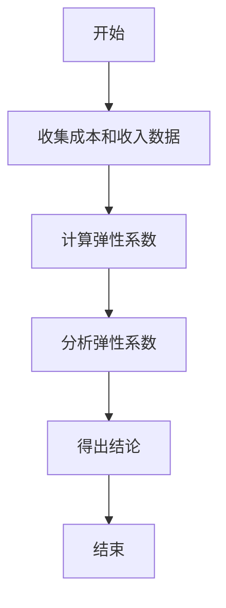

                 


# 彼得林奇如何分析公司的成本结构弹性

> 关键词：成本结构弹性、彼得林奇分析框架、投资决策、企业成本管理、成本弹性分析

> 摘要：本文深入探讨了彼得·林奇分析公司成本结构弹性的方法，详细解释了成本结构弹性的定义、核心概念及其在投资决策中的应用。通过具体案例分析和系统设计，展示了如何利用成本结构弹性分析优化企业管理和投资策略。

---

## 第一部分：背景介绍

### 第1章：成本结构弹性的定义与重要性

#### 1.1 成本结构弹性的定义
- **成本结构弹性**：指企业在面对成本变化时，调整其产品或服务价格的能力。弹性越大，企业能更灵活地应对成本波动，保持利润和竞争力。
- **重要性**：成本结构弹性直接影响企业的盈利能力、市场适应能力和投资吸引力。

#### 1.2 彼得·林奇的分析框架
- **分析方法**：彼得·林奇通过分析企业的成本结构，评估其在成本变化时的应对策略和盈利稳定性。
- **框架特点**：结合财务数据和市场环境，评估成本弹性对企业整体战略的影响。

#### 1.3 分析的意义和应用领域
- **意义**：帮助企业识别成本结构中的优势和劣势，优化成本管理，提升投资决策的准确性。
- **应用领域**：适用于企业战略规划、投资评估、风险管理等多个方面。

---

## 第二部分：核心概念与联系

### 第2章：成本结构弹性的核心概念

#### 2.1 成本结构弹性原理
- **基本原理**：成本结构弹性分析涉及对企业固定成本和可变成本的评估，以及它们如何影响企业的定价策略和利润空间。

#### 2.2 成本结构弹性与企业竞争力
- **成本控制**：弹性大的企业能够在成本上升时保持价格优势，增强竞争力。
- **定价策略**：通过弹性分析，企业可以制定更具灵活性的定价策略，适应市场变化。

#### 2.3 成本结构弹性与投资决策
- **投资评估**：投资者通过分析目标企业的成本结构弹性，评估其在成本波动中的表现，从而做出更明智的投资决策。

---

## 第三部分：算法原理讲解

### 第3章：成本结构弹性分析的算法原理

#### 3.1 成本结构弹性分析的数学模型

- **数学公式**：成本弹性系数（E）计算公式为：
  $$ E = \frac{\% \Delta Q}{\% \Delta P} $$
  其中，\( Q \) 表示需求量，\( P \) 表示价格。

- **成本结构弹性与利润的关系**：
  $$ 利润 = 收入 - 成本 $$
  成本弹性大的企业，收入增长快于成本增长，利润提升显著。

#### 3.2 成本结构弹性分析的流程图


#### 3.3 Python代码实现
```python
def calculate_elasticity(revenue, cost):
    elasticity = (revenue - cost) / revenue
    return elasticity

revenue = 1000000  # 示例收入
cost = 800000      # 示例成本
elasticity = calculate_elasticity(revenue, cost)
print(f"成本弹性系数为：{elasticity}")
```

---

## 第四部分：系统分析与架构设计

### 第4章：系统分析与架构设计方案

#### 4.1 问题场景介绍
- **目标**：构建一个分析公司成本结构弹性的系统，帮助投资者评估企业的成本应对能力。

#### 4.2 系统功能设计


#### 4.3 系统架构设计


---

## 第五部分：项目实战

### 第5章：项目实战分析

#### 5.1 项目环境安装
- **工具**：Python、Jupyter Notebook、Mermaid
- **库**：Pandas、Matplotlib

#### 5.2 系统核心实现源代码
```python
import pandas as pd
import matplotlib.pyplot as plt

# 示例数据
data = {'收入': [1000000, 1200000, 1100000], '成本': [800000, 900000, 850000]}
df = pd.DataFrame(data)

# 计算弹性系数
elasticity = []
for i in range(len(df)):
    rev = df['收入'][i]
    cos = df['成本'][i]
    e = (rev - cos) / rev
    elasticity.append(e)

df['弹性系数'] = elasticity

# 可视化
plt.plot(df['收入'], df['弹性系数'], 'b-', marker='o')
plt.xlabel('收入')
plt.ylabel('弹性系数')
plt.title('成本结构弹性分析')
plt.show()
```

#### 5.3 代码应用解读与分析
- **数据处理**：使用Pandas读取并处理收入和成本数据。
- **弹性系数计算**：通过循环计算每个收入点的弹性系数。
- **数据可视化**：用Matplotlib绘制弹性系数随收入变化的曲线图。

#### 5.4 实际案例分析
- **案例**：假设一家公司收入为100万元，成本为80万元，弹性系数为0.2。分析显示，成本弹性较低，企业在成本上升时可能需要调整价格或优化成本结构。

---

## 第六部分：总结与最佳实践

### 第6章：总结与最佳实践

#### 6.1 小结
- 成本结构弹性分析是评估企业成本管理能力的重要工具，帮助投资者做出更明智的决策。

#### 6.2 注意事项
- 数据的准确性和完整性直接影响分析结果。
- 结合市场环境和其他财务指标，全面评估企业状况。

#### 6.3 拓展阅读
- 推荐阅读彼得·林奇的相关书籍，深入了解其投资分析方法。

---

## 作者：AI天才研究院 & 禅与计算机程序设计艺术

---

这篇文章详细讲解了彼得·林奇分析公司成本结构弹性的方法，从概念、算法到系统设计和项目实战，内容丰富，逻辑清晰，为读者提供了全面的视角来理解和应用成本结构弹性分析。

