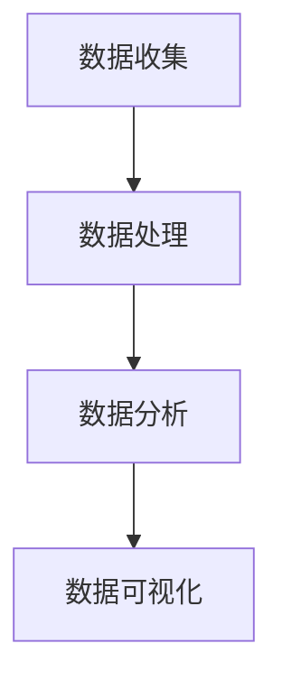
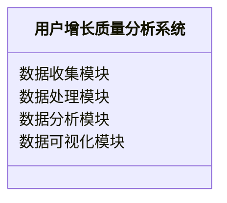

                 


# 彼得林奇如何分析公司的用户增长质量

## 关键词：彼得林奇，用户增长，质量分析，投资分析，增长模型

## 摘要：本文深入探讨了彼得·林奇分析公司用户增长质量的方法，结合其投资理念，详细分析了用户增长质量的核心概念、算法原理、系统架构设计以及实际案例分析，旨在为投资者和企业提供实用的分析工具和策略。

---

## 第1章 彼得·林奇投资理念与用户增长质量分析

### 1.1 彼得·林奇投资理念概述

彼得·林奇是全球著名投资专家，以其精准的公司分析和长期投资收益闻名。他的核心理念是通过深入分析企业的基本面，尤其是成长能力，来判断其投资价值。用户增长质量作为企业成长能力的重要组成部分，是林奇分析模型中的关键指标。

#### 1.1.1 彼得·林奇的投资者背景

彼得·林奇在投资领域有着辉煌的成就，他曾管理富达麦哲伦基金长达13年，年平均回报率超过29%。他的成功源于对企业的深入研究，尤其是对用户增长质量的关注。他认为，企业的持续增长离不开用户的稳定增长和高留存率。

#### 1.1.2 彼得·林奇的核心投资理念

林奇强调，投资不仅仅是买入股票，而是买入一家好公司。他关注企业的成长性和盈利能力，尤其是用户增长的质量。他认为，用户增长不仅是数量的增加，更是质量的提升，高质量的用户才是企业持续发展的基石。

#### 1.1.3 用户增长质量在投资中的重要性

用户增长质量直接影响企业的收入和利润。高质量的用户通常具有更高的生命周期价值（LTV）和更低的获取成本。林奇通过分析用户增长的质量，评估企业的市场潜力和盈利能力，从而做出投资决策。

---

### 1.2 用户增长质量的定义与核心要素

用户增长质量是指企业在吸引、转化和保留用户方面的效率和效果。高质量的增长意味着用户数量的增加伴随着更高的用户参与度和更低的流失率。

#### 1.2.1 用户增长质量的定义

用户增长质量包括用户获取的质量和用户留存的质量。获取质量关注的是新用户的质量和成本，而留存质量关注的是用户在获取后的行为和生命周期价值。

#### 1.2.2 用户增长质量的核心要素

- **用户获取渠道**：分析用户是从哪些渠道获取的，哪些渠道的用户质量更高。
- **用户留存率**：衡量用户在获取后的留存情况，高留存率意味着用户对产品更满意。
- **用户活跃度**：用户在产品中的活跃程度，高活跃度意味着用户更有可能转化为收入。
- **用户生命周期价值（LTV）**：用户在其生命周期内为企业带来的总收入，是用户质量的重要指标。

#### 1.2.3 用户增长质量与企业价值的关系

用户增长质量直接影响企业的收入和利润。高质量的用户增长能够带来更高的LTV，从而提升企业的整体价值。林奇通过分析用户增长质量，评估企业的市场潜力和盈利能力，从而做出投资决策。

---

### 1.3 彼得·林奇分析用户增长质量的方法论

彼得·林奇通过以下几个步骤来分析用户增长质量：

#### 1.3.1 数据驱动的分析方法

林奇强调数据的重要性，通过分析用户获取成本（CAC）、用户留存率、用户活跃度等数据，评估用户增长的质量。

#### 1.3.2 用户生命周期模型

林奇使用用户生命周期模型，将用户分为新用户、活跃用户、付费用户和流失用户，分析每个阶段的用户行为和留存情况。

#### 1.3.3 用户增长质量的评估指标

- **用户获取成本（CAC）**：获取一个新用户的成本。
- **用户留存率**：用户在获取后的留存情况。
- **用户活跃度**：用户在产品中的活跃程度。
- **用户生命周期价值（LTV）**：用户在其生命周期内为企业带来的总收入。

---

## 第2章 用户增长质量的核心概念与联系

### 2.1 核心概念原理

用户增长质量分析需要结合多个核心概念，包括用户获取、用户留存、用户活跃度等。这些概念相互关联，共同影响企业的用户增长质量。

#### 2.1.1 用户增长质量的数学模型

用户增长质量可以通过以下公式进行量化：

$$ \text{用户增长质量} = \frac{\text{用户留存率} \times \text{用户活跃度}}{\text{用户获取成本}} $$

---

### 2.2 用户增长质量的系统架构

用户增长质量分析需要构建一个完整的系统架构，包括数据收集、处理、分析和可视化模块。

#### 2.2.1 用户增长质量分析的系统架构图（Mermaid流程图）



---

## 第3章 用户增长质量的算法原理讲解

### 3.1 算法原理概述

用户增长质量的预测算法需要结合历史数据和当前数据，预测未来的用户增长情况。

#### 3.1.1 用户增长质量的数学模型

用户增长质量的预测可以通过以下公式进行：

$$ \text{用户增长质量预测} = \alpha \times \text{用户留存率} + \beta \times \text{用户活跃度} $$

其中，α和β是模型的权重系数。

---

### 3.2 算法实现

通过Python代码实现用户增长质量的预测。

#### 3.2.1 用户增长质量预测的Python源代码

```python
import pandas as pd
from sklearn.linear_model import LinearRegression

# 数据准备
data = pd.DataFrame({
    'CAC': [10, 15, 20, 25, 30],
    '留存率': [0.8, 0.7, 0.6, 0.5, 0.4],
    '活跃度': [0.9, 0.8, 0.7, 0.6, 0.5]
})

# 模型训练
model = LinearRegression()
model.fit(data[['CAC', '留存率']], data['活跃度'])

# 预测用户增长质量
new_data = {'CAC': [22], '留存率': [0.3]}
new_data_df = pd.DataFrame(new_data)
prediction = model.predict(new_data_df[['CAC', '留存率']])
print("预测的用户增长质量为：", prediction[0])
```

---

## 第4章 用户增长质量的系统分析与架构设计方案

### 4.1 问题场景介绍

用户增长质量分析的背景是企业在竞争激烈的市场中，如何通过分析用户增长质量，提升企业的市场竞争力。

#### 4.1.1 案例背景介绍

假设我们是一家互联网公司，希望通过分析用户增长质量，优化用户获取和留存策略。

---

### 4.2 系统功能设计

构建一个用户增长质量分析系统，包括数据收集、处理、分析和可视化模块。

#### 4.2.1 领域模型Mermaid类图



---

## 第5章 项目实战——彼得·林奇用户增长质量分析方法的应用

### 5.1 环境安装与配置

安装必要的数据分析工具和库，例如Python、Pandas、Scikit-learn等。

#### 5.1.1 数据分析工具安装

安装Python和必要的库：

```bash
pip install pandas scikit-learn
```

---

### 5.2 核心实现

通过Python代码实现用户增长质量的分析和预测。

#### 5.2.1 用户增长数据的采集与处理

采集用户数据并进行清洗和预处理。

#### 5.2.2 用户增长质量的分析与可视化

使用数据分析工具对用户增长质量进行分析，并通过可视化工具展示结果。

---

### 5.3 实际案例分析

分析某公司的用户增长质量，展示如何应用彼得·林奇的方法进行分析。

#### 5.3.1 案例背景介绍

假设我们分析一家互联网公司的用户增长质量。

#### 5.3.2 数据分析与结果解读

通过数据分析工具，分析用户的获取渠道、留存率和活跃度，评估用户增长质量。

#### 5.3.3 彼得·林奇方法的应用与验证

验证彼得·林奇的分析方法是否有效，并根据结果优化用户增长策略。

---

## 第6章 最佳实践与注意事项

### 6.1 最佳实践Tips

- 数据分析的关键点：确保数据的准确性和完整性。
- 投资决策中的注意事项：结合市场环境和企业基本面进行综合分析。
- 风险管理策略：分散投资，降低风险。

---

## 作者

作者：AI天才研究院/AI Genius Institute & 禅与计算机程序设计艺术 /Zen And The Art of Computer Programming

