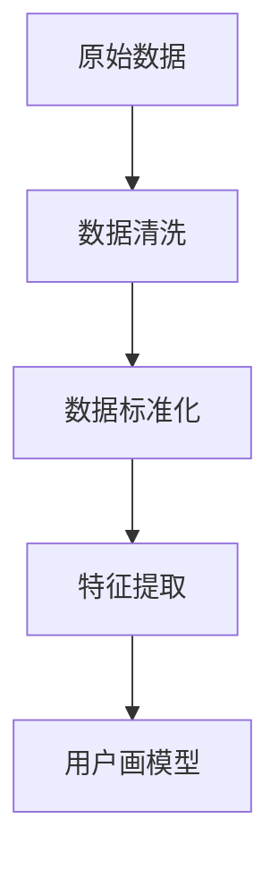
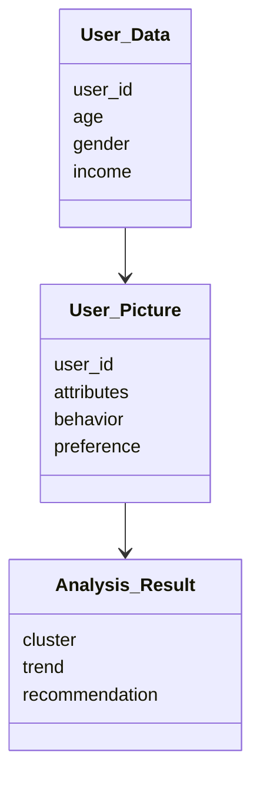
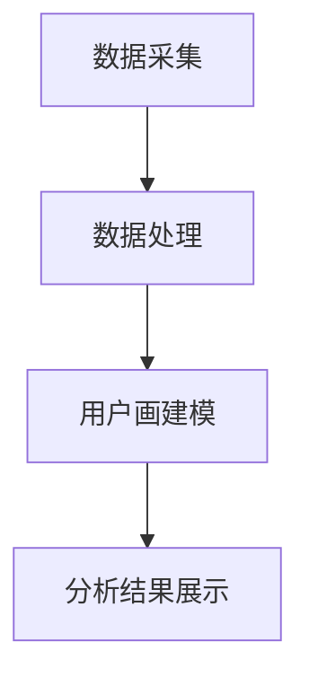
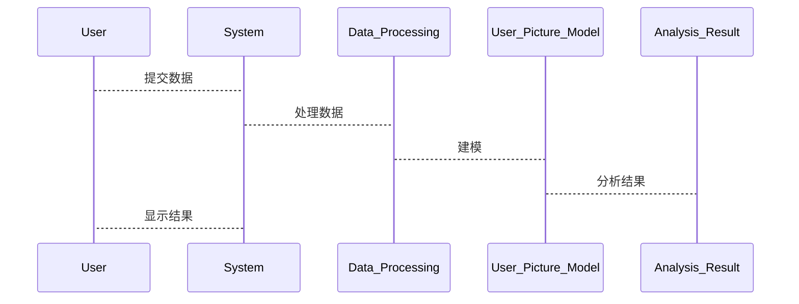

                 


# 彼得林奇如何分析公司的用户画像演变

## 关键词：用户画像，演变分析，彼得林奇，用户行为分析，数据驱动决策，画像建模与分析

## 摘要

本文深入探讨了彼得·林奇如何通过分析公司用户画像的演变来洞察市场动态和用户行为变化。通过详细的技术分析和实际案例，展示了用户画像的演变过程、核心要素、驱动因素以及如何利用这些信息优化企业战略。本文结合理论与实践，提供了从数据预处理、特征提取到系统架构设计的完整方法论，帮助读者掌握用户画像演变的分析技巧，并将其应用到实际项目中。

---

# 第一部分：引言

## 第1章：用户画像演变的背景与重要性

### 1.1 用户画像的定义与演变背景

用户画像是通过对用户行为、属性和偏好进行建模而形成的用户特征集合，是企业理解用户需求、制定精准营销策略的重要工具。随着市场环境的变化和用户行为的多样化，用户画像需要不断更新和优化，即用户画像的演变。

彼得·林奇作为投资大师，善于通过分析公司的用户画像演变来评估企业的市场适应能力和增长潜力。用户画像的演变反映了用户需求的变化趋势，是企业制定长期战略的重要依据。

### 1.2 用户画像演变的核心概念

用户画像的演变是一个动态过程，涉及用户行为、偏好、属性等多个维度的变化。通过分析这些变化，企业可以及时调整产品和服务策略，抓住市场机遇。

彼得·林奇的方法强调对用户画像演变的长期跟踪和分析，关注用户需求的变化趋势，从而帮助企业识别潜在的增长点和市场机会。

### 1.3 彼得·林奇分析方法的概述

彼得·林奇通过分析用户画像的演变，识别企业的市场地位和用户需求的变化。他的方法结合了定性分析和定量分析，注重长期趋势和关键转折点的识别。

---

# 第二部分：用户画像演变的背景与基础

## 第2章：用户画像的定义与演变背景

### 2.1 用户画像的定义

用户画像是基于用户数据构建的用户特征集合，包括用户的 demographic（人口统计）、psychographic（心理特征）、 behavioral（行为特征）和 transactional（交易特征）等方面。

### 2.2 用户画像演变的背景

随着市场竞争的加剧和技术的发展，用户需求和行为不断变化，传统的静态用户画已无法满足企业的分析需求。用户画像需要动态更新，以反映用户行为的变化趋势。

### 2.3 用户画像演变的重要性和应用领域

用户画像的演变分析在多个领域具有重要应用，包括市场营销、产品设计、用户留存和客户关系管理等。通过分析用户画像的演变，企业可以更好地理解用户需求，优化产品和服务策略。

---

## 第3章：用户画像演变的过程与影响因素

### 3.1 用户画像演变的过程

用户画像的演变是一个动态过程，涉及数据的采集、分析和更新。企业需要定期收集用户数据，分析用户行为的变化趋势，并根据分析结果调整用户画像。

### 3.2 影响用户画像演变的主要因素

- 市场环境的变化：宏观经济、政策法规、行业趋势等因素会影响用户需求和行为。
- 用户行为的变化：用户的消费习惯、购买偏好、使用习惯等发生变化，导致用户画像的更新。
- 产品和服务的创新：新产品和服务的推出可能改变用户的使用习惯和偏好，从而影响用户画像。

### 3.3 用户画像演变的阶段划分

用户画像的演变可以分为以下几个阶段：

1. 初始阶段：基于初始用户数据构建初始用户画。
2. 动态更新阶段：定期收集用户数据，更新用户画。
3. 深度分析阶段：通过分析用户行为的变化趋势，识别用户需求的变化。
4. 战略调整阶段：根据用户画的演变结果，调整企业战略和产品策略。

---

## 第4章：用户画像演变的核心要素

### 4.1 用户画像的核心要素

用户画的核心要素包括以下几类：

- 人口统计信息：年龄、性别、地理位置等。
- 心理特征：兴趣、价值观、态度等。
- 行为特征：消费习惯、使用频率、购买渠道等。
- 交易特征：购买金额、购买频率、忠诚度等。

### 4.2 用户画像要素的动态变化

用户画的各个要素可能会随着市场环境和用户行为的变化而动态变化。例如，随着技术的发展，用户的消费习惯可能从线下转移到线上，导致用户画的行为特征发生变化。

### 4.3 用户画像要素的权重分析

不同的用户要素在用户画中的重要性不同。企业需要根据实际情况，确定各个要素的权重，以反映其对用户行为和需求的影响程度。

---

# 第三部分：核心概念与联系

## 第5章：用户画像演变的核心机制

### 5.1 用户画像演变的核心机制

用户画像的演变是用户行为和需求变化的反映。企业需要通过数据采集、分析和建模，识别用户画的变化趋势，并根据趋势结果调整企业战略。

### 5.2 用户画像演变的驱动因素

用户画的演变受到多种因素的驱动，包括市场环境的变化、用户行为的变化、产品创新等。企业需要综合考虑这些因素，分析用户画的演变趋势。

### 5.3 用户画像演变的动态模型

用户画的演变可以通过动态模型进行建模和预测。动态模型需要考虑用户行为的变化趋势，以及外部环境的变化对用户画的影响。

---

## 第6章：用户画像演变的核心概念与联系

### 6.1 用户画像演变的核心概念

用户画的演变涉及多个核心概念，包括用户行为、需求变化、市场趋势等。这些概念相互关联，共同影响用户画的演变过程。

### 6.2 用户画像演变的核心概念对比表

| 概念         | 描述                           |
|--------------|--------------------------------|
| 用户行为     | 用户的消费习惯、使用习惯等    |
| 需求变化     | 用户需求的变化趋势             |
| 市场趋势     | 市场环境的变化趋势             |

### 6.3 用户画像演变的ER实体关系图

```mermaid
er
  user_picture {
    id
    user_id
    attribute
    weight
    update_time
  }
  user_behavior {
    id
    user_id
    action
    timestamp
  }
  user_preference {
    id
    user_id
    preference
    priority
  }
  user_picture --|> user_behavior
  user_picture --|> user_preference
```

---

# 第四部分：算法原理

## 第7章：用户画像演变的算法原理

### 7.1 数据预处理

数据预处理是用户画演变分析的基础。需要对数据进行清洗、标准化和特征提取。



### 7.2 特征提取

特征提取是用户画演变分析的重要步骤。需要从用户数据中提取关键特征，反映用户行为和需求的变化。

```python
# 数据预处理
import pandas as pd
import numpy as np

data = pd.read_csv('user_data.csv')
data = data.dropna()
data = pd.get_dummies(data)
```

### 7.3 聚类分析

聚类分析是用户画演变分析的核心算法之一。通过聚类分析，可以识别用户群体的特征变化，发现潜在的趋势。

```python
from sklearn.cluster import KMeans

X = data[['age', 'income', 'purchase_frequency']]
kmeans = KMeans(n_clusters=3)
kmeans.fit(X)
clusters = kmeans.labels_
```

### 7.4 数学模型与公式

用户画演变的数学模型可以表示为：

$$
P(t) = P_0 + \Delta P
$$

其中，$P(t)$ 表示用户画在时间 $t$ 的状态，$P_0$ 是初始状态，$\Delta P$ 是变化量。

---

## 第8章：用户画演变的系统分析与架构设计

### 8.1 问题场景介绍

用户画演变分析需要解决的问题包括数据采集、分析、建模和结果应用。系统需要能够实时采集用户数据，动态更新用户画，并根据分析结果提供决策支持。

### 8.2 系统功能设计

系统功能设计包括数据采集、数据处理、用户画建模、分析结果展示和决策支持。



### 8.3 系统架构设计

系统架构采用分层架构，包括数据采集层、数据处理层、用户画建模层和分析结果展示层。



### 8.4 系统接口设计

系统接口设计包括数据接口、分析接口和结果展示接口。

### 8.5 系统交互流程

系统交互流程包括数据采集、数据处理、用户画建模、分析结果展示和用户反馈。



---

## 第9章：项目实战

### 9.1 环境安装

需要安装Python、pandas、numpy、scikit-learn等工具。

### 9.2 核心代码实现

```python
import pandas as pd
from sklearn.cluster import KMeans

data = pd.read_csv('user_data.csv')
data = data.dropna()
data = pd.get_dummies(data)

X = data[['age', 'income', 'purchase_frequency']]
kmeans = KMeans(n_clusters=3)
kmeans.fit(X)
clusters = kmeans.labels_
```

### 9.3 案例分析与总结

通过实际案例分析，展示用户画演变的分析过程和结果应用。案例分析包括数据采集、数据处理、用户画建模和分析结果展示。

---

## 第10章：最佳实践与总结

### 10.1 小结

用户画演变分析是企业理解用户需求变化的重要工具。通过分析用户画的演变，企业可以及时调整产品和服务策略，抓住市场机遇。

### 10.2 注意事项

- 数据采集要全面，确保数据的准确性和完整性。
- 分析模型要结合实际，避免过于复杂。
- 结果应用要注重实际效果，避免纸上谈兵。

### 10.3 拓展阅读

推荐阅读《彼得·林奇的投资哲学》和《数据驱动的决策》等书籍，深入了解用户画演变分析的理论和实践。

---

## 作者：AI天才研究院/AI Genius Institute & 禅与计算机程序设计艺术 /Zen And The Art of Computer Programming

本文作者：AI Genius Institute

